# KIN Platform — Galería Visual

Galería de capturas de pantalla del proyecto **KIN**, una plataforma de gestión de proyectos con evaluación de viabilidad asistida por IA.

---

## 1. Landing — Hero

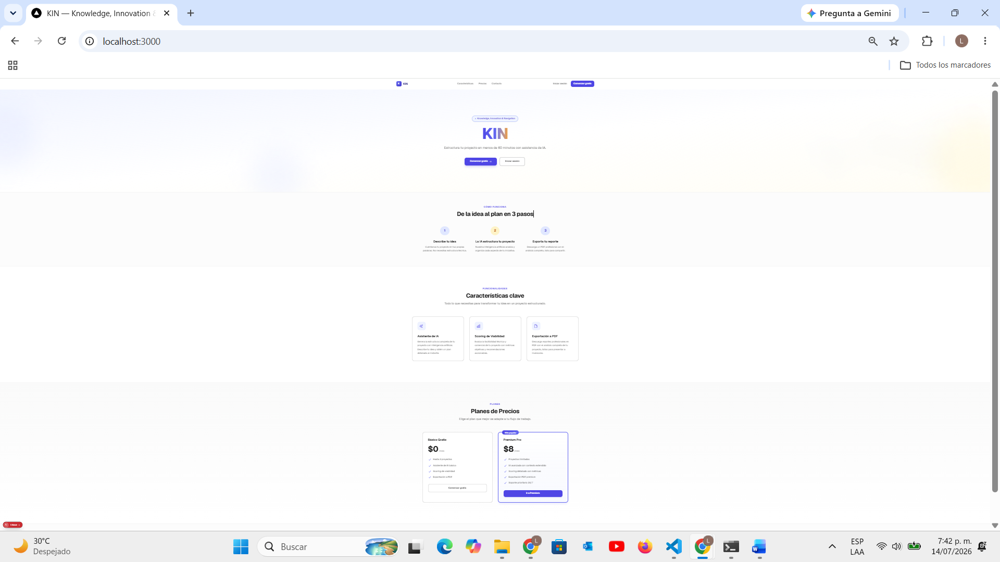

Sección principal de la página de aterrizaje con el call-to-action y valor propuesta.

---

## 2. Landing — Pasos

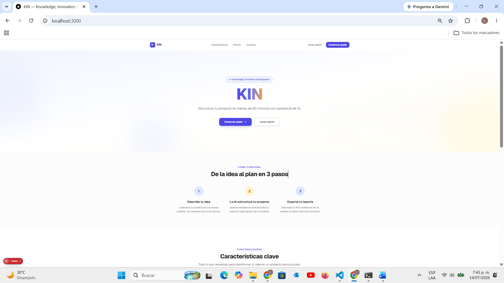

Explicación visual del flujo de trabajo en tres pasos.

---

## 3. Landing — Pricing

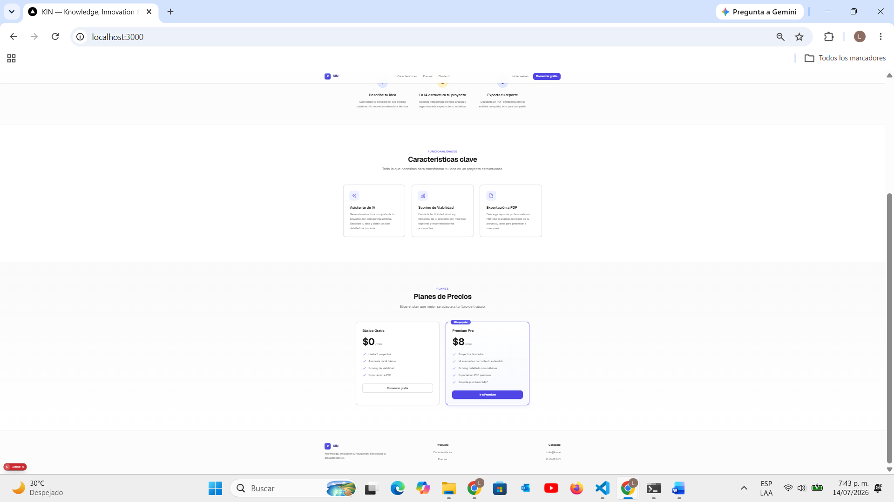

Tabla de planes y precios (Free, Premium, Facilitador).

---

## 4. Inicio de Sesión

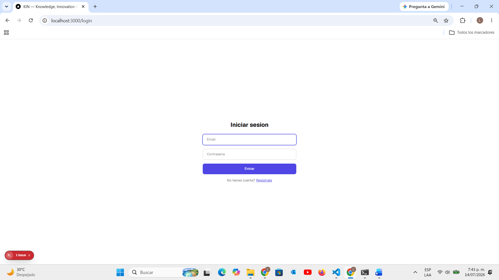

Formulario de inicio de sesión con validación.

---

## 5. Admin — Pricing (Parte Superior)

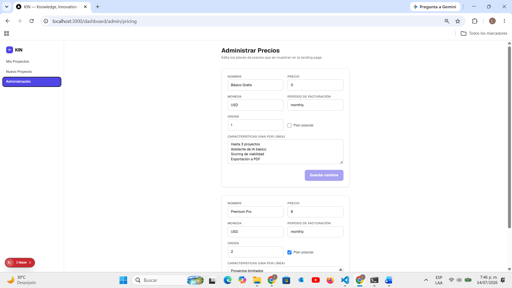

Panel de administración mostrando la sección de precios (vista superior).

---

## 6. Admin — Pricing (Parte Inferior)

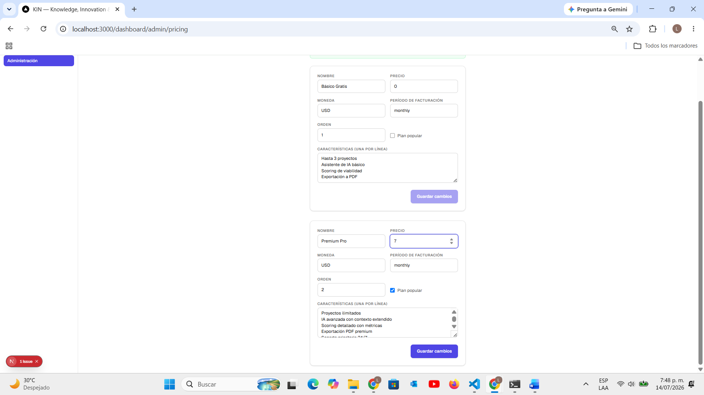

Panel de administración mostrando la sección de precios (vista inferior).

---

## 7. Dashboard — Proyectos

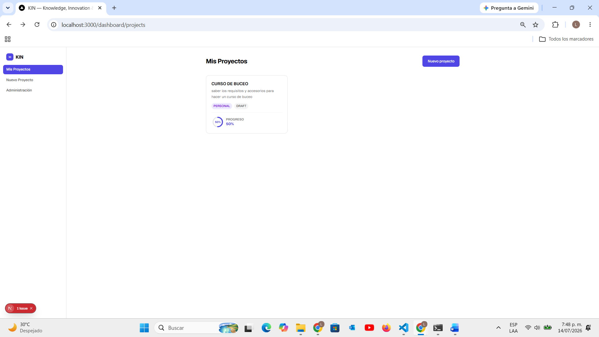

Panel principal del dashboard con la lista de proyectos del usuario.

---

## 8. Chat IA — Boceto Inicial

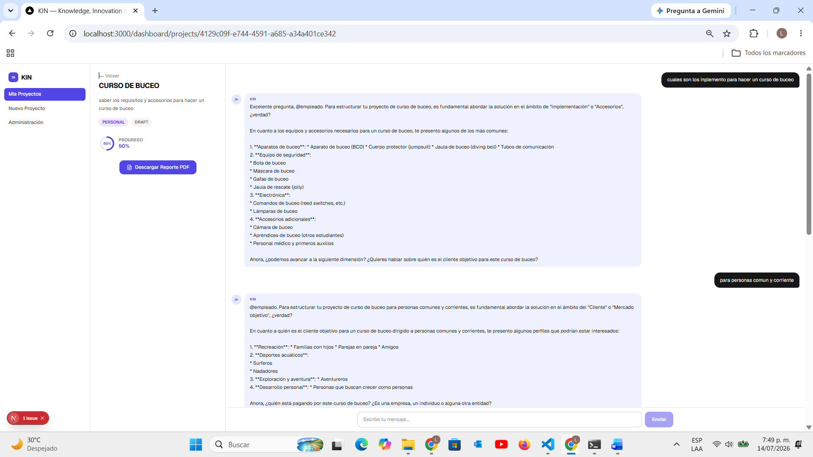

Interfaz de chat con la IA durante la fase de boceto inicial.

---

## 9. Chat IA — Problemas

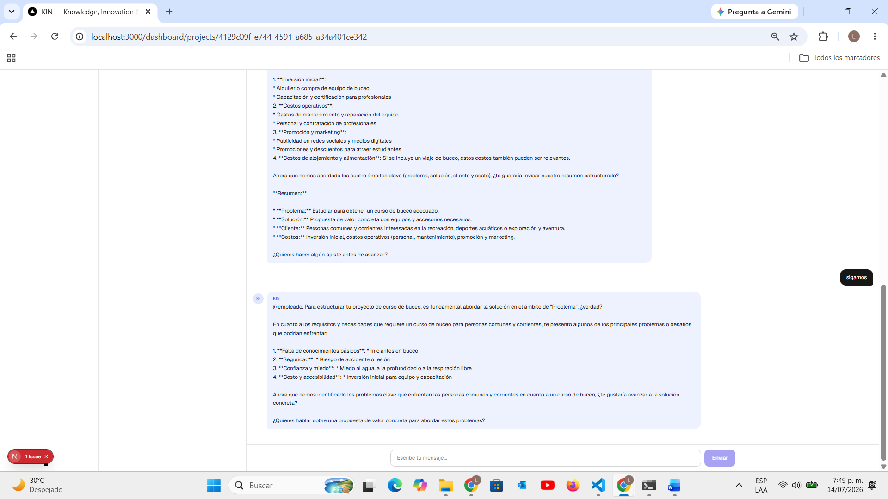

Asistente de IA identificando problemas y riesgos potenciales.

---

## 10. Nuevo Proyecto — Vacío

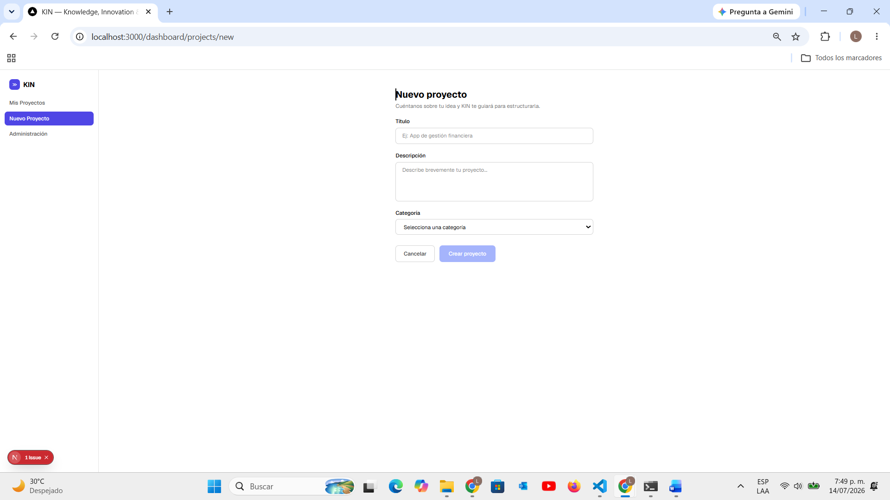

Formulario de creación de proyecto en estado vacío.

---

## 11. Nuevo Proyecto — Completo

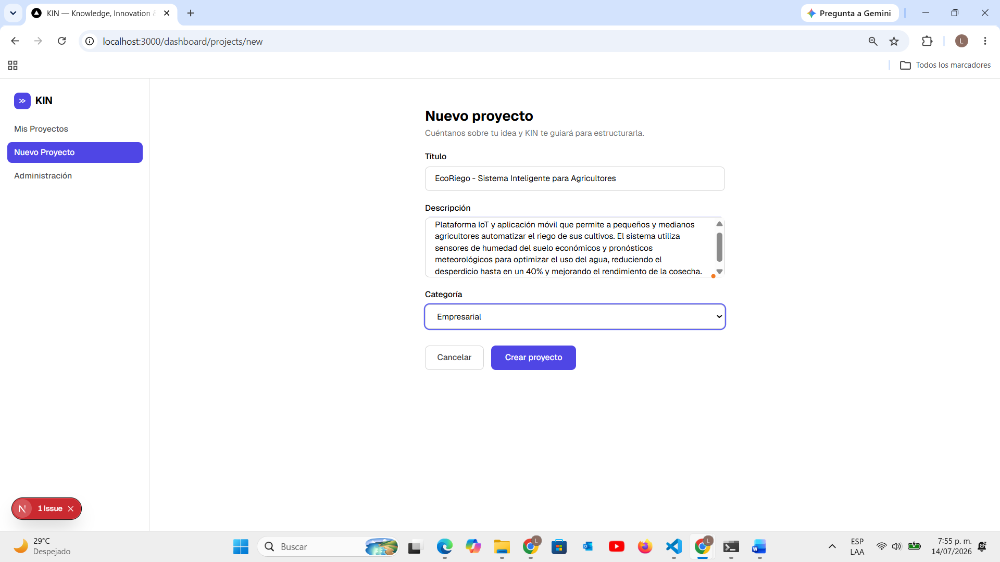

Formulario de creación de proyecto con todos los campos completados.

---

## 12. Proyecto Creado — Chat

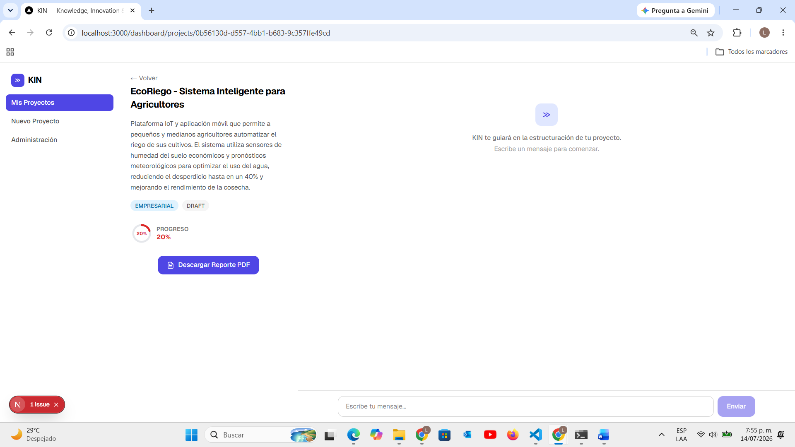

Pantalla posterior a la creación del proyecto, con el chat de IA visible.

---

## 13. Proyecto Creado — Input

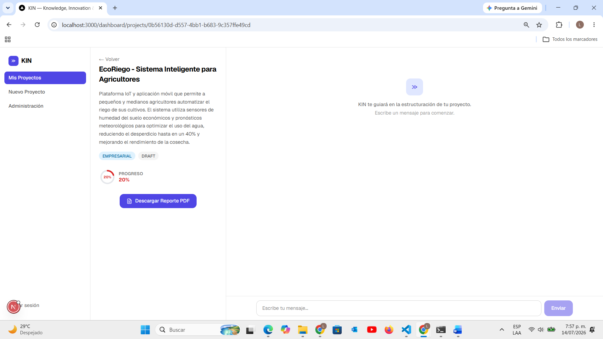

Vista del proyecto creado con el campo de entrada de texto para el chat.

---

## 14. Chat IA — Contexto

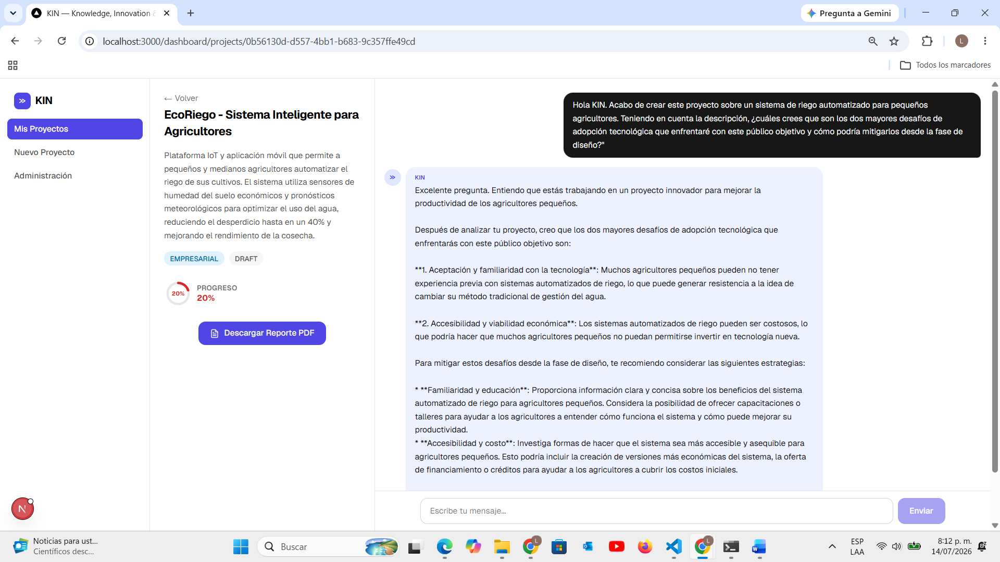

Conversación extendida con la IA mostrando el contexto completo del proyecto.
