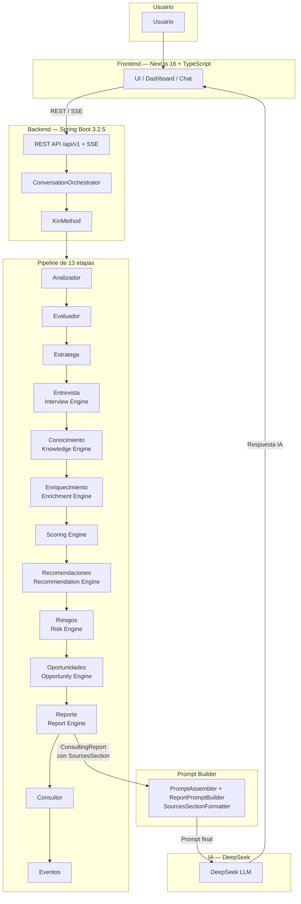

<div align="center">

# 🌱 KIN Platform

### Knowledge, Innovation & Networking

**Plataforma full-stack de gestión y validación de proyectos con asistencia de IA integrada**

[](https://www.oracle.com/java/)
[](https://spring.io/projects/spring-boot)
[](https://nextjs.org/)
[](https://www.typescriptlang.org/)
[](https://www.postgresql.org/)
[](https://www.docker.com/)
[](https://www.deepseek.com/)
[](https://github.com/LuisAIDev/kin-platform/releases/tag/v2.0.0-phase10)
[](LICENSE)

<!-- Badges automáticos (FASE 11 — DevSecOps). Activos cuando los workflows corren en GitHub. -->
[](https://github.com/LuisAIDev/kin-platform/actions/workflows/backend-ci.yml)
[](https://github.com/LuisAIDev/kin-platform/actions/workflows/frontend-ci.yml)
[](https://github.com/LuisAIDev/kin-platform/actions/workflows/security.yml)
[](https://sonarcloud.io/dashboard?id=kin-platform)
[](kin-docs/FASE14_0_PERFORMANCE_ENGINEERING.md)
[](https://github.com/LuisAIDev/kin-platform/releases)

[](https://github.com/LuisAIDev)
[](https://www.linkedin.com/in/luis-orlando-guerra-gonzalez-49aa30244)

[Características](#-características) •
[Arquitectura](#-arquitectura) •
[Pipeline](#-pipeline-de-13-etapas) •
[Stack Tecnológico](#-stack-tecnológico) •
[Instalación](#-instalación-local) •
[API](#-api-endpoints) •
[Roadmap](#-roadmap)

</div>

---

## 📋 Sobre el proyecto

**KIN** es una plataforma full-stack para la gestión y validación de proyectos, diseñada para
acompañar al usuario desde la idea inicial hasta la estructuración de un proyecto viable, con un
asistente de IA integrado que guía la conversación, evalúa la información, adquiere conocimiento
externo verificado y produce un informe de viabilidad con trazabilidad.

El proyecto fue construido desde cero como ejercicio de portafolio para consolidar un stack
backend enterprise (**Java 17 + Spring Boot 3.2.5**) combinado con un frontend moderno
(**Next.js 16 + TypeScript 5**), aplicando **Clean Architecture + DDD Táctico + Pipeline Pattern +
Event-Driven**, autenticación stateless con JWT, y buenas prácticas de seguridad y despliegue con
Docker.

> ✅ **Estado actual: FASE 10 COMPLETADA** — Release `v2.0.0-phase10` (2026-08-04).
> Pipeline de dominio de **13 etapas**, **1850 tests backend (0 fallos)** + **66 tests frontend**,
> cobertura de dominio ≥ 90 % (JaCoCo) y **19 ADRs aprobadas** (ADR-001 … ADR-019). Núcleo
> inteligente con Knowledge Engine, Interview Engine, Enrichment Engine, Scoring, Recommendation,
> Risk, Opportunity, Report Engine, Prompt Engine, sección de fuentes citadas (`SourcesSection`) y
> **Bounded Context Enterprise** (ADR-018) de generación de documentos de negocio. Principio rector:
> **"Java decide. El LLM únicamente comunica."**
> Ver [`kin-docs/releases/v2.0.0-phase10.md`](kin-docs/releases/v2.0.0-phase10.md).

> ⭐ **Current Stable Version**: `v2.0.0-phase10` — FASE 10 COMPLETADA (Enterprise Document Generation, ADR-018).
>
> **Highlights**
> - 🏭 **Enterprise Module** (BC `kin.enterprise`, ADR-018) — generación/exportación de documentos de negocio (PDF/DOCX/PPTX)
> - 📄 **9 tipos de documento** — lean canvas, plan de mercado, plan financiero, hoja de ruta, matriz de riesgos, KPIs, plan de innovación, Executive Report y DOFA
> - 🔄 **Ciclo automático** conversación → generación (M3B) · **resultados reales del pipeline** (M3C)
> - 📊 **Enterprise Score** persistido y expuesto (M3D) · 🧠 **narrativa IA** (M3E)
> - 🖥️ **Enterprise Dashboard** integrado en `kin-frontend` (M3F) + acción de generación desde la UI (M3G)
> - 📦 **Deployment M3H** — `init.sql` sincronizado y Flyway V1..V10 desde cero
> - 🧪 **1850 Automated Tests** (backend) + **66** (frontend)
> - 🛡️ **Pipeline Resilience** · 🔁 **Retry Policies** · ⏱️ **Timeout Policies** · 📊 **Pipeline Metrics**
> - ✅ **Response Validation** · 🧯 **Response Fallback** · 📣 **Event Semantics** · 🔗 **End-to-End Integration**
> - 🧱 **Clean Architecture** · 🏛️ **DDD** · 📐 **SOLID** · 🌐 **Offline First**
> - 🏷️ **Último tag**: [`v2.0.0-phase10`](https://github.com/LuisAIDev/kin-platform/releases/tag/v2.0.0-phase10)

---

## ✨ Características

- 🔐 **Autenticación segura** con JWT y contraseñas cifradas con BCrypt, sesión stateless
- 📁 **Gestión de proyectos** — CRUD completo con paginación
- 🤖 **Chat con IA integrado** por proyecto, con historial persistente, modo bloqueante y **streaming SSE**
- 🧠 **Núcleo inteligente de 13 etapas** que produce un `ConsultingReport` (11 secciones) con score de viabilidad, recomendaciones, riesgos, oportunidades y fuentes citadas
- 📚 **Knowledge Engine** (ADR-014) — adquisición y validación de conocimiento externo verificado (HTTP/JDBC/RAG/Documento), offline-first
- 🎙️ **Interview Engine** (ADR-015) — entrevista estratégica dirigida por Java que garantiza un `ProjectContext` completo antes del análisis
- 🔬 **Enrichment Engine** (ADR-016) — selección determinista de hechos relevantes (`FactRanker`) que enriquece recomendaciones, riesgos y oportunidades, y cita las fuentes en el reporte
- 📄 **Enterprise Module** (ADR-018, Fase 10) — Bounded Context de generación de documentos de negocio (lean canvas, plan de mercado, plan financiero, hoja de ruta, matriz de riesgos, KPIs, plan de innovación, Executive Report y DOFA) en PDF/DOCX/PPTX, con versionado, REST + OpenAPI, dashboard SSE integrado en `kin-frontend` y ciclo automático desde la conversación
- 📊 **Scoring Engine** — score de viabilidad por categoría y dimensión
- 🎭 **Roles de usuario** diferenciados: `FREE`, `PREMIUM`, `FACILITADOR`, `ADMIN`
- 🐳 **Contenerizado con Docker Compose** — PostgreSQL 16, backend y frontend
- 🔄 **Doble entorno de base de datos** — H2 embebida (dev) y PostgreSQL 16 (producción, Flyway)
- 🛡️ **Seguridad** — CORS dual, headers HTTP, rate limiting, gestión de secretos por entorno
- ❤️ **Health check** vía Spring Boot Actuator
- 📱 **Diseño responsive mobile-first**

---

## 🏗️ Arquitectura

KIN aplica **Clean Architecture + DDD Táctico + Pipeline Pattern + Event-Driven**: el dominio
`com.kinplatform.kin.*` es **100 % POJO** (sin Spring, JPA ni IA), la infraestructura se
concentra en adaptadores y la composición se resuelve en `KinConfig`.



**Módulos del backend:** `auth`, `user`, `project`, `chat`, `ai` (adaptadores) y el núcleo de
dominio `kin.*` con sus bounded contexts:

| Paquete | Bounded context |
|---|---|
| `kin.engine` | Infraestructura de motores (`DomainEngine`, `EngineRegistry`, `EngineExecutor`, `EngineStage`) |
| `kin.pipeline` | `Pipeline` + `PipelineContext` + stages genéricos |
| `kin.context` | `ProjectContext`, evaluación, decisión, `ContextRepository` |
| `kin.scoring` | `ScoringEngine` |
| `kin.reporting` | `RecommendationEngine`, `RiskEngine`, `OpportunityEngine`, `ReportEngine` |
| `kin.ai` / `kin.ai.prompt` | `AIResponder`, `PromptAssembler`, `ConversationPromptBuilder`, `ReportPromptBuilder`, formatters |
| `kin.conversation` | `ConversationOrchestrator`, `TurnPolicy`, `ResponseGuard`, `HistoryWindow` |
| `kin.knowledge` | `KnowledgeEngine`, `KnowledgeGateway`, `SourceValidator` (Fase 6) |
| `kin.interview` | `InterviewEngine`, `InterviewBlueprint`, `AnswerValidator` (Fase 7) |
| `kin.enrichment` | `EnrichmentEngine`, `FactRanker`, `EvidenceCategory` (Fase 8) |
| `kin.enterprise` | BC Enterprise (Fase 10, ADR-018): `EnterpriseProject` (aggregate versionado), 8 motores deterministas aislados, eventos, `DocumentRenderer`, REST/SSE |

---

## 🚀 Pipeline de 13 etapas

```
Analizador → Evaluador → Estratega → Entrevista → Conocimiento → Enriquecimiento →
Scoring → Recomendaciones → Riesgos → Oportunidades → Reporte → Consultor → Eventos
```

1. **Analizador** — extrae dimensiones del mensaje y actualiza el `ProjectContext`.
2. **Evaluador** — `CompletenessEvaluation` de las dimensiones cubiertas.
3. **Estratega** — decide la acción (`ConversationDecision`): `ASK`, `REPORT`, etc.
4. **Entrevista** (Interview Engine, ADR-015) — garantiza un proyecto completo; mientras esté
   incompleta la decisión efectiva es `ASK`.
5. **Conocimiento** (Knowledge Engine, ADR-014) — adquiere hechos externos verificados
   (offline-first: `KnowledgeResult.empty()` si no hay fuentes).
6. **Enriquecimiento** (Enrichment Engine, ADR-016) — `FactRanker` selecciona y pondera en Java
   los hechos relevantes por categoría (mercado, innovación, financiero, competitivo).
7. **Scoring** — score de viabilidad.
8. **Recomendaciones** — `RecommendationEngine`.
9. **Riesgos** — `RiskEngine`.
10. **Oportunidades** — `OpportunityEngine`.
11. **Reporte** — `ReportEngine` orquesta 11 `SectionAssembler` y produce el `ConsultingReport`
    (11 secciones, incluye `SourcesSection`).
12. **Consultor** — selecciona el prompt (conversación o REPORT) y pide la respuesta al LLM.
13. **Eventos** — publica eventos de dominio según la decisión.

---

## 🧠 Motores de dominio

| Motor | Fase / ADR | Responsabilidad |
|---|---|---|
| **ScoringEngine** | ADR-009 (prioridad 30) | Score de viabilidad por categoría y dimensión |
| **RecommendationEngine** | ADR-003 | Recomendaciones deduplicadas y priorizadas |
| **RiskEngine** | ADR-004 | Riesgos con severidad, probabilidad y nivel |
| **OpportunityEngine** | ADR-010 (prioridad 60) | 8 analizadores auto-descubiertos (mercado, innovación, tecnológico, financiero, competitivo, escalabilidad, automatización, monetización) |
| **ReportEngine** | ADR-011 (prioridad 70) | Orquestador puro del `ConsultingReport` (11 assemblers) |
| **KnowledgeEngine** | ADR-014 (prioridad 50) | Adquisición y validación de conocimiento externo (`KnowledgeGateway` + `SourceValidator`) |
| **InterviewEngine** | ADR-015 | Entrevista estratégica dirigida por Java (`InterviewBlueprint` + `AnswerValidator`) |
| **EnrichmentEngine** | ADR-016 (prioridad 55) | `FactRanker` selecciona hechos relevantes y pondera evidencia por categoría |
| **Prompt Engine** | ADR-012 | `PromptAssembler` fachada pura; `ReportPromptBuilder` formatea el reporte con 11 `SectionFormatter` |

### SourcesSection

El `ConsultingReport` incorpora la **11.ª sección de fuentes citadas** (`SourcesSection`,
`ReportSectionKind.SOURCES`, ADR-016): `SourcesSectionAssembler` transforma el
`EnrichmentResult` en fuentes deduplicadas (`CitedSource`) y `SourcesSectionFormatter` las
presenta como Markdown ligero en el prompt REPORT (frontera ADR-012 intacta: el prompt consume
únicamente el `ConsultingReport` tipado).

### Principio rector

> **Java decide. El LLM únicamente comunica.**
> Java decide qué preguntar (InterviewEngine), qué conocimiento adquirir (KnowledgeGateway), qué
> hechos son relevantes y cómo ponderan (FactRanker) y qué fuentes se citan (EnrichmentEngine);
> el LLM solo formula preguntas y explica el análisis ya decidido.

---

### 🌐 Catálogo de categorías (SaaS-ready)

Las categorías de proyecto son **datos administrables, no código**. Reemplazan al antiguo enum
`ProjectCategory` (eliminado): una nueva industria/categoría se agrega como fila en `categories`
sin modificar Java ni React.

- **Entidad**: `Category` (`com.kinplatform.project`) → tabla `categories`
  (`id`, `code` único, `name`, `description`, `display_order`, `icon`, `color`, `active`,
  `created_at`, `updated_at`).
- **Relación**: `Project.category` es `@ManyToOne → Category` (columna `category_id`, nullable
  para compatibilidad con proyectos legacy; `@ManyToOne` EAGER por defecto, sin `LazyInitializationException`).
- **API**: `GET /categories` devuelve solo categorías activas ordenadas por `display_order`.
  `POST/PUT /projects` recibe el `code` de la categoría (`category: "SALUD"`) y el backend lo
  resuelve contra el catálogo (400 si no existe).
- **Seed**: 17 categorías iniciales (Tecnología e Innovación, Empresarial, Agroindustria, Salud,
  Educación, Impacto Social, Medio Ambiente, Industria, Gobierno, Fintech, Comercio, Turismo,
  Gastronomía, Logística, Creatividad, Marketing Digital, Investigación). En producción lo siembra
  la migración Flyway `V6__create_categories.sql` (que también migra el enum legacy y elimina la
  columna `category`); en dev (H2, sin Flyway) lo siembra `CategoryDataInitializer` (idempotente).
- **Frontend**: el formulario de proyectos carga `GET /categories` (sin listas hardcodeadas); el
  color del badge viene de `category.color` (hex, aplicado por estilo inline).

---

## 🛠️ Stack Tecnológico

### Backend

| Categoría | Tecnología |
|---|---|
| Lenguaje / Runtime | Java 17 |
| Framework | Spring Boot 3.2.5 |
| Arquitectura | Clean Architecture + DDD Táctico + Pipeline Pattern + Event-Driven |
| Seguridad | Spring Security + JWT (stateless), BCrypt, rate limiting |
| Persistencia | Spring Data JPA / Hibernate |
| Base de datos (dev) | H2 file-based (Flyway deshabilitado) |
| Base de datos (prod) | PostgreSQL 16 (Docker) / Neon |
| Migraciones | Flyway (V1…V10) + `kin-database/init.sql` (referencia histórica) |
| IA | DeepSeek (default) + OpenAI + Ollama (fallback en español) |
| Testing | JUnit 5, Mockito, Reactor Test |
| Cobertura | JaCoCo (dominio ≥ 90 %) |
| Monitoreo | Spring Boot Actuator |
| Build | Maven (Maven Wrapper) |

### Frontend

| Categoría | Tecnología |
|---|---|
| Framework | Next.js 16 (App Router) |
| Librería UI | React 19 |
| Lenguaje | TypeScript 5 (`strict`) |
| Estilos | Tailwind CSS 4 |
| Cliente HTTP | `fetch` nativo con wrapper propio |

### IA utilizada — DeepSeek

El chat y el consultor usan **DeepSeek** como proveedor LLM por defecto. El dominio depende del
puerto `AIResponder` (no del proveedor concreto); `AiEngineService` enruta a través de
`ProviderRouter` (DeepSeek/OpenAI/Ollama) y, si todos los proveedores fallan, garantiza un
**fallback en español** (mock) que permite desarrollar y testear sin un LLM activo.

### Infraestructura y despliegue

| Categoría | Tecnología |
|---|---|
| Contenedores | Docker + Docker Compose (`postgres-db`, `kin-backend`, `kin-frontend`) |
| Base de datos en producción | PostgreSQL 16 (Docker) o **Neon** (PostgreSQL serverless) |
| Backend en producción | **Render** (via `DATABASE_URL` / env vars) |
| Frontend en producción | Vercel / Render |
| Offline First | Sin hechos externos, el pipeline degrada a `EnrichmentResult.empty()` y se comporta como antes |

---

## 📁 Estructura del proyecto

```
proyecto-kin/
├── kin-backend/            # API REST — Spring Boot (Java 17)
│   └── src/main/java/com/kinplatform/
│       ├── auth/ user/ project/ chat/    # Aplicación (REST, I/O)
│       ├── ai/                           # Adaptadores de IA y conocimiento (JPA, providers)
│       ├── common/                       # Configuración, seguridad, excepciones
│       └── kin/                          # Dominio puro (POJO)
│           ├── engine/ pipeline/ context/ decision/ scoring/ reporting/
│           ├── ai/ ai/prompt/ conversation/ knowledge/ interview/ enrichment/ event/
│           ├── enterprise/                 # BC Enterprise (generación de documentos, ADR-018)
├── kin-frontend/           # Cliente — Next.js 16 + TypeScript + Tailwind 4 (incluye Enterprise Dashboard en /dashboard/projects/[id]/enterprise)
├── kin-database/           # init.sql (referencia histórica; Flyway V1..V10 crea el esquema)
├── kin-docs/               # ADRs (001…018), fases, releases, BASELINE
├── docs/                   # Demos y guías (docs/demo/DEMO.md)
├── docker-compose.yml      # Orquestación de los 3 servicios
└── .env.example            # Variables de entorno documentadas
```

---

## 🚀 Instalación local

### Requisitos previos

- Java 17+
- Node.js 20+
- Maven (o usar el wrapper incluido `mvnw`)
- (Opcional) Docker y Docker Compose para el entorno productivo

### 1. Clonar el repositorio

```bash
git clone https://github.com/LuisAIDev/kin-platform.git
cd kin-platform
```

### 2. Configurar variables de entorno

```bash
cp .env.example .env
```

Completa `.env` con tus propios valores (JWT secret, credenciales de base de datos, `DEEPSEEK_API_KEY` si aplica).

### 3. Levantar el backend

```bash
cd kin-backend
./mvnw spring-boot:run
```

Backend en `http://localhost:8080/api/v1` usando H2 como base de datos local (no requiere instalación adicional).

### 4. Levantar el frontend

```bash
cd kin-frontend
npm install
npm run dev
```

Frontend en `http://localhost:3000`.

### 5. (Alternativa) Levantar todo con Docker

```bash
docker compose up --build
```

Orquesta PostgreSQL 16, backend y frontend en contenedores usando las variables de `.env`.

---

## 🔌 API Endpoints

| Endpoint | Método | Auth | Descripción |
|---|---|---|---|
| `/auth/register` | `POST` | No | Registro de nuevo usuario |
| `/auth/login` | `POST` | No | Inicio de sesión, devuelve JWT |
| `/auth/me` | `GET` | Bearer JWT | Datos del usuario autenticado |
| `/categories` | `GET` | No | Catálogo de categorías activas ordenadas por `display_order` |
| `/projects` | `GET` / `POST` | Bearer JWT | Listar / crear proyectos |
| `/projects/{id}` | `GET` / `PUT` / `DELETE` | Bearer JWT | CRUD de un proyecto específico |
| `/projects/{id}/chat` | `POST` | Bearer JWT | Enviar mensaje al asistente IA |
| `/projects/{id}/chat/stream` | `POST` | Bearer JWT | Streaming SSE de la respuesta IA |
| `/projects/{id}/messages` | `GET` / `DELETE` | Bearer JWT | Historial / limpieza de mensajes |
| `/pricing-plans` | `GET` | No | Planes de precios activos |
| `/pricing-plans/{id}` | `GET` | No | Detalle de un plan |
| `/admin/pricing-plans` | `POST` / `PUT` / `DELETE` | ADMIN | CRUD de planes de precios |
| `/subscriptions/current` | `GET` | Bearer JWT | Suscripción activa del usuario |
| `/subscriptions/status` | `GET` | Bearer JWT | Estado del plan (límites, mensajes restantes) |
| `/subscriptions` | `POST` | Bearer JWT | Suscribirse a un plan |
| `/subscriptions/trial` | `POST` | Bearer JWT | Iniciar prueba de un plan |
| `/subscriptions/cancel` | `POST` | Bearer JWT | Cancelar suscripción |
| `/subscriptions/available-upgrades` | `GET` | Bearer JWT | Planes superiores disponibles |
| `/stripe/create-checkout-session` | `POST` | Bearer JWT | Sesión de checkout Stripe |
| `/stripe/webhook` | `POST` | No | Webhook de Stripe |
| `/enterprise/{projectId}` | `GET` | Bearer JWT | Dashboard enterprise (última versión) |
| `/enterprise/{projectId}/latest` | `GET` | Bearer JWT | Última versión enterprise |
| `/enterprise/{projectId}/versions` | `GET` | Bearer JWT | Listado de versiones |
| `/enterprise/{projectId}/{version}` | `GET` | Bearer JWT | Versión específica |
| `/enterprise/{projectId}/generate` | `POST` | Bearer JWT | Generar (o regenerar) documentos |
| `/enterprise/{projectId}/{version}/documents` | `GET` | Bearer JWT | Documentos de una versión |
| `/enterprise/{projectId}/{version}/documents/{type}` | `GET` | Bearer JWT | Detalle de un documento |
| `/enterprise/{projectId}/{version}/export` | `GET` | Bearer JWT | Exportar documentos (bundle) |
| `/enterprise/{projectId}/{version}/export/{format}` | `GET` | Bearer JWT | Exportar en formato (PDF/DOCX/PPTX) |
| `/enterprise/{projectId}/{version}/export/{type}/{format}` | `GET` | Bearer JWT | Exportar un documento en formato |
| `/enterprise/{projectId}/{version}/dashboard` | `GET` | Bearer JWT | Dashboard consolidado de una versión |
| `/enterprise/{projectId}/{version}/stream` | `GET` | Bearer JWT | SSE de progreso de generación |

---

## 🧪 Testing

### Cómo ejecutar los tests

```bash
cd kin-backend
./mvnw clean verify
```

### Resumen

**1850 tests backend, 0 fallos, 0 errores, 0 skipped** + **66 tests frontend (Vitest, 12 archivos)**
(`./mvnw clean verify`, **BUILD SUCCESS**). Cobertura de dominio ≥ 90 % (JaCoCo, último build):

| Dominio | Cobertura |
|---|---|
| `kin.conversation` | 99.26 % |
| `kin.knowledge` + `ai.knowledge.adapter` | 99.70 % |
| `kin.reporting` (agregado) | 99.07 % |
| `kin.reporting.opportunity` | 99.41 % |
| `kin.reporting.risk` | 99.15 % |
| `kin.reporting.report` | 100 % |
| `kin.ai` | 100 % |
| `kin.ai.prompt` | 95.18 % |
| `kin.enrichment` | 97.65 % |
| `kin.pipeline` | 96.93 % |
| `kin.interview` | 99.10 % |
| `kin.engine` | 99.06 % |
| `kin.scoring` | 95.14 % |
| `kin.enterprise` (agregado) | 97.81 % |

---

## 📸 Capturas de pantalla

> _Próximamente — capturas del login, dashboard de proyectos, chat con IA e informe de viabilidad._ Ver `docs/demo/DEMO.md`.

---

## 🗺️ Roadmap

> **Status**: ✅ **Phase 8 Complete** · ✅ **Phase 9 Complete** (KIN 2.1 — Pipeline Estabilizado) · ✅ **Phase 10 Complete** (Enterprise Document Generation, ADR-018)

- [x] Autenticación JWT con roles de usuario
- [x] CRUD completo de proyectos + paginación
- [x] Chat con IA integrado (bloqueante + streaming SSE)
- [x] Contenerización con Docker Compose
- [x] Migraciones versionadas con Flyway (V1…V10)
- [x] **Fase 5.x — Núcleo inteligente**: pipeline, Scoring, Recommendation, Risk, Opportunity, Report, Prompt
- [x] **Fase 6 — Knowledge Engine + RAG** (ADR-014)
- [x] **Fase 7 — Strategic Interview Engine** (ADR-015)
- [x] **Fase 8 — Knowledge-Enhanced Analysis** (ADR-016): EnrichmentEngine, SourcesSection, pipeline de 13 etapas
- [x] **1850 tests, 0 fallos, cobertura de dominio ≥ 90 %**
- [x] **Release `v1.0.0-phase8`**
- [x] **Fase 9 (KIN 2.1)** — Pipeline Resilience (retry/timeout/metrics), EventStage semantics, Response Fallback (ver `kin-docs/FASE9_0.md` y `ADR-017`)
- [x] **Catálogo de categorías SaaS-ready** — el enum `ProjectCategory` se reemplazó por la entidad/tabla `categories` administrable (ver sección [Catálogo de categorías](#-catálogo-de-categorías-saas-ready))
- [x] **Fase 10 — Módulo Enterprise (ADR-018)**: Bounded Context de generación/exportación de documentos
  de negocio (lean canvas, plan de mercado, plan financiero, hoja de ruta, matriz de riesgos, KPIs, plan de
  innovación, Executive Report y DOFA) en PDF/DOCX/PPTX, con versionado, REST + OpenAPI, dashboard SSE y
  **Enterprise Dashboard integrado en kin-frontend** (`/dashboard/projects/[id]/enterprise`, M3F); ciclo
  automático conversación → generación (M3B), resultados reales del pipeline (M3C), Enterprise Score
  persistido (M3D), narrativa IA (M3E), acción de generación desde la UI (M3G) e **infraestructura
  de producción (M3H)** — `init.sql` sincronizado con V7–V10 y `docker compose up --build` verificado
  (PostgreSQL + Backend + Frontend, Flyway V1..V10 desde cero). Ver `kin-docs/AUDITORIA_ENTERPRISE_M3.md`
- [x] **Release `v2.0.0-phase10`** — tag publicado en GitHub (ver `kin-docs/releases/v2.0.0-phase10.md`)
- [x] **Fix de esquema de suscripciones (V9/V10)** — `users.current_plan_id` y tabla `user_subscriptions` sincronizados con Flyway
- [ ] Despliegue en producción (backend en Render, frontend en Vercel, PostgreSQL en Neon)
- [ ] ScoringEngine heuristic replacement (KIN 2.5) · EventBus async (KIN 2.4) · provider dedup (KIN 2.3)
- [ ] E2E de frontend con Playwright (flujo completo)

---

## 📊 Product Intelligence (FASE 16)

Inteligencia de producto **offline y sin IA** sobre analytics local (sin envío externo):

- **Dashboard de uso** — `/dashboard/analytics`: KPIs por día/semana/mes, mensajes IA, tokens/coste estimados, feedback, adopción de funciones.
- **Insights** — `/dashboard/insights`: longitud promedio, preguntas, duración, intención predominante, temas, calidad, satisfacción y línea de tiempo.
- **Recomendaciones** — `/dashboard/recommendations`: próximos pasos, funciones no usadas, tips y mejora a IA Pro (por reglas).
- **Reportes** — `/dashboard/reports`: exportación **JSON / CSV / PDF** de todas las métricas (componente separado de `PdfReportButton`).

Servicios: `AnalyticsAggregator`, `UsageStatistics`, `ConversationInsights`, `FeatureUsageTracker`,
`RecommendationEngine`, `ProductMetrics`, `Exporters` + hook `useProductIntelligence`.
Ver [`kin-docs/FASE20_0_PRODUCT_INTELLIGENCE.md`](kin-docs/FASE20_0_PRODUCT_INTELLIGENCE.md).

---

## 🛡️ AI Experience & Guardrails (FASE 15)

Capa de protección y experiencia IA en la **capa de aplicación** (sin tocar el dominio):

- **Prompt Guardrails** (backend): `PromptGuardrail` detecta inyección de prompts, jailbreak y
  solicitudes inseguras de forma **determinista (sin LLM)**, antes de llegar al conversador.
  Se aplica en `/chat` y `/chat/stream` (`ChatOrchestratorServiceImpl`): mensajes bloqueados
  reciben una respuesta segura y quedan registrados.
- **Preferencias IA** (frontend): en `/dashboard/settings` se configura proveedor preferido,
  creatividad (temperatura) y longitud de respuesta, persistidas localmente.
- **Cost Intelligence** (frontend): `services/tokenEstimator` estima tokens y coste (heurística
  chars/4, sin APIs externas).
- **Feedback 👍👎**: `services/feedback` registra feedback y reporte de respuestas en analytics local.
- **Analytics IA**: eventos `ai_feedback`, `ai_feedback_report`, `settings_saved` — sin envío a terceros.

> Evolución futura (documentada): resumen automático de conversaciones, reintentos exponenciales
> sobre proveedores, health scoring de proveedores y consumo real de tokens por conversación.

---

## 🧭 Product Experience (FASE 14)

Mejoras de UX Enterprise implementadas (aditivas, sin tocar backend):

- **Onboarding**: checklist de bienvenida (`OnboardingChecklist`) con pasos guiados y persistencia en `localStorage` (`useOnboarding`).
- **Feedback visual**: sistema de **toasts** (`ToastProvider`/`useToast`) con roles accesibles y auto-descarte.
- **Estados visuales reutilizables**: `EmptyState`, `Skeleton`, `ErrorState` (con reintentar).
- **Configuración**: página `/dashboard/settings` (perfil, tema, idioma, nivel de IA, notificaciones) con `useSettings` + `settingsService`.
- **Analytics de producto**: `services/analytics` registra eventos en `localStorage`/consola — **sin envío de datos externos** (arquitectura preparada).
- **Páginas de error**: `app/error.tsx` (error boundary con reintentar) y `app/not-found.tsx`.
- **Navegación**: enlace "Configuración" añadido al Sidebar.

> Funcionalidades de evolución futura (documentadas, no implementadas): tour interactivo guiado, favoritos/archivado de proyectos, búsqueda/filtros/sort en la lista, regenerar/copiar respuesta en el chat, modo oscuro completo e i18n.

---

## 🧪 Testing Frontend (FASE 12)

El frontend alcanza calidad Enterprise con pruebas automáticas y cobertura ≥90 %.

| Herramienta | Cómo ejecutar | Alcance |
|---|---|---|
| Vitest + React Testing Library | `cd kin-frontend && npm test` | 130 tests · componentes, hooks, servicios, utils |
| Cobertura (v8) | `npx vitest run --coverage` | components 94.5 % · hooks 96.9 % · services 96.7 % · utils 100 % |
| ESLint | `npm run lint` | 0 errores |
| TypeScript | `npx tsc --noEmit` | 0 errores |
| Playwright (E2E) | `npx playwright test` (requiere backend: `cd kin-backend && ./mvnw spring-boot:run -Dspring-boot.run.profiles=test`) | login, dashboard flow |

- **Testing Library**: los tests usan roles y `aria-*` accesibles (`getByRole`, `getByLabelText`).
- **Servicios**: `fetch` mockeado (`vi.spyOn(globalThis, "fetch")`); sin dependencia de Internet.
- **Accesibilidad**: validación automática de roles/labels/focus en los tests de componentes
  (recomendación: integrar `jest-axe`/`vitest-axe` para escaneo de contraste y ARIA completo).
- **Lighthouse**: ejecutar `npx lighthouse http://localhost:3000` (Performance, Accessibility,
  Best Practices, SEO, Core Web Vitals) — resultados a documentar por entorno.
- **Visual Regression**: recomendado integrar Playwright snapshots (`toHaveScreenshot`) o
  Chromatic/Percy; actualmente no hay infraestructura de snapshots visuales.

---

## ☁️ Cloud & Deployment (FASE 13)

KIN está preparada para despliegue Cloud Enterprise:

- **Render Blueprint** — [`render.yaml`](render.yaml): PostgreSQL + backend (Docker, healthcheck `/api/v1/actuator/health`) + frontend (Next.js), `autoDeploy: true`.
- **Perfiles**: `prod` (propiedades) · `render` · `enterprise` (pool 20, compresión, health probes) · `test` · `dev` (default).
- **Docker**: imágenes multi-stage con usuario **no-root** y **HEALTHCHECK**; `docker compose up --build`.
- **Redis** (opcional): adaptador `RedisKnowledgeRepository` detrás del puerto `KnowledgeRepository`, activable con `KIN_REDIS_ENABLED=true` (pendiente de ADR de clave de caché).
- **Observabilidad**: `/actuator/prometheus`, `/actuator/metrics`, health probes readiness/liveness, logs estructurados con correlación.
- **Backups/DR y costos**: guía en [`kin-docs/FASE17_0_ENTERPRISE_CLOUD_INFRASTRUCTURE.md`](kin-docs/FASE17_0_ENTERPRISE_CLOUD_INFRASTRUCTURE.md).

Variables de entorno: ver [`.env.example`](.env.example).

---

## 🚀 DevSecOps & CI/CD (FASE 11)

Toda Pull Request valida automáticamente: **build, tests, coverage, seguridad,
análisis estático y quality gates**.

| Workflow | Qué valida |
|---|---|
| [Backend CI](.github/workflows/backend-ci.yml) | Java 17, `mvn verify`, JaCoCo, artefactos |
| [Frontend CI](.github/workflows/frontend-ci.yml) | Node LTS, `npm ci`, ESLint, Vitest, Playwright, build |
| [Security Scan](.github/workflows/security.yml) | CodeQL (Java/JS/TS), Gitleaks (secrets), OWASP Dependency Check |
| [Quality Gate](.github/workflows/quality-gate.yml) | SonarQube (cobertura, duplicación, maintainability, reliability, security) |
| [Release](.github/workflows/release.yml) | Tags `v*` → artifacts + release notes |

Automatización de dependencias: **Dependabot** (`.github/dependabot.yml`, Maven/npm/Actions/Docker)
y **Renovate** (`renovate.json`, agrupado por categorías). Escaneo de secretos con **Gitleaks**.

### Branch Protection (recomendado)

- `main` protegida: sin push directo.
- Require pull request + 1 review aprobado.
- Require status checks: `Backend CI`, `Frontend CI`, `Security Scan`.

### Conventional Commits

Los mensajes de commit siguen [Conventional Commits](https://www.conventionalcommits.org/):
`feat:`, `fix:`, `chore:`, `docs:`, `refactor:`, `test:`, `ci:` — habilita versionado semántico y release notes automáticos.

> Nota: SonarQube y Codecov requieren `SONAR_TOKEN`/`SONAR_HOST_URL`/`CODECOV_TOKEN` en los
> secrets del repositorio; sin ellos, esos pasos se omiten sin fallar (pendiente de entorno real).

---

## 👤 Autor

**Luis Orlando Guerra González**
Desarrollador Full-Stack en búsqueda de oportunidades laborales
Formación completada en SENA (Análisis y Desarrollo de Software)
📍 Cartagena, Colombia (disponible para trabajo remoto)

[](https://github.com/LuisAIDev)
[](https://www.linkedin.com/in/luis-orlando-guerra-gonzalez-49aa30244)

---

## 📄 Licencia

Este proyecto está bajo la licencia MIT. Consulta el archivo [LICENSE](LICENSE) para más detalles.

<div align="center">

⭐ Si este proyecto te resulta interesante, considera darle una estrella en GitHub

</div>
