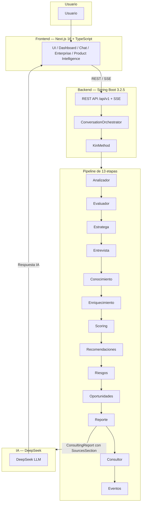

<div align="center">

# KIN

### Intelligent SaaS Platform

**Plataforma SaaS de inteligencia y estructuración estratégica para empresas, consultorías, emprendedores, dueños de empresa y profesionales.**

**Plataforma en producción:** [https://kin-platform.com](https://kin-platform.com)

[](https://www.oracle.com/java/)
[](https://spring.io/projects/spring-boot)
[](https://nextjs.org/)
[](https://www.typescriptlang.org/)
[](https://www.postgresql.org/)
[](https://www.docker.com/)
[](https://www.deepseek.com/)
[](https://github.com/LuisAIDev/kin-platform/releases/tag/v2.0.0-phase10)

[Características](#características) •
[Para quién](#para-quién-es-kin) •
[Arquitectura](#arquitectura) •
[Pipeline](#kin-intelligence-pipeline) •
[Capacidades Enterprise](#capacidades-enterprise) •
[Roadmap](#roadmap) •
[Propiedad intelectual](#propiedad-intelectual)

</div>

---

## Descripción

KIN es una plataforma SaaS de inteligencia y estructuración estratégica que combina:

- **Inteligencia artificial** como capa de comunicación (el análisis lo decide el motor en Java)
- **Análisis estructurado** de proyectos y negocios
- **Adquisición de conocimiento externo** verificado
- **Entrevistas estratégicas** dirigidas por reglas
- **Análisis de riesgos, oportunidades y recomendaciones**
- **Generación de reportes de viabilidad** con trazabilidad
- **Generación documental empresarial** (lean canvas, planes, matrices, KPIs, reportes)
- **Product Intelligence** (analítica de uso, insights y recomendaciones)
- **Observabilidad, arquitectura cloud y controles de seguridad**
- **Suscripciones y planes** (modelo SaaS con integración de pagos)

KIN funciona como una capa inteligente de apoyo que transforma información empresarial y de
proyectos en análisis estructurado y documentación útil.

```
ENTRADA → CONTEXTO → ENTREVISTA → CONOCIMIENTO → ANÁLISIS → RIESGOS → OPORTUNIDADES →
RECOMENDACIONES → REPORTES → DECISIONES
```

---

## Problema que resuelve

Empresas y profesionales frecuentemente tienen información dispersa, ideas sin estructurar,
riesgos no identificados y dificultades para convertir información en análisis estratégico y
documentación útil.

KIN **centraliza y estructura** ese proceso mediante una plataforma inteligente que:

- **estructura** la información dispersa de un proyecto o negocio
- **facilita** el diagnóstico y la evaluación de viabilidad
- **permite** identificar riesgos, oportunidades y recomendaciones
- **reduce** el trabajo manual de análisis y redacción
- **genera** reportes y documentación empresarial reproducible
- **apoya** la toma de decisiones con información organizada y trazable

KIN no promete resultados financieros garantizados: es una herramienta de apoyo y análisis, no
una garantía de ventas, financiación o éxito empresarial.

---

## Propuesta de valor

KIN convierte la información del usuario en un **contexto estructurado** y, sobre él, aplica un
motor de análisis determinista que produce hallazgos accionables y documentación profesional. El
principio rector de la plataforma:

> **Java decide. El LLM únicamente comunica.**
> Java decide qué preguntar, qué conocimiento adquirir, qué hechos son relevantes y qué fuentes
> se citan; el LLM solo formula preguntas y explica el análisis ya decidido.

Esto permite entregar análisis **consistentes, trazables y auditables**, independientes del
proveedor de IA utilizado.

---

## ¿Para quién es KIN?

### Empresas

- Estructuración de información y contexto de proyectos/negocios
- Análisis estratégico y evaluación de viabilidad
- Identificación de riesgos y oportunidades
- Recomendaciones accionables
- Generación de reportes y documentación empresarial
- Seguimiento de indicadores y uso de la plataforma (Product Intelligence)
- Centralización del contexto del proyecto

### Consultorías

- Aceleración de procesos de diagnóstico
- Estructuración de entrevistas estratégicas
- Generación de análisis y documentación
- Apoyo a múltiples proyectos/clientes
- Reducción de tareas repetitivas

### Emprendedores

- Estructuración de ideas
- Evaluación de proyectos
- Identificación de riesgos y oportunidades
- Construcción de contexto estratégico
- Generación de documentación

### Dueños de empresa

- Análisis de iniciativas y nuevas líneas de negocio
- Organización de la información
- Visualización de riesgos
- Obtención de recomendaciones
- Generación de documentación empresarial

### Profesionales

- Apoyo en estructuración y análisis
- Generación de documentos
- Conocimiento contextual

---

## Cómo funciona

El usuario describe su proyecto o negocio en una conversación guiada:

```
Usuario → Registro/Login → Plan/Suscripción → Uso de KIN → Resultados / reportes
```

1. **Registro y autenticación** — cuenta con rol y plan asignado.
2. **Contexto** — la plataforma construye y persiste el contexto del proyecto.
3. **Entrevista estratégica** — el motor pregunta en Java hasta completar el contexto.
4. **Conocimiento** — adquisición de hechos externos verificados (offline-first).
5. **Análisis** — scoring, recomendaciones, riesgos y oportunidades.
6. **Reporte** — informe de viabilidad con fuentes citadas.
7. **Documentos** — generación documental empresarial (plan de negocio, matrices, KPIs, etc.).
8. **Decisiones** — el usuario decide con información estructurada.

---

## Arquitectura

KIN aplica **Clean Architecture + DDD Táctico + Pipeline Pattern + Event-Driven**. El dominio
`com.kinplatform.kin.*` es 100 % POJO (sin Spring, JPA ni IA); la infraestructura se concentra
en adaptadores y la composición se resuelve en `KinConfig`.

```
                 ┌─────────────────────┐
                 │       USUARIO       │
                 └──────────┬──────────┘
                            ↓
                 ┌─────────────────────┐
                 │   KIN FRONTEND      │
                 │  Next.js / Web UI   │
                 └──────────┬──────────┘
                            ↓
                 ┌─────────────────────┐
                 │    KIN BACKEND      │
                 │   Spring Boot API   │
                 └──────────┬──────────┘
                            ↓
          ┌─────────────────┼─────────────────┐
          ↓                 ↓                 ↓
     AI / LLM          Knowledge        Business Logic
     DeepSeek          Engine           Context · Análisis
          ↓             (offline-first)  Riesgos · Oportunidades
          │                 │            Recomendaciones · Reportes
          │                 │            Enterprise Docs
          └─────────────────┼─────────────────┘
                            ↓
                   PostgreSQL / Neon
                            ↓
                  Cloud Platform (Render)
```


```mermaid
flowchart TB
    subgraph Usuario
        U[Usuario]
    end
    subgraph Frontend["Frontend — Next.js 16 + TypeScript"]
        F[UI / Dashboard / Chat / Enterprise / Product Intelligence]
    end
    subgraph Backend["Backend — Spring Boot 3.2.5"]
        REST[REST API /api/v1 + SSE]
        CO[ConversationOrchestrator]
        KM[KinMethod]
    end
    subgraph Pipeline["Pipeline de 13 etapas"]
        A[Analizador] --> B[Evaluador]
        B --> C[Estratega]
        C --> I[Entrevista]
        I --> K[Conocimiento]
        K --> E[Enriquecimiento]
        E --> S[Scoring]
        S --> R[Recomendaciones]
        R --> Ri[Riesgos]
        Ri --> O[Oportunidades]
        O --> Rep[Reporte]
        Rep --> Cons[Consultor]
        Cons --> Ev[Eventos]
    end
    subgraph IA["IA — DeepSeek"]
        LLM[DeepSeek LLM]
    end
    U --> F
    F -->|REST / SSE| REST
    REST --> CO
    CO --> KM
    KM --> Pipeline
    Rep -->|ConsultingReport con SourcesSection| IA
    LLM -->|Respuesta IA| F
```

**Módulos del backend:** `auth`, `user`, `project`, `chat`, `pricing`, `ai` (adaptadores) y el
núcleo de dominio `kin.*` con sus bounded contexts:

| Paquete | Bounded context |
|---|---|
| `kin.engine` | Infraestructura de motores (`DomainEngine`, `EngineRegistry`, `EngineExecutor`, `EngineStage`) |
| `kin.pipeline` | `Pipeline` + `PipelineContext` + stages + resiliencia (retry/timeout/métricas) |
| `kin.context` | `ProjectContext`, evaluación, decisión, `ContextRepository` (contexto durable) |
| `kin.scoring` | `ScoringEngine` |
| `kin.reporting` | `RecommendationEngine`, `RiskEngine`, `OpportunityEngine`, `ReportEngine` |
| `kin.ai` / `kin.ai.prompt` | `AIResponder`, `PromptAssembler`, `ConversationPromptBuilder`, `ReportPromptBuilder` |
| `kin.conversation` | `ConversationOrchestrator`, `TurnPolicy`, `ResponseGuard`, `HistoryWindow` |
| `kin.knowledge` | `KnowledgeEngine`, `KnowledgeGateway`, `SourceValidator` (+ policy/planner/orchestrator/citation) |
| `kin.interview` | `InterviewEngine`, `InterviewBlueprint`, `AnswerValidator` |
| `kin.enrichment` | `EnrichmentEngine`, `FactRanker`, `EvidenceCategory` |
| `kin.enterprise` | BC Enterprise: generación de documentos de negocio, versionado, eventos, renderers |

---

## KIN Intelligence Pipeline

El motor de análisis de KIN se compone de **13 etapas** verificadas en código:

```
Analizador → Evaluador → Estratega → Entrevista → Conocimiento → Enriquecimiento →
Scoring → Recomendaciones → Riesgos → Oportunidades → Reporte → Consultor → Eventos
```

| # | Etapa | Responsabilidad |
|---|---|---|
| 1 | **Analizador** | Extrae dimensiones del mensaje y actualiza el `ProjectContext` |
| 2 | **Evaluador** | `CompletenessEvaluation` de las dimensiones cubiertas |
| 3 | **Estratega** | Decide la acción (`ConversationDecision`): `ASK`, `REPORT`, etc. |
| 4 | **Entrevista** | Entrevista estratégica dirigida por Java (garantiza un contexto completo) |
| 5 | **Conocimiento** | Adquiere hechos externos verificados (offline-first) |
| 6 | **Enriquecimiento** | `FactRanker` selecciona y pondera los hechos relevantes por categoría |
| 7 | **Scoring** | Score de viabilidad por categoría y dimensión |
| 8 | **Recomendaciones** | `RecommendationEngine` |
| 9 | **Riesgos** | `RiskEngine` |
| 10 | **Oportunidades** | `OpportunityEngine` (8 analizadores auto-descubiertos) |
| 11 | **Reporte** | `ReportEngine` orquesta los `SectionAssembler` y produce el `ConsultingReport` (11 secciones, incl. `SourcesSection`) |
| 12 | **Consultor** | Selecciona el prompt (conversación o REPORT) y comunica la respuesta del LLM |
| 13 | **Eventos** | Publica eventos de dominio según la decisión |

**Motores de dominio** (fase / ADR):

| Motor | ADR | Responsabilidad |
|---|---|---|
| `ScoringEngine` | ADR-009 (prioridad 30) | Score de viabilidad por categoría y dimensión |
| `RecommendationEngine` | ADR-003 | Recomendaciones deduplicadas y priorizadas |
| `RiskEngine` | ADR-004 | Riesgos con severidad, probabilidad y nivel |
| `OpportunityEngine` | ADR-010 (prioridad 60) | 8 analizadores (mercado, innovación, tecnológico, financiero, competitivo, escalabilidad, automatización, monetización) |
| `ReportEngine` | ADR-011 (prioridad 70) | Orquestador puro del `ConsultingReport` |
| `KnowledgeEngine` | ADR-014 (prioridad 50) | Adquisición y validación de conocimiento externo |
| `InterviewEngine` | ADR-015 | Entrevista estratégica dirigida por Java |
| `EnrichmentEngine` | ADR-016 (prioridad 55) | Selección y ponderación de hechos relevantes |
| `Prompt Engine` | ADR-012 | `PromptAssembler` fachada pura + `ReportPromptBuilder` |

---

## Características

### Capacidades SaaS

- 🔐 **Autenticación segura** con JWT (stateless) y contraseñas cifradas con BCrypt
- 🎭 **Roles de usuario**: `FREE`, `PREMIUM`, `FACILITADOR`, `ADMIN`
- 💳 **Planes de precios** administrables (`PricingPlan`), CRUD solo ADMIN
- 📋 **Suscripciones** con límites, prueba (trial), cancelación y upgrades
- 💰 **Integración de pagos con Stripe** (checkout + webhook)
- 📁 **Gestión de proyectos** — CRUD con paginación y catálogo de categorías administrable
- 🤖 **Chat con IA** por proyecto, historial persistente, modo bloqueante y streaming SSE
- 📱 **Diseño responsive mobile-first**

### Capacidades Enterprise

- 📄 **Enterprise Document Generation** (BC `kin.enterprise`, ADR-018) — 9 tipos de documento
  (lean canvas, plan de mercado, plan financiero, hoja de ruta, matriz de riesgos, KPIs, plan de
  innovación, Executive Report y DOFA) en **PDF / DOCX / PPTX**, con versionado, REST + OpenAPI,
  dashboard SSE y ciclo automático conversación → generación
- 📊 **Enterprise Score** persistido y expuesto + narrativa IA
- 🖥️ **Enterprise Dashboard** integrado en el frontend
- 📊 **Product Intelligence** — analítica de uso, insights de conversación, recomendaciones y
  reportes (offline, sin envío externo de datos)
- 🛡️ **AI Guardrails** — `PromptGuardrail` detecta inyección de prompts, jailbreak y solicitudes
  inseguras de forma determinista (sin LLM)
- 🔄 **Pipeline Resilience** — retry/timeout/métricas por etapa, semántica de eventos y
  `ResponseFallback` ante respuestas inválidas del LLM

---

## KIN Enterprise — estado de las capacidades

> **Criterio de clasificación:** IMPLEMENTADO EN CÓDIGO = hay clases/endpoints/páginas que lo
> ejecutan. DOCUMENTADO / ARQUITECTURA = existe especificación, sin código que lo ejecute.
> ROADMAP = pendiente, descrito como trabajo futuro.

| Capacidad | Estado | Evidencia |
|---|---|---|
| Enterprise Document Generation | **IMPLEMENTADO EN CÓDIGO** | `kin.enterprise`, `EnterpriseController` (11 endpoints), renderers PDF/DOCX/PPTX, dashboard frontend |
| Product Intelligence | **IMPLEMENTADO EN CÓDIGO** | `src/services/intelligence`, páginas `/dashboard/analytics`, `/insights`, `/recommendations`, `/reports` |
| Observabilidad | **IMPLEMENTADO EN CÓDIGO** | `ai/observability`, Micrometer, `/actuator/prometheus`, logs estructurados |
| Seguridad | **IMPLEMENTADO EN CÓDIGO** | JWT, CORS, rate limiting, headers HTTP, guardrails |
| Testing / CI-CD / DevSecOps | **IMPLEMENTADO EN CÓDIGO** | Vitest, Playwright, 5 workflows GitHub Actions, SonarQube config, CodeQL, Dependabot, Renovate |
| Cloud / Docker / Render | **PARCIAL — configurado, despliegue real pendiente** | `render.yaml`, `Dockerfile*`, perfiles `prod`/`render`/`enterprise` |
| Caché Redis (opcional) | **PARCIAL — implementado y deshabilitado** | `RedisKnowledgeRepository`, `@ConditionalOnProperty`; falta ADR de clave de caché |
| Business Intelligence Layer (BIL) | **DOCUMENTADO / ARQUITECTURA** | `FASE11_BUSINESS_INTELLIGENCE_LAYER.md`, ADR-019 (aprobado-diseño); sin código |
| Arquitectura Empresarial (governance, compliance, continuidad, etc.) | **DOCUMENTADO / ARQUITECTURA** | Especificaciones FASE 18–35 (`KIN_*_SPECIFICATION.md`) — capa documental |
| Multi-región / multi-tenant / analítica avanzada | **ROADMAP** | KIN 3.0 y especificaciones documentales |

---

## Seguridad

- Autenticación **stateless JWT** y contraseñas con **BCrypt**
- **CORS** de origen único configurado (`SecurityConfig`)
- **Rate limiting** y filtro de acceso por suscripción
- **Headers HTTP** de seguridad (CSP/HSTS)
- **Guardrails de IA** deterministas (inyección de prompts, jailbreak)
- Gestión de secretos por variables de entorno (`.env` gitignored)
- **Correo transaccional** con **Brevo SMTP**: las credenciales se administran únicamente mediante variables de entorno/secrets (`MAIL_HOST`, `MAIL_PORT`, `MAIL_USERNAME`, `MAIL_PASSWORD`, `.env` gitignored) y nunca se almacenan en el repositorio
- Mitigación SSRF en adaptadores de conocimiento (`allowlist` de hosts)

---

## Observabilidad

- Spring Boot **Actuator** (`health`, `info`, `metrics`, `prometheus`)
- Métricas **Micrometer** con prefijo `kin.*` (ciclo, etapas, proveedores, caché, orquestador)
- **Logging estructurado** con `correlationId`/`requestId`/`traceId` (sin datos sensibles)
- Métricas internas del pipeline por etapa (duración, éxito/fallo, reintentos, timeout)

---

## Cloud Architecture

- **Contenedores**: Docker + Docker Compose (`postgres-db`, `kin-backend`, `kin-frontend`) con
  HEALTHCHECK y usuario no-root
- **Base de datos**: PostgreSQL 16 (Docker) o **Neon** (PostgreSQL serverless)
- **Backend**: **Render** (Blueprint `render.yaml`, `autoDeploy`, healthcheck `/api/v1/actuator/health`)
- **Frontend**: Vercel / Render (Next.js)
- **Perfiles**: `dev` (default), `test`, `prod`, `render`, `enterprise`
- **Migraciones**: Flyway V1…V12 (`ddl-auto: none`)

---

## Modelo SaaS

KIN implementa un modelo de suscripción completo:

```
Usuario → Registro/Login → Plan → Suscripción → Acceso a funcionalidades → Uso de KIN → Resultados / reportes
```

- **Planes** administrables desde el panel de ADMIN (`/admin/pricing`)
- **Suscripción** con estado, límites (proyectos, mensajes) y prueba
- **Pagos** vía Stripe (checkout y webhook)
- **Acceso** condicionado por plan y rol (filtro de suscripción)

Los precios comerciales se configuran como datos del producto (no están fijados en el código).

---

## Catálogo de categorías (SaaS-ready)

Las categorías de proyecto son datos administrables, no código. Una nueva industria se agrega
como fila en `categories` sin modificar Java ni React.

- **Entidad**: `Category` → tabla `categories` (17 categorías iniciales)
- **API**: `GET /categories` devuelve solo categorías activas ordenadas por `display_order`
- **Seed**: Flyway `V6__create_categories.sql` (prod) / `CategoryDataInitializer` (dev)

---

## API REST

| Endpoint | Método | Auth | Descripción |
|---|---|---|---|
| `/auth/register` | `POST` | No | Registro de nuevo usuario |
| `/auth/login` | `POST` | No | Inicio de sesión, devuelve JWT |
| `/auth/me` | `GET` | Bearer JWT | Datos del usuario autenticado |
| `/categories` | `GET` | No | Catálogo de categorías activas |
| `/projects` | `GET` / `POST` | Bearer JWT | Listar / crear proyectos |
| `/projects/{id}` | `GET` / `PUT` / `DELETE` | Bearer JWT | CRUD de un proyecto |
| `/projects/{id}/chat` | `POST` | Bearer JWT | Enviar mensaje al asistente IA |
| `/projects/{id}/chat/stream` | `POST` | Bearer JWT | Streaming SSE de la respuesta IA |
| `/projects/{id}/messages` | `GET` / `DELETE` | Bearer JWT | Historial / limpieza de mensajes |
| `/projects/{id}/report` | `GET` | Bearer JWT | Informe de viabilidad (`ConsultingReport`) |
| `/projects/{id}/reports` | `GET` | Bearer JWT | Versiones del informe |
| `/pricing-plans` | `GET` | No | Planes de precios activos |
| `/pricing-plans/{id}` | `GET` | No | Detalle de un plan |
| `/admin/pricing-plans` | `POST` / `PUT` / `DELETE` | ADMIN | CRUD de planes |
| `/subscriptions/current` | `GET` | Bearer JWT | Suscripción activa del usuario |
| `/subscriptions/status` | `GET` | Bearer JWT | Estado del plan (límites, mensajes restantes) |
| `/subscriptions` | `POST` | Bearer JWT | Suscribirse a un plan |
| `/subscriptions/trial` | `POST` | Bearer JWT | Iniciar prueba |
| `/subscriptions/cancel` | `POST` | Bearer JWT | Cancelar suscripción |
| `/subscriptions/available-upgrades` | `GET` | Bearer JWT | Planes superiores disponibles |
| `/stripe/create-checkout-session` | `POST` | Bearer JWT | Sesión de checkout Stripe |
| `/stripe/webhook` | `POST` | No | Webhook de Stripe |
| `/enterprise/{projectId}` | `GET` | Bearer JWT | Dashboard enterprise |
| `/enterprise/{projectId}/versions` | `GET` | Bearer JWT | Listado de versiones |
| `/enterprise/{projectId}/{version}` | `GET` | Bearer JWT | Versión específica |
| `/enterprise/{projectId}/generate` | `POST` | Bearer JWT | Generar (o regenerar) documentos |
| `/enterprise/{projectId}/{version}/documents` | `GET` | Bearer JWT | Documentos de una versión |
| `/enterprise/{projectId}/{version}/documents/{type}` | `GET` | Bearer JWT | Detalle de un documento |
| `/enterprise/{projectId}/{version}/export` | `GET` | Bearer JWT | Exportar documentos (bundle) |
| `/enterprise/{projectId}/{version}/export/{format}` | `GET` | Bearer JWT | Exportar en formato (PDF/DOCX/PPTX) |
| `/enterprise/{projectId}/{version}/export/{type}/{format}` | `GET` | Bearer JWT | Exportar un documento en formato |
| `/enterprise/{projectId}/{version}/dashboard` | `GET` | Bearer JWT | Dashboard consolidado de una versión |
| `/enterprise/{projectId}/{version}/stream` | `GET` | Bearer JWT | SSE de progreso de generación |

---

## Tecnología

| Categoría | Tecnología |
|---|---|
| Backend | Java 17 · Spring Boot 3.2.5 · Spring Security (JWT) |
| Frontend | Next.js 16 (App Router) · React 19 · TypeScript 5 (strict) · Tailwind CSS 4 |
| Persistencia | PostgreSQL (dev/prod) · Flyway V1…V12 · JPA/Hibernate |
| IA | DeepSeek (default) + fallback determinista en español (sin LLM) |
| Pagos | Stripe (checkout + webhook) |
| Testing | JUnit 5, Mockito, Reactor Test, Vitest, React Testing Library, Playwright |
| Cobertura | JaCoCo (dominio ≥ 90 %) · Vitest coverage |
| Contenedores / Cloud | Docker Compose · Render · Neon · Vercel |
| Calidad | SonarQube · CodeQL · OWASP Dependency Check · Gitleaks · Dependabot · Renovate |

---

## Modelo de evolución

KIN está diseñado conceptualmente como una plataforma tecnológica de **largo ciclo de vida**,
cuya arquitectura permite **evolución progresiva durante un horizonte de largo plazo** mediante:

- arquitectura modular y clean (dominio POJO, ports & adapters)
- evolución **aditiva** (overloads, puertos, flags) sin romper contratos congelados
- **gobernanza** de decisiones (ADRs) y deprecación controlada
- observabilidad y testing como requisito de cambio
- compatibilidad (SemVer + contract versioning)

Las decisiones de arquitectura se registran como **ADR** (Architecture Decision Records). El
repositorio cuenta con **19 ADRs** (ADR-001 … ADR-019).

---

## Roadmap

> **Status:** ✅ Fase 10 completada (release `v2.0.0-phase10`) · ✅ Fases 11–16/20 implementadas
> en el repositorio principal (Enterprise Platform v2.0) · Resto: documentado o pendiente.

### KIN Evolution Roadmap

La historia de desarrollo de KIN no es una única secuencia lineal de fases: existen **namespaces
históricos de numeración** (fases de release, fases documentales y especificaciones de
arquitectura empresarial). Esta sección los agrupa sin reescribir la historia de Git.

| Etapa | Fases | Contenido | Estado |
|---|---|---|---|
| **I — Fundación** | 1–4 | Auth+Users, Chat+Messages, Project Context, KinMethod+Pipeline | ✅ COMPLETADA |
| **II — KIN Intelligence Core** | 5.0–5.6 | Motores de análisis, runtime consolidado, prompts, orquestador de conversación | ✅ COMPLETADA |
| **III — Knowledge & Analysis** | 6–9 | Knowledge Engine, Interview Engine, Enrichment + Sources, Pipeline Resilience | ✅ COMPLETADA |
| **IV — Enterprise Document Generation** | 10 | BC Enterprise (ADR-018) — generación/exportación de documentos | ✅ COMPLETADA (release `v2.0.0-phase10`) |
| **V — Enterprise SaaS Platform** | 11–16 | DevSecOps, Testing frontend, Cloud, Product Experience, AI Guardrails, Product Intelligence | ✅ IMPLEMENTADA (sin release) |
| **VI — Knowledge Engine / Product Intelligence** | 12.0–17.0 / 20.0 | Construcción KE v1, Observabilidad, Performance, Certificación, Auditoría, Cloud Infra, Product Intelligence | ✅ Implementada / 📄 documentada |
| **VII — Enterprise Architecture** | 18–35 | Especificaciones de arquitectura empresarial (seguridad, gobernanza, compliance, continuidad, etc.) | 📄 DOCUMENTAL (sin código) |

> **Nota de namespaces históricos:** la numeración de fases convive en varios esquemas. Por
> ejemplo, "Fase 11" corresponde a *DevSecOps* (README), a *Business Intelligence Layer*
> (documento de diseño) o a *trabajo planeado* (CHANGELOG); "Fase 20" corresponde a *Product
> Intelligence* (archivo de fase) y a *Visión y Escala Global* (especificación). Esta
> documentación presenta la agrupación oficial por etapas sin afirmar una única secuencia
> numérica. **No existe evidencia de una secuencia de "51 fases".**

### Pendiente (ROADMAP / FUTURO)

- [ ] Despliegue en producción (backend Render, frontend Vercel, PostgreSQL Neon)
- [ ] E2E completo de frontend con Playwright
- [ ] ADR de clave de caché para `RedisKnowledgeRepository`
- [ ] KIN 2.3 — Provider deduplication
- [ ] KIN 2.4 — EventBus async + persistencia (outbox)
- [ ] KIN 2.5 — Context Analyzer NLP
- [ ] KIN 3.0 — multi-tenant, plugin system, separación completa en Bounded Contexts
- [ ] Implementación de Business Intelligence Layer (diseño aprobado, ADR-019)

---

## Estado actual

- **Release estable:** `v2.0.0-phase10` (Fase 10 — Enterprise Document Generation, ADR-018)
- **Releases anteriores:** `v1.0.0-phase8`, `v1.1.0-phase9`, `v2.0.0-alpha.1`
- **Pipeline:** 13 etapas verificadas en código
- **ADRs:** 19 (ADR-001 … ADR-019; ADR-019 aprobado en diseño)
- **Tests backend:** 1.850+ (última release, 0 fallos) · **Tests frontend:** 66+ (Vitest)
- **Cobertura de dominio:** ≥ 90 % (JaCoCo)

---

## Fases de evolución — detalle verificado

Las fases con **implementación comprobable en código y/o release** son:

| Fase | Nombre | Evidencia |
|---|---|---|
| 1 | Auth + Users | `auth/`, `user/`, JWT |
| 2 | Chat + Messages | `chat/` (bloqueante + SSE) |
| 3 | Project Context | `project/` CRUD |
| 4 | KinMethod + Pipeline + Provider IA | `kin/pipeline`, `kin/context`, `ProviderRouter` |
| 5.0–5.6 | Motores (Recommendation, Risk, Engines, Runtime, Opportunity, Report, Prompt, Orchestrator) | `kin/engine`, `kin/reporting`, `kin/conversation`, `kin/ai` |
| 6 | External Knowledge Acquisition | `kin/knowledge` + `ai/knowledge.adapter` |
| 7 | Strategic Interview Engine | `kin/interview` + `ai/interview.adapter` |
| 8 | Knowledge-Enhanced Analysis | `kin/enrichment` + `SourcesSection` |
| 9 | Pipeline Resilience (KIN 2.1) | `kin/pipeline/resilience`, `ResponseFallback` |
| 10 | Enterprise Document Generation | `kin/enterprise` |
| 11–16 | Enterprise SaaS Platform | CI/CD, testing frontend, cloud, UX, guardrails, Product Intelligence |
| 12.0–17.0 / 20.0 | Knowledge Engine v1 / Observabilidad / Performance / Certificación / Auditoría / Cloud Infra / Product Intelligence | `kin.knowledge.*`, `ai/observability`, benchmarks |

Las fases **18–35** corresponden a la **capa documental** de arquitectura empresarial
(`KIN_*_SPECIFICATION.md`): no implementan código y representan especificaciones, políticas y
gobernanza. Las fases **F22, F27 y F28** aparecen referenciadas como precedentes en esas
especificaciones pero no cuentan con archivo propio en el repositorio.

---

## Limitaciones actuales

- Los adaptadores de conocimiento externo están implementados con **mocks** (sin red real); el
  enriquecimiento efectivo requiere configurar allowlist/fuentes en producción
- La caché Redis está implementada pero **deshabilitada** por defecto (pendiente ADR de clave)
- El **despliegue en producción** está configurado pero no ejecutado/validado en entorno real
- La observabilidad OpenTelemetry está preparada, la exportación real queda pendiente de entorno
- El **Business Intelligence Layer** (Fase 11) está aprobada solo como diseño
- Las fases documentales 18–35 no representan funcionalidad implementada

---

## Instalación para desarrollo

### Requisitos previos

- Java 17+, Node.js 20+, Maven (o el wrapper `mvnw`)
- (Opcional) Docker y Docker Compose

### Configurar variables de entorno

```bash
cp .env.example .env
```

### Levantar el backend

```bash
cd kin-backend
./mvnw spring-boot:run
```

Backend en `http://localhost:8080/api/v1` usando PostgreSQL (perfil `dev`). Requiere la base
local (`docker compose up -d postgres-db`).

### Levantar el frontend

```bash
cd kin-frontend
npm install
npm run dev
```

Frontend en `http://localhost:3000`.

### (Alternativa) Todo con Docker

```bash
docker compose up --build
```

### Reset de base local (desarrollo)

```bash
# Windows
powershell -ExecutionPolicy Bypass -File scripts/reset-dev-db.ps1
# Linux / macOS
bash scripts/reset-dev-db.sh
```

> ⚠️ Operación destructiva que solo afecta a la base local de desarrollo (localhost). El esquema
> lo administra Flyway (`V1..V12`, `ddl-auto: none`); Hibernate nunca modifica el esquema
> silenciosamente.

---

## Testing

```bash
cd kin-backend && ./mvnw clean verify   # backend: 1.850+ tests, 0 fallos (última release)
cd kin-frontend && npm test              # frontend: 66+ tests (Vitest)
cd kin-frontend && npx playwright test   # E2E (requiere backend con perfil test)
```

Cobertura de dominio ≥ 90 % (JaCoCo) en `kin.engine`, `kin.ai`, `kin.conversation`,
`kin.knowledge`, `kin.interview`, `kin.enrichment`, `kin.reporting`, `kin.scoring`,
`kin.enterprise`.

---

## Propiedad intelectual

KIN es **software propietario**. El código fuente, la arquitectura, la documentación original,
la metodología, los diseños, los assets originales, los diagramas y los materiales originales
desarrollados para la plataforma pertenecen a sus respectivos titulares y están protegidos por
los derechos de propiedad intelectual aplicables. **Todos los derechos están reservados.**

El uso de los componentes propios de KIN se rige exclusivamente por
[`LICENSE-PROPRIETARY.md`](LICENSE-PROPRIETARY.md). Sin autorización expresa de los titulares
no se permite copiar, redistribuir, modificar, sublicenciar ni explotar comercialmente los
componentes propios de KIN.

El nombre **"KIN"** y los signos distintivos asociados no pueden utilizarse sin autorización de
los titulares.

Los **componentes de terceros** (dependencias del proyecto) se rigen por sus respectivas
licencias y no se ven afectados por esta declaración. La atribución correspondiente se documenta
en [`THIRD_PARTY_NOTICES.md`](THIRD_PARTY_NOTICES.md).

---

## Contribuciones

Las contribuciones están sujetas a las condiciones de propiedad intelectual y licenciamiento de
la plataforma. Consultar [`LICENSE-PROPRIETARY.md`](LICENSE-PROPRIETARY.md) y contactar a los
titulares antes de contribuir.

---

## Contacto

- **Autor / titular del proyecto:** Luis Orlando Guerra González
- **GitHub:** [LuisAIDev](https://github.com/LuisAIDev)
- **LinkedIn:** [Luis Orlando Guerra González](https://www.linkedin.com/in/luis-orlando-guerra-gonzalez-49aa30244)

---

<div align="center">

⭐ Si KIN te resulta útil, considera dar una estrella en GitHub

</div>
