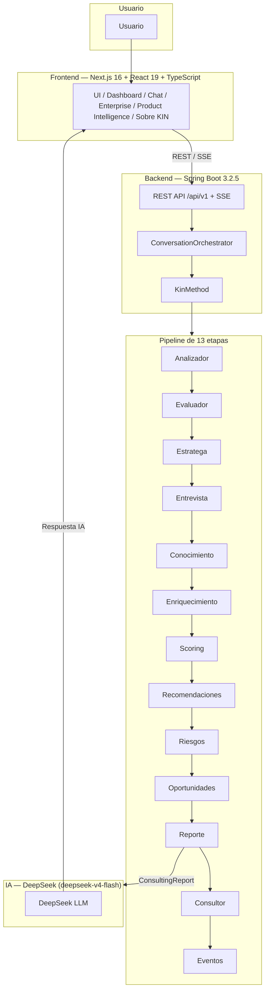

<div align="center">

# KIN

### Intelligent SaaS Platform

**Plataforma SaaS de inteligencia y estructuración estratégica para empresas, consultorías, emprendedores, dueños de empresa y profesionales.**

**🌐 Demo en producción:** [https://kin-platform.com](https://kin-platform.com)

[](https://www.oracle.com/java/)
[](https://spring.io/projects/spring-boot)
[](https://nextjs.org/)
[](https://react.dev/)
[](https://www.typescriptlang.org/)
[](https://tailwindcss.com/)
[](https://www.postgresql.org/)
[](https://www.docker.com/)
[](https://www.deepseek.com/)
[](https://github.com/LuisAIDev/kin-platform/releases/tag/v2.0.0-phase10)

**Índice**

[Descripción](#descripción) •
[Demo en producción](#demo-en-producción) •
[Sobre KIN](#sobre-kin) •
[Creador](#creador-y-responsable-técnico) •
[Arquitectura](#arquitectura) •
[Pipeline](#kin-intelligence-pipeline) •
[Enterprise](#capacidades-enterprise) •
[Seguridad](#seguridad) •
[Quality & Testing](#quality--testing) •
[DevSecOps](#devsecops-y-cicd) •
[API REST](#api-rest) •
[Tecnologías](#tecnologías) •
[Roadmap](#roadmap) •
[Estado actual](#estado-actual) •
[Propiedad intelectual](#propiedad-intelectual-y-acceso-técnico) •
[Contacto](#contacto)

</div>

---

## Descripción

KIN es una plataforma SaaS de **inteligencia y estructuración estratégica** que combina un
motor de análisis determinista escrito en Java con una capa de IA (LLM) orientada a la
comunicación. Transforma la información dispersa de un proyecto o negocio en **contexto
estructurado, análisis de viabilidad, riesgos, oportunidades, recomendaciones y documentación
profesional reproducible**.

El proyecto integra de forma real —no solo documental— las siguientes capacidades:

- **Motor de análisis determinista** (13 etapas) que decide en Java qué preguntar, qué
  conocimiento adquirir, qué hechos son relevantes y qué reporte producir.
- **Entrevista estratégica** dirigida por reglas y **adquisición de conocimiento externo**
  verificada (offline-first).
- **Generación documental Enterprise** (lean canvas, planes, matrices, KPIs, reportes) con
  exportación **PDF / DOCX / PPTX**, versionado y dashboard en tiempo real (SSE).
- **Product Intelligence** (analítica de uso e insights, 100 % local, sin envío externo de datos).
- **Modelo SaaS completo** con roles, suscripciones, límites y pagos (Stripe).
- **DevSecOps**: CI/CD, pruebas automatizadas, análisis estático, escaneo de secretos y
  dependencias, guardrails de IA y observabilidad.

> KIN es una **herramienta de apoyo al análisis y la toma de decisiones**: no garantiza
> resultados financieros, financiación ni éxito empresarial.

---

## Demo en producción

La plataforma está **desplegada y disponible públicamente**:

- **🌐 Plataforma:** [https://kin-platform.com](https://kin-platform.com)
- **📖 Sobre KIN:** [https://kin-platform.com/sobre-kin](https://kin-platform.com/sobre-kin)

Infraestructura de despliegue verificada en `render.yaml` y perfiles de Spring:

| Componente | Entorno | Evidencia |
|---|---|---|
| Frontend (Next.js) | Producción pública `kin-platform.com` | Verificado en línea |
| Backend (Spring Boot) | Render (`kin-backend.onrender.com`, autoDeploy) | `render.yaml` + healthcheck `/api/v1/actuator/health` |
| Base de datos | PostgreSQL gestionada (Neon / Render) | `render.yaml`, perfil `prod` (Flyway `ddl-auto: validate`) |
| CI/CD | GitHub Actions (5 workflows) | `.github/workflows/` |

---

## Sobre KIN

KIN (Knowledge, Innovation & Navigation) es una plataforma de inteligencia para apoyar la
**estructuración, análisis y evolución de proyectos** de emprendedores, empresarios y
organizaciones.

Nació como un proyecto tecnológico orientado a aplicar **desarrollo de software, inteligencia
artificial, arquitectura de sistemas, bases de datos, seguridad, automatización y pruebas** en
una solución real. No representa únicamente una aplicación terminada: representa un **proceso
continuo de aprendizaje, construcción y evolución tecnológica**.

- **Origen:** interés por *aprender haciendo*, sin un objetivo comercial inicial.
- **Propósito:** demostrar que el aprendizaje constante puede convertirse en soluciones
  tecnológicas capaces de aportar valor a la sociedad.
- **Visión:** construir una base arquitectónica lo suficientemente sólida para que nuevas
  capacidades puedan incorporarse a medida que evolucionan las necesidades de los usuarios.
- **Filosofía de desarrollo:** dominio puro (POJO), decisiones deterministas en Java, evolución
  aditiva sin romper contratos congelados y gobernanza mediante ADRs.
- **Capacidades técnicas:** backend Spring Boot, frontend Next.js, IA aplicada, testing,
  seguridad, cloud y documentación de arquitectura.
- **Enfoque:** emprendedores (estructurar ideas), empresarios (analizar y evolucionar proyectos
  existentes) y organizaciones (apoyar procesos de análisis con herramientas tecnológicas).

Puedes conocer la versión completa de esta narrativa en la página pública
[**Sobre KIN**](https://kin-platform.com/sobre-kin).

---

## Creador y responsable técnico

**Luis Orlando Guerra González** — desarrollador de software y responsable técnico del proyecto.

> KIN nació como un proyecto de aprendizaje, ingeniería y servicio, construido con el propósito
> de demostrar que mediante disciplina, estudio constante y desarrollo de software es posible
> construir soluciones tecnológicas robustas capaces de apoyar a empresas, consultorías,
> emprendedores y profesionales.

El proyecto es el resultado de un trabajo autodidacta y disciplinado: cada módulo, integración y
prueba representa práctica real sobre problemas concretos. KIN condensa aprendizaje continuo,
ingeniería de software, arquitectura, automatización, inteligencia artificial, testing,
seguridad, cloud, DevSecOps y diseño de sistemas en una plataforma verificable.

Su objetivo es seguir creciendo dentro de la ingeniería de software, trabajar junto a equipos de
desarrollo, recibir code reviews y críticas constructivas, y aportar lo aprendido durante la
construcción de KIN a nuevos desafíos tecnológicos.

---

## KIN como proyecto de ingeniería

KIN funciona también como un **proyecto demostrativo de capacidades técnicas** construido sobre
patrones de ingeniería de nivel profesional:

- **Clean Architecture + DDD táctico** — dominio `com.kinplatform.kin.*` 100 % POJO (sin Spring,
  JPA ni IA), ports & adapters, composición en `KinConfig`.
- **Pipeline Pattern** — motor de análisis de 13 etapas con resiliencia (retry/timeout/métricas).
- **Event-Driven** — `DomainEventBus`, eventos de dominio (`question_generated`,
  `report_generated`, `score_calculated`, `risk_detected`, etc.) y trigger conversación →
  generación Enterprise.
- **Bounded contexts** — `kin.engine`, `kin.pipeline`, `kin.context`, `kin.scoring`,
  `kin.reporting`, `kin.ai`, `kin.conversation`, `kin.knowledge`, `kin.enrichment`,
  `kin.interview`, `kin.enterprise`, `kin.export`.
- **IA aplicada** con principio **"Java decide. El LLM únicamente comunica."** y guardrails
  deterministas.
- **Testing real** — JUnit 5, Mockito, Testcontainers (PostgreSQL real), Vitest, React Testing
  Library, Playwright y JaCoCo (≥ 90 % de cobertura de instrucciones en el dominio).
- **DevSecOps** — 5 workflows de GitHub Actions, SonarQube, CodeQL, Gitleaks, OWASP Dependency
  Check, Spotless/Checkstyle/SpotBugs/PMD, Dependabot y Renovate.
- **Documentación arquitectónica** — 20 ADRs (ADR-001 … ADR-020) y baseline contractual
  (`BASELINE_ARCHITECTURE.md`).

**¿Qué demuestra este proyecto sobre la persona que lo construyó?** Que aprendió estas
tecnologías y, además, las usó para diseñar, construir, probar, desplegar y documentar un sistema
real en producción.

---

## ¿Qué puede observar un equipo técnico?

KIN permite evaluar capacidades prácticas en:

| Área | Evidencia en el proyecto |
|---|---|
| Backend Engineering | Spring Boot, arquitectura por capas, controllers/services/ports/adapters |
| Frontend Engineering | Next.js App Router, React, TypeScript strict, Tailwind, hooks, servicios |
| API REST | 57 endpoints bajo `/api/v1` (ver [API REST](#api-rest)) |
| Arquitectura de software | Clean Architecture, DDD táctico, bounded contexts, ADRs |
| Diseño orientado a dominio | Motores `DomainEngine` POJO y fachadas puras (`PromptAssembler`) |
| Seguridad | JWT stateless, BCrypt, CORS de origen único, headers HTTP, rate limiting |
| Bases de datos | PostgreSQL, Flyway V1…V18, JPA/Hibernate, contextos durables |
| IA aplicada | DeepSeek vía Spring AI, pipeline determinista, guardrails, fallback en español |
| Testing | 2.758 tests backend + 316 tests frontend + E2E Playwright |
| Automatización E2E | Playwright sobre flujos de login, dashboard y Sobre KIN |
| CI/CD | 5 workflows GitHub Actions con lint, tests, build, E2E, calidad y seguridad |
| Docker | PostgreSQL + backend + frontend con HEALTHCHECK y usuario no-root |
| Cloud | Render, Neon/PostgreSQL, dominio propio `kin-platform.com` |
| Observabilidad | Actuator, Micrometer (`kin.*`), logs estructurados, Prometheus |
| DevSecOps | CodeQL, Gitleaks, OWASP, SonarQube, Dependabot, Renovate |
| Documentación técnica | 20 ADRs, especificaciones, release notes y línea base congelada |

El proyecto demuestra **experiencia práctica y verificable** en estas áreas; no se limita a
declararla.

---

## Principio rector

> **Java decide. El LLM únicamente comunica.**

KIN no delega las decisiones del sistema en el modelo de IA. Un **motor determinista en Java**
controla el contexto, las reglas, las etapas del pipeline, la entrevista estratégica, el scoring,
los riesgos, las oportunidades, las recomendaciones, los reportes y las validaciones. El modelo
de IA funciona como **capa de comunicación**: formula preguntas cuando el motor decide `ASK` y
explica el análisis ya decidido cuando corresponde generar reporte.

Esto produce análisis **consistentes, trazables y auditables**, independientes del proveedor de
IA utilizado.

---

## Arquitectura

KIN aplica **Clean Architecture + DDD Táctico + Pipeline Pattern + Event-Driven**. El dominio
`com.kinplatform.kin.*` es 100 % POJO (sin Spring, JPA ni IA); la infraestructura se concentra en
adaptadores (`ai/`) y la composición se resuelve en `KinConfig`.

```text
Usuario
   ↓
Next.js / React (App Router, TypeScript, Tailwind)
   ↓
Spring Boot REST API (/api/v1, JWT + SSE)
   ↓
Application / Domain (com.kinplatform.kin.* — POJO puro)
   ↓
KIN Intelligence Pipeline (13 etapas, resiliente)
   ↓
AI / Knowledge / Enterprise (DeepSeek · KnowledgeEngine · EnterpriseBC)
   ↓
PostgreSQL (Flyway V1…V18, contexto durable)
   ↓
Cloud Infrastructure (Render · Neon · Docker)
```


```mermaid
flowchart TB
    subgraph Usuario
        U[Usuario]
    end
    subgraph Frontend["Frontend — Next.js 16 + React 19 + TypeScript"]
        F[UI / Dashboard / Chat / Enterprise / Product Intelligence / Sobre KIN]
    end
    subgraph Backend["Backend — Spring Boot 3.2.5"]
        REST[REST API /api/v1 + SSE]
        CO[ConversationOrchestrator]
        KM[KinMethod]
    end
    subgraph Pipeline["Pipeline de 13 etapas"]
        A[Analizador] --> B[Evaluador]
        B --> C[Estratega]
        C --> I[Entrevista]
        I --> K[Conocimiento]
        K --> E[Enriquecimiento]
        E --> S[Scoring]
        S --> R[Recomendaciones]
        R --> Ri[Riesgos]
        Ri --> O[Oportunidades]
        O --> Rep[Reporte]
        Rep --> Cons[Consultor]
        Cons --> Ev[Eventos]
    end
    subgraph IA["IA — DeepSeek (deepseek-v4-flash)"]
        LLM[DeepSeek LLM]
    end
    U --> F
    F -->|REST / SSE| REST
    REST --> CO
    CO --> KM
    KM --> Pipeline
    Rep -->|ConsultingReport| IA
    LLM -->|Respuesta IA| F
```

**Bounded contexts del backend:**

| Paquete | Bounded context |
|---|---|
| `kin.engine` | Infraestructura de motores (`DomainEngine`, `EngineRegistry`, `EngineExecutor`, `EngineStage`) |
| `kin.pipeline` | `Pipeline` + `PipelineContext` + stages + resiliencia (retry/timeout/métricas) |
| `kin.context` | `ProjectContext`, evaluación, decisión, `ContextRepository` (contexto durable) |
| `kin.scoring` | `ScoringEngine` (score de viabilidad) |
| `kin.reporting` | `RecommendationEngine`, `RiskEngine`, `OpportunityEngine` (8 analizadores), `ReportEngine` |
| `kin.ai` / `kin.ai.prompt` | `AIResponder`, `PromptAssembler`, `ConversationPromptBuilder`, `ReportPromptBuilder` (10 `SectionFormatter`) |
| `kin.conversation` | `ConversationOrchestrator`, `TurnPolicy`, `ResponseGuard`, `HistoryWindow` |
| `kin.knowledge` | `KnowledgeEngine`, `KnowledgeGateway`, `SourceRegistry`, `SourceValidator` |
| `kin.enrichment` | `EnrichmentEngine`, `FactRanker`, `EvidenceCategory` |
| `kin.interview` | `InterviewEngine`, `InterviewBlueprint`, `AnswerValidator` |
| `kin.enterprise` | BC Enterprise: documentos de negocio, versionado, eventos, renderers |
| `kin.export` | BC Export (ADR-020): exportación estructurada del proyecto (DOCX/PDF/Markdown) |
| `kin.event` / `kin.usage` | Eventos de dominio y métricas de uso |

---

## KIN Intelligence Pipeline

El motor de análisis de KIN se compone de **13 etapas** verificadas en código
(`KinConfig.chatPipeline`):

```text
Analizador → Evaluador → Estratega → Entrevista → Conocimiento → Enriquecimiento →
Scoring → Recomendaciones → Riesgos → Oportunidades → Reporte → Consultor → Eventos
```

| # | Etapa | Responsabilidad |
|---|---|---|
| 1 | **Analizador** | Extrae dimensiones del mensaje y actualiza el `ProjectContext` |
| 2 | **Evaluador** | `CompletenessEvaluation` de las dimensiones cubiertas |
| 3 | **Estratega** | Decide la acción (`ConversationDecision`): `ASK`, `REPORT`, etc. |
| 4 | **Entrevista** | Entrevista estratégica dirigida por Java (contexto completo) |
| 5 | **Conocimiento** | Adquiere hechos externos verificados (offline-first) |
| 6 | **Enriquecimiento** | `FactRanker` selecciona y pondera los hechos relevantes por categoría |
| 7 | **Scoring** | Score de viabilidad por categoría y dimensión |
| 8 | **Recomendaciones** | `RecommendationEngine` |
| 9 | **Riesgos** | `RiskEngine` |
| 10 | **Oportunidades** | `OpportunityEngine` (8 analizadores auto-descubiertos) |
| 11 | **Reporte** | `ReportEngine` orquesta los `SectionAssembler` y produce el `ConsultingReport` |
| 12 | **Consultor** | Selecciona el prompt (conversación o REPORT) y comunica la respuesta del LLM |
| 13 | **Eventos** | Publica eventos de dominio según la decisión |

**Motores de dominio** (fase / ADR):

| Motor | ADR | Responsabilidad |
|---|---|---|
| `ScoringEngine` | ADR-009 | Score de viabilidad por categoría y dimensión |
| `RecommendationEngine` | ADR-003 | Recomendaciones deduplicadas y priorizadas |
| `RiskEngine` | ADR-004 | Riesgos con severidad, probabilidad y nivel |
| `OpportunityEngine` | ADR-010 | 8 analizadores (mercado, innovación, tecnológico, financiero, competitivo, escalabilidad, automatización, monetización) |
| `ReportEngine` | ADR-011 | Orquestador puro del `ConsultingReport` |
| `Prompt Engine` | ADR-012 | `PromptAssembler` fachada pura + `ConversationPromptBuilder` / `ReportPromptBuilder` |
| `ConversationOrchestrator` | ADR-013 | Ciclo de turno, directiva en Java, guardrails de respuesta |
| `KnowledgeEngine` | ADR-014 | Adquisición y validación de conocimiento externo (SSRF-safe) |
| `InterviewEngine` | ADR-015 | Entrevista estratégica dirigida por Java |
| `EnrichmentEngine` | ADR-016 | Selección y ponderación de hechos relevantes |

**Decisiones de arquitectura:** la evolución se gobierna mediante **20 ADRs** (ADR-001 …
ADR-020). `kin-docs/BASELINE_ARCHITECTURE.md` define la línea base contractual (ALPHA STABLE):
los contratos marcados como estables no pueden modificarse sin una ADR aprobada.

---

## Capacidades Enterprise

El bounded context `kin.enterprise` (ADR-018) implementa **generación documental empresarial**
con versionado y exportación:

- **9 tipos de documento**: Executive Report, Lean Canvas, DOFA, Financial Plan, Market Plan,
  Roadmap, Risk Matrix, KPIs e Innovation Plan.
- **3 formatos de exportación**: PDF, DOCX y PPTX (bundle ZIP por formato y descarga individual).
- **Enterprise Score** persistido por versión (0–100 con grado) y narrativa IA.
- **Dashboard Enterprise** integrado en el frontend con información y fuentes por dimensión
  (mercado, innovación, viabilidad, finanzas, riesgo, escalabilidad, equipo, sostenibilidad).
- **SSE de progreso** en tiempo real (`GET /enterprise/{projectId}/{version}/stream`).
- **Ciclo automático** conversación → generación (`EnterpriseProjectTrigger` → `DomainEventBus` →
  listener) cuando el reporte está completo.
- **8 motores deterministas** aislados de `EngineRegistry`: `BusinessModelEngine`,
  `EnterpriseScoreEngine`, `FinancialPlanEngine`, `InnovationEngine`, `KpiEngine`, `MarketEngine`,
  `RiskPlanEngine`, `RoadmapEngine`.

Además, el módulo **`kin.export`** (ADR-020) permite exportar el proyecto como documento
estructurado en **DOCX / PDF / Markdown** con modos `complete` / `summary` y plantilla de
referencia, con acción de descarga disponible desde el chat.

---

## Product Intelligence

Analítica de producto **offline** (sin envío externo de datos, reglas deterministas en el
frontend):

- `UsageStatistics` (diario/semanal/mensual, mensajes, sesiones, tokens estimados, feedback).
- `ConversationInsights` (longitud, preguntas por sesión, intención predominante, temas).
- `FeatureUsageTracker`, `ProductMetrics` (retención, activación, engagement) y
  `RecommendationEngine` basado en reglas.
- Exportación de métricas a **JSON, CSV y PDF**.
- Páginas `/dashboard/analytics`, `/insights`, `/recommendations` y `/reports`.

---

## AI Guardrails

- `PromptGuardrail` detecta **inyección de prompts, jailbreak y solicitudes inseguras** de forma
  **determinista, sin LLM**.
- `ResponseGuard` valida la respuesta del modelo; ante respuestas inválidas, KIN reintenta
  (acotado) o entrega una **respuesta segura determinista en español** (`ResponseFallback`).
- **Pipeline Resilience**: retry/timeout/métricas por etapa (timeout específico de 60 s para el
  stage Consultor; 5 s por defecto para el resto).

---

## Seguridad

Medidas implementadas en código (`SecurityConfig`, filtros y dominio):

- **Autenticación stateless JWT** (jjwt 0.12.5) y contraseñas con **BCrypt**.
- **CORS de origen único** con garantía del dominio de producción `https://kin-platform.com`.
- **Rate limiting** por IP en `/auth/**` (token bucket en memoria, 5 req/60 s, configurable).
- **Headers HTTP de seguridad**: CSP (`default-src 'none'; frame-ancestors 'none'`), HSTS,
  `frame-ancestors deny`, `Permissions-Policy` y `Referrer-Policy`.
- **Controles de acceso**: roles `FREE`, `PREMIUM`, `FACILITADOR`, `ADMIN`; endpoints `/admin/**`
  y `/actuator/**` solo ADMIN; **aislamiento por propietario** de proyecto (404 ante recursos
  ajenos) e interceptor de ownership para `/enterprise/**` (protección IDOR).
- **Filtro de suscripción**: bloquea creación de proyectos y mensajes cuando se alcanzan los
  límites del plan (403).
- **Protección SSRF**: `SourceValidator` exige HTTPS, allowlist de dominios (vacía por defecto =
  offline-first), status 2xx y content-type permitido.
- **Gestión de secretos** por variables de entorno (`.env` gitignored); credenciales SMTP/Brevo y
  Stripe solo vía secrets.
- **Validaciones** de entrada, `GlobalExceptionHandler` con respuestas consistentes y
  `@Valid`/Bean Validation en DTOs.
- **Correo transaccional** (verificación de email, password reset) con Brevo SMTP.
- **Escaneo de secretos en CI** con Gitleaks.

---

## Observabilidad

- Spring Boot **Actuator** (`health`, `info`, `metrics`, `prometheus`).
- Métricas **Micrometer** con prefijo `kin.*` (ciclo, etapas, proveedores, caché, orquestador).
- **Logging estructurado** (JSON) con `correlationId`/`requestId`/`traceId` (sin datos sensibles).
- Métricas internas del pipeline por etapa (duración, éxito/fallo, reintentos, timeout).
- Salud de producción vía `/api/v1/actuator/health` (público; resto de Actuator solo ADMIN).

---

## API REST

Todos los endpoints se sirven bajo el prefijo global **`/api/v1`** (`server.servlet.context-path`).
**57 endpoints** verificados en 18 controllers (inventario completo de Spring). Autenticación:
**Public**, **Bearer JWT** o **ADMIN**.

| Método | Endpoint | Auth | Descripción |
|---|---|---|---|
| `POST` | `/auth/register` | Public | Registro de usuario (201) |
| `POST` | `/auth/login` | Public | Login; cookie HttpOnly `kin_token_v2` |
| `GET` | `/auth/me` | Bearer JWT | Perfil del usuario autenticado |
| `GET` | `/auth/verify-email?token=` | Public | Verificación de email |
| `POST` | `/auth/resend-verification` | Public | Reenvío de verificación |
| `POST` | `/auth/forgot-password` | Public | Solicitud de reset de contraseña |
| `POST` | `/auth/reset-password` | Public | Aplicar reset de contraseña |
| `POST` | `/auth/logout` | Public | Logout; limpia la cookie |
| `GET` | `/pricing-plans` | Public | Planes de precios activos |
| `GET` | `/pricing-plans/{id}` | Public | Detalle de un plan |
| `POST` | `/admin/pricing-plans` | ADMIN | Crear plan |
| `PUT` | `/admin/pricing-plans/{id}` | ADMIN | Actualizar plan |
| `DELETE` | `/admin/pricing-plans/{id}` | ADMIN | Desactivar plan |
| `GET` | `/categories` | Bearer JWT | Categorías activas (orden por displayOrder) |
| `POST` | `/projects` | Bearer JWT | Crear proyecto (sujeto al límite del plan) |
| `GET` | `/projects` | Bearer JWT | Listar proyectos (paginado) |
| `GET` | `/projects/{id}` | Bearer JWT | Proyecto por id (owner) |
| `PUT` | `/projects/{id}` | Bearer JWT | Actualizar proyecto |
| `DELETE` | `/projects/{id}` | Bearer JWT | Eliminar proyecto |
| `GET` | `/projects/{projectId}/report?version=N` | Bearer JWT | `ConsultingReport` (último o versión) |
| `GET` | `/projects/{projectId}/reports` | Bearer JWT | Versiones del informe |
| `POST` | `/projects/{projectId}/chat` | Bearer JWT | Turno de conversación (orquestado) |
| `POST` | `/projects/{projectId}/chat/stream` | Bearer JWT | Streaming SSE de la respuesta IA |
| `POST` | `/projects/{projectId}/messages` | Bearer JWT | Guardar mensaje |
| `GET` | `/projects/{projectId}/messages` | Bearer JWT | Historial de conversación |
| `DELETE` | `/projects/{projectId}/messages` | Bearer JWT | Limpiar conversación |
| `GET` | `/projects/{projectId}/info` | Bearer JWT | Información estructurada del proyecto |
| `POST` | `/projects/{projectId}/info` | Bearer JWT | Upsert de información estructurada |
| `POST` | `/projects/{projectId}/info/{section}/{key}/confirm` | Bearer JWT | Confirmar dato importado |
| `GET` | `/projects/{projectId}/documents` | Bearer JWT | Listar documentos del proyecto |
| `POST` | `/projects/{projectId}/documents` | Bearer JWT | Subir documento (multipart) |
| `GET` | `/projects/{projectId}/export` | Bearer JWT | Opciones de exportación (formats/modes) |
| `GET` | `/projects/{projectId}/export/{format}` | Bearer JWT | Exportar proyecto (docx/pdf/markdown, `mode`) |
| `GET` | `/subscriptions/current` | Bearer JWT | Suscripción activa |
| `POST` | `/subscriptions` | Bearer JWT | Suscribirse a un plan |
| `POST` | `/subscriptions/cancel` | Bearer JWT | Cancelar suscripción |
| `GET` | `/subscriptions/status` | Bearer JWT | Estado completo (plan, mensajes, cuota, IA) |
| `GET` | `/subscriptions/available-upgrades` | Bearer JWT | Planes superiores disponibles |
| `POST` | `/subscriptions/trial` | Bearer JWT | Iniciar prueba PREMIUM |
| `POST` | `/stripe/create-checkout-session` | Bearer JWT | Sesión de checkout Stripe |
| `POST` | `/stripe/webhook` | Public (firma verificada) | Webhook de Stripe |
| `GET` | `/enterprise/{projectId}` | Bearer JWT (owner) | Resumen de la última versión |
| `GET` | `/enterprise/{projectId}/latest` | Bearer JWT (owner) | Última versión completa |
| `GET` | `/enterprise/{projectId}/versions` | Bearer JWT (owner) | Listado de versiones |
| `GET` | `/enterprise/{projectId}/{version}` | Bearer JWT (owner) | Detalle de una versión |
| `POST` | `/enterprise/{projectId}/generate` | Bearer JWT (owner) | Generar/regenerar documentos (202 async) |
| `GET` | `/enterprise/{projectId}/{version}/status` | Bearer JWT (owner) | Estado de generación |
| `GET` | `/enterprise/{projectId}/{version}/documents` | Bearer JWT (owner) | Documentos de la versión |
| `GET` | `/enterprise/{projectId}/{version}/documents/{type}` | Bearer JWT (owner) | Detalle de un documento |
| `GET` | `/enterprise/{projectId}/{version}/export` | Bearer JWT (owner) | Resumen de exportación |
| `GET` | `/enterprise/{projectId}/{version}/export/{format}` | Bearer JWT (owner) | ZIP de todos los documentos (PDF/DOCX/PPTX) |
| `GET` | `/enterprise/{projectId}/{version}/export/{type}/{format}` | Bearer JWT (owner) | Descarga de un documento en formato |
| `GET` | `/enterprise/{projectId}/{version}/dashboard` | Bearer JWT (owner) | Dashboard consolidado |
| `GET` | `/enterprise/{projectId}/information` | Bearer JWT (owner) | Dimensiones resueltas + fuentes |
| `GET` | `/enterprise/{projectId}/{version}/stream` | Bearer JWT (owner) | SSE de progreso de generación |
| `GET` | `/auth/test/verification-link?email=` | Public* | Hook E2E que expone el enlace de verificación capturado (solo perfil `test`) |
| `GET` | `/test/deepseek` | ADMIN | Test de conectividad DeepSeek (perfil test/dev) |

---

## Tecnologías

Versiones verificadas en `pom.xml`, `package.json` y configuración del repositorio.

| Capa | Tecnología |
|---|---|
| Backend | Java 17 · Spring Boot 3.2.5 · Spring Security · Spring AI 1.1.7 · JWT (jjwt 0.12.5) |
| Frontend | Next.js 16.2.9 (App Router) · React 19.2.4 · TypeScript 5 (strict) · Tailwind CSS 4 · Turbopack |
| Base de datos | PostgreSQL (16 Docker · 18 Testcontainers · Neon prod) · Flyway 11.20.3 (V1…V18) · JPA/Hibernate |
| IA | DeepSeek `deepseek-v4-flash` (API OpenAI-compatible) vía Spring AI + fallback determinista en español |
| Documentos | Apache PDFBox · Apache POI · OpenPDF (backend) · jsPDF (frontend) |
| Pagos | Stripe 24.0.0 (checkout + webhook) |
| Testing | JUnit 5 · Mockito · Testcontainers 1.21.4 · Reactor Test · JaCoCo 0.8.12 · Vitest 3 · React Testing Library · jsdom · Playwright 1.61 |
| Calidad | Spotless · Checkstyle · SpotBugs · PMD · OWASP Dependency Check 9.1.0 · SonarQube · CodeQL · Gitleaks |
| DevOps / Cloud | Docker · Docker Compose · GitHub Actions (5 workflows) · Dependabot · Renovate · Render · Neon |
| Correo | Spring Mail · Brevo SMTP |

---

## Quality & Testing

```text
Unit Testing          ✓  JUnit 5 + Mockito (backend) · Vitest + React Testing Library (frontend)
Integration Testing   ✓  Testcontainers sobre PostgreSQL 18 real
E2E Testing           ✓  Playwright (login, dashboard, Sobre KIN)
Security Checks       ✓  Gitleaks (secretos) · OWASP Dependency Check · CodeQL
Static Analysis       ✓  Spotless · Checkstyle · SpotBugs · PMD · ESLint · SonarQube
CI/CD                 ✓  5 workflows GitHub Actions (push/PR/etiquetas/schedule)
```

**Métricas reales** (verificadas en la última ejecución de la suite):

| Ámbito | Resultado |
|---|---|
| Backend | **2.758 tests** · 373 suites · **0 fallos / 0 errores** (`./mvnw verify`, BUILD SUCCESS) |
| Frontend | **58 archivos** · **316 tests** · **PASS** (`npm test`, ejecutado) |
| E2E (Sobre KIN) | **4/4 PASS** (`npx playwright test tests/sobre-kin.spec.ts`, ejecutado) |
| E2E completo | 8 escenarios (login 3 + dashboard 1 + sobre-kin 4) en entorno aislado (`:3100` / `:8081`) |
| Lint | PASS — ESLint (frontend) + Checkstyle/SpotBugs/PMD (backend, gate en `verify`) |
| Build | PASS — `next build` (frontend) + `mvn verify` (backend) |
| Cobertura de dominio | **≥ 90 %** (JaCoCo gate en `kin.reporting`, `kin.engine`, `kin.ai`, `kin.conversation`, `kin.knowledge`, `kin.interview`) |

```bash
cd kin-backend && ./mvnw clean verify   # backend (tests + JaCoCo + calidad)
cd kin-frontend && npm test              # frontend (Vitest)
cd kin-frontend && npx playwright test   # E2E sobre el entorno aislado
```

---

## DevSecOps y CI/CD

`GitHub Actions` — **5 workflows**:

| Workflow | Responsabilidad |
|---|---|
| `backend-ci.yml` | Build + `mvn verify` (tests + JaCoCo + calidad), artefactos |
| `frontend-ci.yml` | ESLint + Vitest + `next build` + Playwright E2E (PostgreSQL 18) |
| `quality-gate.yml` | Análisis SonarQube (proyecto `kin-platform`, quality gate) |
| `security.yml` | CodeQL (Java/JS/TS) + Gitleaks + OWASP Dependency Check (schedule + push + PR) |
| `release.yml` | Release automática en etiquetas `v*` (jar + build de Next.js) |

Herramientas de calidad integradas: **SonarQube**, **CodeQL**, **Gitleaks**, **OWASP
Dependency Check**, **Spotless**, **Checkstyle**, **SpotBugs**, **PMD**, **JaCoCo**, además de
**Dependabot** y **Renovate** para dependencias.

---

## Cloud y despliegue

- **Contenedores**: Docker + Docker Compose (`postgres-db`, `kin-backend`, `kin-frontend`) con
  HEALTHCHECK y usuario no-root.
- **Base de datos**: PostgreSQL 16 (Docker local) · PostgreSQL 18 (Testcontainers) · Neon
  (PostgreSQL serverless, producción).
- **Backend**: Render (Blueprint `render.yaml`, `autoDeploy`, healthcheck
  `/api/v1/actuator/health`, perfil `render` que incluye `prod`).
- **Frontend**: dominio propio **`kin-platform.com`** (Next.js en producción).
- **Perfiles Spring**: `dev` (default), `test`, `prod`, `render`, `enterprise`.
- **Migraciones**: Flyway V1…V18 (`ddl-auto: none` en dev/test, `validate` en prod).
- **Caché Redis** opcional (`kin.cache.redis.enabled`), implementada y deshabilitada por defecto.

---

## Modelo SaaS

```
Usuario → Registro/Login → Plan → Suscripción → Acceso a funcionalidades → Uso de KIN → Resultados / reportes
```

- **Roles**: `FREE`, `PREMIUM`, `FACILITADOR`, `ADMIN`.
- **Planes** administrables desde el panel de ADMIN (`/admin/pricing-plans`).
- **Suscripción** con estado, límites (proyectos, mensajes), prueba y upgrades.
- **Pagos** vía Stripe (checkout + webhook) con presupuestos de consumo de IA por nivel.
- **Acceso** condicionado por plan y rol (filtro de suscripción).
- Los precios comerciales son datos del producto, no están fijados en el código.

---

## Roadmap

> **Criterio de clasificación:** **Implementado** = código funcionando · **Parcial** = código
> existente pero incompleto o deshabilitado · **Arquitectura / documentación** = diseñado sin
> implementación completa · **Futuro** = roadmap.

### Implementado

- ✅ Plataforma SaaS completa (auth, chat, proyectos, suscripciones, Stripe, categorías)
- ✅ KIN Intelligence Pipeline (13 etapas, motores deterministas, ADR-003…016)
- ✅ Enterprise Document Generation (9 tipos, PDF/DOCX/PPTX, versionado, dashboard SSE, ADR-018)
- ✅ Project Export (DOCX/PDF/Markdown; ADR-020 propuesto)
- ✅ Product Intelligence (analítica offline)
- ✅ AI Guardrails + Pipeline Resilience (ADR-017)
- ✅ Observabilidad (Actuator, Micrometer, logs estructurados)
- ✅ Testing (backend + frontend + E2E) y CI/CD (5 workflows)
- ✅ Despliegue en producción (`kin-platform.com`, Render, Neon/PostgreSQL)

### Parcial

- 🟡 Caché Redis (implementada, deshabilitada por defecto; pendiente ADR de clave de caché)
- 🟡 Observabilidad OpenTelemetry (preparada; exportación real pendiente de entorno)
- 🟡 Adaptadores de conocimiento externo (implementados con mocks, sin red real; requieren
  allowlist de fuentes en producción)

### Arquitectura / documentación

- 📄 Business Intelligence Layer (ADR-019, aprobado en diseño, sin código)
- 📄 Especificaciones de arquitectura empresarial (Fases 18–35, 15 `KIN_*_SPECIFICATION.md`)

### Futuro

- [ ] KIN 2.3 — Provider deduplication
- [ ] KIN 2.4 — EventBus async + persistencia (outbox)
- [ ] KIN 2.5 — Context Analyzer NLP
- [ ] KIN 3.0 — multi-tenant, plugin system, separación completa en Bounded Contexts

---

## Estado actual

Información comprobada contra el código y la configuración del repositorio:

- 🟢 **Plataforma disponible en producción** — `https://kin-platform.com` (+ `/sobre-kin`)
- 🟢 **Backend implementado** — Spring Boot 3.2.5, 57 endpoints, 13-stage pipeline
- 🟢 **Frontend implementado** — Next.js 16.2.9, App Router, TypeScript strict
- 🟢 **Enterprise Document Generation** — 9 tipos de documento, PDF/DOCX/PPTX, versionado
- 🟢 **Project Export** — DOCX/PDF/Markdown (módulo `kin.export`)
- 🟢 **Product Intelligence** — analítica de uso offline
- 🟢 **AI Guardrails** — `PromptGuardrail`, `ResponseGuard`, `ResponseFallback`
- 🟢 **Automated Testing** — 2.758 backend + 316 frontend + E2E Playwright
- 🟢 **CI/CD** — 5 workflows GitHub Actions + SonarQube + CodeQL + Gitleaks + OWASP
- 🟢 **Cloud deployment** — Docker, Render, Neon/PostgreSQL, dominio propio
- 🟢 **Security controls** — JWT, BCrypt, CORS, rate limiting, headers, ownership, SSRF-safe
- 🟢 **Observabilidad** — Actuator, Micrometer `kin.*`, logs estructurados
- 🟡 **Caché Redis** — implementada, deshabilitada por defecto
- 📄 **Business Intelligence Layer** — ADR-019 aprobado en diseño (sin código)

**Releases:** `v2.0.0-phase10` (última, Enterprise Document Generation) · `v2.0.0-alpha1` ·
`v1.1.0-phase9` · `v1.0.0-phase8`.

---

## Instalación para desarrollo

> **Acceso al código:** el repositorio fuente es **privado** (ver
> [Propiedad intelectual](#propiedad-intelectual-y-acceso-técnico)). Para clonarlo se requiere
> autorización explícita del titular. La plataforma pública
> [kin-platform.com](https://kin-platform.com) permite evaluar el producto en producción.

### Requisitos previos

- Java 17+, Node.js 20+ (LTS), Maven (o el wrapper `mvnw`)
- (Opcional) Docker y Docker Compose

### Configurar variables de entorno

```bash
cp .env.example .env
```

Define `JWT_SECRET`, `POSTGRES_PASSWORD`, `DEEPSEEK_API_KEY` y, si aplica, las credenciales SMTP
y Stripe. **Nunca** se suben secretos al repositorio (`.env` está gitignored).

### Levantar el backend (desarrollo)

La base es PostgreSQL local (perfil `dev`); usa **siempre** el script de arranque con guard
FAIL-FAST (detecta el backend ya en ejecución y lo reutiliza):

```bash
docker compose up -d postgres-db            # base local PostgreSQL
# Windows
powershell -ExecutionPolicy Bypass -File scripts/start-dev-backend.ps1
# Linux / macOS
bash scripts/start-dev-backend.sh
```

Backend en `http://localhost:8080/api/v1`.

### Levantar el frontend

```bash
cd kin-frontend
npm install
npm run dev          # http://localhost:3000
```

### (Alternativa) Todo con Docker

```bash
docker compose up --build
```

### Reset de base local (desarrollo)

```bash
# Windows
powershell -ExecutionPolicy Bypass -File scripts/reset-dev-db.ps1
# Linux / macOS
bash scripts/reset-dev-db.sh
```

> ⚠️ Operación destructiva que solo afecta a la base local (localhost). El esquema lo administra
> Flyway (`V1..V18`, `ddl-auto: none`); Hibernate nunca modifica el esquema silenciosamente.

### Testing

```bash
cd kin-backend && ./mvnw clean verify   # backend: tests + JaCoCo + calidad
cd kin-frontend && npm test              # frontend: Vitest (58 archivos / 316 tests)
cd kin-frontend && npx playwright test   # E2E sobre el entorno aislado (frontend :3100, backend E2E :8081)
```

---

## Propiedad intelectual y acceso técnico

KIN es **software propietario**. El código fuente, la arquitectura, la metodología, la
documentación original, los diseños y los assets originales están protegidos por los derechos de
propiedad intelectual aplicables. **Todos los derechos están reservados.**

- El **repositorio fuente se mantiene privado** como medida de protección de la propiedad
  intelectual y prevención de copia no autorizada.
- La **plataforma pública** ([kin-platform.com](https://kin-platform.com)) está disponible para
  demostración y evaluación de la arquitectura, capacidades y funcionamiento del producto.
- Para **procesos técnicos, entrevistas o evaluaciones profesionales**, el titular puede
  proporcionar **acceso controlado al código** cuando sea apropiado.
- El uso de los componentes propios de KIN se rige exclusivamente por
  [`LICENSE-PROPRIETARY.md`](LICENSE-PROPRIETARY.md): sin autorización expresa no se permite
  copiar, redistribuir, modificar, sublicenciar ni explotar comercialmente los componentes de
  KIN. El nombre **"KIN"** y los signos distintivos no pueden usarse sin autorización.
- Los **componentes de terceros** se rigen por sus respectivas licencias (atribución en
  [`THIRD_PARTY_NOTICES.md`](THIRD_PARTY_NOTICES.md)).

No se publican credenciales, secretos, tokens ni variables de entorno en este repositorio.

---

## Contribuciones

Las contribuciones están sujetas a las condiciones de propiedad intelectual y licenciamiento de
la plataforma. Consultar [`LICENSE-PROPRIETARY.md`](LICENSE-PROPRIETARY.md) y contactar al
titular antes de contribuir.

---

## Mensaje del proyecto

KIN representa un proceso de **aprendizaje continuo y construcción de software con propósito**.
Busca demostrar mediante hechos que el aprendizaje constante, la disciplina y la ingeniería
pueden convertirse en soluciones capaces de aportar valor real a empresas, consultorías,
emprendedores y profesionales.

La visión no es únicamente construir software, sino **seguir aprendiendo, trabajar junto a
equipos de ingeniería experimentados y evolucionar profesionalmente**, aportando lo aprendido a
nuevos desafíos tecnológicos. El creador del proyecto está abierto a oportunidades de
colaboración, evaluación técnica, aprendizaje en equipo y nuevos desafíos.

---

## Contacto

- **Creador y responsable técnico:** Luis Orlando Guerra González
- **Email:** [lguerragonzalez42@gmail.com](mailto:lguerragonzalez42@gmail.com)
- **Teléfono:** [+57 318 619 7995](tel:+573186197995)
- **LinkedIn:** [Luis Orlando Guerra González](https://www.linkedin.com/in/luis-orlando-guerra-gonzalez-49aa30244)
- **GitHub:** [LuisAIDev](https://github.com/LuisAIDev)
- **KIN (plataforma):** [https://kin-platform.com](https://kin-platform.com)

---

<div align="center">

**KIN — Knowledge, Innovation & Navigation.**

Construido con disciplina, aprendizaje constante e ingeniería real.

</div>
