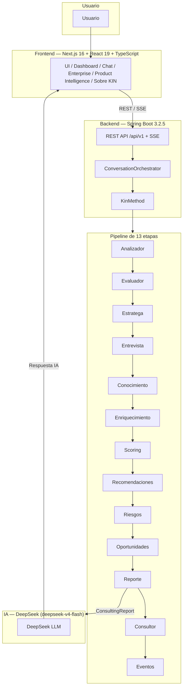

<div align="center">

# KIN

### Intelligent SaaS Platform

**Plataforma SaaS de inteligencia y estructuración estratégica para empresas, consultorías, emprendedores, dueños de empresa y profesionales.**

**🌐 Demo en producción:** [https://kin-platform.com](https://kin-platform.com)

[](https://www.oracle.com/java/)
[](https://spring.io/projects/spring-boot)
[](https://nextjs.org/)
[](https://react.dev/)
[](https://www.typescriptlang.org/)
[](https://tailwindcss.com/)
[](https://www.postgresql.org/)
[](https://www.docker.com/)
[](https://www.deepseek.com/)
[](https://github.com/LuisAIDev/kin-platform/releases/tag/v2.0.0-phase10)

**Índice**

[Descripción](#descripción) •
[Demo en producción](#demo-en-producción) •
[Sobre KIN](#sobre-kin) •
[Creador](#creador-y-responsable-técnico) •
[Arquitectura](#arquitectura) •
[Pipeline](#kin-intelligence-pipeline) •
[Enterprise](#capacidades-enterprise) •
[Seguridad](#seguridad) •
[Quality & Testing](#quality--testing) •
[DevSecOps](#devsecops-y-cicd) •
[API REST](#api-rest) •
[Tecnologías](#tecnologías) •
[Roadmap](#roadmap) •
[Estado actual](#estado-actual) •
[Propiedad intelectual](#propiedad-intelectual-y-acceso-técnico) •
[Contacto](#contacto)

</div>

---

## Descripción

KIN es una plataforma SaaS de **inteligencia y estructuración estratégica** que combina un
motor de análisis determinista escrito en Java con una capa de IA (LLM) orientada a la
comunicación. Transforma la información dispersa de un proyecto o negocio en **contexto
estructurado, análisis de viabilidad, riesgos, oportunidades, recomendaciones y documentación
profesional reproducible**.

El proyecto integra de forma real —no solo documental— las siguientes capacidades:

- **Motor de análisis determinista** (13 etapas) que decide en Java qué preguntar, qué
  conocimiento adquirir, qué hechos son relevantes y qué reporte producir.
- **Entrevista estratégica** dirigida por reglas y **adquisición de conocimiento externo**
  verificada (offline-first).
- **Generación documental Enterprise** (lean canvas, planes, matrices, KPIs, reportes) con
  exportación **PDF / DOCX / PPTX**, versionado y dashboard en tiempo real (SSE).
- **Product Intelligence** (analítica de uso e insights, 100 % local, sin envío externo de datos).
- **Modelo SaaS completo** con roles, suscripciones, límites y pagos (Stripe).
- **DevSecOps**: CI/CD, pruebas automatizadas, análisis estático, escaneo de secretos y
  dependencias, guardrails de IA y observabilidad.

> KIN es una **herramienta de apoyo al análisis y la toma de decisiones**: no garantiza
> resultados financieros, financiación ni éxito empresarial.

---

## Demo en producción

La plataforma está **desplegada y disponible públicamente**:

- **🌐 Plataforma:** [https://kin-platform.com](https://kin-platform.com)
- **📖 Sobre KIN:** [https://kin-platform.com/sobre-kin](https://kin-platform.com/sobre-kin)

Infraestructura de despliegue verificada en `render.yaml` y perfiles de Spring:

| Componente | Entorno | Evidencia |
|---|---|---|
| Frontend (Next.js) | Producción pública `kin-platform.com` | Verificado en línea |
| Backend (Spring Boot) | Render (`kin-backend.onrender.com`, autoDeploy) | `render.yaml` + healthcheck `/api/v1/actuator/health` |
| Base de datos | PostgreSQL gestionada (Neon / Render) | `render.yaml`, perfil `prod` (Flyway `ddl-auto: validate`) |
| CI/CD | GitHub Actions (5 workflows) | `.github/workflows/` |

---

## Sobre KIN

KIN (Knowledge, Innovation & Navigation) es una plataforma de inteligencia para apoyar la
**estructuración, análisis y evolución de proyectos** de emprendedores, empresarios y
organizaciones.

Nació como un proyecto tecnológico orientado a aplicar **desarrollo de software, inteligencia
artificial, arquitectura de sistemas, bases de datos, seguridad, automatización y pruebas** en
una solución real. No representa únicamente una aplicación terminada: representa un **proceso
continuo de aprendizaje, construcción y evolución tecnológica**.

- **Origen:** interés por *aprender haciendo*, sin un objetivo comercial inicial.
- **Propósito:** demostrar que el aprendizaje constante puede convertirse en soluciones
  tecnológicas capaces de aportar valor a la sociedad.
- **Visión:** construir una base arquitectónica lo suficientemente sólida para que nuevas
  capacidades puedan incorporarse a medida que evolucionan las necesidades de los usuarios.
- **Filosofía de desarrollo:** dominio puro (POJO), decisiones deterministas en Java, evolución
  aditiva sin romper contratos congelados y gobernanza mediante ADRs.
- **Capacidades técnicas:** backend Spring Boot, frontend Next.js, IA aplicada, testing,
  seguridad, cloud y documentación de arquitectura.
- **Enfoque:** emprendedores (estructurar ideas), empresarios (analizar y evolucionar proyectos
  existentes) y organizaciones (apoyar procesos de análisis con herramientas tecnológicas).

Puedes conocer la versión completa de esta narrativa en la página pública
[**Sobre KIN**](https://kin-platform.com/sobre-kin).

---

## Creador y responsable técnico

**Luis Orlando Guerra González** — desarrollador de software y responsable técnico del proyecto.

> KIN nació como un proyecto de aprendizaje, ingeniería y servicio, construido con el propósito
> de demostrar que mediante disciplina, estudio constante y desarrollo de software es posible
> construir soluciones tecnológicas robustas capaces de apoyar a empresas, consultorías,
> emprendedores y profesionales.

El proyecto es el resultado de un trabajo autodidacta y disciplinado: cada módulo, integración y
prueba representa práctica real sobre problemas concretos. KIN condensa aprendizaje continuo,
ingeniería de software, arquitectura, automatización, inteligencia artificial, testing,
seguridad, cloud, DevSecOps y diseño de sistemas en una plataforma verificable.

Su objetivo es seguir creciendo dentro de la ingeniería de software, trabajar junto a equipos de
desarrollo, recibir code reviews y críticas constructivas, y aportar lo aprendido durante la
construcción de KIN a nuevos desafíos tecnológicos.

---

## KIN como proyecto de ingeniería

KIN funciona también como un **proyecto demostrativo de capacidades técnicas** construido sobre
patrones de ingeniería de nivel profesional:

- **Clean Architecture + DDD táctico** — dominio `com.kinplatform.kin.*` 100 % POJO (sin Spring,
  JPA ni IA), ports & adapters, composición en `KinConfig`.
- **Pipeline Pattern** — motor de análisis de 13 etapas con resiliencia (retry/timeout/métricas).
- **Event-Driven** — `DomainEventBus`, eventos de dominio (`question_generated`,
  `report_generated`, `score_calculated`, `risk_detected`, etc.) y trigger conversación →
  generación Enterprise.
- **Bounded contexts** — `kin.engine`, `kin.pipeline`, `kin.context`, `kin.scoring`,
  `kin.reporting`, `kin.ai`, `kin.conversation`, `kin.knowledge`, `kin.enrichment`,
  `kin.interview`, `kin.enterprise`, `kin.export`.
- **IA aplicada** con principio **"Java decide. El LLM únicamente comunica."** y guardrails
  deterministas.
- **Testing real** — JUnit 5, Mockito, Testcontainers (PostgreSQL real), Vitest, React Testing
  Library, Playwright y JaCoCo (≥ 90 % de cobertura de instrucciones en el dominio).
- **DevSecOps** — 5 workflows de GitHub Actions, SonarQube, CodeQL, Gitleaks, OWASP Dependency
  Check, Spotless/Checkstyle/SpotBugs/PMD, Dependabot y Renovate.
- **Documentación arquitectónica** — 25 ADRs (ADR-001 … ADR-025) y baseline contractual
  (`BASELINE_ARCHITECTURE.md`).

**¿Qué demuestra este proyecto sobre la persona que lo construyó?** Que aprendió estas
tecnologías y, además, las usó para diseñar, construir, probar, desplegar y documentar un sistema
real en producción.

---

## ¿Qué puede observar un equipo técnico?

KIN permite evaluar capacidades prácticas en:

| Área | Evidencia en el proyecto |
|---|---|
| Backend Engineering | Spring Boot, arquitectura por capas, controllers/services/ports/adapters |
| Frontend Engineering | Next.js App Router, React, TypeScript strict, Tailwind, hooks, servicios |
| API REST | 57 endpoints bajo `/api/v1` (ver [API REST](#api-rest)) |
| Arquitectura de software | Clean Architecture, DDD táctico, bounded contexts, ADRs |
| Diseño orientado a dominio | Motores `DomainEngine` POJO y fachadas puras (`PromptAssembler`) |
| Seguridad | JWT stateless, BCrypt, CORS de origen único, headers HTTP, rate limiting |
| Bases de datos | PostgreSQL, Flyway V1…V18, JPA/Hibernate, contextos durables |
| IA aplicada | DeepSeek vía Spring AI, pipeline determinista, guardrails, fallback en español |
| Testing | 2.832 tests backend (2.856 descubiertos; 24 gated de red real) + 316 tests frontend + E2E Playwright |
| Automatización E2E | Playwright sobre flujos de login, dashboard y Sobre KIN |
| CI/CD | 5 workflows GitHub Actions con lint, tests, build, E2E, calidad y seguridad |
| Docker | PostgreSQL + backend + frontend con HEALTHCHECK y usuario no-root |
| Cloud | Render, Neon/PostgreSQL, dominio propio `kin-platform.com` |
| Observabilidad | Actuator, Micrometer (`kin.*`), logs estructurados, Prometheus |
| DevSecOps | CodeQL, Gitleaks, OWASP, SonarQube, Dependabot, Renovate |
| Documentación técnica | 25 ADRs, especificaciones, release notes y línea base congelada |

El proyecto demuestra **experiencia práctica y verificable** en estas áreas; no se limita a
declararla.

---

## Principio rector

> **Java decide. El LLM únicamente comunica.**

KIN no delega las decisiones del sistema en el modelo de IA. Un **motor determinista en Java**
controla el contexto, las reglas, las etapas del pipeline, la entrevista estratégica, el scoring,
los riesgos, las oportunidades, las recomendaciones, los reportes y las validaciones. El modelo
de IA funciona como **capa de comunicación**: formula preguntas cuando el motor decide `ASK` y
explica el análisis ya decidido cuando corresponde generar reporte.

Esto produce análisis **consistentes, trazables y auditables**, independientes del proveedor de
IA utilizado.

---

## Arquitectura

KIN aplica **Clean Architecture + DDD Táctico + Pipeline Pattern + Event-Driven**. El dominio
`com.kinplatform.kin.*` es 100 % POJO (sin Spring, JPA ni IA); la infraestructura se concentra en
adaptadores (`ai/`) y la composición se resuelve en `KinConfig`.

```text
Usuario
   ↓
Next.js / React (App Router, TypeScript, Tailwind)
   ↓
Spring Boot REST API (/api/v1, JWT + SSE)
   ↓
Application / Domain (com.kinplatform.kin.* — POJO puro)
   ↓
KIN Intelligence Pipeline (13 etapas, resiliente)
   ↓
AI / Knowledge / Enterprise (DeepSeek · KnowledgeEngine · EnterpriseBC)
   ↓
PostgreSQL (Flyway V1…V18, contexto durable)
   ↓
Cloud Infrastructure (Render · Neon · Docker)
```


```mermaid
flowchart TB
    subgraph Usuario
        U[Usuario]
    end
    subgraph Frontend["Frontend — Next.js 16 + React 19 + TypeScript"]
        F[UI / Dashboard / Chat / Enterprise / Product Intelligence / Sobre KIN]
    end
    subgraph Backend["Backend — Spring Boot 3.2.5"]
        REST[REST API /api/v1 + SSE]
        CO[ConversationOrchestrator]
        KM[KinMethod]
    end
    subgraph Pipeline["Pipeline de 13 etapas"]
        A[Analizador] --> B[Evaluador]
        B --> C[Estratega]
        C --> I[Entrevista]
        I --> K[Conocimiento]
        K --> E[Enriquecimiento]
        E --> S[Scoring]
        S --> R[Recomendaciones]
        R --> Ri[Riesgos]
        Ri --> O[Oportunidades]
        O --> Rep[Reporte]
        Rep --> Cons[Consultor]
        Cons --> Ev[Eventos]
    end
    subgraph IA["IA — DeepSeek (deepseek-v4-flash)"]
        LLM[DeepSeek LLM]
    end
    U --> F
    F -->|REST / SSE| REST
    REST --> CO
    CO --> KM
    KM --> Pipeline
    Rep -->|ConsultingReport| IA
    LLM -->|Respuesta IA| F
```

**Bounded contexts del backend:**

| Paquete | Bounded context |
|---|---|
| `kin.engine` | Infraestructura de motores (`DomainEngine`, `EngineRegistry`, `EngineExecutor`, `EngineStage`) |
| `kin.pipeline` | `Pipeline` + `PipelineContext` + stages + resiliencia (retry/timeout/métricas) |
| `kin.context` | `ProjectContext`, evaluación, decisión, `ContextRepository` (contexto durable) |
| `kin.scoring` | `ScoringEngine` (score de viabilidad) |
| `kin.reporting` | `RecommendationEngine`, `RiskEngine`, `OpportunityEngine` (8 analizadores), `ReportEngine` |
| `kin.ai` / `kin.ai.prompt` | `AIResponder`, `PromptAssembler`, `ConversationPromptBuilder`, `ReportPromptBuilder` (10 `SectionFormatter`) |
| `kin.conversation` | `ConversationOrchestrator`, `TurnPolicy`, `ResponseGuard`, `HistoryWindow` |
| `kin.knowledge` | `KnowledgeEngine`, `KnowledgeGateway`, `SourceRegistry`, `SourceValidator` |
| `kin.enrichment` | `EnrichmentEngine`, `FactRanker`, `EvidenceCategory` |
| `kin.interview` | `InterviewEngine`, `InterviewBlueprint`, `AnswerValidator` |
| `kin.enterprise` | BC Enterprise: documentos de negocio, versionado, eventos, renderers |
| `kin.export` | BC Export (ADR-020): exportación estructurada del proyecto (DOCX/PDF/Markdown) |
| `kin.event` / `kin.usage` | Eventos de dominio y métricas de uso |
| `kin.eventbus` | **Transactional Outbox (ADR-026)**: persistencia atómica de Domain Events, relé asíncrono con reintento y dead-letter |

---

## KIN Intelligence Pipeline

El motor de análisis de KIN se compone de **15 etapas** verificadas en código
(`KinConfig.chatPipeline`):

```text
Analizador → Triaje → Diagnóstico diferencial → Evaluador → Estratega → Entrevista →
Conocimiento → Enriquecimiento → Scoring → Recomendaciones → Riesgos → Oportunidades →
Reporte → Consultor → Eventos
```

| # | Etapa | Responsabilidad |
|---|---|---|
| 1 | **Analizador** | Extrae dimensiones del mensaje y actualiza el `ProjectContext` |
| 2 | **Triaje** | Triaje digital de síntomas (ADR-028, solo proyectos `SALUD`; se omite sin síntomas) |
| 3 | **Diagnóstico diferencial** | Factores de riesgo + pruebas sugeridas + explicación (ADR-029, se omite sin triaje) |
| 4 | **Evaluador** | `CompletenessEvaluation` de las dimensiones cubiertas |
| 5 | **Estratega** | Decide la acción (`ConversationDecision`): `ASK`, `REPORT`, etc. |
| 6 | **Entrevista** | Entrevista estratégica dirigida por Java (contexto completo) |
| 7 | **Conocimiento** | Adquiere hechos externos verificados (offline-first) |
| 8 | **Enriquecimiento** | `FactRanker` selecciona y pondera los hechos relevantes por categoría |
| 9 | **Scoring** | Score de viabilidad por categoría y dimensión |
| 10 | **Recomendaciones** | `RecommendationEngine` |
| 11 | **Riesgos** | `RiskEngine` |
| 12 | **Oportunidades** | `OpportunityEngine` (8 analizadores auto-descubiertos) |
| 13 | **Reporte** | `ReportEngine` orquesta los `SectionAssembler` y produce el `ConsultingReport` |
| 14 | **Consultor** | Selecciona el prompt (conversación o REPORT) y comunica la respuesta del LLM |
| 15 | **Eventos** | Publica eventos de dominio según la decisión |

**Motores de dominio** (fase / ADR):

| Motor | ADR | Responsabilidad |
|---|---|---|
| `ScoringEngine` | ADR-009 | Score de viabilidad por categoría y dimensión |
| `RecommendationEngine` | ADR-003 | Recomendaciones deduplicadas y priorizadas |
| `RiskEngine` | ADR-004 | Riesgos con severidad, probabilidad y nivel |
| `OpportunityEngine` | ADR-010 | 8 analizadores (mercado, innovación, tecnológico, financiero, competitivo, escalabilidad, automatización, monetización) |
| `ReportEngine` | ADR-011 | Orquestador puro del `ConsultingReport` |
| `Prompt Engine` | ADR-012 | `PromptAssembler` fachada pura + `ConversationPromptBuilder` / `ReportPromptBuilder` |
| `ConversationOrchestrator` | ADR-013 | Ciclo de turno, directiva en Java, guardrails de respuesta |
| `KnowledgeEngine` | ADR-014 | Adquisición y validación de conocimiento externo (SSRF-safe) |
| `InterviewEngine` | ADR-015 | Entrevista estratégica dirigida por Java |
| `EnrichmentEngine` | ADR-016 | Selección y ponderación de hechos relevantes |
| `TriageEngine` | ADR-028 | Triaje digital determinista (síntomas → condiciones con probabilidad) |

**Decisiones de arquitectura:** la evolución se gobierna mediante **28 ADRs** (ADR-001 …
ADR-028). `kin-docs/BASELINE_ARCHITECTURE.md` define la línea base contractual (ALPHA STABLE):
los contratos marcados como estables no pueden modificarse sin una ADR aprobada.

---

## Capacidades Enterprise

El bounded context `kin.enterprise` (ADR-018) implementa **generación documental empresarial**
con versionado y exportación:

- **9 tipos de documento**: Executive Report, Lean Canvas, DOFA, Financial Plan, Market Plan,
  Roadmap, Risk Matrix, KPIs e Innovation Plan.
- **3 formatos de exportación**: PDF, DOCX y PPTX (bundle ZIP por formato y descarga individual).
- **Enterprise Score** persistido por versión (0–100 con grado) y narrativa IA.
- **Dashboard Enterprise** integrado en el frontend con información y fuentes por dimensión
  (mercado, innovación, viabilidad, finanzas, riesgo, escalabilidad, equipo, sostenibilidad).
- **SSE de progreso** en tiempo real (`GET /enterprise/{projectId}/{version}/stream`).
- **Ciclo automático** conversación → generación (`EnterpriseProjectTrigger` → `DomainEventBus` →
  listener) cuando el reporte está completo.
- **8 motores deterministas** aislados de `EngineRegistry`: `BusinessModelEngine`,
  `EnterpriseScoreEngine`, `FinancialPlanEngine`, `InnovationEngine`, `KpiEngine`, `MarketEngine`,
  `RiskPlanEngine`, `RoadmapEngine`.

Además, el módulo **`kin.export`** (ADR-020) permite exportar el proyecto como documento
estructurado en **DOCX / PDF / Markdown** con modos `complete` / `summary` y plantilla de
referencia, con acción de descarga disponible desde el chat.

---

## Product Intelligence

Analítica de producto **offline** (sin envío externo de datos, reglas deterministas en el
frontend):

- `UsageStatistics` (diario/semanal/mensual, mensajes, sesiones, tokens estimados, feedback).
- `ConversationInsights` (longitud, preguntas por sesión, intención predominante, temas).
- `FeatureUsageTracker`, `ProductMetrics` (retención, activación, engagement) y
  `RecommendationEngine` basado en reglas.
- Exportación de métricas a **JSON, CSV y PDF**.
- Páginas `/dashboard/analytics`, `/insights`, `/recommendations` y `/reports`.

---

## AI Guardrails

- `PromptGuardrail` detecta **inyección de prompts, jailbreak y solicitudes inseguras** de forma
  **determinista, sin LLM**.
- `ResponseGuard` valida la respuesta del modelo; ante respuestas inválidas, KIN reintenta
  (acotado) o entrega una **respuesta segura determinista en español** (`ResponseFallback`).
- **Pipeline Resilience**: retry/timeout/métricas por etapa (timeout específico de 60 s para el
  stage Consultor; 5 s por defecto para el resto).

---

## Seguridad

Medidas implementadas en código (`SecurityConfig`, filtros y dominio):

- **Autenticación stateless JWT** (jjwt 0.12.5) y contraseñas con **BCrypt**.
- **CORS de origen único** con garantía del dominio de producción `https://kin-platform.com`.
- **Rate limiting** por IP en `/auth/**` (token bucket en memoria, 5 req/60 s, configurable).
- **Headers HTTP de seguridad**: CSP (`default-src 'none'; frame-ancestors 'none'`), HSTS,
  `frame-ancestors deny`, `Permissions-Policy` y `Referrer-Policy`.
- **Controles de acceso**: roles `FREE`, `PREMIUM`, `FACILITADOR`, `ADMIN`; endpoints `/admin/**`
  y `/actuator/**` solo ADMIN; **aislamiento por propietario** de proyecto (404 ante recursos
  ajenos) e interceptor de ownership para `/enterprise/**` (protección IDOR).
- **Filtro de suscripción**: bloquea creación de proyectos y mensajes cuando se alcanzan los
  límites del plan (403).
- **Protección SSRF**: `SourceValidator` exige HTTPS, allowlist de dominios (vacía por defecto =
  offline-first), status 2xx y content-type permitido. Además, el adaptador HTTP real usa
  `SecureHttpClient` + `SourceConnectionGuard` (ADR-021): bloqueo de IPs privadas/loopback/
  link-local, literales de IP y DNS-rebinding fail-closed, con redirecciones revalidadas.
- **Gestión de secretos** por variables de entorno (`.env` gitignored); credenciales SMTP/Brevo y
  Stripe solo vía secrets.
- **Validaciones** de entrada, `GlobalExceptionHandler` con respuestas consistentes y
  `@Valid`/Bean Validation en DTOs.
- **Correo transaccional** (verificación de email, password reset) con Brevo SMTP.
- **Escaneo de secretos en CI** con Gitleaks.

---

## Transactional Outbox (ADR-026, KIN 2.4)

KIN implementa el patrón **Transactional Outbox** para garantizar la entrega *at-least-once* de eventos de dominio
(`ReportGeneratedEvent`, `KnowledgeAcquiredEvent`, `ConversationCompletedEvent`, etc.) incluso si los listeners
fallan o la infraestructura de mensajería está caída.

**Arquitectura:**

1. **Tabla `domain_event_outbox`** (PostgreSQL): persiste eventos dentro de la misma transacción que el caso de uso
   (`KinMethod.execute()`). Campos: `id`, `aggregate_id`, `event_type` (FQCN), `payload` (JSONB), `metadata` (JSONB),
   `status` (PENDING/PUBLISHED/FAILED/DEAD_LETTER), `retry_count`, `created_at`, `published_at`, `last_error`.

2. **Puerto `OutboxEventPublisher`** (dominio puro): `publish(DomainEvent event)` valida `null` y `aggregateId`,
   lanza excepciones claras. Se invoca **dentro** de la transacción del caso de uso.

3. **Adaptador `TransactionalOutboxEventPublisher`** (infraestructura): `JdbcTemplate` + `ObjectMapper`
   (con `JavaTimeModule` + `@JsonTypeInfo` para serialización polimórfica). Verifica transacción activa
   (`TransactionSynchronizationManager`). Respeta `kin.outbox.enabled`.

4. **Relé `OutboxRelay`** (infraestructura): polling programado (`@Scheduled`) con `SELECT ... FOR UPDATE SKIP LOCKED`
   (lote configurable). Deserializa con `@JsonTypeInfo`, publica en `DomainEventBus` (in-memory),
   reintentos con backoff exponencial, dead-letter tras `maxRetries`.

**Métricas Micrometer (`kin.outbox.*`):**

| Métrica | Tipo | Descripción |
|---------|------|-------------|
| `kin.outbox.published` | Counter | Eventos publicados exitosamente |
| `kin.outbox.failed` | Counter | Eventos que fallaron (se reintentarán) |
| `kin.outbox.dead_letter` | Counter | Eventos en dead-letter (agotados reintentos) |
| `kin.outbox.pending` | Gauge | Eventos pendientes en cola |
| `kin.outbox.relay.duration` | Timer | Duración del ciclo del relé |

**Configuración (application.yml):**

```yaml
kin:
  outbox:
    enabled: true                    # Master switch del publicador
    relay:
      enabled: true                  # Master switch del relé
      poll-interval-ms: 2000         # Intervalo de polling (ms)
      batch-size: 100                # Tamaño del lote
      max-retries: 5                 # Reintentos antes de DEAD_LETTER
      backoff-base-ms: 1000          # Base para backoff exponencial
```

**Logging estructurado:** incluye `correlationId` y `userId` (si el evento implementa `HasUserId`) extraídos del metadata JSON.

**Feature flags:** `kin.outbox.enabled` y `kin.outbox.relay.enabled` (ambos default `true`);
deshabilitables para tests que no usan BD.

**Integración en Pipeline (PR 3):**

El `KinMethod` ahora usa `OutboxEventPublisher` para publicar eventos de dominio:

1. **Publicación transaccional**: Los eventos se guardan en `domain_event_outbox` dentro de la misma transacción que el caso de uso (`KinMethod.execute()`).
2. **Fallback legacy**: Si `kin.outbox.enabled=false`, se usa `DomainEventBus` directamente (comportamiento anterior).
3. **Entrega síncrona para SSE**: Eventos `ReportGeneratedEvent` se publican también en `DomainEventBus` tras guardarse en outbox, manteniendo la entrega inmediata a SSE sin latencia.

**Behavior:**
- Con `kin.outbox.enabled=true` (default): eventos se persisten en tabla y el relé los procesa asíncronamente.
- Con `kin.outbox.enabled=false`: fallback a publicación directa en `DomainEventBus` (comportamiento legacy).
- `ReportGeneratedEvent` se publica también en `DomainEventBus` para mantener entrega inmediata a SSE.

---

## Interfaz de Administración DLQ (PR 5)

KIN incluye una interfaz web completa para gestionar la Dead Letter Queue en `/admin/outbox/dead-letter` (acceso solo ADMIN):

**Funcionalidades:**
- **Listado paginado** con columnas: id, aggregate_id, event_type, created_at, last_error, retry_count.
- **Botón "Reencolar"** por evento: POST `/admin/outbox/dead-letter/{id}/retry` → status → PENDING.
- **Botón "Eliminar"** por evento: DELETE `/admin/outbox/dead-letter/{id}`.
- **Botón "Eliminar todo"** con doble confirmación: DELETE `/admin/outbox/dead-letter?confirm=true`.
- **Filtros** por `event_type` y `aggregate_id`.
- **Estadísticas**: total, por tipo, top agregados.
- **Protección ADMIN**: middleware de autenticación + `@PreAuthorize("hasRole('ADMIN')")`.

**Pruebas E2E (Playwright):**
- `admin-dlq.spec.ts`: login admin, reencolar, eliminar, verificar estado.
- `admin-permissions.spec.ts`: acceso denegado sin rol ADMIN.

**Pruebas de integración DLQ:**
- `OutboxRelayIntegrationTest`: publicación atómica, procesamiento, reintentos, dead-letter.
- `OutboxRelayDisabledIntegrationTest`: relé desactivado no procesa.

---

## Deduplicación de Conocimiento (PR 6, ADR-027)

El **DeduplicationEngine** (ADR-027) elimina hechos duplicados o casi duplicados que el KnowledgeEngine obtiene de múltiples fuentes, garantizando que el scoring y las recomendaciones no se distorsionen por información redundante.

**Estrategias en cascada (determinísticas, sin LLM):**

| Estrategia | Prioridad | Descripción |
|------------|-----------|-------------|
| **ExactMatchStrategy** | 10 | Coincidencia exacta de `sourceId`, `category` y `claim` normalizado. |
| **FuzzyMatchStrategy** | 20 | Similitud Jaro-Winkler para texto (umbral configurable, default 0.85). |
| **SemanticMatchStrategy** | 30 | Similitud semántica vía embeddings (stub, futura implementación). |

**Resultado:** `DeduplicationResult` con hechos únicos, grupos de duplicados (para auditoría) y métricas.

**Integración:** `DeduplicationStage` (priority 55) tras `KnowledgeStage` (50), antes de `EnrichmentStage`. Guarda `DeduplicationResult` en `PipelineContext.deduplicationResult()`.

**Configuración (`application.yml`):**
```yaml
kin:
  deduplication:
    enabled: true
    fuzzy:
      threshold: 0.85
    strategies:
      - EXACT_MATCH
      - FUZZY_MATCH
      - SEMANTIC
```

**Feature flag:** `kin.deduplication.enabled` (default `true`); deshabilitable para tests.

---

## Observabilidad

- Spring Boot **Actuator** (`health`, `info`, `metrics`, `prometheus`).
- Métricas **Micrometer** con prefijo `kin.*` (ciclo, etapas, proveedores, caché, orquestador).
- **Logging estructurado** (JSON) con `correlationId`/`requestId`/`traceId` (sin datos sensibles).
- Métricas internas del pipeline por etapa (duración, éxito/fallo, reintentos, timeout).
- Salud de producción vía `/api/v1/actuator/health` (público; resto de Actuator solo ADMIN).
- **Tracing distribuido opcional (ADR-022)** — Micrometer Tracing + bridge OTel + exportador OTLP
  HTTP (`micrometer-tracing-bridge-otel`, `opentelemetry-exporter-otlp`). Deshabilitado por
  defecto (`management.tracing.enabled=false`, sampling `0.0`): sin tracer no hay exportador ni
  dependencia de collector. Para habilitarlo:

  ```bash
  # Collector local (Jaeger all-in-one, OTLP HTTP en :4318, UI en :16686)
  docker run -d --name kin-jaeger -p 4317:4317 -p 4318:4318 -p 16686:16686 \
    -e COLLECTOR_OTLP_ENABLED=true jaegertracing/all-in-one:1.57

  # Backend con tracing habilitado — el endpoint DEBE incluir la ruta /v1/traces
  MANAGEMENT_TRACING_ENABLED=true \
  MANAGEMENT_TRACING_SAMPLING_PROBABILITY=1.0 \
  OTEL_EXPORTER_OTLP_ENDPOINT=http://localhost:4318/v1/traces \
  mvnw spring-boot:run -Dspring-boot.run.profiles=dev

  # Generar tráfico y verificar los spans en Jaeger
  curl http://localhost:8080/api/v1/pricing-plans
  curl "http://localhost:16686/api/traces?service=kin-backend&limit=10"
  ```

  **Resultado verificado (2026-08-20):** con el endpoint `/v1/traces` se exportaron **13 trazas**
  a Jaeger (servicio `kin-backend`; spans `http get /pricing-plans`, `http get /auth/me`,
  `security filterchain before/after`, `authorize request`, `secured request`). Sin la ruta
  `/v1/traces` el exportador publica en `/` y el collector responde **404** (no exporta). Con el
  tracing deshabilitado la app arranca y opera normal (health OK, sin exportador OTLP en el log,
  sin trazas nuevas en Jaeger).

---

## Conocimiento externo (producción) — allowlist global por niveles (ADR-023)

El pipeline de adquisición de conocimiento (ADR-014) es **offline-first por defecto**: sin
configuración explícita no hay llamadas a la red. ADR-021 añade los **adaptadores de producción**
seguros y ADR-023 define la **allowlist global por niveles** con metadata por fuente. La
activación **solo ocurre en el perfil `staging`**; producción sigue con `KNOWLEDGE_EXTERNAL_ENABLED=false`.

| Variable | Default | Significado |
|----------|---------|-------------|
| `KNOWLEDGE_EXTERNAL_ENABLED` | `false` | Master switch del adaptador HTTP real |
| `KNOWLEDGE_ALLOWED_DOMAINS` | (vacío) | Allowlist de dominios (comma-separated); vacío = offline-first |
| `KNOWLEDGE_HTTP_CONTENT_TYPES` | `application/json` | Tipos de contenido permitidos (JSON y sub-tipos `+json`) |
| `KNOWLEDGE_TEST_SOURCE_ENABLED` | `false` | Fuente controlada determinista para dev/test/E2E (sin red) |

**Allowlist global (documentada en ADR-023; deshabilitada por defecto):**

| Nivel | Fuente | Dominio | Estado |
|-------|--------|---------|--------|
| 1 — Global | Banco Mundial | `api.worldbank.org` | ✅ Probada (PIB, inflación, desempleo) |
| 1 — Global | BCE (ECB) | `data-api.ecb.europa.eu` | ✅ Probada (tipos de cambio) |
| 2 — Colombia | Datos Abiertos Colombia (DANE, Superfinanciera, Confecámaras, Finagro) | `www.datos.gov.co` | ✅ Probada (**8 datasets**: TRM, PIB departamental, insumos agrícolas, empresas creadas, exportaciones de café, cartera/crédito, tasas de captación, desembolsos Finagro) |
| 2 — España | INE | `servicios.ine.es` | ✅ Probada (IPC nacional) |
| 2 — EE.UU. | openFDA | `api.fda.gov` | 🟡 API verificada (decoder pendiente) |
| 2 — Argentina/Chile | Datos abiertos (CKAN) | `datos.gob.ar`, `datos.gob.cl` | 🟡 API verificada (integración pendiente) |
| 1 — Global | IMF, OCDE, UN, CEPAL | — | ⏳ Pendiente (SDMX/API no resuelven desde este entorno) |
| 2 — México, Perú | INEGI/Banxico, BCRP/INEI | — | ⏳ Pendiente (requieren token o protección anti-bot) |

Cada fuente declara metadata `level`/`region`/`category` para que en el futuro el sistema
seleccione fuentes por país del proyecto (un país sin Nivel 2 recurre a Nivel 1). Las fuentes
exactas, URLs y límites están en `application-staging.yml` y ADR-023.

> **Matriz Maestra de Conocimiento** (`kin-docs/MATRIZ_MAESTRA_CONOCIMIENTO.md`): inventario
> autoritativo de fuentes/categorías/países con licencia, límites, actualización y estado.
> **Política de Fuentes (ADR-025)**: gobernanza para incorporar/descartar/deprecar fuentes.

**Verificación de red real (2026-08-20):** la cadena real `SecureHttpClient` → guard SSRF →
`HttpKnowledgeSourceAdapter` → `SourceRegistry` → `SourceValidator` → `KnowledgeGateway` →
`KnowledgeEngine` se ejecutó con datos reales por país (tests gated por `KIN_TEST_REAL_NETWORK=true`):

```bash
cd kin-backend
KIN_TEST_REAL_NETWORK=true mvnw test -Dtest=KnowledgeGlobalAllowlistTest   # 7/7 verdes
KIN_TEST_REAL_NETWORK=true mvnw test -Dtest=KnowledgeStagingSourcesTest     # config staging real (13 fuentes)
KIN_TEST_REAL_NETWORK=true mvnw test -Dtest=KnowledgeColombiaSourcesTest    # Colombia ampliada + escenario combinado
```

Resultados reales obtenidos (fuentes y hechos concretos):

| Escenario | Hechos reales traídos | Latencia |
|-----------|------------------------|----------|
| Colombia (café exportación) | PIB Colombia 2024: 420.5 B USD · TRM 3062.96 COP/USD · PIB departamental · ECB | ~4.9 s |
| España (startup software) | PIB España 2024: 1.73 T USD · **IPC INE 103.899 (2026)** · ECB | ~7.1 s |
| México (e-commerce) | PIB México 2024: 1.83 T USD · ECB (Nivel 1; fuente nacional pendiente) | ~2.3 s |
| EE.UU. (alimentos) | PIB EE.UU. 2024: 29.3 T USD · ECB (Nivel 1; FDA pendiente) | ~3.2 s |
| **Ecuador (sin Nivel 2)** | PIB Ecuador 2024: 123.8 B USD · ECB → **respaldo Nivel 1 sin fallar** | ~2.1 s |
| Fuente rota (500) | Las demás fuentes siguen aportando (offline-first) | — |

**Colombia ampliada (mercado base, 8 datasets probados en `datos.gov.co`):** además de TRM, PIB
departamental e insumos agrícolas, se integraron y probaron: **Confecámaras — Empresas creadas**
(registro mercantil por municipio), **DANE — Exportaciones de café** (p. ej. *café sin tostar →
China: 3222 mil USD, 2023*), **Superfinanciera — Cartera y crédito** por departamento,
**Superfinanciera — Tasas de interés de captación** (p. ej. *BBVA 12 %, Banco Caja Social
12.99 %*), y **Finagro — Desembolsos de redescuento/crédito directo** (p. ej. *Antioquia/Agua:
$24.2 mil millones*).

**Escenario combinado verificado (comercio exterior de café):** TRM actual + exportaciones de café
del sector + tasas de interés de financiamiento + desembolsos Finagro + PIB, en un mismo análisis
(`KnowledgeColombiaSourcesTest`, 2/2 verdes). La caché Redis con estos datasets quedó verificada:
una consulta idéntica resuelve en **~1 s** (hit de caché).

**Descartadas en Colombia (motivo técnico):** DTF y Bancóldex → vista `403 no tabular` en
datos.gov.co; IPC nacional, desempleo, censo económico → no publicados como datasets tabulares
abiertos; Banco de la República → sin API pública (suameca `401`), cubierto vía datos.gov.co/Banco
Mundial.

---

## Mapeo categoría de proyecto → fuentes (ADR-024)

El catálogo real tiene **19 categorías** (verificado en `V6__create_categories.sql` +
`V18__add_project_categories.sql`; seed de dev idéntico; el frontend carga `GET /categories`).
Cada fuente declara `categories` (lista); **vacío = contexto general** (macro que aplica a todo),
con valores = específica de esas categorías. El `KnowledgeStage` lee la categoría del proyecto
(campo dedicado en `ProjectContext`, que sobrevive al Analizador) y `Java` selecciona solo las
fuentes pertinentes — el LLM nunca elige ni ejecuta peticiones.

**Modo sombra (ADR-025, Fase 1 del plan de activación):** `KNOWLEDGE_SHADOW_ENABLED=true` hace que
el Knowledge Engine ejecute el motor completo (consulta real, validación, caché y métricas
`kin.knowledge.adapter.*`, con latencia **p50/p95/p99** y contador **429 rate-limited**) pero
**sin propagar el resultado** al enriquecimiento/reporte — invisible para el usuario, con un log
resumen `[shadow]` por turno. Ideal para observar antes de activar fuentes visibles.

| Categoría | Fuentes específicas | Estado |
|---|---|---|
| Agroindustria | insumos agrícolas · exportaciones de café · Finagro desembolsos | ✅ **POC probado** |
| Fintech | Superfinanciera tasas · cartera · Finagro desembolsos | ✅ **POC probado** |
| Salud | MinSalud Saludatos (talento humano) | ✅ **POC probado** |
| Empresarial | Confecámaras empresas · tasas · cartera · Finagro | ✅ **POC end-to-end** |
| Comercio | Confecámaras empresas · exportaciones de café | ✅ **POC end-to-end** |
| Logística | Aerocivil transporte aéreo · exportaciones de café (reuso) | ✅ **POC end-to-end** |
| Tecnología e Innovación | MinTIC internet fijo · internet móvil | ✅ **POC end-to-end** |
| Investigación | MinCiencias proyectos de investigación | ✅ **POC end-to-end** |
| Medio Ambiente | IDEAM calidad del aire | ✅ Fuente probada |
| Gobierno | SECOP origen de recursos de contratación | ✅ **Nueva (Fase 1B, shadow)** |
| Servicios | Confecámaras empresas (reuso) | ✅ **Nueva (Fase 1B, shadow)** |
| Marketing Digital | MinTIC internet fijo · móvil (reuso) | ✅ **Nueva (Fase 1B, shadow)** |
| Gastronomía y Alimentos | insumos agrícolas (reuso) | ✅ **Nueva (Fase 1B, shadow)** |
| Industria | (DANE no publica IPI/manufacturera como dataset tabular) | 🔴 Descartada |
| Educación, Impacto Social, Turismo, Creatividad, Otro | (sin fuente oficial con API tabular relevante) | ⏳ Pendiente |

Verificado end-to-end en staging (2ª ronda): proyectos reales en **Empresarial, Comercio,
Logística, Tecnología e Innovación e Investigación** → turno de chat → la caché Redis del turno
contiene solo las fuentes de su categoría + contexto general (y excluye las demás)
(`KnowledgeCategoryMappingTest`, 6/6 verdes). Hallazgo corregido: el pipeline ahora pasa el
**código** de categoría (`Category.code`) y el matcheo normaliza acentos.

**Offline-first / seguridad:** allowlist vacía o dominio fuera de ella rechaza antes de conectar;
un error 5xx degrada a `KnowledgeResult.empty()` sin romper el análisis; la guardia SSRF
(`SourceConnectionGuard`) y la allowlist única de acceso no se modifican.

**Caché Redis (ADR-021/025):** opt-in con `kin.cache.redis.enabled=true` (default `false`).
`RedisKnowledgeRepository` usa el **contrato de clave determinista** `kin:knowledge:q:<hex>`
(por consulta: `topic|keywords|categoría`) y `kin:knowledge:c:<hex>` (por contenido: `sourceId|claim`
ordenados), **TTL por fuente** (mínimo `maxAge` de los hechos del resultado — datos diarios 12–24 h,
mensuales 30 d, estructurales 60 d), invalidación por expiración o borrado (resultado vacío /
JSON corrupto) y **aislamiento por diseño**: solo se cachean hechos públicos validados, nunca PII
ni contexto de usuario/proyecto. Verificado contra **Redis real** con datos reales: tras una
consulta se pueblan las claves `kin:knowledge:*` y una segunda consulta idéntica resuelve en
**~1 s** (hit de caché).
hit/miss, TTL expirado, no-colisión entre consultas, deduplicación y ausencia de datos privados.

---

## API REST

Todos los endpoints se sirven bajo el prefijo global **`/api/v1`** (`server.servlet.context-path`).
**90 endpoints** verificados en 25 controllers (inventario completo de Spring). Autenticación:
**Public**, **Bearer JWT** o **ADMIN**.

| Método | Endpoint | Auth | Descripción |
|---|---|---|---|
| `POST` | `/auth/register` | Public | Registro de usuario (201) |
| `POST` | `/auth/register/patient` | Public | Registro de paciente (vertical Salud) |
| `POST` | `/auth/register/physician` | Public | Registro de médico (verificación pendiente) |
| `POST` | `/auth/login` | Public | Login; cookie HttpOnly `kin_token_v2` |
| `GET` | `/auth/me` | Bearer JWT | Perfil del usuario autenticado |
| `GET` | `/auth/verify-email?token=` | Public | Verificación de email |
| `POST` | `/auth/resend-verification` | Public | Reenvío de verificación |
| `POST` | `/auth/forgot-password` | Public | Solicitud de reset de contraseña |
| `POST` | `/auth/reset-password` | Public | Aplicar reset de contraseña |
| `POST` | `/auth/logout` | Public | Logout; limpia la cookie |
| `POST` | `/auth/refresh` | Public | Renueva el access token (refresh token 7 días) |
| `GET` | `/pricing-plans` | Public | Planes de precios activos |
| `GET` | `/pricing-plans/{id}` | Public | Detalle de un plan |
| `POST` | `/admin/pricing-plans` | ADMIN | Crear plan |
| `PUT` | `/admin/pricing-plans/{id}` | ADMIN | Actualizar plan |
| `DELETE` | `/admin/pricing-plans/{id}` | ADMIN | Desactivar plan |
| `GET` | `/categories` | Bearer JWT | Categorías activas (orden por displayOrder) |
| `POST` | `/projects` | Bearer JWT | Crear proyecto (sujeto al límite del plan) |
| `GET` | `/projects` | Bearer JWT | Listar proyectos (paginado) |
| `GET` | `/projects/{id}` | Bearer JWT | Proyecto por id (owner) |
| `PUT` | `/projects/{id}` | Bearer JWT | Actualizar proyecto |
| `DELETE` | `/projects/{id}` | Bearer JWT | Eliminar proyecto |
| `GET` | `/projects/{projectId}/report?version=N` | Bearer JWT | `ConsultingReport` (último o versión) |
| `GET` | `/projects/{projectId}/reports` | Bearer JWT | Versiones del informe |
| `POST` | `/projects/{projectId}/chat` | Bearer JWT | Turno de conversación (orquestado) |
| `POST` | `/projects/{projectId}/chat/stream` | Bearer JWT | Streaming SSE de la respuesta IA |
| `POST` | `/projects/{projectId}/messages` | Bearer JWT | Guardar mensaje |
| `GET` | `/projects/{projectId}/messages` | Bearer JWT | Historial de conversación |
| `DELETE` | `/projects/{projectId}/messages` | Bearer JWT | Limpiar conversación |
| `GET` | `/projects/{projectId}/info` | Bearer JWT | Información estructurada del proyecto |
| `POST` | `/projects/{projectId}/info` | Bearer JWT | Upsert de información estructurada |
| `POST` | `/projects/{projectId}/info/{section}/{key}/confirm` | Bearer JWT | Confirmar dato importado |
| `GET` | `/projects/{projectId}/documents` | Bearer JWT | Listar documentos del proyecto |
| `POST` | `/projects/{projectId}/documents` | Bearer JWT | Subir documento (multipart) |
| `GET` | `/projects/{projectId}/export` | Bearer JWT | Opciones de exportación (formats/modes) |
| `GET` | `/projects/{projectId}/export/{format}` | Bearer JWT | Exportar proyecto (docx/pdf/markdown, `mode`) |
| `GET` | `/subscriptions/current` | Bearer JWT | Suscripción activa |
| `POST` | `/subscriptions` | Bearer JWT | Suscribirse a un plan |
| `POST` | `/subscriptions/cancel` | Bearer JWT | Cancelar suscripción |
| `GET` | `/subscriptions/status` | Bearer JWT | Estado completo (plan, mensajes, cuota, IA) |
| `GET` | `/subscriptions/available-upgrades` | Bearer JWT | Planes superiores disponibles |
| `POST` | `/subscriptions/trial` | Bearer JWT | Iniciar prueba PREMIUM |
| `POST` | `/stripe/create-checkout-session` | Bearer JWT | Sesión de checkout Stripe |
| `POST` | `/stripe/webhook` | Public (firma verificada) | Webhook de Stripe |
| `GET` | `/enterprise/{projectId}` | Bearer JWT (owner) | Resumen de la última versión |
| `GET` | `/enterprise/{projectId}/latest` | Bearer JWT (owner) | Última versión completa |
| `GET` | `/enterprise/{projectId}/versions` | Bearer JWT (owner) | Listado de versiones |
| `GET` | `/enterprise/{projectId}/{version}` | Bearer JWT (owner) | Detalle de una versión |
| `POST` | `/enterprise/{projectId}/generate` | Bearer JWT (owner) | Generar/regenerar documentos (202 async) |
| `GET` | `/enterprise/{projectId}/{version}/status` | Bearer JWT (owner) | Estado de generación |
| `GET` | `/enterprise/{projectId}/{version}/documents` | Bearer JWT (owner) | Documentos de la versión |
| `GET` | `/enterprise/{projectId}/{version}/documents/{type}` | Bearer JWT (owner) | Detalle de un documento |
| `GET` | `/enterprise/{projectId}/{version}/export` | Bearer JWT (owner) | Resumen de exportación |
| `GET` | `/enterprise/{projectId}/{version}/export/{format}` | Bearer JWT (owner) | ZIP de todos los documentos (PDF/DOCX/PPTX) |
| `GET` | `/enterprise/{projectId}/{version}/export/{type}/{format}` | Bearer JWT (owner) | Descarga de un documento en formato |
| `GET` | `/enterprise/{projectId}/{version}/dashboard` | Bearer JWT (owner) | Dashboard consolidado |
| `GET` | `/enterprise/{projectId}/information` | Bearer JWT (owner) | Dimensiones resueltas + fuentes |
| `GET` | `/enterprise/{projectId}/{version}/stream` | Bearer JWT (owner) | SSE de progreso de generación |
| `GET` | `/auth/test/verification-link?email=` | Public* | Hook E2E que expone el enlace de verificación capturado (solo perfil `test`) |
| `GET` | `/test/deepseek` | ADMIN | Test de conectividad DeepSeek (perfil test/dev) |
| `POST` | `/health/triage` | Bearer JWT | Consulta de triaje por síntomas (Salud, ADR-028) |
| `GET` | `/health/triage/symptoms` | Bearer JWT | Catálogo de síntomas para el formulario |
| `GET` | `/health/triage/history` | Bearer JWT | Historial de triaje del paciente autenticado |
| `POST` | `/admin/health/triage/catalog/update` | ADMIN | Fuerza la actualización del catálogo desde fuentes externas |
| `GET` | `/health/differential?consultationId=...` | Bearer JWT | Diagnóstico diferencial de una consulta de triaje (ADR-029) |
| `POST` | `/health/differential` | Bearer JWT | Diagnóstico diferencial por síntomas directos |
| `GET` | `/health/dashboard/summary` | Bearer JWT | Resumen de salud del paciente (ADR-030) |
| `GET` | `/health/dashboard/history` | Bearer JWT | Historial paginado de consultas de triaje |
| `GET` | `/health/dashboard/history/{consultationId}` | Bearer JWT | Detalle de una consulta del paciente |
| `GET` | `/health/dashboard/profile` | Bearer JWT | Perfil del paciente (factores de riesgo, crónicas) |
| `PUT` | `/health/dashboard/profile` | Bearer JWT | Actualizar perfil del paciente |
| `GET` | `/health/dashboard/care-plan` | Bearer JWT | Plan de cuidado personalizado |
| `GET` | `/health/dashboard/reminders` | Bearer JWT | Listar recordatorios activos |
| `POST` | `/health/dashboard/reminders` | Bearer JWT | Crear recordatorio base |
| `GET` | `/health/physician/patients` | JWT (PHYSICIAN) | Pacientes asignados al médico (ADR-031) |
| `GET` | `/health/physician/patients/{patientId}/summary` | JWT (PHYSICIAN) | Resumen clínico del paciente |
| `GET` | `/health/physician/patients/{patientId}/history` | JWT (PHYSICIAN) | Historial de triajes del paciente |
| `GET` | `/health/physician/alerts` | JWT (PHYSICIAN) | Alertas activas del médico |
| `POST` | `/health/physician/alerts/{alertId}/acknowledge` | JWT (PHYSICIAN) | Marcar alerta como atendida |
| `POST` | `/admin/health/physician/assign` | ADMIN | Asignar paciente a médico |
| `POST` | `/admin/health/catalog/import-from-external` | ADMIN | Importar condiciones/síntomas desde fuentes externas |
| `GET` | `/admin/health/catalog/coverage` | ADMIN | Informe de cobertura de síntomas por condición |
| `GET` | `/health/telemedicine/conversations` | Bearer JWT | Conversaciones del usuario (ADR-032) |
| `GET` | `/health/telemedicine/messages?with=...` | Bearer JWT | Mensajes de una conversación (marca leídos) |
| `POST` | `/health/telemedicine/messages` | Bearer JWT | Enviar mensaje (requiere asignación) |
| `GET` | `/health/telemedicine/unread` | Bearer JWT | Contador de mensajes no leídos |
| `POST` | `/health/telemedicine/appointments` | Bearer JWT | Solicitar cita |
| `PUT` | `/health/telemedicine/appointments/{id}/status` | JWT (PHYSICIAN) | Confirmar/rechazar/completar cita |
| `GET` | `/health/telemedicine/appointments` | Bearer JWT | Lista de citas (filtro por rol) |
| `POST` | `/admin/health/pilot/setup` | ADMIN | Crear/actualizar el grupo piloto (idempotente) |
| `GET` | `/admin/health/pilot/metrics` | ADMIN | Métricas de éxito anonimizadas del piloto |
| `GET` | `/admin/users/physicians/pending` | ADMIN | Médicos pendientes de verificación |
| `POST` | `/admin/users/physicians/{userId}/approve` | ADMIN | Aprobar cédula de un médico |
| `POST` | `/admin/users/physicians/{userId}/reject` | ADMIN | Rechazar cédula de un médico |
| `GET` | `/admin/health/email/diagnostic?to=...` | ADMIN | Diagnóstico SMTP (conexión + correo de prueba) |
| `POST` | `/admin/users/{userId}/verify` | ADMIN | Marcar email como verificado manualmente |
| `POST` | `/admin/users/{userId}/reset-password-link` | ADMIN | Generar enlace de reset de contraseña sin correo |
| `POST` | `/admin/security/rate-limit/reset?ip=...` | ADMIN | Desbloquear una IP del rate limiting |

---

## Salud - Triaje Digital (ADR-028)

Módulo de apoyo a la decisión para pacientes: introducen sus síntomas y obtienen una lista de posibles condiciones con un score de probabilidad, severidad, urgencia y recomendación. **Herramienta informativa: no sustituye el diagnóstico médico profesional** (aviso incluido en la respuesta y en la UI).

### Backend

Bounded context `com.kinplatform.kin.health.triage` (Clean Architecture + DDD):
- **Dominio**: `Symptom` (+ `aliases` para normalización), `Condition`, `SymptomConditionRelation` (peso 0..1 + `required`), enums `Severity`/`Urgency`, `TriageCatalog`, `TriageInput`, `TriageResult`, `CatalogUpdate`/`CatalogUpdateResult`, `SymptomNormalizer`.
- **Motor determinista** `TriageEngine` (`DomainEngine<TriageInput, TriageResult>`): para cada condición suma los pesos de los síntomas presentes, excluye condiciones con síntomas `required` ausentes, normaliza a probabilidad (0..1) y ordena descendente. Sin IA/LLM (el NLP solo extrae síntomas, nunca calcula).
- **Extracción NLP**: `SymptomExtractor` es un puerto de dominio; `OpenNLPSymptomExtractor` (OpenNLP, sin modelos descargados) detecta síntomas y aliases con fallback determinista a `KeywordSymptomExtractor`. P. ej. *"tengo tos seca, fiebre de 38° y dolor muscular"* → `[tos, fiebre, dolor muscular]`.
- **Etapa de pipeline** `TriageStage` (aditiva, después del Analizador): extrae síntomas del mensaje con el extractor inyectado y, solo si hay síntomas, ejecuta el motor y almacena `PipelineContext.triageResult`. Se omite si el módulo está deshabilitado o el proyecto no es de categoría `SALUD`.
- **Persistencia** (Flyway `V21__create_triage_tables.sql` + `V22__expand_triage_catalog.sql`): tablas `symptoms` (con `aliases` JSONB), `conditions`, `symptom_condition_relations` y `triage_consultations` (JSONB), con seed de **50 condiciones** y **100+ relaciones**.
- **Enriquecimiento del catálogo** (fase profesional): `HealthKnowledgeAdapter` implementa `KnowledgeSource` (dataset empaquetado `data/triage-catalog-extended.json` u API médica externa), `HealthCatalogParser` convierte los candidatos en `CatalogUpdate` con IDs deterministas y `TriageKnowledgeRepository.applyUpdate` hace un upsert idempotente. `TriageCatalogUpdateService` integra el **KnowledgeEngine** y degrada con elegancia al bundle si la fuente falla (el catálogo local nunca se rompe).

### Configuración

```yaml
kin:
  health:
    triage:
      enabled: ${KIN_HEALTH_TRIAGE_ENABLED:true}        # Master switch del módulo
      max-conditions: ${KIN_HEALTH_TRIAGE_MAX_CONDITIONS:5}  # Límite de resultados
      data-source: ${KIN_HEALTH_TRIAGE_DATA_SOURCE:db}  # db (default) o file (futuro)
      nlp-enabled: ${KIN_HEALTH_TRIAGE_NLP_ENABLED:true} # Extracción con OpenNLP (fallback keywords)
      catalog:
        external-enabled: ${KIN_HEALTH_TRIAGE_CATALOG_EXTERNAL_ENABLED:false}  # API médica externa (PubMed/WHO)
        base-url: ${KIN_HEALTH_TRIAGE_CATALOG_BASE_URL:}                       # URL de la API externa
        bundled-resource: ${KIN_HEALTH_TRIAGE_CATALOG_BUNDLED_RESOURCE:data/triage-catalog-extended.json}
```

### Actualización del catálogo (admin)

```bash
curl -X POST http://localhost:8080/api/v1/admin/health/triage/catalog/update \
  -H "Authorization: Bearer <JWT_ADMIN>"
# → {"symptomsAdded":N,"conditionsAdded":N,"relationsAdded":N,"source":"health-catalog","changed":true}
```

### Uso

```bash
curl -X POST http://localhost:8080/api/v1/health/triage \
  -H "Authorization: Bearer <JWT>" \
  -H "Content-Type: application/json" \
  -d '{"symptoms": ["fiebre", "tos", "dolor de cabeza"]}'
```

Respuesta:

```json
{
  "status": "SUCCESS",
  "results": [
    {
      "conditionId": "...",
      "condition": "Gripe",
      "description": "...",
      "probability": 0.61,
      "severity": "MODERADO",
      "urgency": "MEDIA",
      "recommendation": "Consulta médica en 24-48 h. Reposo e hidratación abundante.",
      "matchedSymptoms": ["fiebre", "tos", "dolor de cabeza"]
    }
  ],
  "disclaimer": "Esta herramienta es de apoyo informativo y no sustituye la evaluación ni el diagnóstico de un profesional de la salud..."
}
```

### Frontend

- Ruta `/dashboard/patient/triage`: formulario con buscador + multiselect de síntomas, botón **Analizar** y tarjetas de resultados con barra de probabilidad, severidad, urgencia y recomendación.
- Aviso destacado de que es una herramienta informativa.
- Accesible desde el menú lateral (*Triaje Digital*).

### Roles y seguridad

- Endpoints protegidos por JWT (roles `FREE`, `PREMIUM`, `FACILITADOR`, `PATIENT`, `ADMIN`).
- El `userId` se resuelve siempre desde la autenticación: cada paciente solo ve su propio historial.

---

## Salud - Consolidación del catálogo (fase 2, ADR-028)

Mejora de la calidad clínica de KIN Health: catálogo ampliado, NER mejorado, validación de datos y UX.

### Catálogo 100+ condiciones

- **Flyway V26** amplía el catálogo a **100 condiciones**, **95 síntomas** y **~253 relaciones**, con la columna `validation_status` (`PENDING`/`REVIEWED`/`APPROVED`/`REJECTED`) para auditoría clínica.

### Importación desde fuentes externas

- `HealthDataImporter` integra el **KnowledgeEngine** para adquirir condiciones/síntomas desde APIs médicas abiertas (WHO, PubMed, datasets estructurados), normaliza y deduplica con IDs deterministas, y aplica la actualización al repositorio JPA con estado `PENDING`.
- Endpoint admin `POST /api/v1/admin/health/catalog/import-from-external`.
- Feature flag `kin.health.triage.auto-update` (default `false`).

### NER V2

- `OpenNLPSymptomExtractorV2` mejora la extracción con **negaciones** ("no tengo…"), **parafraseo** ("me duele la cabeza" → "dolor de cabeza") y **mediciones** ("fiebre de 38°"), con fallback determinista a keywords. **≥10 % de mejora de F1** sobre keyword matching (verificado en `OpenNLPSymptomExtractorV2Test`).

### Informe de cobertura y validación clínica

- `GET /api/v1/admin/health/catalog/coverage` genera el informe de cobertura de síntomas por condición.
- Proceso de revisión documentado en `kin-docs/GUIA_VALIDACION_CLINICA.md`.

### Mejoras UX

- Triaje: el paciente confirma/edita los síntomas seleccionados antes de analizar.
- Diagnóstico diferencial: enlaces a Wikipedia y MedlinePlus por condición.
- Dashboard: gráfico de evolución de consultas por mes.

---

## Salud - Diagnóstico Diferencial (ADR-029)

Módulo que parte del `TriageResult` y genera un **diagnóstico diferencial** más elaborado: condiciones probables con su probabilidad ajustada por **factores de riesgo**, **pruebas complementarias** para diferenciar y una **explicación** breve. **Herramienta informativa: no sustituye el diagnóstico médico profesional** (aviso en la respuesta y en la UI).

### Backend

Bounded context `com.kinplatform.kin.health.differential` (Clean Architecture + DDD):
- **Dominio**: `DifferentialInput`, `DifferentialResult`, `DifferentialItem`, `RiskFactor` (condición, factor, peso), `RecommendedTest` (condición, prueba, descripción), `DifferentialCatalog`, `PatientContext`.
- **Motor determinista** `DifferentialEngine` (`DomainEngine<DifferentialInput, DifferentialResult>`): ajusta la probabilidad con `p' = p + weight·(1-p)` por factor de riesgo coincidente, adjunta pruebas del catálogo, genera el `reasoning` por template y ordena descendente. Sin IA/LLM.
- **Etapa de pipeline** `DifferentialStage` (aditiva, justo después de `TriageStage`): lee `PipelineContext.triageResult` y almacena `PipelineContext.differentialResult`; se omite si el módulo está deshabilitado o no hay triaje.
- **Persistencia** (Flyway `V23__create_differential_tables.sql`): tablas `risk_factors` y `recommended_tests` con **25 factores de riesgo** y **22 pruebas** sembradas.
- **Enriquecimiento** vía KnowledgeEngine: `DifferentialKnowledgeAdapter` (bundle `data/differential-catalog.json` u API externa) + `DifferentialCatalogParser` (resuelve nombres → ids) + upsert idempotente.

### Configuración

```yaml
kin:
  health:
    differential:
      enabled: ${KIN_HEALTH_DIFFERENTIAL_ENABLED:true}
      max-items: ${KIN_HEALTH_DIFFERENTIAL_MAX_ITEMS:5}
      catalog:
        external-enabled: ${KIN_HEALTH_DIFFERENTIAL_CATALOG_EXTERNAL_ENABLED:false}
        base-url: ${KIN_HEALTH_DIFFERENTIAL_CATALOG_BASE_URL:}
        bundled-resource: ${KIN_HEALTH_DIFFERENTIAL_CATALOG_BUNDLED_RESOURCE:data/differential-catalog.json}
```

### Uso

```bash
# Por síntomas directos (ejecuta triaje primero)
curl -X POST http://localhost:8080/api/v1/health/differential \
  -H "Authorization: Bearer <JWT>" \
  -H "Content-Type: application/json" \
  -d '{"symptoms": ["tos seca", "fiebre", "dolor muscular"], "riskFactors": ["fumador"]}'

# Por una consulta de triaje existente
curl "http://localhost:8080/api/v1/health/differential?consultationId=<id>" \
  -H "Authorization: Bearer <JWT>"
```

### Frontend

- En `/dashboard/patient/triage`, tras el triaje aparece la sección **Diagnóstico diferencial** con selectores de factores de riesgo y tarjetas de condiciones con probabilidad, severidad, urgencia, factores de riesgo y pruebas sugeridas.

---

## Salud - Dashboard del Paciente (ADR-030)

Panel centralizado del paciente en **`/dashboard/patient/health`** ("Mi Salud"): resumen de salud, historial de consultas, perfil con factores de riesgo gestionados y plan de cuidado personalizado.

### Backend

Bounded context `com.kinplatform.kin.health.dashboard` (Clean Architecture + DDD):
- **Dominio**: `PatientProfile`, `HealthSummary`, `CarePlan`, `Reminder`, `CareRecommendationRegistry` (plantillas deterministas sin LLM).
- **`DashboardService`**: calcula el resumen (consultas, condiciones más frecuentes, último triaje, recordatorios), el historial paginado, el perfil y el plan de cuidado (condiciones crónicas del perfil + condiciones del historial → recomendaciones combinadas y deduplicadas).
- **Persistencia** (Flyway `V24__create_patient_profiles.sql`): `patient_profiles` (JSONB) y `reminders`.
- Los **factores de riesgo del perfil** se consumen por el `DifferentialEngine` (ADR-029) en futuros diagnósticos.

### Configuración

```yaml
kin:
  health:
    dashboard:
      enabled: ${KIN_HEALTH_DASHBOARD_ENABLED:true}
      top-conditions: ${KIN_HEALTH_DASHBOARD_TOP_CONDITIONS:3}
```

### Uso

```bash
# Resumen
curl http://localhost:8080/api/v1/health/dashboard/summary -H "Authorization: Bearer <JWT>"
# Historial paginado
curl "http://localhost:8080/api/v1/health/dashboard/history?page=0&size=10" -H "Authorization: Bearer <JWT>"
# Actualizar perfil
curl -X PUT http://localhost:8080/api/v1/health/dashboard/profile \
  -H "Authorization: Bearer <JWT>" -H "Content-Type: application/json" \
  -d '{"riskFactors": ["fumador"], "chronicConditions": ["hipertensión"]}'
# Plan de cuidado
curl http://localhost:8080/api/v1/health/dashboard/care-plan -H "Authorization: Bearer <JWT>"
```

### Frontend

- Ruta **`/dashboard/patient/health`** con `HealthSummaryCards` (consultas, diagnósticos, último triaje, recordatorios, condiciones más frecuentes), `HistoryList` (tabla paginada con "Ver detalle" en modal), `ProfileEditor` (factores de riesgo y condiciones crónicas) y `CarePlanView` (recomendaciones con prioridad).

---

## Salud - Portal para Médicos (ADR-031)

Portal para profesionales de la salud en **`/dashboard/physician`** (accesible solo para rol `PHYSICIAN`): pacientes asignados, resumen clínico, historial y alertas automáticas de alta urgencia.

### Backend

Bounded context `com.kinplatform.kin.health.physician` (Clean Architecture + DDD):
- **Dominio**: `PatientSummary`, `ClinicalAlert` (tipo/severidad/estado), `PhysicianPatientAssignment`.
- **`PhysicianService`**: lista de pacientes asignados (paginated), resumen clínico e historial (solo pacientes asignados — **aislamiento estricto**, 404 en otro caso), alertas activas y `acknowledgeAlert`.
- **Alertas automáticas deterministas**: `ClinicalAlertEventListener` escucha `TriagePerformedEvent` (extendido aditivamente con `maxUrgency`/`conditionNames`) y, si la urgencia máxima es `ALTA`, crea una alerta para cada médico asignado al paciente.
- **Asignación**: endpoint ADMIN `POST /admin/health/physician/assign` (MVP: asignación manual).
- **Persistencia** (Flyway `V25__create_physician_tables.sql`): `physician_patient_assignments` y `clinical_alerts`.
- **Seguridad**: rol `PHYSICIAN` añadido; endpoints `/health/physician/**` restringidos a `PHYSICIAN`/`ADMIN`.

### Configuración

```yaml
kin:
  health:
    physician:
      enabled: ${KIN_HEALTH_PHYSICIAN_ENABLED:true}
```

### Uso

```bash
# Pacientes asignados
curl http://localhost:8080/api/v1/health/physician/patients -H "Authorization: Bearer <JWT_PHYSICIAN>"
# Resumen clínico
curl http://localhost:8080/api/v1/health/physician/patients/<patientId>/summary -H "Authorization: Bearer <JWT_PHYSICIAN>"
# Alertas activas
curl http://localhost:8080/api/v1/health/physician/alerts -H "Authorization: Bearer <JWT_PHYSICIAN>"
# Asignar paciente a médico (admin)
curl -X POST http://localhost:8080/api/v1/admin/health/physician/assign \
  -H "Authorization: Bearer <JWT_ADMIN>" -H "Content-Type: application/json" \
  -d '{"physicianId": "<id>", "patientId": "<id>"}'
```

### Frontend

- Ruta **`/dashboard/physician`** con `AlertList` (alertas de alta urgencia con "Marcar atendida"), `PatientList` (tabla paginada con "Ver resumen") y `PatientDetailView` (resumen clínico + historial en modal). Item "Portal Médico" en el sidebar solo para rol `PHYSICIAN`.

---

## Salud - Telemedicina (ADR-032)

Comunicación asíncrona segura entre pacientes y sus médicos asignados: mensajería y gestión de citas, con notificaciones básicas dentro de la plataforma.

### Backend

Bounded context `com.kinplatform.kin.health.telemedicine` (Clean Architecture + DDD):
- **Dominio**: `Message` (emisor, receptor, conversación determinista y simétrica, leído) y `Appointment` (estado `PENDIENTE`/`CONFIRMADA`/`CANCELADA`/`COMPLETADA`).
- **`TelemedicineService`**: enviar/listar mensajes, marcar leídos, contador de no leídos, solicitar cita, confirmar/rechazar/completar cita y listar por rol. La validación de asignación médico-paciente se reutiliza de `PhysicianPatientRepository` (ADR-031).
- **Cifrado en reposo**: el contenido de los mensajes se cifra con AES/GCM (`ContentCipher`, clave `kin.health.telemedicine.crypto-secret`).
- **Persistencia** (Flyway `V27__create_telemedicine_tables.sql`): `messages` y `appointments`.
- **Notificaciones**: contador de no leídos vía `GET /unread` + polling en el frontend (sin WebSockets).

### Configuración

```yaml
kin:
  health:
    telemedicine:
      enabled: ${KIN_HEALTH_TELEMEDICINE_ENABLED:true}
      crypto-secret: ${KIN_HEALTH_TELEMEDICINE_CRYPTO_SECRET:kin-telemedicine-dev-key}
```

> En producción configure `crypto-secret` con un secreto propio.

### Frontend

- **Paciente**: `/dashboard/patient/messages` y `/dashboard/patient/appointments`.
- **Médico**: `/dashboard/physician/messages` y `/dashboard/physician/appointments`.
- Componentes `ChatView` (hilo con input y polling), `MessagesPage` (lista de conversaciones + chat), `AppointmentForm` (solicitar cita) y `AppointmentList` (con acciones de confirmar/rechazar para el médico).

---

## Salud - Piloto clínico

Arranque controlado de KIN Health con un grupo reducido (10–20 pacientes, 2–3
médicos) para validar usabilidad, calidad clínica y flujo de comunicación.

### Backend

Bounded context `com.kinplatform.kin.health.pilot`:
- **`PilotOnboardingService`**: crea el grupo piloto en una sola llamada
  (idempotente). Crea usuarios `PATIENT`/`PHYSICIAN` (BCrypt, marca
  `emailVerified`/`active`) y las asignaciones médico-paciente reutilizando
  `PhysicianService.assignPatient` (ADR-031). Las asignaciones con correos
  desconocidos se omiten sin fallar.
- **`PilotMetricsService`**: KPIs anonimizados (sin correos ni nombres) — tasa
  de finalización de triaje, tiempo medio de respuesta del médico (proxy),
  volumen de triajes/mensajes/citas y alertas pendientes.

### Endpoints (ADMIN)

| Método | Endpoint | Descripción |
|---|---|---|
| `POST` | `/admin/health/pilot/setup` | Crea/actualiza el grupo piloto (idempotente) |
| `GET` | `/admin/health/pilot/metrics` | Métricas de éxito anonimizadas |

### Frontend

- Botón **"Dar feedback"** en `Mi Salud` y `Portal Médico`
  (`components/health/FeedbackButton`). Apunta a `NEXT_PUBLIC_FEEDBACK_URL`
  (formulario configurable); si está vacío usa `mailto:soporte@kin-platform.com`.

### Navegación lateral por rol

El menú lateral (`components/layout/Sidebar.tsx`) se segmenta según el rol del
usuario autenticado (leído de la sesión local, `authService.getUser()`):

| Rol | Opciones |
|-----|----------|
| `FREE` / `PREMIUM` / `FACILITADOR` | Empresarial: Mis Proyectos, Nuevo Proyecto, Analytics, Insights, Recomendaciones, Reportes, Planes, Suscripción, Configuración, Sobre KIN |
| `PATIENT` | Salud: Mi Salud, Triaje Digital, Mensajes, Citas, Configuración |
| `PHYSICIAN` | Portal Médico, Mensajes, Citas, Configuración |
| `ADMIN` | Menú completo (empresarial + salud + portal médico + Administración) |

Un usuario empresarial no ve opciones de salud y viceversa. Sin usuario
autenticado, el componente redirige a `/login`. Si el espejo local (`kin_user_v2`)
se pierde pero la cookie `kin_token_v2` existe, `RoleGuard` **re-sincroniza la
sesión desde `/auth/me`** en lugar de redirigir. La página de login y `RoleGuard`
consultan la sesión con `authService.fetchCurrentUser()` (fetch raw que no
dispara `forceLogout` ante un 401), a diferencia del wrapper `api` que recargaría
`/login` en bucle.

> **Cookie HttpOnly cross-origin**: la cookie `kin_token_v2` la establece el
> backend en su propio origen (`kin-backend-lwmy.onrender.com`, host-only). En
> despliegues cross-origin el navegador no la envía al frontend, por lo que el
> middleware (`src/proxy.ts`) **no la usa para gatear `/dashboard`** (deja pasar);
> la sesión la resuelve el cliente (`RoleGuard` → `/auth/me`) y las llamadas API
> envían la cookie al backend correctamente (SameSite=None + Secure + CORS con
> credentials).

### Verticales y hubs del dashboard

La plataforma separa **dos verticales** (Empresa y Salud) más **Admin**. El
home de cada usuario según su rol (`src/utils/roles.ts`):

| Vertical | Home | Roles |
|----------|------|-------|
| Empresa | `/dashboard/empresa` | FREE, PREMIUM, FACILITADOR |
| Salud | `/dashboard/salud` | PATIENT, PHYSICIAN |
| Admin | `/dashboard/admin` | ADMIN |

El acceso por ruta se enforceda en dos capas: **middleware** (`src/proxy.ts`,
server-side, resuelve el rol vía `/auth/me`) y **`RoleGuard`** (client-side, en
el layout del dashboard). Así, un paciente no puede abrir
`/dashboard/empresa/analytics` ni un empresario `/dashboard/patient/health`.
La raíz `/dashboard` redirige al home del rol.

### Auto-registro de la vertical Salud

La vertical Salud permite el **auto-registro** con verificación de identidad:

| Flujo | Endpoint | Resultado |
|-------|----------|-----------|
| Paciente | `POST /auth/register/patient` | Rol `PATIENT`, verificación de email, acceso inmediato a `/dashboard/salud` |
| Médico | `POST /auth/register/physician` | Rol `PHYSICIAN`, estado `PENDING` (cédula profesional), **no puede iniciar sesión hasta que un ADMIN lo apruebe** |

- Registro en el frontend: `/register/salud` (selección de rol), formularios
  `PatientRegisterForm` / `PhysicianRegisterForm` (reutilizables, con
  consentimiento explícito de datos de salud).
- Un médico pendiente/rechazado recibe el código `ACCOUNT_PENDING_REVIEW` al
  intentar loguearse y una pantalla de espera ("cuenta en revisión") vía
  `RoleGuard`.
- Admin aprueba/rechaza desde `/dashboard/admin/physicians`
  (`GET /admin/users/physicians/pending`, `POST .../{id}/approve|reject`).

### Documentación operativa

| Documento | Contenido |
|-----------|-----------|
| `kin-docs/BRIEF_PILOTO.md` | Objetivos, KPIs, procedimiento de arranque y criterios de salida |
| `kin-docs/GUIA_USUARIO_PILOTO.md` | Guía entregable a pacientes y médicos participantes |
| `kin-docs/MODELO_CONSENTIMIENTO.md` | Plantilla de consentimiento informado |

---

## Operaciones

Guías operativas para producción en `kin-docs/`:

| Guía | Contenido |
|------|-----------|
| `GUIA_DESPLIEGUE_PRODUCCION.md` | Despliegue en Render/Neon, variables de entorno, post-despliegue |
| `GUIA_MONITOREO.md` | Métricas clave (`kin.health.*`), umbrales de alerta, logs JSON con `correlationId` |
| `GUIA_RECUPERACION.md` | Rollback, recuperación ante fallos, rotación de secretos (JWT y crypto-secret de telemedicina) |
| `GUIA_VALIDACION_CLINICA.md` | Validación del catálogo clínico (PENDING/APPROVED) |
| `GUIA_TELEMEDICINA.md` | Uso de mensajería y citas |
| `BRIEF_PILOTO.md` | Objetivos, KPIs y arranque del piloto clínico |
| `GUIA_USUARIO_PILOTO.md` | Guía entregable a participantes del piloto |
| `MODELO_CONSENTIMIENTO.md` | Consentimiento informado del piloto |

### Observabilidad en producción

- Métricas Micrometer en `/api/v1/actuator/metrics` (incluidas `kin.health.triages.total`,
  `kin.health.triages.high_urgency`, `kin.health.differentials.total`,
  `kin.health.telemedicine.messages.total`, `kin.health.telemedicine.appointments.total`).
- Healthchecks: `/api/v1/actuator/health` + `/health/healthModules` (estado de los módulos de salud).
- Logs JSON con `correlationId`/`userId` (perfiles `prod`/`render`).
- Rate limiting por IP en `/auth/**`, `/health/triage/**`, `/health/differential/**` y
  `/health/telemedicine/**` (configurable en `app.rate-limit.*`).
- Caché del catálogo con `@Cacheable` (`kin.triage.catalog`); Redis opcional.

### Seguridad en producción

- JWT: access 24 h + **refresh token** 7 días (`POST /api/v1/auth/refresh`).
- Mensajes de telemedicina **cifrados en reposo** (AES/GCM) con rotación de claves
  (lista separada por comas en `KIN_HEALTH_TELEMEDICINE_CRYPTO_SECRET`).
- CORS limitado a orígenes autorizados (`app.cors.allowed-origins`; `kin-platform.com` siempre garantizado).

### Solución de problemas de correos

Si un usuario se registra pero **no recibe el correo de verificación**:

1. **Confirmar el modo de envío en los logs de Render** (el backend lo imprime al
   arrancar):
   - `INFO ... SMTP habilitado: host=... from=*** smtpAuth=true` → el envío es por
     SMTP real.
   - `WARN ... CORREO DESHABILITADO (modo sin SMTP)` → el enlace solo se imprime en
     los logs; configura `APP_MAIL_ENABLED=true` + `MAIL_*` y el perfil `render`.

2. **Ejecutar el diagnóstico SMTP (solo ADMIN):**
   ```bash
   curl -H "Authorization: Bearer <token_admin>" \
     "https://kin-backend.onrender.com/api/v1/admin/health/email/diagnostic?to=test@example.com"
   ```
   Devuelve la configuración (enmascarada), el resultado de la conexión SMTP y el
   resultado del envío de un correo de prueba. Sin `to`, usa `MAIL_DIAGNOSTIC_TO`.

3. **Probar SMTP desde la consola de Render (Shell):**
   ```bash
   bash scripts/test-smtp.sh test@example.com
   ```

4. **Revisar Brevo:** confirmar que `MAIL_FROM` usa un dominio **verificado** en
   Brevo (DKIM/SPF), que la cuenta tiene créditos y no está en modo sandbox, y
   revisar la sección de emails transaccionales. Hotmail/Outlook filtra con fuerza:
   verifica también spam y los registros de rebotes.

5. **Fallback de último recurso (debug):** con `MAIL_DEBUG_FALLBACK=true` y
   `MAIL_DEBUG_FALLBACK_ALLOWLIST=@kin-platform.com`, si el envío falla, el enlace
   se imprime en los logs (WARN) solo para destinatarios de la whitelist. Apágalo
   tras depurar.

6. **Verificación manual en BD (urgencia, solo ADMIN):**
   ```bash
   curl -X POST -H "Authorization: Bearer <token_admin>" \
     "https://kin-backend.onrender.com/api/v1/admin/users/<userId>/verify"
   ```

7. **Logs de envío:** cada intento registra `Correo de {tipo} ACEPTADO POR SMTP`
   (éxito) o `Fallo SMTP al enviar ...` (error con destinatario y asunto). El
   contenido completo del correo se loguea en DEBUG solo en perfiles `dev`/`test`.

### Solución de problemas de recuperación de contraseña

El flujo de `POST /auth/forgot-password` genera un token (hash SHA-256, 24 h,
un solo uso) en `password_reset_tokens` y envía el correo **por el mismo
`EmailSender`** de la verificación (`SmtpEmailSender` en producción). La URL usa
`FRONTEND_BASE_URL` → `<FRONTEND_BASE_URL>/reset-password?token=<token>`
(verifica que `FRONTEND_BASE_URL` esté configurado en Render).

1. **Verificar que el token se genera en la BD:** tras solicitar la
   recuperación, debe aparecer una fila en `password_reset_tokens` para el
   usuario (el hash). Si no hay fila, el usuario no existe o el envío lanzó
   excepción (en cuyo caso `forgot-password` respondería 500, no 200).
2. **Probar el SMTP general:** `GET /admin/health/email/diagnostic?to=...`
   (ADMIN). Si el correo de prueba llega pero el de recuperación no, revisa la
   plantilla/asunto y spam.
3. **Fallback de logs:** con `MAIL_DEBUG_FALLBACK=true` +
   `MAIL_DEBUG_FALLBACK_ALLOWLIST=@tu-dominio`, si el envío falla (excepción) el
   enlace se imprime en los logs (WARN). El envío en este entorno **no falla**
   (SMTP acepta), por lo que el problema real suele ser la entrega de Brevo
   (remitente no verificado, sandbox, créditos o filtros de spam).
4. **Acceso urgente (ADMIN):** `POST /admin/users/{userId}/reset-password-link`
   devuelve `{"resetUrl": "..."}` con un token válido sin depender del correo.
5. **Anti-enumeración:** `forgot-password` responde siempre el mismo mensaje
   genérico; no cambia este comportamiento.

### Rate limiting (auth y salud)

El filtro `RateLimitingFilter` limita por IP con ventanas deslizantes por
prefijo de ruta (en memoria; un reinicio limpia el estado):

| Prefijo | Límite |
|---------|--------|
| `/auth/login` | **10 / min** |
| `/auth/resend-verification` | **5 / min** |
| `/auth/` (resto) | 10 / min |
| `/health/triage/` | 30 / min |
| `/health/differential/` | 30 / min |
| `/health/telemedicine/` | 60 / min |

- **Whitelist de IPs**: `RATE_LIMIT_WHITELIST` (comma-separated) exime a IPs
  concretas (administradores, entorno de pruebas). También `RATE_LIMIT_ENABLED`
  (default true) y `RATE_LIMIT_TRUST_PROXY_HEADERS` (default false; activar solo
  tras proxy de confianza para usar `X-Forwarded-For`).
- **Desbloqueo (ADMIN)**: `POST /admin/security/rate-limit/reset?ip=<ip>`
  limpia los buckets de esa IP (o la de la propia solicitud si se omite).
- **UX**: el frontend muestra "Demasiados intentos de inicio de sesión. Espera
  60 segundos..." cuando recibe un 429 (`code: RATE_LIMITED`); el backend añade
  el header `Retry-After`.

---

## Tecnologías

Versiones verificadas en `pom.xml`, `package.json` y configuración del repositorio.

| Capa | Tecnología |
|---|---|
| Backend | Java 17 · Spring Boot 3.2.5 · Spring Security · Spring AI 1.1.7 · JWT (jjwt 0.12.5) |
| Frontend | Next.js 16.2.9 (App Router) · React 19.2.4 · TypeScript 5 (strict) · Tailwind CSS 4 · Turbopack |
| Base de datos | PostgreSQL (16 Docker · 18 Testcontainers · Neon prod) · Flyway 11.20.3 (V1…V18) · JPA/Hibernate |
| IA | DeepSeek `deepseek-v4-flash` (API OpenAI-compatible) vía Spring AI + fallback determinista en español |
| Documentos | Apache PDFBox · Apache POI · OpenPDF (backend) · jsPDF (frontend) |
| Pagos | Stripe 24.0.0 (checkout + webhook) |
| Testing | JUnit 5 · Mockito · Testcontainers 1.21.4 · Reactor Test · JaCoCo 0.8.12 · Vitest 3 · React Testing Library · jsdom · Playwright 1.61 |
| Calidad | Spotless · Checkstyle · SpotBugs · PMD · OWASP Dependency Check 9.1.0 · SonarQube · CodeQL · Gitleaks |
| DevOps / Cloud | Docker · Docker Compose · GitHub Actions (5 workflows) · Dependabot · Renovate · Render · Neon |
| Correo | Spring Mail · Brevo SMTP |

---

## Quality & Testing

```text
Unit Testing          ✓  JUnit 5 + Mockito (backend) · Vitest + React Testing Library (frontend)
Integration Testing   ✓  Testcontainers sobre PostgreSQL 18 real
E2E Testing           ✓  Playwright (login, dashboard, Sobre KIN)
Security Checks       ✓  Gitleaks (secretos) · OWASP Dependency Check · CodeQL
Static Analysis       ✓  Spotless · Checkstyle · SpotBugs · PMD · ESLint · SonarQube
CI/CD                 ✓  5 workflows GitHub Actions (push/PR/etiquetas/schedule)
```

**Métricas reales** (verificadas en la última ejecución de la suite):

| Ámbito | Resultado |
|---|---|
| Backend | **2.832 tests** (2.856 descubiertos; 24 gated de red real) · 0 fallos / 0 errores · BUILD SUCCESS (`./mvnw clean verify`) |
| Frontend | **58 archivos** · **316 tests** · **PASS** (`npm test`, ejecutado) |
| E2E (Sobre KIN) | **4/4 PASS** (`npx playwright test tests/sobre-kin.spec.ts`, ejecutado) |
| E2E completo | 8 escenarios (login 3 + dashboard 1 + sobre-kin 4) en entorno aislado (`:3100` / `:8081`) |
| Lint | PASS — ESLint (frontend) + Checkstyle/SpotBugs/PMD (backend, gate en `verify`) |
| Build | PASS — `next build` (frontend) + `mvn verify` (backend) |
| Cobertura de dominio | **≥ 90 %** (JaCoCo gate en `kin.reporting`, `kin.engine`, `kin.ai`, `kin.conversation`, `kin.knowledge`, `kin.interview`) |

```bash
cd kin-backend && ./mvnw clean verify   # backend (tests + JaCoCo + calidad)
cd kin-frontend && npm test              # frontend (Vitest)
cd kin-frontend && npx playwright test   # E2E sobre el entorno aislado
```

---

## DevSecOps y CI/CD

`GitHub Actions` — **5 workflows**:

| Workflow | Responsabilidad |
|---|---|
| `backend-ci.yml` | Build + `mvn verify` (tests + JaCoCo + calidad), artefactos |
| `frontend-ci.yml` | ESLint + Vitest + `next build` + Playwright E2E (PostgreSQL 18) |
| `quality-gate.yml` | Análisis SonarQube (proyecto `kin-platform`, quality gate) |
| `security.yml` | CodeQL (Java/JS/TS) + Gitleaks + OWASP Dependency Check (schedule + push + PR) |
| `release.yml` | Release automática en etiquetas `v*` (jar + build de Next.js) |

Herramientas de calidad integradas: **SonarQube**, **CodeQL**, **Gitleaks**, **OWASP
Dependency Check**, **Spotless**, **Checkstyle**, **SpotBugs**, **PMD**, **JaCoCo**, además de
**Dependabot** y **Renovate** para dependencias.

---

## Cloud y despliegue

- **Contenedores**: Docker + Docker Compose (`postgres-db`, `kin-backend`, `kin-frontend`) con
  HEALTHCHECK y usuario no-root.
- **Base de datos**: PostgreSQL 16 (Docker local) · PostgreSQL 18 (Testcontainers) · Neon
  (PostgreSQL serverless, producción).
- **Backend**: Render (Blueprint `render.yaml`, `autoDeploy`, healthcheck
  `/api/v1/actuator/health`, perfil `render` que incluye `prod`).
- **Frontend**: dominio propio **`kin-platform.com`** (Next.js en producción).
- **Perfiles Spring**: `dev` (default), `test`, `prod`, `render`, `enterprise`.
- **Migraciones**: Flyway V1…V18 (`ddl-auto: none` en dev/test, `validate` en prod).
- **Caché Redis** opcional (`kin.cache.redis.enabled`, default `false`), ADR-021: contrato de
  clave determinista, TTL 24h, invalidación y aislamiento; implementada y deshabilitada por defecto.

---

## Modelo SaaS

```
Usuario → Registro/Login → Plan → Suscripción → Acceso a funcionalidades → Uso de KIN → Resultados / reportes
```

- **Roles**: `FREE`, `PREMIUM`, `FACILITADOR`, `ADMIN`.
- **Planes** administrables desde el panel de ADMIN (`/admin/pricing-plans`).
- **Suscripción** con estado, límites (proyectos, mensajes), prueba y upgrades.
- **Pagos** vía Stripe (checkout + webhook) con presupuestos de consumo de IA por nivel.
- **Acceso** condicionado por plan y rol (filtro de suscripción).
- Los precios comerciales son datos del producto, no están fijados en el código.

---

## Roadmap

> **Criterio de clasificación:** **Implementado** = código funcionando · **Parcial** = código
> existente pero incompleto o deshabilitado · **Arquitectura / documentación** = diseñado sin
> implementación completa · **Futuro** = roadmap.

### Implementado

- ✅ Plataforma SaaS completa (auth, chat, proyectos, suscripciones, Stripe, categorías)
- ✅ KIN Intelligence Pipeline (13 etapas, motores deterministas, ADR-003…016)
- ✅ Enterprise Document Generation (9 tipos, PDF/DOCX/PPTX, versionado, dashboard SSE, ADR-018)
- ✅ Project Export (DOCX/PDF/Markdown; ADR-020 propuesto)
- ✅ Product Intelligence (analítica offline)
- ✅ AI Guardrails + Pipeline Resilience (ADR-017)
- ✅ Observabilidad (Actuator, Micrometer, logs estructurados)
- ✅ OpenTelemetry opcional (ADR-022: exportación OTLP **verificada** con collector local Jaeger;
  deshabilitada por defecto, sin collector obligatorio)
- ✅ Caché Redis opcional (ADR-021: contrato de clave determinista, TTL, invalidación y
  aislamiento; Redis real verificado con Testcontainers; opt-in por defecto)
- ✅ Adaptadores de conocimiento externo con red real (ADR-021/023: `SecureHttpClient` SSRF-safe,
  allowlist global por niveles `KNOWLEDGE_ALLOWED_DOMAINS`, **verificada por país** — Colombia,
  España, México, EE.UU. y respaldo Nivel 1 para países sin fuente nacional; offline-first ante
  fallo o deshabilitado)
- ✅ Testing (backend + frontend + E2E) y CI/CD (5 workflows)
- ✅ Despliegue en producción (`kin-platform.com`, Render, Neon/PostgreSQL)

### Arquitectura / documentación

- 📄 Business Intelligence Layer (ADR-019, aprobado en diseño, sin código)
- 📄 Especificaciones de arquitectura empresarial (Fases 18–35, 15 `KIN_*_SPECIFICATION.md`)

### Futuro

- [ ] KIN 2.3 — Provider deduplication
- [ ] KIN 2.4 — EventBus async + persistencia (outbox)
- [ ] KIN 2.5 — Context Analyzer NLP
- [ ] KIN 3.0 — multi-tenant, plugin system, separación completa en Bounded Contexts

---

## Estado actual

Información comprobada contra el código y la configuración del repositorio:

- 🟢 **Plataforma disponible en producción** — `https://kin-platform.com` (+ `/sobre-kin`)
- 🟢 **Backend implementado** — Spring Boot 3.2.5, 57 endpoints, 13-stage pipeline
- 🟢 **Frontend implementado** — Next.js 16.2.9, App Router, TypeScript strict
- 🟢 **Enterprise Document Generation** — 9 tipos de documento, PDF/DOCX/PPTX, versionado
- 🟢 **Project Export** — DOCX/PDF/Markdown (módulo `kin.export`)
- 🟢 **Product Intelligence** — analítica de uso offline
- 🟢 **AI Guardrails** — `PromptGuardrail`, `ResponseGuard`, `ResponseFallback`
- 🟢 **Automated Testing** — 2.832 backend (2.856 descubiertos) + 316 frontend + E2E Playwright
- 🟢 **CI/CD** — 5 workflows GitHub Actions + SonarQube + CodeQL + Gitleaks + OWASP
- 🟢 **Cloud deployment** — Docker, Render, Neon/PostgreSQL, dominio propio
- 🟢 **Security controls** — JWT, BCrypt, CORS, rate limiting, headers, ownership, SSRF-safe
- 🟢 **Observabilidad** — Actuator, Micrometer `kin.*`, logs estructurados
- 🟢 **OpenTelemetry** — exportación OTLP **verificada** con collector local Jaeger (13 trazas;
  spans HTTP de `kin-backend`); deshabilitada por defecto (ADR-022)
- 🟢 **Caché Redis** — opt-in por defecto; ADR-021 con contrato de clave determinista
  (`kin:knowledge:q/c:<hex>`), invalidación y aislamiento; Redis real verificado (TTL efectivo por
  ventana de consulta)
- 🟢 **Conocimiento externo** — allowlist global por niveles (ADR-023), red real **verificada por
  país** (Colombia, España, México, EE.UU., Ecuador-respaldo Nivel 1); SSRF-safe, offline-first
  ante fallo/deshabilitado; `KNOWLEDGE_EXTERNAL_ENABLED=false` por defecto
- 📄 **Business Intelligence Layer** — ADR-019 aprobado en diseño (sin código)

**Releases:** `v2.0.0-phase10` (última, Enterprise Document Generation) · `v2.0.0-alpha1` ·
`v1.1.0-phase9` · `v1.0.0-phase8`.

---

## Instalación para desarrollo

> **Acceso al código:** el repositorio fuente es **privado** (ver
> [Propiedad intelectual](#propiedad-intelectual-y-acceso-técnico)). Para clonarlo se requiere
> autorización explícita del titular. La plataforma pública
> [kin-platform.com](https://kin-platform.com) permite evaluar el producto en producción.

### Requisitos previos

- Java 17+, Node.js 20+ (LTS), Maven (o el wrapper `mvnw`)
- (Opcional) Docker y Docker Compose

### Configurar variables de entorno

```bash
cp .env.example .env
```

Define `JWT_SECRET`, `POSTGRES_PASSWORD`, `DEEPSEEK_API_KEY` y, si aplica, las credenciales SMTP
y Stripe. **Nunca** se suben secretos al repositorio (`.env` está gitignored).

### Levantar el backend (desarrollo)

La base es PostgreSQL local (perfil `dev`); usa **siempre** el script de arranque con guard
FAIL-FAST (detecta el backend ya en ejecución y lo reutiliza):

```bash
docker compose up -d postgres-db            # base local PostgreSQL
# Windows
powershell -ExecutionPolicy Bypass -File scripts/start-dev-backend.ps1
# Linux / macOS
bash scripts/start-dev-backend.sh
```

Backend en `http://localhost:8080/api/v1`.

### Levantar el frontend

```bash
cd kin-frontend
npm install
npm run dev          # http://localhost:3000
```

### (Alternativa) Todo con Docker

```bash
docker compose up --build
```

### Reset de base local (desarrollo)

```bash
# Windows
powershell -ExecutionPolicy Bypass -File scripts/reset-dev-db.ps1
# Linux / macOS
bash scripts/reset-dev-db.sh
```

> ⚠️ Operación destructiva que solo afecta a la base local (localhost). El esquema lo administra
> Flyway (`V1..V18`, `ddl-auto: none`); Hibernate nunca modifica el esquema silenciosamente.

### Testing

```bash
cd kin-backend && ./mvnw clean verify   # backend: tests + JaCoCo + calidad
cd kin-frontend && npm test              # frontend: Vitest (58 archivos / 316 tests)
cd kin-frontend && npx playwright test   # E2E sobre el entorno aislado (frontend :3100, backend E2E :8081)
```

---

## Propiedad intelectual y acceso técnico

KIN es **software propietario**. El código fuente, la arquitectura, la metodología, la
documentación original, los diseños y los assets originales están protegidos por los derechos de
propiedad intelectual aplicables. **Todos los derechos están reservados.**

- El **repositorio fuente se mantiene privado** como medida de protección de la propiedad
  intelectual y prevención de copia no autorizada.
- La **plataforma pública** ([kin-platform.com](https://kin-platform.com)) está disponible para
  demostración y evaluación de la arquitectura, capacidades y funcionamiento del producto.
- Para **procesos técnicos, entrevistas o evaluaciones profesionales**, el titular puede
  proporcionar **acceso controlado al código** cuando sea apropiado.
- El uso de los componentes propios de KIN se rige exclusivamente por
  [`LICENSE-PROPRIETARY.md`](LICENSE-PROPRIETARY.md): sin autorización expresa no se permite
  copiar, redistribuir, modificar, sublicenciar ni explotar comercialmente los componentes de
  KIN. El nombre **"KIN"** y los signos distintivos no pueden usarse sin autorización.
- Los **componentes de terceros** se rigen por sus respectivas licencias (atribución en
  [`THIRD_PARTY_NOTICES.md`](THIRD_PARTY_NOTICES.md)).

No se publican credenciales, secretos, tokens ni variables de entorno en este repositorio.

---

## Contribuciones

Las contribuciones están sujetas a las condiciones de propiedad intelectual y licenciamiento de
la plataforma. Consultar [`LICENSE-PROPRIETARY.md`](LICENSE-PROPRIETARY.md) y contactar al
titular antes de contribuir.

---

## Mensaje del proyecto

KIN representa un proceso de **aprendizaje continuo y construcción de software con propósito**.
Busca demostrar mediante hechos que el aprendizaje constante, la disciplina y la ingeniería
pueden convertirse en soluciones capaces de aportar valor real a empresas, consultorías,
emprendedores y profesionales.

La visión no es únicamente construir software, sino **seguir aprendiendo, trabajar junto a
equipos de ingeniería experimentados y evolucionar profesionalmente**, aportando lo aprendido a
nuevos desafíos tecnológicos. El creador del proyecto está abierto a oportunidades de
colaboración, evaluación técnica, aprendizaje en equipo y nuevos desafíos.

---

## Contacto

- **Creador y responsable técnico:** Luis Orlando Guerra González
- **Email:** [lguerragonzalez42@gmail.com](mailto:lguerragonzalez42@gmail.com)
- **Teléfono:** [+57 318 619 7995](tel:+573186197995)
- **LinkedIn:** [Luis Orlando Guerra González](https://www.linkedin.com/in/luis-orlando-guerra-gonzalez-49aa30244)
- **GitHub:** [LuisAIDev](https://github.com/LuisAIDev)
- **KIN (plataforma):** [https://kin-platform.com](https://kin-platform.com)

---

<div align="center">

**KIN — Knowledge, Innovation & Navigation.**

Construido con disciplina, aprendizaje constante e ingeniería real.

</div>
