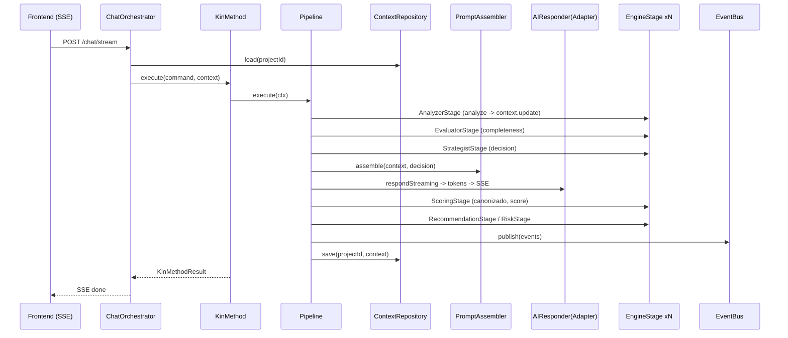

# AUDITORÍA ARQUITECTÓNICA COMPLETA — PREPARACIÓN FASE 5.3

> **Proyecto**: KIN Platform — `LuisAIDev/kin-platform`
> **Milestone auditado**: `v2.0.0-alpha.1` (KIN 2.0 Alpha 1 — Architecture Stable)
> **Fecha**: 30 de julio de 2026
> **Rol**: Software Architect Principal
> **Alcance**: Lectura/análisis completo del repositorio. **Sin cambios de código, sin commits.**
> **Objetivo**: Garantizar que la base pueda evolucionar 10 años sin rediseño.

---

## ÍNDICE

- [0. Metodología](#0-metodología)
- [1. Auditoría de estabilidad](#1-auditoría-de-estabilidad)
- [2. Deuda técnica clasificada](#2-deuda-técnica-clasificada)
- [3. Evolución futura (12+ motores, plugins, API pública, RAG, multi-agent)](#3-evolución-futura)
- [4. Revisión del dominio (DDD)](#4-revisión-del-dominio-ddd)
- [5. Revisión del pipeline](#5-revisión-del-pipeline)
- [6. Revisión del engine framework](#6-revisión-del-engine-framework)
- [7. Revisión del prompt (lógica de negocio)](#7-revisión-del-prompt)
- [8. Revisión de eventos](#8-revisión-de-eventos)
- [9. Revisión de testing](#9-revisión-de-testing)
- [10. Revisión de documentación (contradicciones)](#10-revisión-de-documentación)
- [11. Propuesta para Fase 5.3](#11-propuesta-para-fase-53)
- [12. Conclusión ejecutiva](#12-conclusión-ejecutiva)

---

## 0. METODOLOGÍA

- Inventario completo: 176 fuentes Java en `main` + 14 en `test` (archivos), 9 documentos en `kin-docs`, 5 ADRs, `pom.xml`, 3 configuraciones Spring (`.yml`/`.properties`), frontend (Next.js).
- Ejecución de `./mvnw clean test` → 102 tests / 0 fallos / BUILD SUCCESS.
- Extracción de cobertura JaCoCo por paquete.
- Verificación de **wiring real** entre flujos: `ChatController` → `ChatOrchestratorServiceImpl` → `KinMethod` → `Pipeline` → stages → engines (grep de llamadas, no de intención).
- Cruce doc–código: `BASELINE_ARCHITECTURE.md`, `ADR-001..005`, `FASE5_*`, `ARQUITECTURA_BASE_KIN_2.0.md`, Release Notes, CHANGELOG vs. código real.

---

## 1. AUDITORÍA DE ESTABILIDAD

### 1.1 Veredicto general

| Área | Estado | Nota |
|------|--------|------|
| Arquitectura general (Clean Arch + DDD + Pipeline + Events) | ⚠️ EN RIESGO | El diseño es correcto; el **runtime no lo ejecuta** (ver C1/C2) |
| `kin/` dominio puro (sin Spring/JPA) | ✅ CUMPLE | Verificado: sin anotaciones, sin imports de infraestructura |
| `kin/engine` | ✅ SÓLIDO | Contrato limpio, determinista, 99,1 % cobertura; pero **no se consume en producción** |
| `kin/reporting` | ✅ SÓLIDO | Motores deterministas, bien modelados, explicables |
| `kin/scoring` | ⚠️ INCOMPLETO | `ScoringEngine` **fuera del contrato** `DomainEngine`; heurística de longitud |
| Pipeline | ⚠️ INERTE | En el flujo bloqueante todos los stages se saltan (ver C1) |
| AI | ⚠️ DEUDA | Prompt gigante inline; duplicación de providers; sin `AbstractAIProvider` |
| Eventos | ⚠️ BÁSICO | Interfaces limpias; bus en memoria sin async/persistencia; no se publican en streaming |
| Configuración Spring | ⚠️ FRAGIL | `KinConfig` cablea todo a mano; `ddl-auto: validate` + Flyway V2 no portable a H2 |
| Tests | ⚠️ PARCIAL | 102 verdes pero sin integración y con huecos en el dominio crítico |
| Documentación / ADR | ❌ CONTRADICCIONES | El propio `BASELINE` describe contratos que no existen (ver H1) |
| DDD | ⚠️ MIXTO | Modelo táctico rico en `kin/`; entidades JPA anémicas (`@Data`) en infraestructura |
| SOLID | ⚠️ PARCIAL | OCP bien aplicado en engines/providers; SRP violado en `AiEngineService` y `KinConfig`; ISP violado en `EngineInput` |

### 1.2 El hallazgo central (C1)

**El pipeline de motores NO es operativo en ningún flujo productivo.**

Verificación por código:

1. `KinMethod.execute()` construye `PipelineContext` **sin** `ProjectContext` (`KinMethod.java:26-34`).
2. **Nadie** invoca `PipelineContext.projectContext(ctx)` en código de producción (el setter existe, `PipelineContext.java:62`, pero no hay llamadas — verificado por grep en `src/main/java`).
3. Todos los stages de análisis requieren `context.projectContext() != null` en `supports()` (`AnalyzerStage:22`, `EvaluatorStage:22`, `StrategistStage:22`, `ScoringStage:22`, `RecommendationStage:24`, `RiskStage:24`, `EventStage:19`).
4. Consecuencia en el flujo bloqueante (`POST /chat`): **todos los stages se omiten**. Solo `ConsultorStage` corre (siempre `supports()==true`) y llama a la IA con `projectContext = null`.
5. `ChatOrchestratorServiceImpl.processMessage()` obtiene el contexto (`projectContextService.getContext(projectId)`) y **no lo usa** (`ChatOrchestratorServiceImpl.java:48`).
6. El frontend usa **`/chat/stream`** (`kin-frontend/src/app/dashboard/projects/[id]/page.tsx:132`), flujo que **ni siquiera invoca `KinMethod`** — es un camino ad-hoc (`processMessageStream`).

Resultado: `ScoringEngine`, `RecommendationEngine`, `RiskEngine` y el sistema de eventos **no se ejecutan jamás en producción**. La arquitectura del hito existe en tests y en beans, pero está desconectada del runtime. El motor de contexto en memoria (`ProjectContextService`) solo alimenta al flujo streaming ad-hoc, y **se pierde al reiniciar** (`ConcurrentHashMap`, sin persistencia).

### 1.3 Diagnóstico por área

- **Spring**: `KinConfig.java` (202 líneas) es el mayor configurador manual; registrar un motor nuevo exige editar beans, stages y el pipeline. `EngineRegistry` y `EngineExecutor` se crean como beans pero **ningún código de producción los consume** (grep: solo definición + tests).
- **Clean Architecture**: las capas están bien separadas; la violación principal es `AiEngineService` (Application) que **incrusta el prompt completo** (contenido de dominio/negocio) y `ConsultorStage` (dominio) que depende de `AiEngineService` (Application) — **la dependencia apunta en la dirección equivocada**: el pipeline de dominio importa el servicio de aplicación.
- **DDD**: el lado rico (`kin/`) es ejemplar (VOs inmutables, servicios de dominio puros, factories). El lado infraestructura (entidades `@Data` con setters: `Project`, `ChatMessage`, `UserSubscription`) es anémico; `Project` tiene campos muertos (`viabilityScore`, `aiSummary` nunca se escriben).
- **SOLID**: `AiEngineService` (SRP/OCP), `EngineInput` (ISP: fuerza `score()`/`decision()` a todos los inputs futuros), `KinConfig` (SRP de cableado), `ChatOrchestratorServiceImpl` (DIP parcial: el flujo streaming ignora `KinMethod`).

---

## 2. DEUDA TÉCNICA CLASIFICADA

### 2.1 CRÍTICO

| ID | Hallazgo | Ubicación | Detalle |
|----|----------|-----------|---------|
| C1 | Pipeline de motores inerte en runtime | `KinMethod`/`PipelineContext`/stages | `projectContext` nunca se asigna → todo stage se salta en `/chat`; `/chat/stream` ni usa `KinMethod`. Motores jamás ejecutados |
| C2 | Dos flujos de chat divergentes | `ChatOrchestratorServiceImpl` | Bloqueante = KinMethod (inerte); streaming = camino ad-hoc con contexto en memoria. Duplica prompt, contexto y persistencia; pierde contexto al reiniciar |
| C3 | Endpoint de prueba público | `TestAiController` + `SecurityConfig.java:51` (`/test/**` permitAll) | Dispara llamadas LLM sin autenticación (abuso de costos / info de modelo). `DeepSeekConfig.java:28-31` además loguea los primeros 6 caracteres del API key |

### 2.2 ALTO

| ID | Hallazgo | Ubicación |
|----|----------|-----------|
| H1 | Contratos documentados ≠ código | `BASELINE_ARCHITECTURE.md:59-60,133-134` y `releases/KIN_2_0_ALPHA_1.md:47-48` describen `EnginePhase = EXTRACT→DECIDE` (5 fases) y `EngineType = SCORING/RECOMMENDATION/RISK/EVALUATION`; el código real tiene **16 fases** y `EngineType = DOMAIN/ADAPTER`. El propio ADR-005 y FASE5_2 están correctos → el BASELINE contradice a sus propias fuentes |
| H2 | Canonización incompleta | `ScoringEngine` no implementa `DomainEngine`; `ScoreResult` no implementa `EngineResult`; `ScoringStage` es manual (no usa `EngineStage`) mientras `RecommendationStage`/`RiskStage` sí. Solo 2 de 3 motores están canonizados |
| H3 | `EngineInput` acoplado a dominio específico | `EngineInput.java` exige `projectContext()/evaluation()/decision()/score()`; un futuro `MarketEngine`/`CompetitionEngine` no encaja sin forzar campos |
| H4 | Duplicación de providers IA | `DeepSeekProvider` y `OpenAIProvider` ~95 % idénticos (`buildMessages`, timeout con `CompletableFuture`) + `TestAiController` repite el patrón (3 copias) |
| H5 | Lógica de negocio en el prompt | `AiEngineService.buildSystemPrompt` (202 líneas inline): personalidad, reglas por tipo de proyecto, estructura completa del informe (18 secciones + scoring), "el sistema determinó la siguiente dimensión". Todo esto debería ser Java (ReportEngine/PromptAssembler) |
| H6 | Contexto de proyecto sin persistencia | `ProjectContextService` = `ConcurrentHashMap` en memoria. En streaming el contexto se pierde en cada reinicio; en bloqueante no se usa |
| H7 | `RiskModel.highSeverityCoverageThreshold` muerto | `RiskEngine` nunca lo lee (config definida, sin efecto) |
| H8 | Cobertura de dominio crítico muy baja | `kin.scoring` 9 %, `kin.decision` 69 %, `kin.context` 41 %, `kin.event` 0 %, `kin.pipeline` 39,8 % — el dominio que impulsa la conversación no está testeado |

### 2.3 MEDIO

| ID | Hallazgo | Ubicación |
|----|----------|-----------|
| M1 | `EngineRegistry`/`EngineExecutor` no consumidos en producción | Solo tests |
| M2 | `EngineMetadata.dependencies` definido pero nunca poblado (factory `of()` lo deja vacío) | `EngineMetadata.java` |
| M3 | `KinMethodResult` descarta `RecommendationResult`/`RiskResult` | Solo devuelve score/decision/events |
| M4 | Duplicación de almacenamiento en `PipelineContext` (campos tipados + mapa genérico `engineResults`) | `PipelineContext.java:32-37,82-85` |
| M5 | Caches de suscripción con riesgo de staleness | `SubscriptionValidatorService` `@Cacheable("projectLimit")`/`getActiveSubscription`; `incrementMessageCount` **nunca se invoca** → el límite de mensajes no se aplica de hecho; `getAvailableAILevel` sin uso |
| M6 | `ConversationStrategist.specializedStrategies` nunca se registra (`registerStrategy` sin llamadas) — dead feature | `ConversationStrategist.java` |
| M7 | `DefaultExplorationStrategy.adjustPriorityByContext` es un stub (retorna lo mismo) | `DefaultExplorationStrategy.java:46-48` |
| M8 | `GlobalExceptionHandler` filtra mensajes internos de excepciones al cliente (`IllegalArgumentException`, `RuntimeException`) | Posible fuga de detalles técnicos |
| M9 | `Pipeline` sin manejo de errores por stage (un fallo aborta el pipeline) | `Pipeline.java` |
| M10 | Config duplicada / contradictoria: CORS dual (`SecurityConfig`+`CorsConfig`), `ai.openai.enabled` sin consumidor, `ddl-auto: validate` vs. AGENTS.md ("update"), solo `V2` en Flyway (sin `V1`), `h2-console` habilitado en main | `application.yml`, `pom.xml` |
| M11 | `CompletenessEvaluator` pasa 3 listas vacías hardcodeadas al construir `CompletenessEvaluation` (`List.of(), List.of(), List.of()`) — campos `detectedRisks/opportunities/missingCriticalInformation` nunca se llenan | `CompletenessEvaluator.java:40` |
| M12 | `RiskAssembler.build` accede `rules.get(0)` sin validación de lista vacía | `RiskAssembler.java:29` |
| M13 | `InMemoryDomainEventBus.publishedEvents` usa `ArrayList` (no thread-safe) leído con `List.copyOf` | `InMemoryDomainEventBus.java:12` |
| M14 | `RecommendationEngine.buildExplanation` re-ejecuta `coverageRecommendations/scoreRecommendations/maturityRecommendations` (trabajo repetido) | `RecommendationEngine.java:357-359` |
| M15 | `RecommendationEngine.coverageSpec` = 200 líneas de contenido de negocio embebido en un switch gigante | No configurable/externo |

### 2.4 BAJO

| ID | Hallazgo |
|----|----------|
| B1 | `BusinessRiskAnalyzer`/`TechnicalRiskAnalyzer`/etc. instancian `new RiskAssembler()` cada uno (4 instancias) |
| B2 | `Message.role` es `String` con constantes "USER"/"ASSISTANT"/"SYSTEM" — duplica el enum `MessageRole` de chat |
| B3 | `RiskCategory`/`RiskLevel` duplican conceptos de `ImpactLevel`/`EffortLevel` (nombres y rangos) |
| B4 | `application-test.yml` en `src/main/resources` (viaja en el jar) |
| B5 | Logs excesivos con información sensible en filtros (`SubscriptionAccessFilter`, `ChatController` loguean tokens/uris) |
| B6 | `ProjectContext.fromProject` no cubre `SOLUTION` en `dimensionsCovered` (se guarda el dato pero no marca la dimensión) |

### 2.5 Clases a vigilar (riesgo de God Class / God Object)

| Clase | Líneas | Problema |
|-------|--------|----------|
| `AiEngineService` | 202 | SRP: prompt + routing + fallback. God object del prompt |
| `KinConfig` | 202 | Cableado de todo el dominio a mano; crecerá con cada engine |
| `RecommendationEngine` | 393 | Reglas + contenido + análisis en una clase (el switch `coverageSpec` es 200 líneas) |
| `PipelineContext` | 99 | God object del flujo de datos: campos tipados + mapa genérico + eventos + atributos |
| `SubscriptionValidatorService` | 159 | Plan + límites + cachés + suscripción |
| `ChatOrchestratorServiceImpl` | 179 | Dos flujos completos + serialización SSE + persistencia en una clase |

---

## 3. EVOLUCIÓN FUTURA

Análisis de soporte de las capacidades declaradas **sin reescribir la arquitectura**:

| Capacidad | ¿Soportada hoy? | Análisis |
|-----------|----------------|----------|
| `ScoringEngine` | ⚠️ Parcial | Existe pero fuera del contrato `DomainEngine`; necesita canonización (H2) |
| `RecommendationEngine` | ✅ | Canonizado, determinista, ADR-003 |
| `RiskEngine` | ✅ | Canonizado, extensible vía `List<RiskAnalyzer>`, ADR-004 |
| `OpportunityEngine` | ⚠️ Preparada | `EnginePhase.OPPORTUNITY` ya existe; solo falta el motor |
| `MarketEngine` | ⚠️ Preparada | `EnginePhase.MARKET` existe; el acoplamiento de `EngineInput` (H3) es el freno |
| `CompetitionEngine` | ⚠️ Preparada | `EnginePhase.COMPETITION` existe; idem H3 |
| `InnovationEngine` | ⚠️ Preparada | `EnginePhase.INNOVATION` existe; idem H3 |
| `FinancialEngine` | ⚠️ Preparada | `EnginePhase.FINANCIAL` existe; idem H3 |
| `KnowledgeEngine` | ⚠️ Preparada | `EnginePhase.KNOWLEDGE` existe; requiere base de conocimiento (port nuevo) |
| `ReportEngine` | ❌ No | No existe; la lógica del informe vive en el prompt (H5). Requiere `Report`/`ReportSection` + `ReportRenderer` port |
| `PromptAssembler` | ❌ No | El prompt es inline en `AiEngineService`; requiere extracción (H5) |
| `RendererRegistry` | ❌ No | No existe; se puede apoyar en el patrón `EngineRegistry` |
| `EngineRegistry` | ✅ | Auto-descubrimiento por `List<DomainEngine>`; robusto para N motores |
| Plugin System | ⚠️ Lejano | `EngineRegistry` + beans ya permiten "registro" por composición, pero falta una API de registro explícita, versionado y aislamiento de clases |
| Public API | ⚠️ Lejano | API REST ya versionada por contexto-path; faltan contratos públicos estables y documentación OpenAPI |
| Multi-Agent | ❌ No | Requiere `Role`/`Agent` abstracción + orquestación; el pipeline actual es monousuario/monofase |
| RAG | ❌ No | Requiere `KnowledgeRepository`/embeddings; la memoria de contexto actual es un mapa en RAM |
| Analytics | ❌ No | Requiere que los motores realmente se ejecuten (C1) y emitir métricas/eventos (C2) |

**Veredicto**: el diseño conceptual soporta 20+ motores, **pero la precondición es resolver C1 (runtime) y H2/H3 (canonización y desacoplamiento de `EngineInput`)**. Hoy, agregar 12 motores no cambiaría nada funcional porque no corren en producción. La arquitectura de motores es extensible **en el papel**; la extensibilidad real exige reconectar el runtime primero.

---

## 4. REVISIÓN DEL DOMINIO (DDD)

### 4.1 Inventario de clasificación actual

| Concepto DDD | Implementaciones | Evaluación |
|--------------|------------------|------------|
| **Entities** | `ProjectContext` (aggregate de facto del contexto), `Project`, `ChatMessage`, `UserSubscription` (JPA) | `ProjectContext` es rico y correcto. Las JPA son **anémicas** (`@Data` + setters + equals/hashCode generados sobre estado mutable) |
| **Value Objects** | `ConversationDecision`, `CompletenessEvaluation`, `AnalysisResult`, `ScoringModel`, `ScoreResult`, `RecommendationResult`, `RiskResult`, `Risk`, `Recommendation`, `EngineMetadata`, `RiskExplanation`, `RecommendationExplanation`, `Message` | Excelentes: records inmutables con factories y normalización. `ScoringModel`/`RiskModel` son clases no-record pero inmutables (aceptable) |
| **Domain Services** | `KinMethod`, `ScoringEngine`, `RecommendationEngine`, `RiskEngine`, `CompletenessEvaluator`, `ConversationStrategist`, `RiskAssembler`, `Pipeline` | Correctos, puros, deterministas |
| **Aggregates** | No declarado formalmente | `ProjectContext` es el único candidato real (raíz del contexto de conversación). No hay raíces JPA ricas. **Falta declarar el aggregate explícitamente** |
| **Factories** | `ProjectContext.fromProject`, `ConversationDecision.ask/generateReport/stop`, `Recommendation.create`, `Risk.create`, `ScoringModel.defaultModel`, `RiskModel.defaultModel`, `EvaluationPolicies.defaults`, `ExplorationPriority.defaultPriorities` | Bien aplicadas |
| **Policies** | `EvaluationPolicies`, `ExplorationPriority`, `ScoringModel.weights`, `RiskModel` | Bien: configuración como VOs inmutables, inyectados. (`RiskModel` con campo muerto, ver H7) |
| **Events** | `DomainEvent` (+ 6 eventos concretos) | Correctos como records; **sin `occurredAt` ni metadata de auditoría** |
| **Repositories** | JPA: `ProjectRepository`, `ChatMessageRepository`, `UserRepository`, `PricingPlanRepository`, `UserSubscriptionRepository` | Solo infraestructura; **no hay interfaz de repositorio en el dominio** (la interfaz JPA vive en `project/`) |
| **Ports** | `AIProvider`, `ContextAnalyzerPort`, `DomainEventBus`, `PipelineStage`, `DomainEngine`, `RiskAnalyzer`, `ExplorationStrategy` | Buenos. **Falta `ContextRepository`** (persistencia del contexto) y `ReportRenderer` |
| **Adapters** | `HeuristicContextAnalyzerAdapter`, `InMemoryDomainEventBus`, `DeepSeekProvider`, `OpenAIProvider`, `ProviderRouter` | Correctos. Falta adaptador JPA del contexto (H6) |

### 4.2 Cambios de categoría recomendados

| Concepto | Hoy | Debería ser | Motivo |
|----------|-----|-------------|--------|
| `ProjectContext` | Entity implícita en `kin/context` | **Aggregate Root** declarado | Es la única raíz que agrupa dimensiones + decisión + contador + reporte; formalizarlo define los invariantes de persistencia |
| `PipelineContext` | God object mutable en `kin/pipeline` | **Unit of Work / flujo temporal**, no dominio | Es un mecanismo de transporte entre stages; debería ser el `EngineExecutionContext`, no un agregado |
| `ScoringEngine` | Clase suelta en `kin/scoring` | **Domain Service bajo `DomainEngine`** | Canonización H2 |
| `AiEngineService` | Application Service | Separar en **`PromptAssembler` (dominio)** + **orquestador** (aplicación) | Extraer contenido del prompt (H5) |
| `ConsultorStage` | Stage que depende de `AiEngineService` | Invertir dependencia: el pipeline debe depender de un **port `AIResponder`** en el dominio | Regla de Clean Arch: el dominio no importa la aplicación |
| Entidades JPA (`Project`, `ChatMessage`, `UserSubscription`) | Entities con `@Data` | Modelos de persistencia (anémicos) **sin setters públicos** o mapeados a agregados de dominio | DDD: no exponer estado mutable |
| `RiskLevel`/`ImpactLevel`/`EffortLevel` | VOs separados por paquete | Unificar en **`Severity`/`Magnitude`** compartido o documentar la intención | Eliminar duplicación semántica (B3) |

---

## 5. REVISIÓN DEL PIPELINE

| Requisito | Estado | Evidencia |
|-----------|--------|-----------|
| Una sola responsabilidad por stage | ✅ | Cada stage ejecuta exactamente una tarea (analizar, evaluar, decidir, consultar, scorear, recomendar, riesgos, eventos) |
| Sin lógica duplicada | ⚠️ | `RecommendationStage`/`RiskStage` bien delegados a `EngineStage`; pero `ScoringStage` duplica el patrón a mano (H2) |
| Sin conocer stages futuros | ✅ | Ningún stage referencia a otro stage por nombre |
| Sin conocer stages anteriores | ⚠️ | `RecommendationStage`/`RiskStage`/`ScoringStage` requieren `decision().shouldGenerateReport()` y `scoreResult() != null` en `supports()` — **acoplamiento implícito de orden** (deben correr después de Strategist/Scoring). No conocen el stage, pero **conocen su salida tipada**, lo que los ata al orden |
| Sin depender del orden interno | ❌ | `PipelineContext` con campos tipados (`scoreResult`, `recommendationResult`, `riskResult`) acopla el pipeline al orden de producción de resultados; el mapa genérico `engineResults` lo mitiga solo parcialmente (M4) |
| Sin lógica del LLM | ⚠️ | Los stages de análisis son puros; pero `ConsultorStage` depende directamente de `AiEngineService` (Application) — el pipeline de dominio tiene una flecha hacia la aplicación (violación Clean Arch) |

**Veredicto**: diseño limpio salvo (a) el acoplamiento de orden vía `PipelineContext` tipado y (b) la dependencia `ConsultorStage → AiEngineService`. Además, como el pipeline **nunca se ejecuta** en producción (C1), la limpieza es estructural pero no funcional.

---

## 6. REVISIÓN DEL ENGINE FRAMEWORK

| Componente | Auditoría | ¿Soporta 20+ engines? |
|------------|-----------|----------------------|
| `DomainEngine<E,R>` | ✅ Contrato mínimo correcto (`metadata()` + `evaluate(E)`) | ✅ Sí, por composición genérica |
| `EngineRegistry` | ✅ Auto-descubrimiento por `List<DomainEngine>`, `find/contains/names/size/allOrdered/byPhase/after` | ✅ Sí (O(1) lookups, orden determinista) — pero **nadie lo usa en producción** |
| `EngineExecutor` | ✅ `execute/executeAll/executeIf/executeOptional/executeAllParallel` (paralelo = secuencial) | ✅ Sí; los motores son stateless e inmutables |
| `EngineStage` | ✅ Composición pura (`supports/inputFactory/resultWriter`) | ✅ Sí — un stage por motor sin tocar el pipeline |
| `EngineMetadata` | ✅ 7 campos + `dependencies` (sin poblar, M2) | ⚠️ El campo `dependencies` promete orden topológico pero la factory lo ignora; `EngineExecutor` no lo usa |
| `EngineResult` | ✅ `confidence/explanation/generatedBy/engineVersion/isEmpty` | ⚠️ **`ScoreResult` no lo implementa** (H2) — impide que scoring participe de `EngineStage` |
| `EngineInput` | ❌ **Acoplado** (`score()`, `decision()` obligatorios) | ⚠️ Los futuros motores de mercado/competencia no tienen score ni decisión en su dominio → **no encajan** sin refactor (H3) |

**Veredicto**: la infraestructura base es sólida y puede sostener 20+ motores **si** se (1) desacopla `EngineInput`, (2) canoniza `ScoringEngine`/`ScoreResult`, (3) puebla/usar `EngineMetadata.dependencies` y (4) se consume `EngineRegistry`/`EngineExecutor` en el pipeline. Sin estos 4 pasos, agregar motores solo infla un registry que nadie invoca.

---

## 7. REVISIÓN DEL PROMPT (lógica de negocio a migrar a Java)

`AiEngineService.buildSystemPrompt` (`AiEngineService.java:66-189`, 202 líneas) contiene lógica de negocio que **debe vivir en Java**:

| Bloque en el prompt | Lógica de negocio | Migración sugerida |
|---------------------|-------------------|--------------------|
| "No preguntes sobre datos que ya están aquí" (snippet de contexto) | Regla de deduplicación de preguntas | Ya en Java (`ProjectContext.toPromptSnippet`) — mover el ensamblado a `PromptAssembler` |
| "INSTRUCCIÓN ESTRATÉGICA: seguí la dimensión decidida" | **Delega la decisión al sistema** (bueno) pero la redacción vive en `ConversationDecision.toStrategySnippet()` (dominio generando prompt) | `PromptAssembler` debe consumir `ConversationDecision` y renderizar la instrucción |
| Reglas por tipo de proyecto (restaurante→comida, software→funcionalidades…) | Taxonomía de sectores | **Java**: tabla `SectorTemplate` (VO) + `SectorTemplateRegistry` |
| "No uses listas numeradas / no frases genéricas" | Reglas de estilo | Config de `PromptAssembler` (plantilla) — no lógica ad-hoc |
| Estructura del informe (18 secciones + "### Scoring de Viabilidad Estimado: X/100") | **Contrato del reporte** | **`ReportEngine` + `ReportTemplate`** (ADR futura). El prompt debe recibir el template, no definirlo |
| Reglas absolutas ("no inventes cifras", "respondé siempre en español") | Políticas de respuesta | Config del `PromptAssembler` |
| PERSONALIDAD / CÓMO CONVERSAR / CÓMO PROFUNDIZAR | Prompt de sistema estático | Extraer a recursos versionados (`.txt`/`/resources/prompts`) |

**Conclusión**: aprox. **60-70 % del prompt es contenido de negocio migrable a Java/recursos**. Solo el núcleo de "persona" debería seguir en una plantilla. La migración NO se realiza en esta auditoría (identificación únicamente).

---

## 8. REVISIÓN DE EVENTOS

| Criterio | Estado | Análisis |
|----------|--------|----------|
| Contrato base (`DomainEvent`) | ✅ | `type()` + `aggregateId()`. Correcto y estable |
| `DomainEventBus` | ✅ | `publish()` + `subscribe()` limpios |
| Tipos de evento | ⚠️ | 6 concretos (`ConversationCompleted`, `ProjectContextUpdated`, `QuestionGenerated`, `ReportGenerated`, `RiskDetected`, `ScoreCalculated`). `RiskDetected`/`ReportGenerated` se declaran pero **`EventStage` no los emite** en todos los casos; `ScoreCalculated` solo si `totalScore > 0`. Sin `occurredAt`, sin `metadata`, sin `version` de evento |
| Escalabilidad | ⚠️ | `InMemoryDomainEventBus` síncrono, en proceso. Los handlers se ejecutan en el hilo del publisher |
| Async readiness | ❌ | `publish()` es bloqueante. No hay `ExecutorService`, colas ni `@Async` |
| Plugin readiness | ⚠️ | `subscribe` es simple; sin ciclo de vida, sin prioridad de handlers |
| Kafka readiness | ⚠️ | El contrato `publish/subscribe` es lo suficientemente abstracto para un adaptador Kafka, pero no hay serialización (`ObjectMapper` ausente), headers ni partición/agregado |
| Audit readiness | ❌ | Sin id de evento, sin timestamp, sin causación; `publishedEvents` solo para tests |
| Event sourcing readiness | ❌ | Sin comandos, sin snapshot, sin stream por agregado; `ProjectContext` mutable en RAM, no un stream de eventos |
| Publicación real | ❌ | En el flujo streaming **no se publica ningún evento**; en el bloqueante el `EventStage` se salta (C1) → **el sistema de eventos no produce nada en producción** |

**Veredicto**: contrato bien diseñado, implementación mínima, **cero emisión real**. Para Kafka/audit/event-sourcing hace falta rediseñar `DomainEvent` (agregar `occurredAt`, `eventId`, `metadata`) — cambio aditivo, no rompedor.

---

## 9. REVISIÓN DE TESTING

### 9.1 Cobertura real (JaCoCo, instrucciones)

| Paquete | Cobertura | Paquete | Cobertura |
|---------|-----------|---------|-----------|
| `kin.engine` | **99,1 %** (ramas 100 %) | `kin.context` | 41 % |
| `kin.reporting` | **96,2 %** | `kin.context.strategy` | 0 % |
| `kin.reporting.risk` | **99,6 %** | `kin.event` | 0 % |
| `kin.decision` | 69 % | `kin.scoring` | 9 % |
| `kin.pipeline` | 39,8 % | `kin.pipeline.stage` | 41,7 % |
| `chat` | 26 % | `ai.context`/`ai.provider` | 3,5 % / 0,7 % |
| `auth`, `pricing`, `project`, `user`, `common` | 0 % | — | — |

**El requisito ≥90 % se cumple solo en `kin.engine` + `kin.reporting`, que son justamente los motores que no corren en producción.** El dominio que sí opera la conversación (`scoring`, `decision`, `context`, `pipeline`, `event`) está entre 0 % y 69 %.

### 9.2 Calidad de las pruebas

| Dimensión | Evaluación |
|-----------|------------|
| Tests de motores (`RecommendationEngineTest`, `RiskEngineTest`, etc.) | ✅ Excelentes: casos de negocio, límites, explicaciones |
| Tests de framework (`EngineRegistry/Executor/Metadata/DeterministicId`) | ✅ Buenos |
| Tests de stages | ⚠️ Solo `EngineStage/RecommendationStage/RiskStage`; **sin tests para `AnalyzerStage`, `EvaluatorStage`, `StrategistStage`, `ConsultorStage`, `ScoringStage`, `EventStage`, `Pipeline`, `KinMethod`** |
| Tests de integración | ❌ **0** (`@SpringBootTest`/`@WebMvcTest`/MockMvc: ninguno) |
| Tests de controllers | ❌ 0 |
| Tests de flujo bloqueante | ❌ `ChatOrchestratorServiceImplTest` **mockea `KinMethod`** y solo cubre streaming (5 tests) → no detecta C1 |
| Tests de infraestructura | ❌ auth/pricing/project/user/common/security: 0 |
| Tests redundantes | ⚠️ `RiskResultTest`/`RecommendationResultTest` validan mucho normalizado de records (valor útil pero con solapamiento) |
| Tests lentos | ✅ Rápidos (suite completa < 1 min) |
| Tests frágiles | ⚠️ `ChatOrchestratorServiceImplTest` usa `mockConstruction(SseEmitter)` + spies de `ObjectMapper` (frágil a cambios de serialización); asserts sobre conteos de llamadas `verify(...times(3))` |

### 9.3 Mejoras propuestas (priorizadas)

1. **Test de integración KinMethod→Pipeline→engines** con `ProjectContext` real (detectaría C1).
2. **Unit tests** para `ScoringEngine`, `ScoringStage`, `CompletenessEvaluator`, `ConversationStrategist`, `DefaultExplorationStrategy`, `EventStage`, `ProjectContext`, `Pipeline`, `KinMethod`.
3. **Contract tests** del `DomainEngine` (todo motor nuevo debe pasar la suite común: `empty()` en entrada inválida, inmutabilidad, determinismo).
4. **Tests de seguridad**: `SecurityConfig` (permisos `/test/**`, rutas autenticadas), `JwtAuthenticationFilter`, `RateLimitingFilter`, `SubscriptionAccessFilter`.
5. **Prueba de humo del arranque** (`@SpringBootTest` con H2 mem) para detectar el problema Flyway V2 y el wiring.
6. **Cobertura objetivo por capa**: fijar ≥80 % en `kin.*` completo (no solo reporting/engine) antes de Fase 5.3.

---

## 10. REVISIÓN DE DOCUMENTACIÓN (CONTRADICCIONES)

| Doc | Contradicción |
|-----|---------------|
| `BASELINE_ARCHITECTURE.md:59-60,133-134` | `EnginePhase` = EXTRACT→DECIDE (5) y `EngineType` = SCORING/RECOMMENDATION/RISK/EVALUATION **vs código real** (16 fases; DOMAIN/ADAPTER) y vs `ADR-005` (correcto). **El documento contractual es el que está mal** |
| `releases/KIN_2_0_ALPHA_1.md:47-48` | Idem: describe `EngineType` con valores inexistentes |
| `BASELINE_ARCHITECTURE.md` Known Issues + `releases` + `CHANGELOG` | "EventStage dispara `ConversationCompleted` de forma fija" — **falso en código actual**: `EventStage` dispara según `decision.action()` (ASK/REPORT/ScoreCalculated/ConversationCompleted). Doc obsoleto |
| `BASELINE_ARCHITECTURE.md:176` | Clasifica `EnginePhase`/`EngineType` como "Estables" — lo son, pero sus valores documentados no existen |
| `FASE5_CONSOLIDACION_ARQUITECTONICA.md` (UML) | Propone API `supportedPhase()/getAllByPhase/executePhase/buildInput/storeResult` en el registry — **difiere de la implementación real** (`byPhase/after/allOrdered/find`). Documento de diseño previo, marcado como consolidación |
| `ARQUITECTURA_BASE_KIN_2.0.md` §8.1/§9 | Estables/roadmap razonablemente alineados; §8.2 mantiene "EventStage siempre ConversationCompleted" (obsoleto) |
| `AGENTS.md` | Dice "Dev (H2): `ddl-auto: update`" pero `application.yml` usa `ddl-auto: validate` + `flyway.enabled: true` con solo `V2` (sin `V1`) → arranque dev frágil; documenta `spring.flyway.enabled=false` como workaround |
| `CHANGELOG.md` v2.0.0-alpha.1 "Known Issues" | Repite el item de EventStage obsoleto y no menciona C1 (pipeline inerte) |

**Resumen**: 4 contradicciones documentales (EnginePhase/EngineType, EventStage, API del registry, ddl-auto) y **una omisión crítica**: ninguna doc del milestone menciona que el pipeline no se ejecuta en runtime. El BASELINE debe corregirse (no a la inversa: el código es el que define el contrato real).

---

## 11. PROPUESTA PARA FASE 5.3

### 11.1 Principio rector

> **No añadir motores. Re-conectar el runtime.** Un motor que no se ejecuta no es arquitectura: es inventario.
> La Fase 5.3 debe convertir la arquitectura de motores en **operativa**, y recién después
> demostrar la extensibilidad con una familia de motores nueva.

### 11.2 Objetivo

Dejar el pipeline **ejecutándose en ambos flujos de chat**, con contexto persistente, prompts
ensamblados en Java y el framework de motores canonizado — cumpliendo el 100 % de los requisitos
de §6 — de modo que la Fase 5.4+ solo agregue motores y stages sin tocar el núcleo.

### 11.3 Arquitectura objetivo (cambios estructurales)

```
CONTROL (aplicación)                      DOMINIO (kin/)                       INFRA (adaptadores)
──────────────────────                    ───────────────────────              ──────────────────────
ChatController ──────► ChatOrchestrator ─► KinMethod ──► Pipeline               ContextRepositoryJpa
                                                                                (tabla project_context)
                                   ▲           │
                                   │           ▼
                          (ambos flujos)   EngineStage* (8+)   ◄── DomainEngine<E,R>
                                   │           │                     ScoringEngine (canonizado)
                                   │           ▼                     RecommendationEngine
                                   │        EventBus ──► EventHandler RiskEngine + MarketEngine...
                                   │                                 AIResponder port ◄── AiEngineService
                                   │                                          │
                                   └────── PromptAssembler (dominio) ◄─────────┘ (solo implementa el port)
```

Puntos de cambio:
1. `KinMethod` recibe el `ProjectContext` desde un nuevo **port `ContextRepository`** (carga por `projectId`, guarda tras el pipeline). Se elimina el mapa en RAM de `ProjectContextService`.
2. **Flujo único**: `processMessageStream` y `processMessage` delegan en `KinMethod`; el streaming usa el mismo pipeline (la generación de tokens se encadena a la salida del `ConsultorStage`/`AiResponder`).
3. `ConsultorStage` depende de un **port `AIResponder`** (dominio); `AiEngineService` pasa a ser un adaptador.
4. Extracción de `PromptAssembler` (port en dominio + impl) y de `SectorTemplateRegistry`.
5. Canonización completa: `ScoringEngine implements DomainEngine<ScoringInput, ScoreResult>`, `ScoreResult implements EngineResult`, `ScoringStage` compone `EngineStage`.
6. Desacople de `EngineInput`: se convierte en **marker vacío**; cada input tipado se construye con la `Function<PipelineContext, E>` (ya soportada por `EngineStage`). Se elimina `decision()`/`score()` del contrato genérico.

### 11.4 Nuevos paquetes

| Paquete | Contenido |
|---------|-----------|
| `com.kinplatform.kin.context.port` | `ContextRepository` (port) |
| `com.kinplatform.kin.prompt` | `PromptAssembler`, `PromptTemplate`, `SectorTemplate`, `SectorTemplateRegistry` |
| `com.kinplatform.kin.pipeline.executor` | `PipelineExecutor` (unificado), `PipelineStreamingAdapter` |
| `com.kinplatform.infrastructure.context` | `ContextRepositoryJpaAdapter` + entidad `ProjectContextEntity` |
| `com.kinplatform.infrastructure.ai.prompt` | `FilePromptTemplateProvider` (recursos versionados) |
| `com.kinplatform.kin.reporting.market` | (Fase 5.4) `MarketEngine`, `MarketInput`, `MarketResult`, `MarketRiskAnalyzer` |

### 11.5 Nuevos contratos

```java
// Port de persistencia del contexto (dominio)
public interface ContextRepository {
    ProjectContext load(UUID projectId);
    void save(UUID projectId, ProjectContext context);
}

// Port de respuesta IA (dominio) — reemplaza la dependencia ConsultorStage → AiEngineService
public interface AIResponder {
    String respondBlocking(ConversationContext ctx, String userMessage);
    Flux<String> respondStreaming(ConversationContext ctx, String userMessage);
}

// Contrato de ensamblado de prompts (dominio)
public interface PromptAssembler {
    String assemble(ProjectContext context, ConversationDecision decision, PromptTemplate template);
}

// EngineInput pasa a marker (elimina el acoplamiento H3)
public interface EngineInput { }
```

### 11.6 Nuevos Value Objects

| VO | Paquete | Propósito |
|----|---------|-----------|
| `PromptTemplate` | `kin.prompt` | Plantilla versionada del prompt (persona + reglas) |
| `SectorTemplate` | `kin.prompt` | Taxonomía de sectores (migra la lógica "restaurante→comida" del prompt) |
| `ScoringInput` | `kin.scoring` | Input tipado del `ScoringEngine` (para canonizarlo) |
| `EngineExecutionContext` | `kin.pipeline` | Reemplazo de `PipelineContext` como transporte tipado (opcional, mitigar M4/M9) |
| (Fase 5.4) `MarketInsight`, `CompetitionProfile`, `InnovationScore`, `Opportunity` | `kin.reporting.*` | Resultados de la familia nueva |

### 11.7 Nuevos engines / stages

- **Fase 5.3 (canonización)**: `ScoringEngine` (ya existe; se canoniza). **Sin engines nuevos**.
- **Fase 5.4 (demostración de extensibilidad)**: `MarketEngine` (`EnginePhase.MARKET`), `CompetitionEngine` (`EnginePhase.COMPETITION`), `InnovationEngine` (`EnginePhase.INNOVATION`) — con su `XxxInput`/`XxxResult` y **una sola configuración de `EngineStage` por motor** (sin nuevas clases de stage).

### 11.8 Nuevos tests

| Tipo | Contenido |
|------|-----------|
| Integración | `KinMethodPipelineIntegrationTest` (contexto real → todos los stages ejecutan y persisten) |
| Integración Spring | `@SpringBootTest` smoke (boot sin Flyway, beans del dominio presentes) |
| Unit | `ScoringEngineTest`, `ScoringStageTest`, `CompletenessEvaluatorTest`, `ConversationStrategistTest`, `DefaultExplorationStrategyTest`, `EventStageTest`, `ProjectContextTest`, `PipelineTest`, `PromptAssemblerTest`, `ContextRepositoryJpaAdapterTest` |
| Contract | `DomainEngineContractTest` (suite común para todo motor) |
| Seguridad | `SecurityConfigTest` (`/test/**` debe quedar autenticado), filtros JWT/rate/subscription |
| Flujo bloqueante | `ChatOrchestratorServiceImplTest` con `KinMethod` real (no mock) |

### 11.9 Nuevos ADRs

| ADR | Título |
|-----|--------|
| ADR-006 | Runtime reconnection: flujo único de chat y pipeline operativo |
| ADR-007 | Context persistence port (`ContextRepository`) |
| ADR-008 | Prompt assembly en dominio (`PromptAssembler`, `SectorTemplateRegistry`) |
| ADR-009 | Engine canonization completa + desacople de `EngineInput` (marker) |
| ADR-010 | (Fase 5.4) Familia de motores de estrategia (Market/Competition/Innovation) |

### 11.10 Diagramas UML (objetivo)



### 11.11 Roadmap

| Fase | Contenido | Entregable |
|------|-----------|------------|
| **5.3 (prioridad)** | Reconexión runtime + canonización + `ContextRepository` + `PromptAssembler` + seguridad (`/test/**`) + corrección de BASELINE + tests | Pipeline operativo en ambos flujos; cobertura `kin.*` ≥80 % |
| 5.4 | Familia Market/Competition/Innovation sobre `EngineStage` | Extensibilidad demostrada (20+ motores viable) |
| 5.5 | `ReportEngine` + `ReportRenderer` + `RendererRegistry` (migra la estructura del informe fuera del prompt) | Informes estructurados reales |
| 6.x | Event bus async + outbox; `EngineRegistry` como API pública; `AbstractAIProvider` | Escala horizontal, auditoría |
| 7.0 | Public API (OpenAPI), Plugin System, multi-agent, RAG | Plataforma extensible de terceros |

### 11.12 Riesgos de la fase

| Riesgo | Impacto | Mitigación |
|--------|---------|------------|
| Unificar el streaming con el pipeline rompe el contrato SSE actual | Alto | Mantener ambos endpoints durante la transición; feature flag; los eventos SSE (`token/done/error`) se conservan exactamente |
| Migración del contexto en memoria (RAM → DB) cambia el comportamiento de sesiones activas | Medio | `ContextRepository` con estrategia dual (memoria+DB) y migración suave |
| Canonización de `ScoringEngine` cambia su API pública | Alto | `evaluate(ctx, eval)` se conserva como método de conveniencia; el nuevo `evaluate(ScoringInput)` es aditivo; no se rompe `ScoringStage` público |
| Corrección del BASELINE rompe la "congelación" del hito | Medio | Se corrige la **descripción** del contrato, no el código; acompañado de ADR-009 y una nota de errata del milestone |

### 11.13 Compatibilidad hacia atrás

| Contrato | Estrategia |
|----------|------------|
| `KinMethodCommand` | Se mantiene; se añade sobrecarga para recibir el `ProjectContext` (aditivo) |
| Endpoints `/chat` y `/chat/stream` | Se mantienen (mismos contratos de request/response/SSE) |
| `DomainEngine` / `EngineStage` / `EngineExecutor` / `EngineRegistry` | Sin cambios de firma |
| `EngineInput` | Cambia a marker → **cambio rompedor de contrato interno**; se compensa con ADR-009 y se aplica solo dentro de `kin/` (sin impacto en API REST) |
| `RecommendationResult` / `RiskResult` | Sin cambios |
| Frontend | Sin cambios (usa los mismos endpoints) |

---

## 12. CONCLUSIÓN EJECUTIVA

KIN 2.0 Alpha 1 declara una arquitectura **estructuralmente excelente** (dominio puro, motores
deterministas, contratos limpios, documentación extensa) pero **funcionalmente desconectada**:
los motores no se ejecutan en runtime, el flujo principal (`/chat/stream`) no usa `KinMethod`, y
el contexto no persiste. El riesgo #1 no es técnico, es de **confianza**: la plataforma cree que
scoring/recomendación/riesgo están activos y no lo están.

La Fase 5.3 no debe añadir capacidad; debe **hacer operativo el contrato ya congelado** y,
en paralelo, sanear: (1) seguridad pública (`/test/**`, logging de keys), (2) documentos
contractuales contradictorios, (3) cobertura de tests en el dominio que sí opera la conversación.

Con esas 3 correcciones + la canonización completa (§6) + el desacople de `EngineInput`,
la arquitectura queda genuinamente preparada para 10 años: los 12+ motores futuros, el plugin
system, la API pública, el RAG, el multi-agent y la analítica se apoyarán en un runtime que
**ya ejecuta** y en contratos que **sí coinciden** con su documentación.

---

*Auditoría de solo lectura. No se modificó ningún archivo ni se creó commit.*
*Erratas de baseline detectadas se reportan aquí y deberían tratarse en Fase 5.3 (no retroactivas al hito).*
