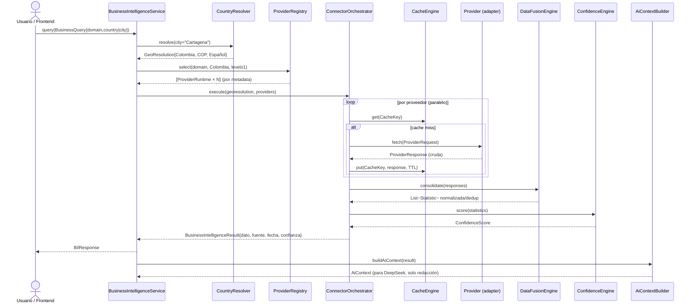

# FASE 11 — Business Intelligence Layer (BIL)

> **Documento de arquitectura** (diseño únicamente — sin implementación).
> Sancionado por **ADR-019** (`kin-docs/adr/ADR-019-business-intelligence-layer.md`).
> Fase 10 cerrada y publicada (`v2.0.0-phase10`). Este documento NO modifica funcionalidad
> existente y NO toca ningún contrato congelado de `BASELINE_ARCHITECTURE.md`.

---

## 1. Resumen ejecutivo

KIN se convierte en una plataforma de consulta de inteligencia empresarial, económica,
turística, geográfica y estadística de cualquier país. La nueva capa **Business Intelligence
Layer (BIL)** es un **Bounded Context aislado** que:

- Resuelve el contexto geográfico (país / ciudad / región / moneda / idioma).
- Adquiere datos de **providers externos por país y dominio** a través de **interfaces**
  (nunca `if(country)` ni `switch(country)`).
- Cachea (TTL por dominio), fusiona (normaliza/dedup/consolida) y puntúa confianza.
- Construye un **contexto estructurado para la IA**: **Java recopila, DeepSeek solo redacta**.

Regla de oro (idéntica al resto de KIN): **Java decide. El LLM únicamente comunica.**

---

## 2. Principios de diseño

| Principio | Aplicación en BIL |
|-----------|-------------------|
| **SOLID** | S: un puerto por dominio (`TourismProvider`, `EconomyProvider`, …). O: nuevos países = nuevas implementaciones, cero cambios en consumidores. L: toda implementación sustituye a su interfaz. I: interfaces pequeñas por dominio. D: el dominio depende de puertos, no de concretos. |
| **DDD** | Bounded Context `BusinessIntelligence` con su propio lenguaje ubicuo (Statistic, GeoResolution, ConfidenceScore, Provenance); dominio puro sin Spring. |
| **Open/Closed** | Añadir un país = añadir un `@Component` que implementa un puerto. El registro selecciona por **metadata**, nunca por branching. |
| **Strategy Pattern** | La selección del proveedor es una estrategia (`ProviderSelector`); el procesamiento de fusión y de confianza son estrategias intercambiables. |
| **Factory Pattern** | `ProviderFactory` compone el runtime de cada provider (conexión + cache + política de reintento) y construye conectores a partir de `ProviderConfig`. |
| **Adapter Pattern** | Toda fuente externa (HTTP, CLDR, Redis, Caffeine, documento) es un adaptador tras su puerto. KIN nunca depende de Google/Redis/etc. |
| **Dependency Injection** | Auto-descubrimiento vía `List<XxxProvider>` (patrón ya usado por `RiskAnalyzer`, `OpportunityAnalyzer`, `SectionFormatter`, `KnowledgeSource`). Composición en `BilConfig`. |
| **Clean / Hexagonal** | Núcleo de dominio en `com.kinplatform.kin.bil` (POJO puro); adaptadores en `com.kinplatform.ai.bil.adapter`; web del BC en `com.kinplatform.kin.bil.web`. Dependencias siempre hacia dentro. |

---

## 3. Arquitectura — diagrama general

```
                         ┌────────────────────────────────────────────────────────┐
                         │                       KIN FRONTEND                     │
                         └───────────────────────────┬────────────────────────────┘
                                                     │ HTTP /api/v1/bil/... (+ SSE opcional)
                                                     ▼
┌─────────────────────────────────────────────────────────────────────────────────────┐
│                  BUSINESS INTELLIGENCE BOUNDED CONTEXT   (com.kinplatform.kin.bil)   │
│                                                                                      │
│  ┌──────────────────────┐   ┌─────────────────────────┐   ┌────────────────────────┐ │
│  │ BusinessIntelligence │──▶│ Connector Orchestrator  │──▶│   Provider Registry    │ │
│  │ Service (app)        │   │ (orquesta adquisición)  │   │  (selección metadata)  │ │
│  └──────────┬───────────┘   └────────────┬────────────┘   └───────────┬────────────┘ │
│             │                            │                             │              │
│             │                            ▼                             ▼              │
│             │                   ┌─────────────────┐            ┌──────────────────┐  │
│             │                   │  Cache Engine   │◀───▶──────│  Provider Factory │  │
│             │                   │ (TTL por dominio)│            │ (runtime por      │  │
│             │                   └─────────────────┘            │  proveedor)       │  │
│             │                            │                       └────────┬─────────┘  │
│             │                            ▼                                ▼             │
│             │                   ┌─────────────────┐            ┌──────────────────┐  │
│             │                   │  Data Fusion    │◀───────────│  ConnectorPort   │  │
│             │                   │  Engine         │            │  (HTTP adapters) │  │
│             │                   └────────┬────────┘            └────────┬─────────┘  │
│             │                            ▼                               │             │
│             │                   ┌─────────────────┐                       │             │
│             │                   │ Confidence      │                       ▼             │
│             │                   │ Engine          │            ┌──────────────────┐  │
│             │                   └────────┬────────┘            │  8+ providers/   │  │
│             │                            ▼                     │  dominio/país     │  │
│             │             ┌──────────────────────────┐         └──────────────────┘  │
│             │             │ Country Resolver (geo)   │◀──── CLDR / gazetteer         │
│             │             └──────────────────────────┘                               │
│  ┌──────────┴──────────┐                                                             │
│  │ AI Context Builder  │──▶ AiContext (Java) ──▶ [ADITIVO futuro] PromptAssembler     │
│  └─────────────────────┘                                   └──────────▶ DeepSeek      │
│                                                              (solo redacta)           │
└─────────────────────────────────────────────────────────────────────────────────────┘
```

### 3.1 Diagrama UML de clases (mermaid)

```mermaid
classDiagram
    class BusinessQuery {
        +ProviderDomain domain
        +String country
        +String city
        +Map~String,String~ params
    }
    class GeoResolution {
        +String country
        +String countryCode
        +String region
        +String city
        +Currency currency
        +Locale language
    }
    class ProviderDescriptor {
        +String id
        +String name
        +ProviderDomain domain
        +Set~String~ countries
        +SourceLevel sourceLevel
        +int baseConfidence
        +Duration defaultTtl
    }
    class Statistic {
        +String metric
        +double value
        +String unit
        +Currency currency
        +GeoResolution geo
        +LocalDate date
        +List~Provenance~ provenance
    }
    class Provenance {
        +String source
        +LocalDate date
        +SourceLevel level
        +ConfidenceScore confidence
    }
    class ConfidenceScore {
        +int value
        +String reason
    }

    <<interface>> Provider
    <<interface>> TourismProvider
    <<interface>> EconomyProvider
    <<interface>> DemographyProvider
    <<interface>> BusinessProvider
    <<interface>> MapsProvider
    <<interface>> WeatherProvider
    <<interface>> FinanceProvider
    <<interface>> KnowledgeProvider

    Provider <|-- TourismProvider
    Provider <|-- EconomyProvider
    Provider <|-- DemographyProvider
    Provider <|-- BusinessProvider
    Provider <|-- MapsProvider
    Provider <|-- WeatherProvider
    Provider <|-- FinanceProvider
    Provider <|-- KnowledgeProvider
    Provider "1" --> "1" ProviderDescriptor
    Provider --> ProviderResponse

    ProviderRegistry o-- Provider
    ProviderRegistry ..> ProviderFactory
    ProviderFactory ..> ProviderRuntime
    ConnectorOrchestrator ..> ProviderRegistry
    ConnectorOrchestrator ..> CacheEngine
    ConnectorOrchestrator ..> DataFusionEngine
    ConnectorOrchestrator ..> ConfidenceEngine
    BusinessIntelligenceService ..> ConnectorOrchestrator
    BusinessIntelligenceService ..> CountryResolver
    AiContextBuilder ..> BusinessIntelligenceService
    AiContextBuilder ..> CountryResolver
```

### 3.2 Diagrama UML de secuencia (mermaid)



---

## 4. Bounded Contexts

### 4.1 Nuevo BC: `BusinessIntelligence`

| Contexto | Paquete | Tipo |
|----------|---------|------|
| `BusinessIntelligence` | `com.kinplatform.kin.bil` | **Nuevo** (dominio puro) |
| — adaptadores | `com.kinplatform.ai.bil.adapter` | **Nuevo** (infraestructura) |

### 4.2 Relación con BC existentes (sin acoplarlos)

| BC existente | Relación | Acoplamiento |
|--------------|----------|--------------|
| `kin.conversation` / `Pipeline` (13 etapas) | **Ninguno en esta fase**. La integración del `AiContext` con la conversación será **aditiva** (overload de `PromptRequest`, patrón ADR-012/013) en el roadmap M6. | 0 (aislado) |
| `kin.ai` / `AIResponder` | El `AiContext` es **dato**, no fuente cruda: respeta la frontera ADR-012 (el LLM solo consume contexto ya procesado). | Aditivo futuro |
| `kin.enterprise` | Reutiliza `KnowledgeProvider` para consultar la base Enterprise (documentos internos). | Solo lectura vía puerto |

**Aislamiento garantizado**: BIL no se registra en `EngineRegistry`, no se añade al
`Pipeline`, no se toca `KinMethod`, `ConversationOrchestrator`, `EngineRegistry`, `Flyway`
ni la API pública existente. El BC vive en paquetes nuevos (`kin.bil`, `ai.bil.adapter`).

---

## 5. Paquetes Java

```
com.kinplatform.kin.bil                                   # DOMINIO (POJO puro, sin Spring)
├── geo/
│   ├── GeoResolution.java
│   ├── CountryProfile.java
│   ├── CityProfile.java
│   ├── CountryResolver.java          (interface)
│   ├── GazetteerCountryResolver.java (implementación determinista)
│   └── CountryCatalog.java           (gazetteer: ciudades→países, CLDR)
├── provider/
│   ├── ProviderDomain.java           (enum)
│   ├── SourceLevel.java              (enum)
│   ├── ProviderDescriptor.java
│   ├── Provider.java                 (marcador base)
│   ├── TourismProvider.java          (interface)
│   ├── EconomyProvider.java          (interface)
│   ├── DemographyProvider.java       (interface)
│   ├── BusinessProvider.java         (interface)
│   ├── MapsProvider.java             (interface)
│   ├── WeatherProvider.java          (interface)
│   ├── FinanceProvider.java          (interface)
│   ├── KnowledgeProvider.java        (interface)
│   ├── ProviderRegistry.java
│   ├── ProviderRuntime.java
│   ├── ProviderFactory.java
│   └── ProviderResponse.java
├── connector/
│   ├── BusinessQuery.java
│   ├── ProviderRequest.java
│   ├── ConnectorPort.java            (puerto de adquisición)
│   ├── ConnectorOrchestrator.java
│   └── BusinessIntelligenceResult.java
├── cache/
│   ├── CacheEngine.java              (puerto)
│   ├── CacheKey.java
│   └── CachePolicy.java              (TTL por dominio/proveedor)
├── fusion/
│   ├── Statistic.java
│   ├── Provenance.java
│   └── DataFusionEngine.java
├── confidence/
│   ├── ConfidenceScore.java
│   └── ConfidenceEngine.java
├── service/
│   └── BusinessIntelligenceService.java
├── aicontext/
│   ├── AiContext.java
│   └── AiContextBuilder.java
└── web/
    ├── BilController.java            (REST /api/v1/bil/...)
    ├── dto/BilResponse.java
    └── BilConfig.java                (composition root del BC)

com.kinplatform.ai.bil.adapter                          # INFRAESTRUCTURA (adaptadores)
├── cache/CaffeineCacheEngine.java    (Caffeine; futuro RedisCacheEngine)
├── http/HttpConnector.java           (RestClient base: timeout, retry, circuit breaker)
├── http/ScraperConnector.java        (scraping ético, robots.txt)
├── country/CldrCountrySource.java    (CLDR: moneda, idioma, región)
└── provider/
    ├── tourism/ColombiaTourismProvider.java, SpainTourismProvider.java, ...
    ├── economy/...        demography/...        business/...
    ├── maps/GoogleMapsProvider.java, OpenStreetMapProvider.java, MapboxProvider.java, ...
    ├── weather/...        finance/...           knowledge/...
```

---

## 6. Componentes y responsabilidades

| Componente | Responsabilidad | Patrón |
|------------|-----------------|--------|
| **Country Resolver** | Detecta país, ciudad, región, moneda e idioma a partir de texto, coordenadas o código. Determinista (gazetteer + CLDR). Devuelve `GeoResolution`. | Port + adapter (CLDR) |
| **Provider Registry** | Catálogo de providers disponibles por dominio/país/nivel. **Selección por metadata**, jamás por `if`/`switch`. Auto-descubrimiento por `List<Provider>`. | Registry (como `EngineRegistry`/`SourceRegistry`) |
| **Provider Factory** | Compone el `ProviderRuntime` de cada provider: descriptor + conexión (`ConnectorPort`) + política de cache + reintento + circuit breaker. | Factory |
| **Connector Orchestrator** | Orquesta la adquisición: fan-out paralelo con timeout, cache, fallback entre providers, y coordinación de fusión + confianza. | Orchestrator / Facade |
| **Cache Engine** | Puente de cache independiente (puerto). Implementaciones: Caffeine / memoria hoy, **Redis** futuro. TTL configurable por dominio y proveedor. | Port + adapter |
| **Data Fusion Engine** | Normaliza las respuestas crudas a `Statistic`, elimina duplicados, resuelve conflictos y calcula el valor consolidado con su procedencia. | Strategy |
| **Confidence Engine** | Puntúa 0–100 cada dato (nivel de fuente, frescura, acuerdo entre fuentes, plausibilidad). Determinista. | Strategy |
| **Business Intelligence Service** | Frontera anti-corrupción / servicio de aplicación: `query(BusinessQuery) → BusinessIntelligenceResult`. Sin lógica de negocio. | Application service |
| **AI Context Builder** | Construye `AiContext` (estructurado, acotado en tokens, con confianza) para que DeepSeek **solo redacte**. Java nunca delega la consulta al LLM. | Builder |

---

## 7. Interfaces (contratos de diseño)

```java
// ── Dominio base ────────────────────────────────────────────────────────────
public interface Provider {
    ProviderDescriptor descriptor();   // metadata: dominio, países, nivel, confianza base, TTL
}

// ── Puertos por dominio (8) ──────────────────────────────────────────────────
public interface TourismProvider extends Provider {
    ProviderResponse fetchTourism(ProviderRequest request);   // atractivos, turistas/año, hoteles, flujo peatonal
}
public interface EconomyProvider extends Provider {
    ProviderResponse fetchEconomy(ProviderRequest request);   // PIB, inflación, sectores, salario medio
}
public interface DemographyProvider extends Provider {
    ProviderResponse fetchDemography(ProviderRequest request);// población, densidad, edad media, urbano/rural
}
public interface BusinessProvider extends Provider {
    ProviderResponse fetchBusiness(ProviderRequest request);  // registro mercantil, cámaras, empresas activas, competencia
}
public interface MapsProvider extends Provider {
    ProviderResponse fetchMaps(ProviderRequest request);      // geocoding, lugares, distancias, tráfico
}
public interface WeatherProvider extends Provider {
    ProviderResponse fetchWeather(ProviderRequest request);   // clima, temporada
}
public interface FinanceProvider extends Provider {
    ProviderResponse fetchFinance(ProviderRequest request);   // tipo de cambio, inflación, costo de vida
}
public interface KnowledgeProvider extends Provider {
    ProviderResponse fetchKnowledge(ProviderRequest request); // documentos internos, PDF, DOCX, base Enterprise
}

// ── Resolución geográfica ────────────────────────────────────────────────────
public interface CountryResolver {
    Optional<GeoResolution> resolve(String query);      // "Cartagena" | "Colombia" | "Bogotá, CO"
    Optional<GeoResolution> resolve(double lat, double lon);
}

// ── Cache (independiente del proveedor) ──────────────────────────────────────
public interface CacheEngine {
    Optional<ProviderResponse> get(CacheKey key);
    void put(CacheKey key, ProviderResponse response, Duration ttl);
    void evict(CacheKey key);
}

// ── Adquisición (implementada por adaptadores HTTP/scraping/knowledge) ──────
public interface ConnectorPort {
    ProviderResponse execute(ProviderRuntime runtime, ProviderRequest request);
}
```

**Regla estructural (evidencia del Open/Closed):** el dominio NUNCA contiene
`if(country.equals(...))` ni `switch(country)`. La selección es una consulta al
`ProviderRegistry` filtrada por `descriptor().countries()` y `descriptor().sourceLevel()`.

---

## 8. Providers

### 8.1 Dominios y ejemplos

| Puerta | Ejemplos de implementación (país) | Fuentes típicas |
|--------|-----------------------------------|-----------------|
| `TourismProvider` | Colombia, España, México, Brasil, Chile, USA, Francia, Italia, Japón, Canadá | Ministerios de Turismo, PromPerú/CiudadX, OMT |
| `EconomyProvider` | BanRepública, Ministerio de Economía, INEGI, INSEE, INE, Eurostat | Bancos centrales, institutos nacionales |
| `DemographyProvider` | DANE (CO), INEGI (MX), US Census, Eurostat, Statistics Canada, INE (ES) | Censos nacionales |
| `BusinessProvider` | Cámaras de Comercio, Registro Mercantil, DataUSA, INSEE SIRENE | Registros públicos |
| `MapsProvider` | Google Maps, OpenStreetMap, Mapbox, Here Maps, TomTom | Plataformas de mapas |
| `WeatherProvider` | Open-Meteo, AEMET, NOAA, DWD | Servicios meteorológicos |
| `FinanceProvider` | Banco Central, BCE, IMF, World Bank, X-Rates | Datos macro/financieros |
| `KnowledgeProvider` | Base Enterprise, documentos internos (PDF/DOCX), Knowledge Base de KIN | Interno KIN |

### 8.2 Niveles de fuente

```java
public enum SourceLevel {
    OFFICIAL(1),          // ministerios, institutos nacionales, gobiernos, open government
    OPEN_DATA(2),         // portales abiertos, open APIs, datasets públicos
    ETHICAL_SCRAPING(3);  // solo si no hay API oficial; robots.txt respetado
}
```

`ProviderDescriptor.sourceLevel` alimenta directamente al `ConfidenceEngine` (base: 1→100,
2→90, 3→70).

### 8.3 Selección por metadata (nunca por branching)

```java
// ProviderRegistry — selección declarativa, extensible
List<ProviderRuntime> select(ProviderDomain domain, GeoResolution geo, int minLevel) {
    return providers.stream()
        .filter(p -> p.descriptor().domain() == domain)
        .filter(p -> p.descriptor().countries().contains(geo.countryCode()))
        .filter(p -> p.descriptor().sourceLevel().rank() <= minLevel)
        .sorted(Comparator.comparing(p -> p.descriptor().sourceLevel().rank())
                           .thenComparing(Provider::descriptor, ProviderDescriptor.CONFIDENCE_DESC))
        .map(factory::runtime)
        .toList();
}
```

Añadir un país nuevo = añadir **una clase** (`@Component`) que implementa el puerto y declara
su `ProviderDescriptor`. Cero cambios en el registro, el orquestador o los consumidores.

### 8.4 Política de scraping ético

- Solo nivel 3 y **únicamente** cuando no exista API oficial (nivel 1/2) para el dato.
- **Siempre** respetar `robots.txt`, `sitemap.xml` y las condiciones de uso.
- User-Agent identificable, frecuencia mínima (politeness delay), sin bypass de autenticación,
  sin acceso a zonas restringidas.
- Respuestas **cacheadas** (TTL largo) para minimizar peticiones; nunca scraping agresivo.
- La política vive en `ai.bil.adapter.http.ScraperConnector` y es revisable (métrica de
  cortesía y compliance log).

---

## 9. Flujo completo

```
1. Usuario consulta:  "¿Cómo está el turismo en Cartagena?"
2. BusinessIntelligenceService.query({TOURISM, city="Cartagena"})
3. CountryResolver.resolve("Cartagena")
     → GeoResolution{ country="Colombia", code="CO", region="Bolívar",
                      city="Cartagena", currency="COP", language="es" }
4. ProviderRegistry.select(TOURISM, CO, minLevel=1)
     → [ColombiaTourismProvider (OFICIAL), OpenMapsProvider (OPEN_DATA),
        ScrapingTourismProvider (ÉTICO)]  ← por metadata, no por if/switch
5. ConnectorOrchestrator.execute:
     a. por cada provider: CacheEngine.get(CacheKey) → miss → provider.fetch() → put(TTL 7d)
     b. fan-out paralelo con timeout y circuit breaker; fallback entre providers
6. DataFusionEngine.consolidate:
     "Google: 150 hoteles | OpenStreetMap: 163 | Scraping: 158"
     → normaliza a Statistic{HOTEL_COUNT, 157, unit=hoteles, geo=Cartagena, date=…}
     → dedup + resolución de conflictos (confianza + frescura + mayoría)
7. ConfidenceEngine.score → ConfidenceScore{value=98, reason="acuerdo entre 3 fuentes (1 oficial)"}
8. BusinessIntelligenceResult{ dato, fuente(s), fecha, confidence }
9. REST → Frontend (BilResponse).
10. AiContextBuilder.build → AiContext{ciudad, país, turistas, cruceros, competidores,
    ingreso promedio, hoteles, flujo peatonal, confidence}
    → [M6, aditivo] PromptAssembler → DeepSeek (solo redacta la respuesta en lenguaje natural).
```

---

## 10. Data Fusion Engine — reglas

| Regla | Comportamiento |
|-------|----------------|
| **Normalización** | Cada respuesta cruda se convierte a `Statistic(metric, value, unit, currency, geo, period)` con `Provenance`. |
| **Deduplicación** | Clave de dedup = `metric + geo + periodo` con tolerancia (±t% según unidad). |
| **Resolución de conflictos** | Valor ganador por: 1) mayor `SourceLevel` (oficial > open data > scraping), 2) mayor confianza, 3) mayor frescura, 4) voto mayoritario entre fuentes independientes. |
| **Consolidación** | Si ≥ 2 fuentes independientes coinciden dentro de tolerancia, se consolida (media) y se anota `agreement=true` (bonifica confianza). |

---

## 11. Confidence Engine — modelo determinista

```
ConfidenceScore = clamp(0, 100, base(sourceLevel) − freshnessDecay + agreementBonus − validationMalus)

base:  OFFICIAL=100   OPEN_DATA=90   ETHICAL_SCRAPING=70   USER=20
freshnessDecay: por cada periodo (días) más allá de la ventana de frescura del dominio → −2/periodo
agreementBonus: +5 si ≥2 fuentes independientes coinciden
validationMalus: −20 si el valor está fuera del rango de plausibilidad del dominio
```

BIL devuelve **SIEMPRE**: `dato + fuente + fecha + confidence` (`Statistic.provenance`).
Sin excepción.

---

## 12. Cache Engine — estrategia

| Dominio | TTL por defecto |
|---------|-----------------|
| Maps | 24 h |
| Turismo | 7 días |
| Economía | 30 días |
| Clima | 30 min |
| Finanzas (tipo de cambio) | 12 h |
| Demografía | 90 días |
| Negocios | 7 días |
| Knowledge (interno) | 30 días |

- **Clave**: `CacheKey(domain, countryCode, city, providerId, paramsHash)`.
- **Puerto** `CacheEngine` → implementaciones intercambiables: `CaffeineCacheEngine`
  (hoy, en proceso) y `RedisCacheEngine` (futuro, distribuido). Sin acoplamiento a Redis.
- **Override por proveedor**: `ProviderDescriptor.defaultTtl` puede acortar/alargar el TTL base.
- Política opcional *stale-while-revalidate* (M5).

---

## 13. Estrategia de escalabilidad

- **Dominio stateless**: el BC BIL no guarda estado en memoria → escala horizontalmente.
- **Cache distribuido** (Redis, M5): el fan-out paralelo se amortigua; el punto caliente de
  escalado es el cache, no los providers.
- **Fan-out paralelo** con pool acotado y timeout por provider (evita latencia encadenada).
- **Limitación por proveedor**: token bucket por provider/país para respetar cuotas.
- **BIL aislado del turno de conversación**: ningún provider externo bloquea o degrada el
  pipeline de 13 etapas.

---

## 14. Estrategia de internacionalización

- **CLDR** (Java estándar) como fuente de moneda, idioma y región → `GeoResolution` es
  neutral en idioma (datos estructurados).
- **Idioma de respuesta**: DeepSeek redacta en el idioma del usuario; el `AiContext` es
  independiente del idioma (números + etiquetas canónicas).
- **Providers localizados**: cada adaptador declara `Locale` soportado; las etiquetas se
  resuelven por `ResourceBundle` por país.
- **Decimales/monedas**: normalización a `Currency` (ISO 4217) y `BigDecimal`; sin redondeo
  en el dominio.

---

## 15. Estrategia de observabilidad

- **Logs estructurados** por consulta: `queryId`, dominio, país, providers usados, cache
  hit/miss, latencia por provider, confianza resultante.
- **Métricas (Micrometer)**: `bil.query.total`, `bil.query.latency`, `bil.cache.hit.ratio`,
  `bil.provider.success/failure`, `bil.provider.timeout`, `bil.confidence.avg`,
  `bil.fusion.conflicts`.
- **Compliance log** de scraping: cada petición de nivel 3 registra URL, robots.txt, delay.
- **Correlación**: `queryId` propagado en logs y (futuro) en tracing OpenTelemetry.

---

## 16. Estrategia de tolerancia a fallos

- **Timeout por provider** (configurable; default 5 s) + **retry** acotado con backoff.
- **Circuit breaker por provider**: tras N fallos consecutivos abre el circuito y sirve desde
  cache o degrade (menos proveedores, confianza ajustada).
- **Fail-open**: la consulta BIL nunca falla por culpa de un provider; devuelve los datos
  disponibles con su confianza.
- **Fallback encadenado**: si el provider de nivel 1 falla, se prueba nivel 2 → 3.
- **Cache como primera línea de defensa**: stale-while-revalidate en degradación.
- **Aislamiento del pipeline**: BIL es un BC independiente; si falla, la conversación y el
  pipeline de 13 etapas siguen intactos.

---

## 17. Riesgos

| # | Riesgo | Severidad | Mitigación |
|---|--------|-----------|------------|
| R1 | Cambio/discontinuación de APIs externas | Alta | Puertos + adaptadores: sustituir un adaptador sin tocar dominio; cache y fallback |
| R2 | Licencias de datos (nivel 2/3) | Alta | Solo fuentes con licencia abierta; política de scraping ético; compliance log |
| R3 | Latencia del fan-out externo | Media | Timeout/circuit breaker por provider; paralelismo acotado; cache |
| R4 | Datos inconsistentes entre países (moneda, fechas) | Media | Normalización CLDR + fusión determinista + confianza |
| R5 | Costo de llamadas externas | Media | TTL por dominio + agregación batch; límites de cuota por provider |
| R6 | Datos obsoletos | Media | Frescura por dominio (TTL) + decay de confianza por edad |
| R7 | Dependencia creciente de Google (Maps) | Baja | Interfaz única `MapsProvider` + implementaciones alternativas (OSM, Mapbox…) |
| R8 | Acoplamiento accidental con el pipeline | Baja | BC aislado; integración solo aditiva en M6 |

---

## 18. Roadmap de implementación

| Fase | Milestone | Contenido | Estado |
|------|-----------|-----------|--------|
| **M0** | Diseño y ADR | ADR-019 + este documento + diagramas | ✅ Diseño |
| **M1** | Núcleo de dominio | `kin.bil.geo` (CountryResolver + gazetteer), tipos (`GeoResolution`, `Statistic`, `Provenance`, `ConfidenceScore`, `ProviderDescriptor`), `ConfidenceEngine` + tests | ⏳ |
| **M2** | Infraestructura de providers | `ProviderRegistry`/`ProviderFactory`/`ConnectorPort` + `HttpConnector` + `CaffeineCacheEngine` + primeros providers (Colombia, España, México) | ⏳ |
| **M3** | Orquestación y servicio | `ConnectorOrchestrator` + `DataFusionEngine` + `BusinessIntelligenceService` + `BilController` (REST) + `AiContextBuilder` | ⏳ |
| **M4** | Portafolio de países | Brasil, Chile, USA, Francia, Italia, Japón, Canadá + `KnowledgeProvider` (base Enterprise) | ⏳ |
| **M5** | Robustez | Redis cache, circuit breaker/retry formalizados, scraping ético (ScraperConnector), observabilidad (métricas/logs) | ⏳ |
| **M6** | Integración aditiva con conversación | `AiContext` → `PromptAssembler` (overload aditivo, frontera ADR-012/013 intacta) + i18n completa | ⏳ |

---

## 19. Criterios de aceptación (diseño)

- [x] BIL como Bounded Context aislado (`kin.bil` + `ai.bil.adapter`), sin tocar el pipeline.
- [x] Selección de providers por metadata (`ProviderDescriptor`), nunca `if`/`switch` por país.
- [x] 8 puertos por dominio + niveles de fuente (1/2/3) + política de scraping ético.
- [x] CacheEngine con TTL por dominio (puerto + Caffeine ahora, Redis futuro).
- [x] DataFusionEngine (normalizar/dedup/resolver/consolidar) y ConfidenceEngine determinista.
- [x] `BusinessIntelligenceService` entrega SIEMPRE dato + fuente + fecha + confianza.
- [x] `AiContextBuilder` garantiza que **Java recopila y DeepSeek solo redacta**.
- [x] Cero cambios en contratos congelados, `BASELINE`, Flyway, seguridad o API pública.

---

## 20. Referencias

- `kin-docs/adr/ADR-019-business-intelligence-layer.md` — ADR que sanciona este diseño.
- `kin-docs/BASELINE_ARCHITECTURE.md` — contratos congelados (no modificados).
- `kin-docs/KIN_ARCHITECTURE_GOVERNANCE.md` — principios rectores (Java decide, LLM comunica).
