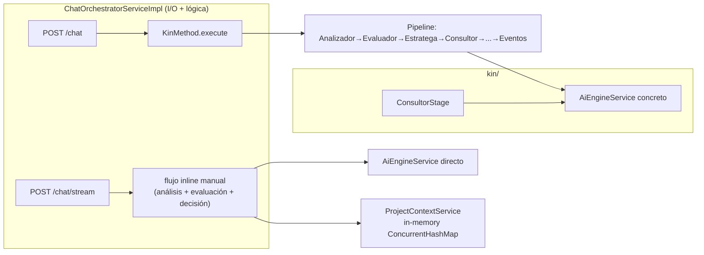
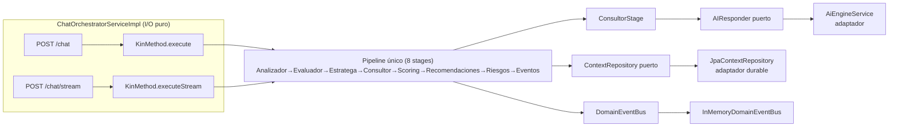
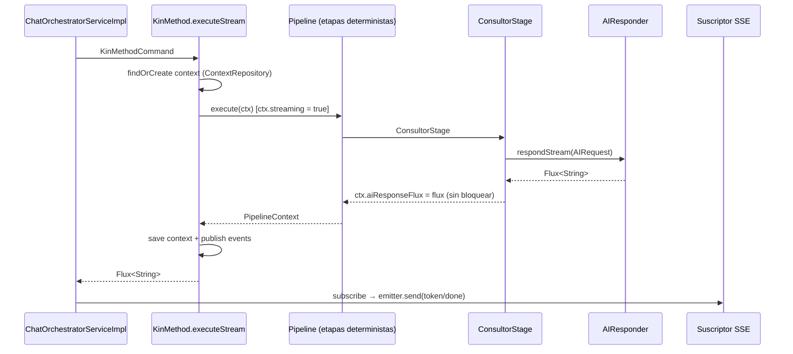

# FASE 5.2.1 — Consolidación del runtime (pipeline único + contexto durable)

> **Estado**: Completada — 2026-07-30
> **Tag base**: `v2.0.0-alpha.1` (`91426e5` / docs `b823271`)
> **ADRs**: 006 (runtime), 007 (context repository), 008 (AI responder/prompt assembler), 009 (canonización de scoring)

## 1. Objetivo

Unificar todo el procesamiento de conversación —bloqueante (`/chat`) y streaming (`/chat/stream`)— a través de un único `KinMethod`, preparar el `ProjectContext` para persistencia real mediante un puerto `ContextRepository` con adaptador JPA durable, y cerrar las observaciones de la auditoría arquitectónica previa a la Fase 5.3 sin ampliar el alcance a deuda técnica ajena.

## 2. Alcance

| Dentro | Fuera (documentado) |
|--------|---------------------|
| Pipeline único vía `KinMethod.execute` / `executeStream` | `pricing_plans.advanced_ai` y columnas relacionadas (incidencia heredada; ver §6) |
| `ContextRepository` (puerto) + adaptador JPA + migración V3 | OpportunityEngine / ReportEngine / KnowledgeEngine |
| `AIResponder` + `PromptAssembler` (dominio) | Pipeline hardening (error handling, timeouts, métricas) |
| Canonización de `ScoringEngine`/`ScoreResult`/`ScoringStage` | Event bus async con persistencia (outbox) |
| Endurecimiento de seguridad (endpoints `/test/**`, logging de secretos) | Refactor de `EventStage` completo |

## 3. Arquitectura ANTES



Problemas: lógica duplicada en el flujo streaming; `ConsultorStage` dependía del servicio concreto; el contexto era volátil; `ScoringEngine` fuera de la infraestructura común de motores.

## 4. Arquitectura DESPUÉS



### 4.1 Flujo streaming (detalle)



## 5. Cambios principales

### 5.1 Nuevos componentes

| Componente | Paquete | Rol |
|------------|---------|-----|
| `ContextRepository` | `kin.context` | Puerto de persistencia del `ProjectContext` |
| `ProjectContext.restore(...)` | `kin.context` | Factory de dominio para reconstruir contexto persistido |
| `AIResponder` / `AIRequest` | `kin.ai` | Puerto del proveedor de IA |
| `PromptAssembler` | `kin.ai` | Construcción centralizada del system prompt |
| `JpaContextRepository` / `ProjectContextEntity` / `ProjectContextJpaRepository` | `ai.context.adapter` | Adaptador JPA durable (JSON) |
| `ScoringInput` | `kin.scoring` | Input tipado del motor de scoring |
| `V3__create_project_context.sql` | `resources/db/migration` | Migración PostgreSQL (prod) |

### 5.2 Componentes modificados

| Componente | Cambio |
|------------|--------|
| `KinMethod` | Único punto de entrada; carga/re-persiste contexto; `executeStream` devuelve `Flux<String>` |
| `PipelineContext` | Flags `streaming` + `aiResponseFlux` |
| `ConsultorStage` | Depende de `AIResponder` + `PromptAssembler`; no bloquea en streaming |
| `AiEngineService` | Implementa `AIResponder`; conserva métodos legacy |
| `EngineInput` | Record → interfaz marcadora (ADR-009) |
| `ScoringEngine` | Implementa `DomainEngine<ScoringInput, ScoreResult>` (metadata SCORING/DOMAIN/30) |
| `ScoreResult` | Implementa `EngineResult` (confidence, generatedBy, engineVersion, isEmpty) |
| `ScoringStage` | Compone `EngineStage`; elimina requisito `scoreResult() != null` |
| `ChatOrchestratorServiceImpl` | I/O puro: ambos endpoints delegan en `KinMethod` |
| `SecurityConfig` | `/test/**` requiere `ADMIN` |
| `DeepSeekConfig` | Ya no loguea el prefijo/longitud de la API key |
| `application.yml` | Dev: `ddl-auto: update` + Flyway deshabilitado |

### 5.3 Eliminados

- `ProjectContextService` (`ai/context/`) y su cableado — el ciclo de vida del contexto pasa a `ContextRepository`.

## 6. Incidencias heredadas (fuera de alcance)

1. **`pricing_plans.advanced_ai` / `is_active` / `pdf_export` / `support_level`**: el arranque dev con H2 + `ddl-auto: update` emite warnings de DDL no aplicado sobre la tabla `pricing_plans` existente (columnas NOT NULL ya pobladas). **No bloquean el arranque** y son ajenas a esta fase: no se modificaron tablas, entidades ni migraciones de `PricingPlan`.
2. **`V2__add_viability_scoring_column.sql`** no portable a H2 — resuelto en dev vía `ddl-auto: update` + Flyway off (no es un fix de PricingPlan, es configuración de dev).
3. **`EventStage`**: ahora refleja mejor el flujo (ASK→Question, REPORT→Report+Score, siempre ConversationCompleted), pero la semántica completa queda para KIN 2.1.
4. **`InMemoryDomainEventBus`**: sin async ni persistencia (KIN 2.4).

## 7. Verificación

```bash
# Tests (130, 0 fallos)
cd kin-backend && ./mvnw clean test

# Cobertura de dominio (JaCoCo, `./mvnw clean verify`)
#   kin.engine ............  99,1 %  (ramas 100 %)
#   kin.reporting .........  96,2 %  (+ kin.reporting.risk 99,6 %)
#   kin.scoring ...........  95,1 %  (canonizado; ScoringModel legado)
# Requisito ≥ 90 % en kin.reporting y kin.engine: CUMPLIDO

# Arranque dev (H2, sin Docker): tabla project_context auto-creada
cd kin-backend && ./mvnw spring-boot:run
#   → Started KinApplication (Tomcat 8080, /api/v1)
```

### 7.1 Cobertura de los componentes nuevos

| Clase | Instrucciones |
|-------|---------------|
| `KinMethod` | 44/44 (100 %) |
| `ScoringEngine` | 60/60 (100 %) |
| `PromptAssembler` | 14/14 (100 %) |
| `ScoreResult` | 6/6 (100 %) |
| `PipelineContext` | 44/48 |
| `Pipeline` | 20/22 |

## 8. Evidencia de la auditoría previa

Los hallazgos de `AUDITORIA_ARQUITECTONICA_PRE_FASE_5_3.md` relativos al runtime (flujo streaming duplicado, dependencia del dominio hacia la infraestructura, contexto volátil, scoring no canonizado, seguridad) se cierran con las ADRs 006–009 y el código de esta fase.
