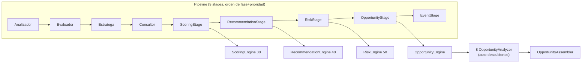
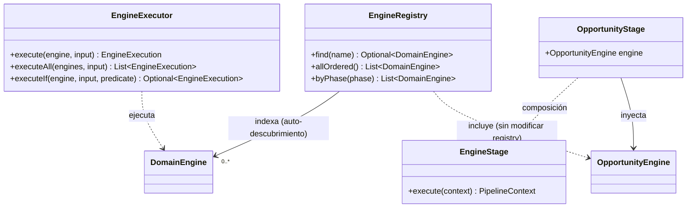
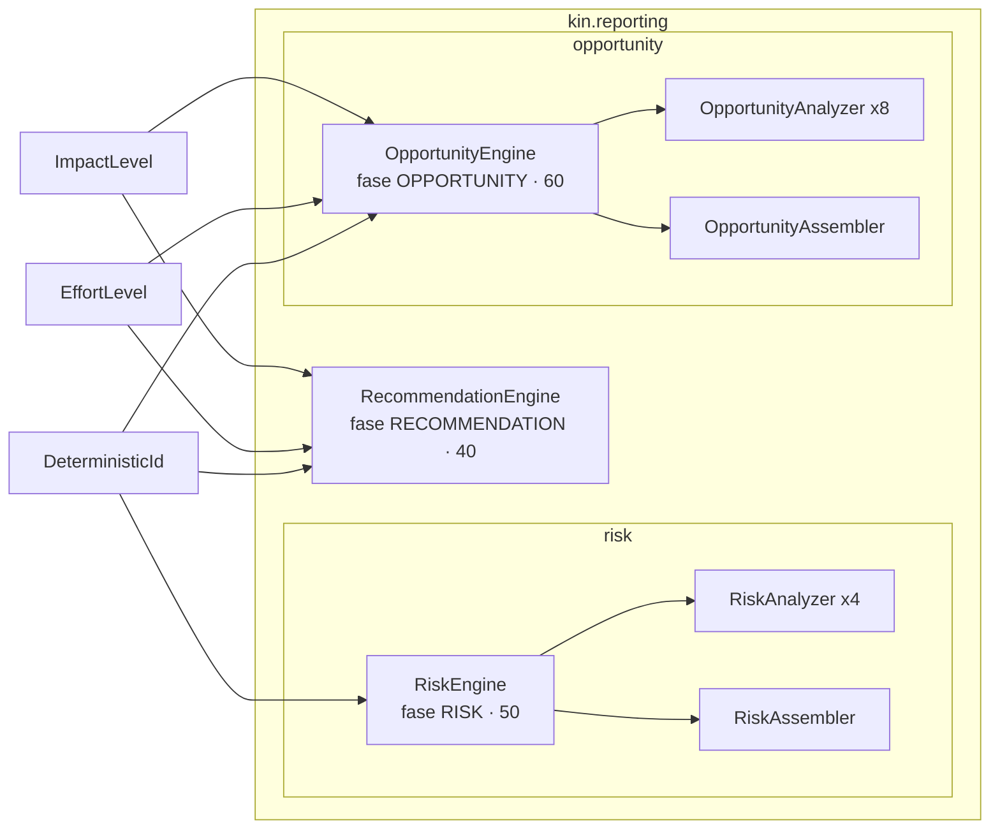
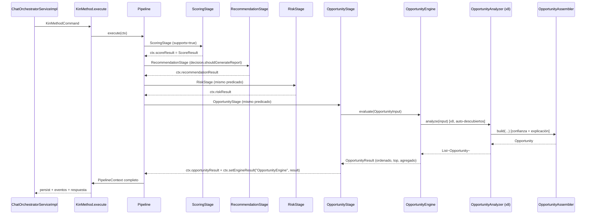

# FASE 5.3 — OpportunityEngine

> **Estado**: Completado
> **Base**: Fase 5.2.1 (ADR-006 … ADR-009) — `ARCHITECTURE STABLE` (enmendado)
> **ADRs**: 010 (opportunity engine)
>
> Secuencia oficial del proyecto: **Fase 5.3 → OpportunityEngine**, Fase 5.4 → ReportEngine,
> Fase 5.5 → PromptAssembler + explicación LLM, Fase 6 → KnowledgeEngine + RAG.

---

## 1. Auditoría arquitectónica (Stage 1)

Auditoría de los componentes consolidados antes de diseñar `OpportunityEngine`.
Objetivo: confirmar el patrón a seguir, identificar reutilización permitida por
composición/infraestructura compartida y descartar duplicación de lógica.

### 1.1 `RecommendationEngine` (`kin/reporting`)

| Aspecto | Hallazgo |
|---|---|
| Contrato | `implements DomainEngine<RecommendationInput, RecommendationResult>` |
| Metadata | `("RecommendationEngine", model.version(), "KIN Architecture Team", RECOMMENDATION, DOMAIN, 40)` |
| Entrada | `RecommendationInput(projectContext, evaluation, decision, score)` — record inmutable |
| Salida | `RecommendationResult(recommendations, priority, confidence, category, explanation, generatedBy, engineVersion)` |
| VO | `Recommendation(id, category, title, description, priority, impactLevel, effortLevel, relatedDimension, actionableSteps, expectedOutcome, explanation)` |
| Explicación | `RecommendationExplanation(usedInformation, appliedRule, reason)` |
| ID determinista | `DeterministicId.from(category, title, description)` |
| Reglas | Cobertura de dimensiones + score bajo/alto + madurez; `CoverageSpec` interno |
| Confianza | `0.15 + 0.35·coverage + 0.25·quality + 0.25·(score/100)` clamp `[0,1]` |
| Guardas | `input == null || ctx == null || eval == null || score == null → RecommendationResult.empty()` |

**Conclusión**: motor de dominio puro con reglas embebidas en la clase (switch `coverageSpec`
de ~200 líneas — observación M15 de la auditoría previa). Patrón de referencia para el VO y el
resultado, pero **su reglas NO se copian**.

### 1.2 `RiskEngine` (`kin/reporting/risk`)

| Aspecto | Hallazgo |
|---|---|
| Contrato | `implements DomainEngine<RiskInput, RiskResult>` |
| Metadata | `("RiskEngine", model.version(), "KIN Architecture Team", RISK, DOMAIN, 50)` |
| Entrada | `RiskInput(projectContext, evaluation, decision, score)` |
| Salida | `RiskResult(risks, overallRiskLevel, topRisks, confidence, explanation, generatedBy, engineVersion)` |
| VO | `Risk(id, category, title, description, severity, probability, impact, confidence, explanation, appliedRules, relatedDimension, engineVersion)` |
| Explicación | `RiskExplanation(usedInformation, appliedRule, reason, evidence)` |
| Composición | Orquestador **sin reglas de negocio**: auto-descubre `List<RiskAnalyzer>` (inyección Spring), consolida, ordena por `severityScore()`, agrega |
| Analizadores | `RiskAnalyzer` (category, analyze, version) × 4 (Business, Technical, Financial, Market) |
| Ensamblador | `RiskAssembler` — fórmula de confianza y explicación compartidas (elimina duplicación entre analizadores) |
| Fábricas | `RiskResult.empty()` y `Risk.create(...)` |

**Conclusión**: patrón **coordinador + analizadores + ensamblador**. Es el modelo de diseño que
encaja con el alcance de 8 categorías de oportunidad. La infraestructura compartida
(`RiskAssembler`, `DeterministicId`, `EngineStage`) se reutiliza por composición; el
`OpportunityEngine` no duplica estas clases.

### 1.3 `EngineRegistry` (`kin/engine`)

- Índice `Map<String, DomainEngine<?,?>>` construido desde `List<DomainEngine<?,?>>` inyectada.
- `allOrdered()` ordena por `phase.ordinal()` y luego `priority`.
- **Agregar un motor NUNCA modifica el registry** — solo se registra el bean.
- `EnginePhase.OPPORTUNITY` **ya existe** (16 fases, ordinal entre `RISK` y `KNOWLEDGE`).

### 1.4 `EngineExecutor` (`kin/engine`)

- `execute`, `executeAll` (secuencial por prioridad), `executeIf`, `executeOptional`.
- Paralelo **diseñado, NO activo** (delega a secuencial).
- Stateless, sin Spring, determinista.

### 1.5 `PipelineContext` (`kin/pipeline`)

- Campos tipados: `scoreResult`, `recommendationResult`, `riskResult` (getter/setter) +
  mapa genérico `engineResults` + `setEngineResult(name, result)`.
- `EngineStage.execute` escribe el resultado vía `resultWriter` **y** en `engineResults`.
- Para `OpportunityEngine`: se agrega un campo tipado `opportunityResult` (mismo patrón que
  `riskResult`, aditivo y compatible) y el resultado queda además en `engineResults`.

### 1.6 `ConsultationResult`

- **No existe como clase**: es un contrato de salida planificado (ADR-002 §decición y
  `FASE5_CONSOLIDACION_ARQUITECTONICA.md`) que separará `PipelineContext` en
  `ExecutionMetadata` + `PipelineContext` + `ConsultationResult`.
- La Fase 5.3 **NO lo introduce**: sería un refactor de consolidación fuera de alcance y
  tocaría contratos estables. El resultado de `OpportunityEngine` se expone igual que
  `RecommendationResult`/`RiskResult` (campo tipado en `PipelineContext` + `engineResults`).

### 1.7 Oportunidades de reutilización (composición / infraestructura compartida)

| Reutilización | Cómo |
|---|---|
| `DomainEngine<E,R>` + `EngineMetadata` + `EnginePhase.OPPORTUNITY` | Contrato y metadata del nuevo motor |
| `EngineStage<E,R>` | `OpportunityStage` compone `EngineStage` (como `RiskStage`) |
| `EngineRegistry` / `EngineExecutor` | Auto-descubrimiento y ejecución — sin cambios |
| `DeterministicId.from(category, title, description)` | IDs deterministas de cada oportunidad |
| `ImpactLevel` / `EffortLevel` (`kin.reporting`) | Enums compartidos para impacto/esfuerzo |
| Patrón coordinador + analizadores + ensamblador | Estructura de `RiskEngine` (sin copiar reglas) |

### 1.8 Restricciones confirmadas (auditoría)

- `kin/` es 100 % POJO (sin Spring, sin JPA, sin infraestructura) — el engine y sus VOs no
  dependen de nada externo al dominio.
- No se modifican contratos estables (§4 BASELINE) ni comportamiento existente.
- No se introducen eventos nuevos (el `EventStage` sigue intacto); el resultado queda en el
  contexto, como `RiskResult`.
- No se tocan REST, SSE, frontend ni los 130 tests existentes.

---

## 2. Diseño de la solución (Stage 2)

### 2.1 Modelo de dominio

Nuevo subpaquete **`com.kinplatform.kin.reporting.opportunity`** (espeja la estructura de
`kin.reporting.risk` — misma filosofía de coordinador + analizadores + ensamblador).

```
kin.reporting.opportunity
├── OpportunityCategory      enum    (8 categorías obligatorias)
├── Opportunity              record  (VO de dominio, ID determinista)
├── OpportunityExplanation   record  (usedInformation, appliedRule, reason, evidence)
├── OpportunityInput         record  (implements EngineInput)
├── OpportunityResult        record  (implements EngineResult)
├── OpportunityModel         class   (umbrales configurables, stateless VO)
├── OpportunityAssembler     class   (fórmula de confianza + explicación compartidas)
├── OpportunityAnalyzer      interface (category, analyze, version)
├── OpportunityEngine        class   (implements DomainEngine, coordinador sin reglas)
└── (analizadores) Market/Innovation/Technological/Financial/Competitive/
                      Scalability/Automation/MonetizationOpportunityAnalyzer
```

### 2.2 Responsabilidades

| Componente | Responsabilidad |
|---|---|
| `OpportunityCategory` | Enum con las 8 categorías: `MERCADO`, `INNOVACION`, `TECNOLOGICA`, `FINANCIERA`, `COMPETITIVA`, `ESCALABILIDAD`, `AUTOMATIZACION`, `MONETIZACION` |
| `Opportunity` | VO inmutable: `id (UUID v3), category, title, description, priority (1-10), impactLevel, effortLevel, confidence, explanation, appliedRules, relatedDimension, engineVersion` |
| `OpportunityExplanation` | Trazabilidad: `usedInformation`, `appliedRule`, `reason`, `evidence` (4 campos, como `RiskExplanation`) |
| `OpportunityInput` | `(projectContext, evaluation, decision, score)` — solo info producida por Java |
| `OpportunityResult` | `(opportunities, topOpportunities, confidence, explanation, generatedBy, engineVersion)` + `hasOpportunities()`, `opportunityCount()`, `highestPriority()`, `isEmpty()` |
| `OpportunityModel` | Umbrales de prioridad (VO estático, inyectado; regla común §6.3-governance) |
| `OpportunityAssembler` | Fórmula de confianza y formato de explicación compartidos (deduplicación entre analizadores) |
| `OpportunityAnalyzer` | Contrato común: `category()`, `analyze(OpportunityInput)`, `version()` |
| `OpportunityEngine` | Coordinador: invoca `List<OpportunityAnalyzer>`, consolida, ordena por `priority` desc + categoría, agrega, calcula confianza. **Sin reglas de negocio** |
| `OpportunityStage` | Composición pura sobre `EngineStage` (mismo patrón que `RiskStage`) |

### 2.3 Reglas de detección (deterministas, basadas en señales Java)

Cada analizador emite **0..n** oportunidades usando exclusivamente señales de dominio:

1. **Dimensiones ausentes** (`ProjectContext.isDimensionCovered(dimension)` = false) mapeadas a la
   categoría del analizador → oportunidad de explorar/validar esa brecha. Mapa categoría→dimensiones:
   - `MERCADO` → SECTOR, TARGET_CUSTOMER, PROBLEM
   - `INNOVACION` → SOLUTION, VALUE_PROPOSITION, MVP
   - `TECNOLOGICA` → RESOURCES (requisitos técnicos)
   - `FINANCIERA` → OBJECTIVES, RESOURCES (presupuesto)
   - `COMPETITIVA` → COMPETITION, VALUE_PROPOSITION
   - `ESCALABILIDAD` → SCALABILITY
   - `AUTOMATIZACION` → RESOURCES, OBJECTIVES (procesos)
   - `MONETIZACION` → REVENUE_MODEL
2. **Señal textual** `CompletenessEvaluation.detectedOpportunities()`: si menciona la categoría
   (o su sinónimo), el analizador la convierte en una oportunidad concreta con prioridad alta.
3. **Prioridad (1-10)** calculada por el ensamblador desde:
   `base = score.viabilityScore / 10` + bono por `evaluation.readyForReport`/madurez + bono por
   señal detectada; clamp `[1,10]`. (Fórmula exacta se fija en Stage 5 contratos.)
4. **Impacto/esfuerzo**: `ImpactLevel`/`EffortLevel` reutilizados de `kin.reporting` (infraestructura
   compartida — no duplicados).

**Confianza** (compartida, patrón `RiskAssembler`): `0.35 + 0.35·coveragePercent + 0.3·qualityOfInformation`, clamp `[0,1]`.

### 2.4 Metadata y registro

- `EngineMetadata.of("OpportunityEngine", model.version(), "KIN Architecture Team", EnginePhase.OPPORTUNITY, EngineType.DOMAIN, 60)`
- Prioridad **60**: ordinal `OPPORTUNITY` ya está después de `RISK` (50) y antes de `KNOWLEDGE`.
- `EngineRegistry` lo auto-descubre vía `List<DomainEngine<?,?>>` — **sin modificar el registry**.

### 2.5 Dependencias

| Dependencia | Dirección | Naturaleza |
|---|---|---|
| `DomainEngine`, `EngineMetadata`, `EnginePhase`, `EngineType`, `DeterministicId` | opportunity → engine | infraestructura compartida (composición) |
| `EngineInput`, `EngineResult` | opportunity → engine | contrato común |
| `ProjectContext`, `CompletenessEvaluation`, `AnalyzedDimension` | opportunity → context | dominio |
| `ConversationDecision`, `ScoreResult` | opportunity → decision/scoring | tipos de entrada |
| `ImpactLevel`, `EffortLevel` | opportunity → reporting | enums reutilizados |
| `PipelineContext.opportunityResult` | pipeline → opportunity | campo tipado aditivo |
| `OpportunityStage` | config → opportunity | bean en `KinConfig` |

**Sin dependencias circulares**: `kin.reporting.opportunity` no depende de pipeline ni config.

### 2.6 Riesgos y mitigaciones

| Riesgo | Mitigación |
|---|---|
| Duplicar reglas de `RecommendationEngine`/`RiskEngine` | Analizadores nuevos, reglas nuevas; solo se reutiliza composición/infra compartida. Auditoría (Stage 1) documenta qué NO se copia |
| Romper `PipelineContext` o contratos estables | Cambio puramente aditivo: nuevo campo `opportunityResult` + bean nuevo; ningún contrato existente se modifica |
| Baja cobertura de dominio | Tests unitarios por clase del subpaquete (patrón `ScoringEngineTest`/`RiskStageTest`); umbral ≥90 % en `kin.reporting` |
| Acoplar el motor a Spring | `kin.reporting.opportunity` es 100 % POJO (como `risk`); Spring solo en `KinConfig` |
| Orden de prioridad inválido | Prioridad 60 > RiskEngine (50), < futuros Knowledge (diseñado). `allOrdered()` respeta fase+prioridad |

### 2.7 Compatibilidad

| Superficie | Impacto |
|---|---|
| `POST /chat`, `/chat/stream` | Ninguno (pipeline agrega etapa; contrato REST intacto) |
| `KinMethod`/`KinMethodResult` | Ninguno (resultado adicional en contexto, no en el DTO de salida) |
| `EventStage` | Ninguno (no se emiten eventos nuevos) |
| Frontend | Ninguno (cambios visuales fuera de alcance de 5.3) |
| 130 tests existentes | Deben seguir en verde (verificación en Stage 7) |
| `EngineRegistry`/`EngineExecutor` | Ninguno (auto-descubrimiento, sin modificación) |
| ADRs 001-009 / BASELINE | Compatible; solo se agrega ADR-010 |

---

## 3. Diagramas UML (Stage 3)

### 3.1 UML de dominio (subpaquete `opportunity`)

```mermaid
classDiagram
    class OpportunityEngine {
        +evaluate(OpportunityInput) OpportunityResult
        +metadata() EngineMetadata
        +analyzers() List~OpportunityAnalyzer~
    }
    class OpportunityAnalyzer {
        <<interface>>
        +category() OpportunityCategory
        +analyze(OpportunityInput) List~Opportunity~
        +version() String
    }
    class OpportunityAssembler {
        +build(category, title, description, priority, impact, effort, rules, dimension, reason, evidence, evaluation, version) Opportunity
        +computeConfidence(evaluation) double
    }
    class OpportunityCategory {
        <<enum>>
        MERCADO
        INNOVACION
        TECNOLOGICA
        FINANCIERA
        COMPETITIVA
        ESCALABILIDAD
        AUTOMATIZACION
        MONETIZACION
    }
    class Opportunity {
        +UUID id
        +OpportunityCategory category
        +String title
        +String description
        +int priority
        +ImpactLevel impactLevel
        +EffortLevel effortLevel
        +double confidence
        +OpportunityExplanation explanation
        +List~String~ appliedRules
        +AnalyzedDimension relatedDimension
        +String engineVersion
        +create(...) Opportunity
    }
    class OpportunityExplanation {
        +List~String~ usedInformation
        +String appliedRule
        +String reason
        +String evidence
    }
    class OpportunityInput {
        +ProjectContext projectContext
        +CompletenessEvaluation evaluation
        +ConversationDecision decision
        +ScoreResult score
    }
    class OpportunityResult {
        +List~Opportunity~ opportunities
        +List~Opportunity~ topOpportunities
        +double confidence
        +String explanation
        +String generatedBy
        +String engineVersion
        +hasOpportunities() boolean
        +opportunityCount() int
        +highestPriority() int
        +empty() OpportunityResult
    }
    class OpportunityModel {
        +int highPriorityThreshold
        +int mediumPriorityThreshold
        +String version
        +String description
        +defaultModel() OpportunityModel
    }
    class MarketOpportunityAnalyzer
    class InnovationOpportunityAnalyzer
    class TechnologicalOpportunityAnalyzer
    class FinancialOpportunityAnalyzer
    class CompetitiveOpportunityAnalyzer
    class ScalabilityOpportunityAnalyzer
    class AutomationOpportunityAnalyzer
    class MonetizationOpportunityAnalyzer

    OpportunityEngine --> OpportunityAnalyzer : usa (List, composición)
    OpportunityAnalyzer <|.. MarketOpportunityAnalyzer
    OpportunityAnalyzer <|.. InnovationOpportunityAnalyzer
    OpportunityAnalyzer <|.. TechnologicalOpportunityAnalyzer
    OpportunityAnalyzer <|.. FinancialOpportunityAnalyzer
    OpportunityAnalyzer <|.. CompetitiveOpportunityAnalyzer
    OpportunityAnalyzer <|.. ScalabilityOpportunityAnalyzer
    OpportunityAnalyzer <|.. AutomationOpportunityAnalyzer
    OpportunityAnalyzer <|.. MonetizationOpportunityAnalyzer
    OpportunityAnalyzer ..> OpportunityAssembler : usa
    OpportunityEngine ..> OpportunityModel : configura
    OpportunityAnalyzer --> Opportunity : produce
    Opportunity --> OpportunityCategory
    Opportunity --> OpportunityExplanation
    OpportunityEngine --> OpportunityResult : produce
    OpportunityEngine ..|> DomainEngine : implements
    OpportunityInput ..|> EngineInput : implements
    OpportunityResult ..|> EngineResult : implements
```



### 3.2 UML del pipeline (con OpportunityStage)



### 3.3 UML de engines (registro y ejecución)



### 3.4 UML de reporting consolidado



### 3.5 UML de la consulta completa (Opportunity en contexto)



---

## 4. Contratos (Stage 5)

### 4.1 `OpportunityCategory`

```java
public enum OpportunityCategory {
    MERCADO, INNOVACION, TECNOLOGICA, FINANCIERA,
    COMPETITIVA, ESCALABILIDAD, AUTOMATIZACION, MONETIZACION
}
```

### 4.2 `OpportunityExplanation`

```java
public record OpportunityExplanation(
    List<String> usedInformation,
    String appliedRule,
    String reason,
    String evidence
) {
    public OpportunityExplanation {
        usedInformation = usedInformation == null ? List.of() : List.copyOf(usedInformation);
        appliedRule = appliedRule == null ? "" : appliedRule;
        reason = reason == null ? "" : reason;
        evidence = evidence == null ? "" : evidence;
    }
    public static OpportunityExplanation of(List<String> usedInformation, String appliedRule,
                                            String reason, String evidence) { ... }
}
```

### 4.3 `Opportunity` (VO, `record`)

```java
public record Opportunity(
    UUID id,
    OpportunityCategory category,
    String title,
    String description,
    int priority,                 // 1..10 (clamp)
    ImpactLevel impactLevel,
    EffortLevel effortLevel,
    double confidence,            // clamp [0,1]
    OpportunityExplanation explanation,
    List<String> appliedRules,
    AnalyzedDimension relatedDimension,
    String engineVersion
) {
    public Opportunity { /* defensas de nulidad + clamp priority 1..10 + clamp confidence */ }
    public static Opportunity create(OpportunityCategory category, String title, String description,
                                     int priority, ImpactLevel impactLevel, EffortLevel effortLevel,
                                     double confidence, OpportunityExplanation explanation,
                                     List<String> appliedRules, AnalyzedDimension relatedDimension,
                                     String engineVersion) {
        return new Opportunity(
            DeterministicId.from(category.name(), title, description),
            category, title, description, priority, impactLevel, effortLevel, confidence,
            explanation, appliedRules, relatedDimension, engineVersion);
    }
}
```

### 4.4 `OpportunityInput`

```java
public record OpportunityInput(
    ProjectContext projectContext,
    CompletenessEvaluation evaluation,
    ConversationDecision decision,
    ScoreResult score
) implements EngineInput {}
```

### 4.5 `OpportunityResult`

```java
public record OpportunityResult(
    List<Opportunity> opportunities,
    List<Opportunity> topOpportunities,   // top 3 por prioridad (o todas si ≤3)
    double confidence,                     // promedio de confianza de las oportunidades
    String explanation,                    // resumen agregado por categoría
    String generatedBy,
    String engineVersion
) implements EngineResult {
    public OpportunityResult { /* defensas de nulidad + clamp confidence */ }
    public boolean hasOpportunities() { return !opportunities.isEmpty(); }
    public int opportunityCount() { return opportunities.size(); }
    public int highestPriority() { /* max priority, 0 si vacío */ }
    @Override public boolean isEmpty() { return opportunities.isEmpty(); }
    public static OpportunityResult empty() { /* List.of(), List.of(), 0.0, "", "", "" */ }
}
```

### 4.6 `OpportunityModel`

```java
public class OpportunityModel {
    private final int highPriorityThreshold;   // default 8 (oportunidad alta)
    private final int mediumPriorityThreshold; // default 5 (oportunidad media)
    private final String version;              // default "v1"
    private final String description;
    // getters + defaultModel()
}
```

### 4.7 `OpportunityAssembler`

Fórmula de confianza compartida (idéntica en filosofía a `RiskAssembler`):

```java
public double computeConfidence(CompletenessEvaluation evaluation) {
    double raw = 0.35 + 0.35 * evaluation.coveragePercent() + 0.3 * evaluation.qualityOfInformation();
    return Math.max(0.0, Math.min(1.0, raw));
}
```

`build(...)`: construye `usedInformation` ("Cobertura del proyecto: X%", "Dimensiones cubiertas:
n/m"), `appliedRule` (primera regla), `reason` y `evidence`, delega en `Opportunity.create(...)`.

### 4.8 `OpportunityAnalyzer`

```java
public interface OpportunityAnalyzer {
    OpportunityCategory category();
    List<Opportunity> analyze(OpportunityInput input);
    String version();
}
```

### 4.9 `OpportunityEngine`

```java
public class OpportunityEngine implements DomainEngine<OpportunityInput, OpportunityResult> {
    public static final String GENERATOR_NAME = "OpportunityEngine";

    private final List<OpportunityAnalyzer> analyzers;
    private final OpportunityModel model;

    public OpportunityEngine(List<OpportunityAnalyzer> analyzers, OpportunityModel model) { ... }

    @Override
    public EngineMetadata metadata() {
        return EngineMetadata.of(GENERATOR_NAME, model.version(), "KIN Architecture Team",
            EnginePhase.OPPORTUNITY, EngineType.DOMAIN, 60);
    }

    @Override
    public OpportunityResult evaluate(OpportunityInput input) {
        if (input == null || input.projectContext() == null
            || input.evaluation() == null || input.score() == null) {
            return OpportunityResult.empty();
        }
        var opportunities = new ArrayList<Opportunity>();
        for (var analyzer : analyzers) {
            opportunities.addAll(analyzer.analyze(input));
        }
        opportunities.sort(Comparator.comparingInt(Opportunity::priority).reversed()
            .thenComparing(Comparator.comparingInt(o -> o.category().ordinal()))
            .thenComparing(Opportunity::title));
        if (opportunities.isEmpty()) {
            return new OpportunityResult(List.of(), List.of(), 0.0,
                "No se identificaron oportunidades.", GENERATOR_NAME, model.version());
        }
        var top = opportunities.size() > 3 ? List.copyOf(opportunities.subList(0, 3))
                                           : List.copyOf(opportunities);
        double confidence = opportunities.stream()
            .mapToDouble(Opportunity::confidence).average().orElse(0.0);
        return new OpportunityResult(opportunities, top, confidence,
            buildExplanation(opportunities), GENERATOR_NAME, model.version());
    }

    public List<OpportunityAnalyzer> analyzers() { return List.copyOf(analyzers); }
    private String buildExplanation(List<Opportunity> opps) { /* resumen por categoría */ }
}
```

### 4.10 Fórmula de prioridad (determinista, 1-10)

Para una oportunidad de la categoría `C` relacionada con la dimensión `D`:

```
baseScore    = round((100 - score.totalScore) / 20.0)      // 0..5 (score bajo → más urgente)
missingBonus = 3 si D está en criticalMissingDimensions, 2 si es missing, 0 si cubierta
detectedBonus= 2 si evaluation.detectedOpportunities menciona la categoría/sinónimo, 0 si no
priority     = clamp(baseScore + missingBonus + detectedBonus, 1, 10)
```

`ImpactLevel`/`EffortLevel` se derivan de la categoría y del tipo de brecha (tabla por analizador;
p. ej. brecha crítica → impacto `HIGH`, escala por esfuerzo estimado de la acción).

### 4.11 `OpportunityStage` (composición pura sobre `EngineStage`)

```java
public class OpportunityStage implements PipelineStage {
    private final EngineStage<OpportunityInput, OpportunityResult> delegate;

    public OpportunityStage(OpportunityEngine opportunityEngine) {
        this.delegate = new EngineStage<>(
            "Oportunidades",
            opportunityEngine,
            context -> context.projectContext() != null
                && context.evaluation() != null
                && context.decision() != null
                && context.decision().shouldGenerateReport()
                && context.scoreResult() != null,
            context -> new OpportunityInput(
                context.projectContext(), context.evaluation(),
                context.decision(), context.scoreResult()),
            PipelineContext::opportunityResult
        );
    }
    // name(), supports(), execute() delegan en delegate
}
```

### 4.12 Versionado

| Artefacto | Versión | Fuente |
|---|---|---|
| `OpportunityModel` | `v1` | `OpportunityModel.defaultModel()` |
| `OpportunityEngine` metadata | `model.version()` | modelo inyectado |
| Analizadores | `"v1"` cada uno | `version()` propio |

**Sin cambios de versión en**: `ScoringEngine` (v1), `RecommendationEngine`, `RiskEngine`,
`PipelineContext`, `KinMethod`, contratos REST, eventos.

---

## 5. Implementación (Stage 6)

### 5.1 Archivos nuevos

| Archivo | Paquete | Rol |
|---|---|---|
| `OpportunityCategory.java` | `kin.reporting.opportunity` | Enum 8 categorías |
| `Opportunity.java` | `kin.reporting.opportunity` | VO inmutable con ID determinista |
| `OpportunityExplanation.java` | `kin.reporting.opportunity` | Trazabilidad (usedInformation, appliedRule, reason, evidence) |
| `OpportunityInput.java` | `kin.reporting.opportunity` | Input tipado (`EngineInput`) |
| `OpportunityResult.java` | `kin.reporting.opportunity` | Resultado (`EngineResult`) |
| `OpportunityModel.java` | `kin.reporting.opportunity` | Umbrales configurables (VO) |
| `OpportunityAssembler.java` | `kin.reporting.opportunity` | Confianza/prioridad/explicación compartidas |
| `OpportunityAnalyzer.java` | `kin.reporting.opportunity` | Interface `category/analyze/version` |
| `OpportunityEngine.java` | `kin.reporting.opportunity` | Coordinador sin reglas (prioridad 60) |
| 8 analizadores | `kin.reporting.opportunity` | Market, Innovation, Technological, Financial, Competitive, Scalability, Automation, Monetization |
| `OpportunityStage.java` | `kin.pipeline.stage` | Composición pura sobre `EngineStage` |

### 5.2 Archivos modificados

| Archivo | Cambio |
|---|---|
| `PipelineContext.java` | Campo tipado aditivo `opportunityResult` + getter/setter |
| `KinConfig.java` | Beans: `OpportunityModel`, 8 analizadores, `OpportunityEngine`, `OpportunityStage`; pipeline de 9 etapas |

### 5.3 Decisiones de implementación

- El engine NO contiene reglas de negocio: solo coordina analizadores, ordena por prioridad desc
  (+ categoría + título) y agrega (top 3, confianza promedio, explicación por categoría).
- Prioridad determinista `1-10`: `round((100 - totalScore)/20)` + bono de dimensión ausente
  (2 normal / 3 crítica) + bono de señal detectada (2).
- Confianza compartida: `0.35 + 0.35·coveragePercent + 0.3·qualityOfInformation`, clamp `[0,1]`.
- ID determinista por `DeterministicId.from(category.name(), title, description)`.
- Guarda de nulidad: `input/projectContext/evaluation/score` nulos → `OpportunityResult.empty()`.
- `ImpactLevel`/`EffortLevel` reutilizados de `kin.reporting` (no duplicados).

---

## 6. Tests (Stage 7)

### 6.1 Archivos de prueba nuevos

| Archivo | Tests | Cubre |
|---|---|---|
| `OpportunityEngineTest` | 15 | Proyecto completo, monetización, escalabilidad, mercado, inmaduro, prioridad crítica, señales (mercado/tecnología/escalabilidad/automatización/competencia/financiera/innovación), datos nulos, determinismo, auto-descubrimiento |
| `OpportunityResultTest` | 13 | Inmutabilidad, listas nulas, clamp confianza, vacío, prioridad máxima, clamp prioridad, IDs deterministas, explicación, modelo, categorías |
| `OpportunityAssemblerTest` | 9 | Construcción, fórmula de confianza, clamps, explicación con cobertura, determinismo, missingBonus, hasSignal, prioridad por score |
| `OpportunityStageTest` | 5 | name, supports (no reporte/no score/reporte), ejecución en contexto + `engineResults` |

### 6.2 Verificación

```bash
cd kin-backend && ./mvnw clean verify      # 172 tests, 0 fallos, BUILD SUCCESS

# Cobertura de dominio (JaCoCo)
#   kin.engine ............................ 100 %
#   kin.reporting* (agregado) ............. 98,6 %
#   kin.reporting.opportunity ............. 100 %
#   kin.reporting.risk .................... 99,5 %
#   kin.scoring ........................... 98,9 %
# Requisito ≥ 90 % en kin.reporting y kin.engine: CUMPLIDO

cd kin-backend && ./mvnw spring-boot:run   # arranque dev H2 (sin Docker)
```

---

## 7. Documentación (Stage 8)

- `kin-docs/adr/ADR-010-opportunity-engine.md` — nueva ADR aprobada.
- `kin-docs/BASELINE_ARCHITECTURE.md` — pipeline de 9 etapas, tabla de motores con
  `OpportunityEngine`, preparación para Fase 5.4.
- `kin-docs/KIN_ARCHITECTURE_GOVERNANCE.md` §6.2 — `OpportunityEngine` como motor existente.
- `CHANGELOG.md` — entrada `[Unreleased] - Fase 5.3`.
- `AGENTS.md` — paquetes, conteo de tests (172) y cobertura actualizada.
- Este documento (`FASE5_3_OPPORTUNITY_ENGINE.md`).

---

## 8. Compatibilidad (verificación de no-regresión)

| Superficie | Estado |
|---|---|
| `POST /chat`, `/chat/stream` | Sin cambios (pipeline agrega etapa; contrato REST intacto) |
| `KinMethod` / `KinMethodResult` | Sin cambios |
| `EventStage` / eventos | Sin cambios |
| `ScoringEngine`, `RecommendationEngine`, `RiskEngine` | Sin cambios |
| `EngineRegistry` / `EngineExecutor` | Sin cambios (auto-descubrimiento) |
| ADRs 001-009 / BASELINE | Compatibles; solo se agrega ADR-010 |
| 130 tests previos | En verde (172 total) |
