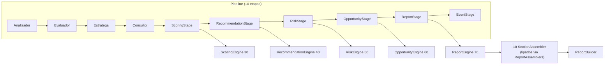
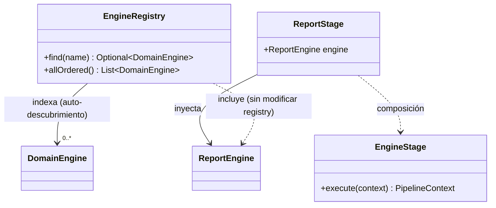
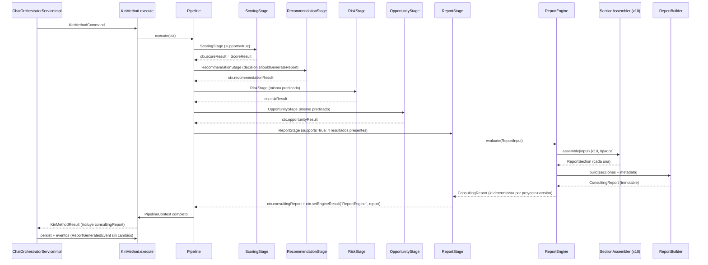

# FASE 5.4 — ReportEngine (Etapa 1: Diseño Arquitectónico)

> **Estado**: Diseño congelado — sin código de implementación
> **Base**: Fase 5.3 (ADR-010) — `ARCHITECTURE STABLE` (enmendado por ADR-006…ADR-010)
> **ADRs**: 011 (report engine) — **Estado: Propuesto** (pendiente de aprobación)
>
> Secuencia oficial del proyecto: Fase 5.3 → OpportunityEngine, **Fase 5.4 → ReportEngine**,
> Fase 5.5 → PromptAssembler + explicación LLM, Fase 6 → KnowledgeEngine + RAG.
>
> Este documento entrega el **diseño completo** del ReportEngine. No contiene código de
> implementación: congela la arquitectura y deja preparada la implementación incremental
> (ver §9 Roadmap).

---

## 1. Auditoría arquitectónica (Stage 1)

Auditoría de los componentes consolidados antes de diseñar `ReportEngine`. Objetivo: confirmar
que los cuatro motores ya producen los resultados que el reporte necesita, identificar qué se
reutiliza por composición y qué **NO** se recalcula.

### 1.1 `ScoringEngine` (`kin/scoring`)

| Aspecto | Hallazgo |
|---|---|
| Contrato | `implements DomainEngine<ScoringInput, ScoreResult>` (canonizado, ADR-009) |
| Metadata | `("ScoringEngine", model.version(), "KIN Architecture Team", SCORING, DOMAIN, 30)` |
| Entrada | `ScoringInput(projectContext, evaluation)` |
| Salida | `ScoreResult(totalScore, maxScore, categoryScores, viabilityLabel, strengths, weaknesses, explanation)` + `confidence()` = `total/max` + `engineVersion()` |
| Estado | ✅ Estable. Produce el score numérico que el reporte proyecta **tal cual** |

### 1.2 `RecommendationEngine` (`kin/reporting`)

| Aspecto | Hallazgo |
|---|---|
| Contrato | `implements DomainEngine<RecommendationInput, RecommendationResult>` |
| Metadata | `("RecommendationEngine", model.version(), "KIN Architecture Team", RECOMMENDATION, DOMAIN, 40)` |
| Salida | `RecommendationResult(recommendations, priority, confidence, category, explanation, generatedBy, engineVersion)` |
| VO | `Recommendation(id, category, title, description, priority, impactLevel, effortLevel, relatedDimension, actionableSteps, expectedOutcome, explanation)` |
| Estado | ✅ Estable (ADR-003). El reporte **reutiliza** el VO `Recommendation` y la lista ya ordenada |

### 1.3 `RiskEngine` (`kin/reporting/risk`)

| Aspecto | Hallazgo |
|---|---|
| Contrato | `implements DomainEngine<RiskInput, RiskResult>` |
| Metadata | `("RiskEngine", model.version(), "KIN Architecture Team", RISK, DOMAIN, 50)` |
| Salida | `RiskResult(risks, overallRiskLevel, topRisks, confidence, explanation, generatedBy, engineVersion)` |
| VO | `Risk(id, category, title, description, severity, probability, impact, confidence, explanation, appliedRules, relatedDimension, engineVersion)` con `severityScore()` |
| Composición | Coordinador + `List<RiskAnalyzer>` ×4 + `RiskAssembler` (patrón de referencia) |
| Estado | ✅ Estable (ADR-004). El reporte **reutiliza** `Risk` y `topRisks` |

### 1.4 `OpportunityEngine` (`kin/reporting/opportunity`)

| Aspecto | Hallazgo |
|---|---|
| Contrato | `implements DomainEngine<OpportunityInput, OpportunityResult>` |
| Metadata | `("OpportunityEngine", model.version(), "KIN Architecture Team", OPPORTUNITY, DOMAIN, 60)` |
| Salida | `OpportunityResult(opportunities, topOpportunities, confidence, explanation, generatedBy, engineVersion)` |
| VO | `Opportunity(id, category, title, description, priority, impactLevel, effortLevel, confidence, explanation, appliedRules, relatedDimension, engineVersion)` |
| Estado | ✅ Estable (Fase 5.3, ADR-010). El reporte **reutiliza** `Opportunity` y `topOpportunities` |

### 1.5 Pipeline (`kin/pipeline`) y Runtime (`kin/`)

- `PipelineContext` expone los 4 resultados como campos tipados: `scoreResult`,
  `recommendationResult`, `riskResult`, `opportunityResult` **y** en el mapa genérico
  `engineResults`. `EngineStage.execute` escribe en ambos (resultWriter + `setEngineResult`).
- `KinMethod` es el punto de entrada único (`execute` / `executeStream`); el pipeline actual tiene
  **9 etapas**: Analizador → Evaluador → Estratega → Consultor → Scoring → Recomendaciones → Riesgos
  → Oportunidades → Eventos.
- `EngineStage<E,R>` permite integrar el `ReportEngine` sin tocar el pipeline ni el registry.
- `EventStage` emite `ReportGeneratedEvent(projectId, "markdown")` en decisión REPORT (no cambia).

### 1.6 La observación clave: los resultados YA están en el contexto

Los cuatro motores se ejecutan en el pipeline **antes** de cualquier etapa de reporte, con el mismo
predicado `decision().shouldGenerateReport()`. Por lo tanto:

> **El ReportEngine NO debe invocar a los motores.** Recibe sus resultados ya calculados en
> `ReportInput` y solo los proyecta en secciones. Esto elimina el riesgo M14 (trabajo repetido del
> diseño original de FASE5_DISENO §8, donde ReportEngine re-ejecutaba Recommendation/Risk/Opportunity).

### 1.7 Oportunidades de reutilización (composición / infraestructura compartida)

| Reutilización | Cómo |
|---|---|
| `DomainEngine<E,R>` + `EngineMetadata` + `EnginePhase.REPORTING` | Contrato y metadata del motor (fase 14 ya existe, aditivo) |
| `EngineStage<E,R>` | `ReportStage` compone `EngineStage` (como `RiskStage`/`OpportunityStage`) |
| `EngineRegistry` / `EngineExecutor` | Auto-descubrimiento y ejecución — sin cambios |
| `DeterministicId.from(...)` | ID determinista del `ConsultingReport` |
| `Recommendation`, `Risk`, `Opportunity` (VOs existentes) | Se incrustan **por referencia** en las secciones (sin duplicar modelos) |
| `ScoreResult` / `RecommendationResult` / `RiskResult` / `OpportunityResult` | Fuente de verdad de scores, listas, confianzas y versiones |
| Patrón coordinador + analizadores + ensamblador (Risk/Opportunity) | Inspira `ReportEngine` + `SectionAssembler` (sin copiar reglas) |

### 1.8 Restricciones confirmadas (auditoría)

- `kin/` es 100 % POJO (sin Spring/JPA/IA) — el engine, sus secciones y sus ensambladores no
  dependen de nada externo al dominio.
- No se modifican contratos estables salvo el cambio **aditivo** de `KinMethodResult` (§5.8),
  justificado por ADR-011.
- No se introducen eventos nuevos (el `EventStage` sigue intacto).
- No se tocan REST, SSE, frontend, ni los 172 tests existentes.
- No se introducen renderers ni persistencia del reporte (fases posteriores).

---

## 2. Diseño de la solución (Stage 2)

### 2.1 Principio rector

> **ReportEngine = orquestador puro. Proyecta, no calcula. Ensambla, no decide.**

### 2.2 Frontera de pureza (boundary)

El `ReportEngine` y sus `SectionAssembler` pueden y deben:

| SÍ (permitido) | NO (prohibido) |
|---|---|
| Proyectar valores ya calculados (scores, listas, confianzas, versiones) | Invocar `ScoringEngine`/`RecommendationEngine`/`RiskEngine`/`OpportunityEngine` |
| Ordenar/limitar listas **ya existentes** (top-N usando campos ya presentes) | Recalcular scores, prioridades, confianzas, niveles o viabilidad |
| Defensas de nulidad + clamps (higiene de VO) | Derivar nuevos riesgos/recomendaciones/oportunidades |
| Contar elementos ya presentes (nº de riesgos, nº de recomendaciones) | Aplicar umbrales de negocio (thresholds de decisión) |
| Tomar timestamp de generación (metadata) | Llamar al LLM |
| Proyectar valores de `ProjectContext` por dimensión + estado de cobertura | Persistir, serializar o renderizar |

**Límite aplicado a Financial/Market/Innovation**: estas secciones solo exponen los valores de
dimensión ya presentes en `ProjectContext` (`value(dimension)`) y su estado `isDimensionCovered`.
Cualquier estimación de mercado/financiera es de fases futuras o del LLM (solo explicación, Fase 5.5).

### 2.3 Estructura de paquetes

Nuevo subpaquete **`com.kinplatform.kin.reporting.report`** (espeja la filosofía de
`kin.reporting.risk` / `kin.reporting.opportunity`, con la separación adicional
modelo/ensambladores porque son 30 clases + 1 enum (31 tipos)):

```
kin.reporting.report
├── ReportInput.java                record  (implements EngineInput)
├── ReportModel.java                class   (versión + límite de next steps, VO inmutable)
├── SectionAssembler.java           interface (sectionName + assemble)
├── ReportAssemblers.java           record  (agrupación tipada de los 10 ensambladores)
├── ReportEngine.java               class   (implements DomainEngine<ReportInput, ConsultingReport>)
├── model/
│   ├── ReportSection.java          interface marcadora (sectionName + kind)
│   ├── ReportSectionKind.java      enum    (GENERAL, EXECUTIVE, SCORING, ANALYTIC, PROJECTION, AGGREGATE, METADATA)
│   ├── ConsultingReport.java       record  (VO raíz del reporte, implements EngineResult)
│   ├── ReportBuilder.java          class   (builder inmutable estricto: validate() + defensas)
│   ├── ReportMetadata.java         record  (reportVersion, architectureVersion, generatedAt, generatedBy, engineVersions, coveragePercent, confidence, sectionsIncluded)
│   ├── ExecutiveSummary.java       record  (sección)
│   ├── ScoresSection.java          record  (sección)
│   ├── RecommendationsSection.java record  (sección — reutiliza Recommendation)
│   ├── RisksSection.java           record  (sección — reutiliza Risk)
│   ├── OpportunitiesSection.java   record  (sección — reutiliza Opportunity)
│   ├── FinancialSection.java       record  (sección — proyección de contexto)
│   ├── MarketSection.java          record  (sección — proyección de contexto)
│   ├── InnovationSection.java      record  (sección — proyección de contexto)
│   ├── NextStepsSection.java       record  (sección — agregación de top items)
│   ├── DimensionCoverage.java      record  (VO auxiliar: dimensión + cubierta)
│   └── NextStep.java               record  (VO auxiliar: paso siguiente)
└── assembler/
    ├── ExecutiveSummaryAssembler.java
    ├── ScoresSectionAssembler.java
    ├── RecommendationsSectionAssembler.java
    ├── RisksSectionAssembler.java
    ├── OpportunitiesSectionAssembler.java
    ├── FinancialSectionAssembler.java
    ├── MarketSectionAssembler.java
    ├── InnovationSectionAssembler.java
    ├── NextStepsSectionAssembler.java
    └── ReportMetadataAssembler.java
```

### 2.4 Responsabilidades

| Componente | Responsabilidad |
|---|---|
| `ReportInput` | Porta los resultados **ya calculados** (`score`, `recommendation`, `risk`, `opportunity`) + contexto/evaluación/decisión + identidad del proyecto |
| `ReportModel` | Configuración del reporte: `version` ("v1"), `description`, `nextStepsLimit` (VO inyectable) |
| `ReportSection` | Interfaz con `sectionName()` (única fuente de verdad del nombre) + `kind()`; toda sección la implementa |
| `ReportSectionKind` | Taxonomía de secciones (GENERAL, EXECUTIVE, SCORING, ANALYTIC, PROJECTION, AGGREGATE, METADATA) para renderers/agrupación |
| `ConsultingReport` | VO raíz inmutable: id determinista (proyecto+versión) + projectId + 9 secciones + `ReportMetadata`; implementa `EngineResult` |
| `ReportBuilder` | Construcción inmutable del `ConsultingReport`: contrato estricto (`validate()`, `projectId` nulo y setters duplicados lanzan), defensas de nulidad, listas y mapas copiados; deriva `sectionsIncluded` e id |
| `SectionAssembler<T>` | Contrato de ensamblado: `assemble(ReportInput) → T`; stateless. Sin `sectionName()` (única fuente: `ReportSection`) |
| `ReportAssemblers` | Agrupación tipada de los 10 ensambladores (constructor único del engine) |
| `ReportEngine` | Orquestador puro: valida entrada → invoca los 10 ensambladores → ensambla `ConsultingReport`. **Sin reglas de negocio** |
| `ReportStage` | Composición pura sobre `EngineStage<ReportInput, ConsultingReport>` (como `OpportunityStage`) |
| Ensambladores (×10) | Cada uno produce su sección a partir de `ReportInput` (ver §6) |

### 2.5 Metadata y registro

- `EngineMetadata.of("ReportEngine", model.version(), "KIN Architecture Team",
  EnginePhase.REPORTING, EngineType.DOMAIN, 70)`.
- Fase `REPORTING` (ordinal 14) ya existe en `EnginePhase` (16 fases, aditivo).
- Prioridad **70**: después de `OpportunityEngine` (60) y antes de los futuros.
- `EngineRegistry` lo auto-descubre vía `List<DomainEngine<?,?>>` — sin modificar el registry.

### 2.6 Dependencias

| Dependencia | Dirección | Naturaleza |
|---|---|---|
| `DomainEngine`, `EngineMetadata`, `EnginePhase`, `EngineType`, `DeterministicId`, `EngineInput`, `EngineResult` | report → engine | infraestructura compartida (composición) |
| `ProjectContext`, `CompletenessEvaluation`, `AnalyzedDimension` | report → context | dominio (lectura) |
| `ConversationDecision`, `ScoreResult` | report → decision/scoring | tipos de entrada |
| `Recommendation`, `RecommendationResult`, `RecommendationCategory` | report → reporting | reutilización de VOs |
| `Risk`, `RiskResult`, `RiskLevel`, `RiskCategory` | report → reporting.risk | reutilización de VOs |
| `Opportunity`, `OpportunityResult`, `OpportunityCategory` | report → reporting.opportunity | reutilización de VOs |
| `ImpactLevel`, `EffortLevel` | report → reporting | enums reutilizados |
| `PipelineContext.consultingReport` | pipeline → report | campo tipado aditivo |
| `ReportStage` | config → report | bean en `KinConfig` |

**Sin dependencias circulares**: `kin.reporting.report` no depende de pipeline ni de config.

---

## 3. Modelo de dominio: `ConsultingReport` (VO inmutable)

### 3.1 Estructura

```java
public record ConsultingReport(
    UUID id,                          // DeterministicId.from(projectId.toString(), "ConsultingReport", reportVersion)
    UUID projectId,
    ExecutiveSummary executiveSummary,
    ScoresSection scores,
    RecommendationsSection recommendations,
    RisksSection risks,
    OpportunitiesSection opportunities,
    FinancialSection financial,
    MarketSection market,
    InnovationSection innovation,
    NextStepsSection nextSteps,
    ReportMetadata metadata
) implements EngineResult { ... }
```

- **Record inmutable** con constructor compacto defensivo: secciones nulas → `empty()` de cada sección;
  listas y mapas copiados (`List.copyOf` / `Map.copyOf`); `id`/`projectId` nunca nulos.
- **`ReportBuilder`** (contrato estricto): API encadenada (`create(projectId)`, `.executiveSummary(...)`,
  `.scores(...)`, …, `.metadata(...)`, `.validate()`, `.build()`). `create(null)` →
  `IllegalArgumentException`; setter de sección ya asignado → `IllegalStateException`; `validate()`
  exige las secciones obligatorias (`executiveSummary`, `scores`, `metadata`) antes de `build()`.
  `build()` computa `generatedAt` (`OffsetDateTime.now()`, **solo metadata**) e `id` determinista y
  reproducible: `DeterministicId.from(projectId.toString(), "ConsultingReport", metadata.reportVersion())`
  — sin dependencia de `now()` para el identificador.
- **Mapeo a `EngineResult`** (integración con registry/executor):
  - `confidence()` → `metadata.confidence()`
  - `explanation()` → `executiveSummary.summaryText()`
  - `generatedBy()` → `metadata.generatedBy()` = `ReportEngine.GENERATOR_NAME`
  - `engineVersion()` → `metadata.reportVersion()`
  - `isEmpty()` → `executiveSummary`/`scores`/… sin contenido relevante (score vacío y secciones vacías)
- Fábrica `ConsultingReport.empty()` (fallback seguro, nunca lanza).

### 3.2 Secciones (VO inmutables)

| Sección | Campos (proyección directa) | Fuente |
|---|---|---|
| `ExecutiveSummary` | projectName, projectCategory, overallScore, maxScore, viabilityLabel, coveragePercent, summaryText, keyHighlights | PipelineContext/ProjectContext + ScoreResult + top de rec/opp |
| `ScoresSection` | totalScore, maxScore, categoryScores, viabilityLabel, confidenceLevel, strengths, weaknesses, scoringModelVersion | `ScoreResult` (+ `engineVersion()`) |
| `RecommendationsSection` | recommendations (List\<Recommendation\>), priority, confidence, dominantCategory | `RecommendationResult` (lista ya ordenada) |
| `RisksSection` | risks (List\<Risk\>), overallRiskLevel, topRisks, confidence | `RiskResult` (topRisks ya calculado) |
| `OpportunitiesSection` | opportunities (List\<Opportunity\>), topOpportunities, confidence | `OpportunityResult` (top ya calculado) |
| `FinancialSection` | revenueModel, resources, objectives, coverage (List\<DimensionCoverage\>) | `ProjectContext` (REVENUE_MODEL, RESOURCES, OBJECTIVES) |
| `MarketSection` | sector, targetCustomer, city, problem, coverage (List\<DimensionCoverage\>) | `ProjectContext` (SECTOR, TARGET_CUSTOMER, CITY, PROBLEM) |
| `InnovationSection` | solution, valueProposition, mvp, innovationSignals, coverage (List\<DimensionCoverage\>) | `ProjectContext` (SOLUTION, VALUE_PROPOSITION, MVP) + `evaluation.detectedOpportunities` |
| `NextStepsSection` | nextSteps (List\<NextStep\>) | top de recommendations + risks + opportunities (agregación) |
| `ReportMetadata` | reportVersion, architectureVersion, generatedAt, generatedBy, engineVersions (Map\<String,String\>), coveragePercent, confidence, sectionsIncluded (derivada en `ReportBuilder`) | ReportModel + resultados + evaluation |

- **`DimensionCoverage(dimension, covered)`**: VO auxiliar; `covered = projectContext.isDimensionCovered(dimension)`.
- **`NextStep(id, source, title, priority, reason)`**: `source` ∈ {RECOMMENDATION, RISK_MITIGATION,
  OPPORTUNITY}; `priority` es el valor **ya existente** (priority 1-10 de rec/opp, severity de risk);
  `reason` deriva del `appliedRule`/explicación ya existente. No se calcula nada nuevo: solo se
  seleccionan top items y se etiquetan.
- **Copia defensiva completa (inmutabilidad profunda)**: todos los campos de colección de
  `ConsultingReport` y sus secciones se copian con `List.copyOf` **y** `Map.copyOf` (mapas:
  `categoryScores` de `ScoresSection`, `engineVersions` de `ReportMetadata`), igual que ya hacen
  `Recommendation`/`Risk`/`Opportunity` en el origen.

---

## 4. UML completo del Reporting Bounded Context (Stage 3)

### 4.1 UML del subpaquete `report`

```mermaid
classDiagram
    class ReportEngine {
        +evaluate(ReportInput) ConsultingReport
        +metadata() EngineMetadata
        +assemblers() ReportAssemblers
    }
    class ReportInput {
        +UUID projectId
        +String projectTitle
        +String projectCategory
        +ProjectContext projectContext
        +CompletenessEvaluation evaluation
        +ConversationDecision decision
        +ScoreResult score
        +RecommendationResult recommendation
        +RiskResult risk
        +OpportunityResult opportunity
    }
    class ReportModel {
        +String version
        +String description
        +int nextStepsLimit
        +defaultModel() ReportModel
    }
    class SectionAssembler {
        <<interface>>
        +assemble(ReportInput) T
    }
    class ReportAssemblers {
        +ExecutiveSummaryAssembler executiveSummary
        +ScoresSectionAssembler scores
        +RecommendationsSectionAssembler recommendations
        +RisksSectionAssembler risks
        +OpportunitiesSectionAssembler opportunities
        +FinancialSectionAssembler financial
        +MarketSectionAssembler market
        +InnovationSectionAssembler innovation
        +NextStepsSectionAssembler nextSteps
        +ReportMetadataAssembler metadata
    }
    class ConsultingReport {
        +UUID id
        +UUID projectId
        +ExecutiveSummary executiveSummary
        +ScoresSection scores
        +RecommendationsSection recommendations
        +RisksSection risks
        +OpportunitiesSection opportunities
        +FinancialSection financial
        +MarketSection market
        +InnovationSection innovation
        +NextStepsSection nextSteps
        +ReportMetadata metadata
        +empty() ConsultingReport
    }
    class ReportBuilder {
        +create(UUID projectId) ReportBuilder
        +executiveSummary(ExecutiveSummary) ReportBuilder
        +scores(ScoresSection) ReportBuilder
        +recommendations(RecommendationsSection) ReportBuilder
        +risks(RisksSection) ReportBuilder
        +opportunities(OpportunitiesSection) ReportBuilder
        +financial(FinancialSection) ReportBuilder
        +market(MarketSection) ReportBuilder
        +innovation(InnovationSection) ReportBuilder
        +nextSteps(NextStepsSection) ReportBuilder
        +metadata(ReportMetadata) ReportBuilder
        +validate() void
        +build() ConsultingReport
    }
    class ReportSection {
        <<interface>>
        +sectionName() String
        +kind() ReportSectionKind
    }
    class ReportSectionKind {
        <<enum>>
        GENERAL
        EXECUTIVE
        SCORING
        ANALYTIC
        PROJECTION
        AGGREGATE
        METADATA
    }
    class ExecutiveSummary
    class ScoresSection
    class RecommendationsSection
    class RisksSection
    class OpportunitiesSection
    class FinancialSection
    class MarketSection
    class InnovationSection
    class NextStepsSection
    class ReportMetadata {
        +String reportVersion
        +String architectureVersion
        +OffsetDateTime generatedAt
        +String generatedBy
        +Map engineVersions
        +double coveragePercent
        +double confidence
        +List sectionsIncluded
    }
    class DimensionCoverage
    class NextStep

    ReportEngine ..|> DomainEngine : implements
    ReportInput ..|> EngineInput : implements
    ConsultingReport ..|> EngineResult : implements
    ReportEngine --> ReportAssemblers : coordina (tipado)
    ReportEngine ..> ReportModel : configura
    ReportEngine --> ReportBuilder : usa
    ReportAssemblers o-- SectionAssembler : 10 ensambladores
    ReportBuilder --> ConsultingReport : produce
    ConsultingReport o-- ExecutiveSummary : sección
    ConsultingReport o-- ScoresSection
    ConsultingReport o-- RecommendationsSection
    ConsultingReport o-- RisksSection
    ConsultingReport o-- OpportunitiesSection
    ConsultingReport o-- FinancialSection
    ConsultingReport o-- MarketSection
    ConsultingReport o-- InnovationSection
    ConsultingReport o-- NextStepsSection
    ConsultingReport o-- ReportMetadata
    ReportSection <|.. ExecutiveSummary
    ReportSection ..> ReportSectionKind : kind()
    ReportSection <|.. ScoresSection
    ReportSection <|.. RecommendationsSection
    ReportSection <|.. RisksSection
    ReportSection <|.. OpportunitiesSection
    ReportSection <|.. FinancialSection
    ReportSection <|.. MarketSection
    ReportSection <|.. InnovationSection
    ReportSection <|.. NextStepsSection
    ReportSection <|.. ReportMetadata
    SectionAssembler <|.. ExecutiveSummaryAssembler
    SectionAssembler <|.. ScoresSectionAssembler
    SectionAssembler <|.. RecommendationsSectionAssembler
    SectionAssembler <|.. RisksSectionAssembler
    SectionAssembler <|.. OpportunitiesSectionAssembler
    SectionAssembler <|.. FinancialSectionAssembler
    SectionAssembler <|.. MarketSectionAssembler
    SectionAssembler <|.. InnovationSectionAssembler
    SectionAssembler <|.. NextStepsSectionAssembler
    SectionAssembler <|.. ReportMetadataAssembler
```



### 4.2 UML del pipeline (con ReportStage — 10 etapas)



### 4.3 UML de engines (registro y ejecución)



### 4.4 UML de reporting consolidado

```mermaid
flowchart LR
    subgraph "kin.reporting"
        R[RecommendationEngine<br/>fase RECOMMENDATION · 40]
        subgraph "risk"
            RE[RiskEngine<br/>fase RISK · 50] --> RA[RiskAnalyzer x4]
            RE --> RS[RiskAssembler]
        end
        subgraph "opportunity"
            OE[OpportunityEngine<br/>fase OPPORTUNITY · 60] --> OA[OpportunityAnalyzer x8]
            OE --> OS[OpportunityAssembler]
        end
        subgraph "report"
            PE[ReportEngine<br/>fase REPORTING · 70] --> PA["SectionAssembler x10<br/>(ReportAssemblers)"]
            PE --> PB[ReportBuilder]
            PE --> CR[ConsultingReport]
        end
    end
    RE --> CR : RiskResult
    OE --> CR : OpportunityResult
    R --> CR : RecommendationResult
    S[ScoringEngine<br/>fase SCORING · 30] --> CR : ScoreResult
```

### 4.5 UML de la consulta completa (ReportEngine en contexto)



---

## 5. Contratos (Stage 5)

### 5.1 `ReportInput`

```java
public record ReportInput(
    UUID projectId,
    String projectTitle,
    String projectCategory,
    ProjectContext projectContext,
    CompletenessEvaluation evaluation,
    ConversationDecision decision,
    ScoreResult score,
    RecommendationResult recommendation,
    RiskResult risk,
    OpportunityResult opportunity
) implements EngineInput {}
```

> `score`, `recommendation`, `risk` y `opportunity` son los resultados **ya producidos** por el
> pipeline. El `ReportEngine` los consume sin re-ejecutar ningún motor.
>
> **Evolución prevista (KIN 3.0 / Fase 6)**: cuando aparezca el 5º motor de resultados
> (`KnowledgeEngine`), `ReportInput` encapsulará los resultados en un contenedor `EngineResults`
> (accesores tipados para los 4 núcleo + acceso genérico) para no añadir campos al record por cada
> motor nuevo. Único punto de cambio: la `inputFactory` de `ReportStage`.

### 5.2 `ReportModel`

```java
public class ReportModel {
    private final String version;             // "v1" (reportVersion)
    private final String architectureVersion; // p. ej. "2.0.0-alpha.1" (versión de plataforma)
    private final String description;
    private final int nextStepsLimit;         // default 5 (cuántos NextStep incluir)
    // getters + defaultModel()
}
```

### 5.3 `ReportSection` y `SectionAssembler`

```java
public interface ReportSection {
    String sectionName();                       // única fuente de verdad del nombre
    default ReportSectionKind kind() { return ReportSectionKind.GENERAL; }
}

public enum ReportSectionKind {
    GENERAL, EXECUTIVE, SCORING, ANALYTIC, PROJECTION, AGGREGATE, METADATA
}

public interface SectionAssembler<T extends ReportSection> {
    T assemble(ReportInput input);              // sin sectionName(): lo aporta la sección producida
}
```

### 5.4 `ReportAssemblers` (agrupación tipada)

```java
public record ReportAssemblers(
    ExecutiveSummaryAssembler executiveSummary,
    ScoresSectionAssembler scores,
    RecommendationsSectionAssembler recommendations,
    RisksSectionAssembler risks,
    OpportunitiesSectionAssembler opportunities,
    FinancialSectionAssembler financial,
    MarketSectionAssembler market,
    InnovationSectionAssembler innovation,
    NextStepsSectionAssembler nextSteps,
    ReportMetadataAssembler metadata
) {}
```

### 5.5 `ReportEngine`

```java
public class ReportEngine implements DomainEngine<ReportInput, ConsultingReport> {
    public static final String GENERATOR_NAME = "ReportEngine";

    private final ReportAssemblers assemblers;
    private final ReportModel model;

    public ReportEngine(ReportAssemblers assemblers, ReportModel model) { ... }

    @Override
    public EngineMetadata metadata() {
        return EngineMetadata.of(GENERATOR_NAME, model.version(), "KIN Architecture Team",
            EnginePhase.REPORTING, EngineType.DOMAIN, 70);
    }

    @Override
    public ConsultingReport evaluate(ReportInput input) {
        if (input == null || input.projectContext() == null
            || input.evaluation() == null || input.score() == null) {
            return ConsultingReport.empty();
        }
        return ReportBuilder.create(input.projectId())
            .executiveSummary(assemblers.executiveSummary().assemble(input))
            .scores(assemblers.scores().assemble(input))
            .recommendations(assemblers.recommendations().assemble(input))
            .risks(assemblers.risks().assemble(input))
            .opportunities(assemblers.opportunities().assemble(input))
            .financial(assemblers.financial().assemble(input))
            .market(assemblers.market().assemble(input))
            .innovation(assemblers.innovation().assemble(input))
            .nextSteps(assemblers.nextSteps().assemble(input))
            .metadata(assemblers.metadata().assemble(input))
            .build();
    }

    public ReportAssemblers assemblers() { return assemblers; }
}
```

> **Pura orquestación**: 10 llamadas a ensambladores + builder. Cero reglas de negocio.

### 5.6 `ConsultingReport` y `ReportBuilder`

```java
public record ConsultingReport(
    UUID id,
    UUID projectId,
    ExecutiveSummary executiveSummary,
    ScoresSection scores,
    RecommendationsSection recommendations,
    RisksSection risks,
    OpportunitiesSection opportunities,
    FinancialSection financial,
    MarketSection market,
    InnovationSection innovation,
    NextStepsSection nextSteps,
    ReportMetadata metadata
) implements EngineResult {
    // constructor compacto defensivo (secciones → sección empty(), listas Y mapas copiados)
    // confidence() → metadata.confidence()
    // explanation() → executiveSummary.summaryText()
    // generatedBy() → metadata.generatedBy()
    // engineVersion() → metadata.reportVersion()
    // isEmpty() → score vacío y secciones sin contenido
    // static ConsultingReport empty() — fallback del pipeline, nunca lanza
}

public final class ReportBuilder {
    // Contrato estricto, INDEPENDIENTE del empty() de fallback:
    public static ReportBuilder create(UUID projectId)  // projectId nulo → IllegalArgumentException
    public ReportBuilder executiveSummary(ExecutiveSummary s) { ... } // ya asignada → IllegalStateException
    // ... una por sección (misma defensa de duplicados) ...
    public ReportBuilder metadata(ReportMetadata m) { ... }
    public void validate()   // exige executiveSummary, scores y metadata; id/projectId no nulos
    public ConsultingReport build() {
        validate();
        // generatedAt = OffsetDateTime.now()   → SOLO metadata, no identifica
        // id = DeterministicId.from(projectId.toString(), "ConsultingReport", metadata.reportVersion())
        // sectionsIncluded = sectionName() de las secciones ensambladas (derivada aquí)
        // mapas copiados con Map.copyOf (categoryScores, engineVersions)
    }
}
```

### 5.7 `ReportStage` (composición pura sobre `EngineStage`)

```java
public class ReportStage implements PipelineStage {
    private final EngineStage<ReportInput, ConsultingReport> delegate;

    public ReportStage(ReportEngine reportEngine) {
        this.delegate = new EngineStage<>(
            "Reporte",
            reportEngine,
            context -> context.projectContext() != null
                && context.evaluation() != null
                && context.decision() != null
                && context.decision().shouldGenerateReport()
                && context.scoreResult() != null
                && context.recommendationResult() != null
                && context.riskResult() != null
                && context.opportunityResult() != null,
            context -> new ReportInput(
                context.projectId(), context.projectTitle(), context.projectCategory(),
                context.projectContext(), context.evaluation(), context.decision(),
                context.scoreResult(), context.recommendationResult(),
                context.riskResult(), context.opportunityResult()),
            PipelineContext::consultingReport
        );
    }
    // name(), supports(), execute() delegan en delegate
}
```

### 5.8 Cambios aditivos a contratos existentes

| Artefacto | Cambio | Naturaleza |
|---|---|---|
| `PipelineContext` | Campo tipado aditivo `consultingReport` + getter/setter (patrón `opportunityResult`) | Aditivo, no rompe |
| `KinConfig` | Beans: `ReportModel`, 10 ensambladores, `ReportAssemblers`, `ReportEngine`, `ReportStage`; pipeline de 10 etapas (ReportStage entre OpportunityStage y EventStage) | Aditivo |
| `KinMethodResult` | Componente aditivo `consultingReport` (único punto de construcción: `KinMethod.execute`) | Aditivo, justificado por ADR-011 |
| `KinMethod` | Pasa `result.consultingReport()` al resultado | Interno |

> **Dos contratos congelados de BASELINE §4.1 reciben cambios aditivos**: `PipelineContext` (campo
> tipado `consultingReport`) y `KinMethodResult` (componente `consultingReport`). Ambos son aditivos
> (se añade sin eliminar/renombrar nada), preservan la compatibilidad hacia atrás y quedan autorizados
> por ADR-011, con el mismo precedente que ADR-009 (que modificó `EngineInput`).

### 5.9 Versionado

| Artefacto | Versión | Fuente |
|---|---|---|
| `ReportModel.version` | `v1` | `ReportModel.defaultModel()` |
| `ReportModel.architectureVersion` | `"2.0.0-alpha.1"` | `ReportModel.defaultModel()` |
| `ReportEngine` metadata | `model.version()` | modelo inyectado |
| `ConsultingReport.reportVersion` | `model.version()` | `ReportMetadataAssembler` |
| `ConsultingReport.architectureVersion` | `model.architectureVersion()` | `ReportMetadataAssembler` |
| `engineVersions` | map: `{"ScoringEngine": v1, "RecommendationEngine": v1, "RiskEngine": v1, "OpportunityEngine": v1, "ReportEngine": v1}` | de `engineVersion()` de cada `EngineResult` + modelo |

**Sin cambios de versión en**: `ScoringEngine`, `RecommendationEngine`, `RiskEngine`,
`OpportunityEngine`, `EnginePhase`, `EngineType`, `PipelineContext`, contratos REST, eventos.

### 5.10 Puertos futuros: `ReportRenderer` (declarado, no implementado)

| Componente | Rol futuro | Consumo |
|---|---|---|
| `ReportRenderer` (port) | `render(ConsultingReport) → String` / `byte[]` por formato (markdown, html, pdf, json, dashboard) | Lee el `ConsultingReport` **congelado**; no lo modifica |
| `RendererRegistry` | Descubre renderers por formato (patrón `EngineRegistry`) | Selecciona renderer sin `switch` |
| Persistencia del reporte | Almacén de `ConsultingReport` por `projectId` + id determinista | Fase posterior |

**No se implementa en la Fase 5.4** (YAGNI: sin consumidor todavía). El ADR-011 lo declara como
extensión prevista para la Fase 5.5+; el modelo queda congelado para que renderers y persistencia lo
consuman sin modificarlo.

---

## 6. SectionAssemblers (10) — responsabilidades y entradas

Todos son beans stateless que implementan `SectionAssembler<X>` y producen un `ReportSection`.
Ninguno calcula ni decide: proyecta.

| # | Assembler | Sección que produce | Entrada (de `ReportInput`) | Reglas de proyección (permitidas) |
|---|---|---|---|---|
| 1 | `ExecutiveSummaryAssembler` | `ExecutiveSummary` | projectTitle, projectCategory, `score`, `evaluation`, `recommendation`, `opportunity` | projectName/category directos; overallScore=maxScore=score; viabilityLabel; coveragePercent; `summaryText` narrativa que **reafirma** score + cobertura + conteos (nº rec/riesgos/opp); `keyHighlights` = fortalezas de score + títulos top-2 de oportunidades |
| 2 | `ScoresSectionAssembler` | `ScoresSection` | `score` | totalScore, maxScore, categoryScores, viabilityLabel, strengths, weaknesses directos; confidenceLevel = porcentaje de `score.confidence()`; scoringModelVersion = `score.engineVersion()` |
| 3 | `RecommendationsSectionAssembler` | `RecommendationsSection` | `recommendation` | Lista ya ordenada (copy defensiva); priority/confidence/category directos |
| 4 | `RisksSectionAssembler` | `RisksSection` | `risk` | risks + topRisks + overallRiskLevel + confidence directos |
| 5 | `OpportunitiesSectionAssembler` | `OpportunitiesSection` | `opportunity` | opportunities + topOpportunities + confidence directos |
| 6 | `FinancialSectionAssembler` | `FinancialSection` | projectContext | `value(REVENUE_MODEL)`, `value(RESOURCES)`, `value(OBJECTIVES)`; `coverage` = `DimensionCoverage` de esas 3 dimensiones |
| 7 | `MarketSectionAssembler` | `MarketSection` | projectContext | `value(SECTOR)`, `value(TARGET_CUSTOMER)`, `value(CITY)`, `value(PROBLEM)`; `coverage` de esas 4 dimensiones |
| 8 | `InnovationSectionAssembler` | `InnovationSection` | projectContext, `evaluation` | `value(SOLUTION)`, `value(VALUE_PROPOSITION)`, `value(MVP)`; `coverage` de esas 3; `innovationSignals` = señales de `evaluation.detectedOpportunities()` que mencionan innovación |
| 9 | `NextStepsSectionAssembler` | `NextStepsSection` | `recommendation`, `risk`, `opportunity`, `ReportModel` (constructor) | Top `nextStepsLimit` items: top-3 recomendaciones (priority desc), top-3 riesgos (severityScore desc), top-3 oportunidades (priority desc); se etiquetan como `NextStep(source, title, priority, reason)` con valores **ya existentes** |
| 10 | `ReportMetadataAssembler` | `ReportMetadata` | `evaluation`, `score`, `recommendation`, `risk`, `opportunity`, `ReportModel` (constructor) | reportVersion + architectureVersion del modelo; generatedBy; `engineVersions` de los `engineVersion()` de los 4 resultados + modelo; coveragePercent; `confidence` = `evaluation.confidenceScore()` (valor existente, sin fórmula nueva). `sectionsIncluded` la deriva `ReportBuilder.build()` de las secciones ensambladas (única fuente: `ReportSection.sectionName()`), no el assembler |

**Frontera de pureza verificada**: los campos de Financial/Market/Innovation son **valores crudos**
de dimensión (o `""` si no cubierta) + un booleano de cobertura. Los conteos de NextSteps usan
prioridades/severidades ya existentes. No hay fórmulas de negocio nuevas.

---

## 7. ADR-011 (resumen)

La decisión arquitectónica completa está en `kin-docs/adr/ADR-011-report-engine.md` (**Estado:
Propuesto**). Resumen:

1. Nuevo subpaquete `kin.reporting.report` + `model/` + `assembler/` (POJO puro).
2. `ReportEngine implements DomainEngine<ReportInput, ConsultingReport>` — fase REPORTING/DOMAIN/70,
   **orquestador puro** (no invoca engines, no recalcula).
3. `ConsultingReport` record inmutable que implementa `EngineResult`: id determinista por
   proyecto+versión (`DeterministicId.from(projectId.toString(), "ConsultingReport", reportVersion)`),
   sin `now()` en el identificador; listas y mapas copiados (`List.copyOf`/`Map.copyOf`).
4. `ReportBuilder` estricto: `projectId` nulo y setters duplicados lanzan excepción; `validate()`
   exige `executiveSummary`/`scores`/`metadata`; separado del `ConsultingReport.empty()` de fallback.
5. `ReportSection` (`sectionName()` + `kind()`), enum `ReportSectionKind`, `SectionAssembler<T>`
   (solo `assemble`) + agrupación tipada `ReportAssemblers`.
6. `ReportStage` compone `EngineStage`; pipeline de 10 etapas.
7. Cambios aditivos a DOS contratos congelados (BASELINE §4.1): `PipelineContext.consultingReport` y
   `KinMethodResult.consultingReport` — compatibilidad hacia atrás.
8. Sin eventos nuevos, sin REST/SSE/frontend, sin renderers, sin persistencia del reporte. Puertos
   futuros declarados (`ReportRenderer`/`RendererRegistry`); evolución de `ReportInput` → `EngineResults`
   documentada para KIN 3.0 / Fase 6.

---

## 8. Compatibilidad (verificación de no-regresión)

### 8.1 Fase 4 (Contexto + AI + KinMethod)

| Superficie | Impacto |
|---|---|
| `ProjectContext`, `AnalyzedDimension`, `CompletenessEvaluator`, `ConversationStrategist` | Sin cambios. Los nuevos assemblers **leen** `ProjectContext`/`CompletenessEvaluation` (solo lectura) |
| `AIResponder` / `PromptAssembler` / `AiEngineService` | Sin cambios. El reporte no usa IA |
| `KinMethod` | Sin cambios de firma; internamente pasa `consultingReport` al `KinMethodResult` |

### 8.2 Fase 5.0 (RecommendationEngine, ADR-003)

| Superficie | Impacto |
|---|---|
| `RecommendationEngine`, `RecommendationResult`, `Recommendation` | Sin cambios. `ConsultingReport` **reutiliza** el VO `Recommendation` y `RecommendationResult` |

### 8.3 Fase 5.1 (RiskEngine, ADR-004)

| Superficie | Impacto |
|---|---|
| `RiskEngine`, `RiskResult`, `Risk`, `RiskAssembler`, `RiskAnalyzer` | Sin cambios. `ConsultingReport` **reutiliza** `Risk` y `RiskResult` |

### 8.4 Fase 5.2 (Infraestructura de motores, ADR-005)

| Superficie | Impacto |
|---|---|
| `DomainEngine`, `EngineMetadata`, `EnginePhase` (16), `EngineType` | Sin cambios. `ReportEngine` los consume; `EnginePhase.REPORTING` ya existía |
| `EngineRegistry`, `EngineExecutor`, `DeterministicId`, `EngineStage` | Sin cambios. Auto-descubrimiento del nuevo motor; `ReportStage` compone `EngineStage` |

### 8.5 Fase 5.2.1 (Runtime consolidado, ADR-006…009)

| Superficie | Impacto |
|---|---|
| Runtime único (`/chat` + `/chat/stream` por `KinMethod`) | Sin cambios. El reporte se genera en ambos flujos (etapa determinista) |
| `ContextRepository` durable | Sin cambios. El reporte no persiste (fases futuras) |
| `ScoringEngine`/`ScoreResult` canonizados | Sin cambios. `ConsultingReport` proyecta `ScoreResult` |
| `PipelineContext` | **Aditivo**: campo `consultingReport` |
| `KinMethodResult` | **Aditivo** (ADR-011): componente `consultingReport` |

### 8.6 Fase 5.3 (OpportunityEngine, ADR-010)

| Superficie | Impacto |
|---|---|
| `OpportunityEngine`, `OpportunityResult`, `Opportunity` | Sin cambios. `ConsultingReport` **reutiliza** `Opportunity` y `OpportunityResult` |
| Pipeline (9 etapas) | Pasa a **10 etapas**: `ReportStage` después de `OpportunityStage`, antes de `EventStage` |

### 8.7 Resumen

| Superficie | Estado |
|---|---|
| `POST /chat`, `/chat/stream` | Sin cambios (pipeline agrega etapa; contrato REST intacto) |
| SSE (`token`/`error`/`done`) | Sin cambios |
| `EventStage` / eventos | Sin cambios (no se emiten eventos nuevos) |
| `EngineRegistry` / `EngineExecutor` | Sin cambios (auto-descubrimiento) |
| 172 tests previos | En verde (verificación en implementación) |
| ADRs 001-010 / BASELINE | Compatibles; solo se agrega ADR-011 (cambios aditivos a `PipelineContext` y `KinMethodResult`) |

---

## 9. Roadmap de implementación incremental

Cada etapa es independiente, desplegable y verificable. **El orden minimiza riesgo**: primero el
modelo (VO), luego los ensambladores, luego el motor, luego la integración.

| Etapa | Contenido | Archivos | Verificación |
|---|---|---|---|
| **E0** | Aprobación de ADR-011 + este documento | `ADR-011`, `FASE5_4_REPORT_ENGINE.md` | Revisión del equipo; ADR a `Aprobado` |
| **E1** | Modelo de secciones | `ReportSection`, `ReportSectionKind`, 9 secciones (`section/`), `DimensionCoverage`, `NextStep`, `ReportMetadata` | Tests de VO (inmutabilidad, defensas de listas y mapas, `empty()`, clamps) |
| **E2** | Reporte raíz | `ConsultingReport`, `ReportBuilder` | Tests de builder (`validate()`, `projectId` nulo, setters duplicados, secciones obligatorias, id determinista proyecto+versión) + `EngineResult` (confidence/explanation/generatedBy/engineVersion/isEmpty) |
| **E3** | Contratos de entrada | `ReportInput`, `ReportModel`, `SectionAssembler` | Tests de records + `defaultModel()` |
| **E4** | Ensambladores (×10) | `assembler/*` + `ReportAssemblers` | Tests por assembler (proyección correcta; frontera de pureza) |
| **E5** | Motor | `ReportEngine` | Tests de orquestación: reporte completo, nulidad → `empty()`, determinismo de id, metadata |
| **E6** | Integración pipeline | `ReportStage`, `PipelineContext.consultingReport`, `KinConfig` (pipeline 10 etapas), `KinMethodResult` + `KinMethod` | Tests de stage (name/supports/execute + `engineResults`); `KinMethodTest` actualizado |
| **E7** | Documentación y cierre | `BASELINE_ARCHITECTURE.md`, `KIN_ARCHITECTURE_GOVERNANCE.md` §6.2, `AGENTS.md`, `CHANGELOG.md` | `./mvnw clean verify` (tests verdes) + JaCoCo: `kin.reporting.report` ≥90 % |

### 9.1 Estimación de superficie

- **30 clases + 1 enum = 31 tipos** en `kin.reporting.report`: 11 records de modelo (10 secciones de
  contenido + `ConsultingReport`) + 2 VOs auxiliares (`DimensionCoverage`, `NextStep`) + `ReportBuilder`
  + `ReportEngine` + `ReportInput` + `ReportModel` + 2 interfaces (`ReportSection`, `SectionAssembler`)
  + 1 enum (`ReportSectionKind`) + record de agrupación (`ReportAssemblers`) + 10 ensambladores.
- 2 archivos modificados en dominio (`PipelineContext`, `KinMethodResult`), 2 en infraestructura
  (`KinConfig`, `KinMethod`), 1 stage nuevo (`ReportStage`).
- Tests estimados: ~8 (VO) + ~6 (builder/report) + ~15 (engine) + ~10 (assemblers) + ~5 (stage).

### 9.2 Criterios de aceptación de la Fase 5.4

- [ ] `ReportEngine` produce `ConsultingReport` con las 10 secciones sin invocar motores ni recalcular.
- [ ] Cobertura JaCoCo `kin.reporting.report` ≥90 %; total de tests previos en verde.
- [ ] Pipeline de 10 etapas operativo en bloqueante y streaming (`KinMethod`).
- [ ] `KinMethodResult.consultingReport` disponible para el orquestador.
- [ ] ADR-011 aprobada; `BASELINE`, Governance §6.2, `AGENTS.md` y `CHANGELOG` actualizados.

---

## 10. Riesgos y mitigaciones

| Riesgo | Probabilidad | Impacto | Mitigación |
|---|---|---|---|
| **`ReportEngine` demasiado grande / con reglas embebidas** (replica M15) | Media | Alto | Frontera de pureza (§2.2) explícita; el motor solo coordina 10 ensambladores; límite de revisión ≤120 líneas |
| **Duplicar VOs de rec/risk/opportunity en las secciones** | Media | Alto | Las secciones **reutilizan** `Recommendation`/`Risk`/`Opportunity` por referencia (contrato §5.6) |
| **Secciones Financial/Market/Innovation con cálculo de negocio** | Media | Medio | Solo proyección de valores + `DimensionCoverage`; cualquier estimación es de fases futuras |
| **Cambio aditivo a `KinMethodResult` rompe contrato congelado** | Baja | Medio | Cambio de un solo componente, un único punto de construcción (`KinMethod`), autorizado por ADR-011; precedente ADR-009 |
| **`PipelineContext` God Class (+1 campo)** | Media | Medio | El mapa `engineResults` ya escala a N motores; el campo tipado es por conveniencia de lectura (patrón existente) |
| **Cobertura de dominio por debajo del umbral** | Media | Medio | Tests por clase desde la etapa E1; JaCoCo verificado en E7 |
| **Reporte con datos incompletos (secciones vacías)** | Baja | Bajo | Cada sección tiene `empty()`; `ConsultingReport.empty()` como fallback seguro |

---

## 11. Estado del entregable

- [x] Auditoría completa del estado actual (Stage 1) — §1
- [x] Diseño del `ReportEngine` como orquestador puro — §2
- [x] Modelo de dominio `ConsultingReport` (VO inmutable) — §3
- [x] UML completo del Reporting Bounded Context — §4
- [x] Contratos (`ReportEngine`, `ReportBuilder`, `SectionAssembler`, `ReportSection`, …) — §5
- [x] SectionAssemblers (10) — §6
- [x] ADR-011 — `kin-docs/adr/ADR-011-report-engine.md`
- [x] Compatibilidad con Fases 4, 5.0, 5.1, 5.2, 5.2.1 y 5.3 — §8
- [x] Roadmap de implementación incremental — §9
- [ ] Implementación (Etapas E1…E7) — **fuera de alcance de esta entrega**

---

*Diseño de la Fase 5.4 — Etapa 1. No se modificó código fuente ni se creó commit.*
*Arquitectura congelada. La implementación comienza tras la aprobación de ADR-011.*
