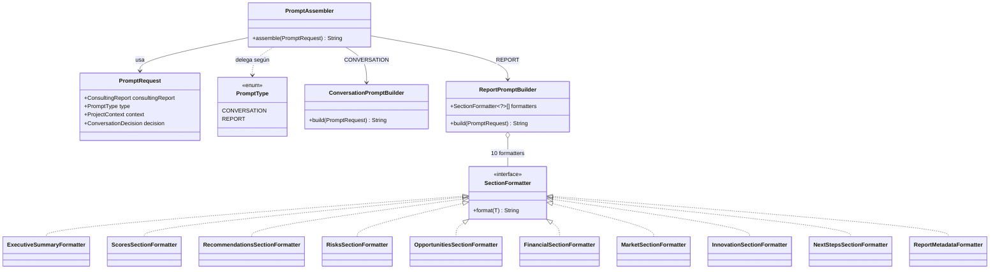
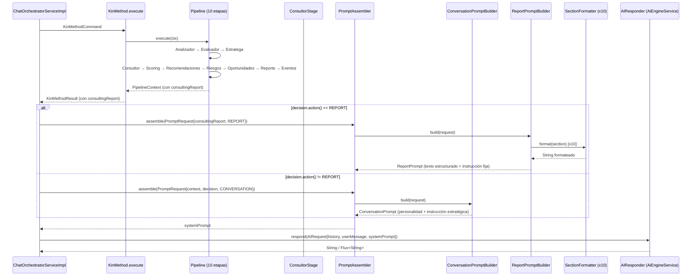

# FASE 5.5 — PromptAssembler (Etapa 1: Diseño Arquitectónico)

> **Estado**: Implementación completa (Etapas E1…E7) — ver §9 Roadmap y §13 Estado del entregable
> **Base**: Fase 5.4 (ADR-011) — `ARCHITECTURE STABLE` (enmendado por ADR-006…ADR-012)
> **ADRs**: 012 (prompt assembler) — **Estado: Aprobado**
>
> Secuencia oficial del proyecto: Fase 5.4 → ReportEngine, **Fase 5.5 → PromptAssembler + explicación LLM**, Fase 6 → KnowledgeEngine + RAG.
>
> Este documento entrega el **diseño completo** del PromptAssembler rediseñado. No contiene código de implementación: congela la arquitectura y deja preparada la implementación incremental (ver §9 Roadmap).

---

## 1. Objetivo

Rediseñar `PromptAssembler` para que sea el **único puente** entre el dominio (Java) y el LLM, transformando exclusivamente el `ConsultingReport` ya calculado en un prompt estructurado que el LLM usará **solo para explicar** el reporte de forma natural.

**Principio rector**:
- Java analiza.
- Java decide.
- Java puntúa.
- Java detecta riesgos.
- Java identifica oportunidades.
- Java construye el `ConsultingReport`.
- **PromptAssembler transforma únicamente el `ConsultingReport` en un prompt estructurado**.
- El LLM nunca toma decisiones de negocio.
- El LLM únicamente explica el `ConsultingReport` de forma natural.

---

## 2. Auditoría resumida (Stage 1)

### 2.1 Estado actual de `PromptAssembler`

| Aspecto | Hallazgo |
|---|---|
| Ubicación | `com.kinplatform.kin.ai.PromptAssembler` (dominio, POJO puro) |
| Método público | `assemble(String title, String description, String category, ProjectContext)` |
| Entradas actuales | `title`, `description`, `category`, `ProjectContext` |
| Salida | `String` (system prompt completo) |
| Responsabilidad actual | Construye personalidad + datos del proyecto + `## INFORMACIÓN CONOCIDA DEL PROYECTO` (snippet de `ProjectContext`) + `## INSTRUCCIÓN ESTRATÉGICA` (snippet de `ConversationDecision`) + reglas de conversación + **CIERRE Y REPORTE** (instrucciones al LLM para generar el informe) |
| Tests | 5 tests en `PromptAssemblerTest` |

### 2.2 Problemas identificados

1. **El LLM decide**: La sección `CIERRE Y REPORTE` del prompt actual le pide al LLM que "GENERE UN INFORME PROFESIONAL COMPLETO" con 20+ secciones, scoring, etc. El LLM **calcula, decide y estructura** el reporte.
2. **Fuga de responsabilidad**: `PromptAssembler` accede directamente a `ProjectContext`, `ConversationDecision` y dimensiones crudas. No consume el `ConsultingReport`.
3. **No hay frontera clara**: El prompt mezcla instrucciones de conversación (fase exploratoria) con instrucciones de reporte (fase de cierre), sin separar responsabilidades.
4. **Inauditable**: El reporte que produce el LLM no es tipado, no es determinista, no es versionable y no se puede auditar.

### 2.3 Queda confirmado de la Fase 5.4

- `ReportEngine` produce `ConsultingReport` (VO inmutable, determinista, tipado, con 10 secciones + metadata).
- `ConsultingReport` contiene: `ExecutiveSummary`, `ScoresSection`, `RecommendationsSection`, `RisksSection`, `OpportunitiesSection`, `FinancialSection`, `MarketSection`, `InnovationSection`, `NextStepsSection`, `ReportMetadata`.
- El pipeline ejecuta `ReportStage` (octava etapa) **antes** de `ConsultorStage` (novena) y de `EventStage` (décima), para que `ConsultorStage` pueda pedir al LLM la respuesta con el reporte ya disponible.
- `KinMethodResult` ya expone `consultingReport`.
- `PipelineContext` ya expone `consultingReport`.

---

## 3. Diseño arquitectónico (Stage 2)

### 3.1 Principio rector

> **PromptAssembler = transformador puro. Proyecta, no decide. Estructura, no calcula.**

### 3.2 Nueva responsabilidad

`PromptAssembler` recibe **exclusivamente** un `ConsultingReport` y produce **dos tipos de prompt** según la fase conversacional:

| Tipo de prompt | Cuándo se usa | Qué contiene |
|---|---|---|
| `ConversationPrompt` | Fase exploratoria (`decision.action() != REPORT`) | Personalidad + reglas de conversación + `ProjectContext` resumido (solo para contexto conversacional) + `INSTRUCCIÓN ESTRATÉGICA` |
| `ReportPrompt` | Fase de cierre (`decision.action() == REPORT`) | **Solo** el `ConsultingReport` estructurado + instrucción: "Explica este reporte de forma natural, profesional y conversacional en español. No añadas secciones, no recalcules, no opines sobre viabilidad." |

### 3.3 Frontera de pureza (boundary)

| SÍ (permitido en `PromptAssembler`) | NO (prohibido) |
|---|---|
| Leer `ConsultingReport` y sus secciones | Acceder a `ProjectContext`, `ScoreResult`, `RecommendationResult`, `RiskResult`, `OpportunityResult` directamente |
| Formatear secciones del reporte en texto legible | Calcular scores, prioridades, confianzas, niveles |
| Incluir `ReportMetadata` (versión, timestamp, coverage) | Derivar nuevos riesgos/recomendaciones/oportunidades |
| Aplicar plantillas de presentación (Markdown, bullets, tablas) | Aplicar umbrales de negocio |
| Incluir instrucción fija: "Explica, no decidas" | Llamar al LLM |
| Seleccionar qué secciones mostrar según `ReportSectionKind` | Persistir, serializar o renderizar el reporte |

**Regla de oro**: Toda la información proviene del `ConsultingReport`. Cero acceso a fuentes crudas.

### 3.4 Estructura de paquetes

El `PromptAssembler` permanece en `com.kinplatform.kin.ai` (dominio, POJO puro). Se refactoriza internamente:

```
kin.ai
├── PromptAssembler.java           class (stateless, servicio de dominio)
├── PromptType.java                enum (CONVERSATION, REPORT)
├── PromptRequest.java             record (entrada unificada)
├── AIRequest.java                 record (sin cambios, puerto)
├── AIResponder.java               interface (sin cambios, puerto)
└── prompt/
    ├── ConversationPromptBuilder.java   class (construye prompt conversacional)
    ├── ReportPromptBuilder.java         class (construye prompt de reporte)
    ├── SectionFormatter.java            interface (formatea una ReportSection → String)
    └── formatter/
        ├── ExecutiveSummaryFormatter.java
        ├── ScoresSectionFormatter.java
        ├── RecommendationsSectionFormatter.java
        ├── RisksSectionFormatter.java
        ├── OpportunitiesSectionFormatter.java
        ├── FinancialSectionFormatter.java
        ├── MarketSectionFormatter.java
        ├── InnovationSectionFormatter.java
        ├── NextStepsSectionFormatter.java
        └── ReportMetadataFormatter.java
```

---

## 4. Responsabilidades

| Componente | Responsabilidad |
|---|---|
| `PromptAssembler` | Fachada única: `assemble(PromptRequest) → String`. Delega al builder según `PromptType`. |
| `PromptRequest` | Entrada unificada: `ConsultingReport consultingReport`, `PromptType type`, `ProjectContext context` (solo para prompt conversacional), `ConversationDecision decision` (solo para prompt conversacional). |
| `PromptType` | Enum: `CONVERSATION` (fase exploratoria), `REPORT` (fase de cierre). |
| `ConversationPromptBuilder` | Construye prompt para conversación: personalidad + reglas + `INSTRUCCIÓN ESTRATÉGICA` + contexto mínimo del proyecto (título, categoría, coverage). **No incluye secciones de reporte**. |
| `ReportPromptBuilder` | Construye prompt para explicación del reporte: itera `ConsultingReport` secciones, usa `SectionFormatter` por cada una, produce texto estructurado + instrucción final fija. |
| `SectionFormatter<T extends ReportSection>` | Interfaz: `format(T section) → String`. Una implementación por tipo de sección. Statelss. |
| `*Formatter` (×10) | Formatean cada sección del `ConsultingReport` a texto legible (Markdown ligero). No calculan, solo presentan. |

---

## 5. Frontera de pureza — Verificación detallada

### 5.1 Prompt conversacional (CONVERSATION)

| Fuente permitida | Campo usado | Uso |
|---|---|---|
| `PromptRequest.context` (ProjectContext) | `projectTitle`, `projectCategory`, `coverageRatio()`, `knownDimensionsCount()` | Contexto mínimo para que el LLM sepa de qué proyecto habla |
| `PromptRequest.decision` (ConversationDecision) | `toStrategySnippet()` | `## INSTRUCCIÓN ESTRATÉGICA` |
| Constantes | Personalidad, reglas de conversación, memoria, profundización | Inmutables, hardcoded en builder |

**No se usa**: `ConsultingReport` (aún no existe en fase exploratoria), dimensiones crudas, valores de dimensión.

### 5.2 Prompt de reporte (REPORT)

| Fuente permitida | Campo usado | Uso |
|---|---|---|
| `PromptRequest.consultingReport` (ConsultingReport) | **Todas las secciones + metadata** | Única fuente de verdad |
| `ReportSectionKind` | Para ordenar/filtrar secciones | Taxonomía de presentación |

**No se usa**: `ProjectContext`, `ConversationDecision`, `ScoreResult`, `RecommendationResult`, `RiskResult`, `OpportunityResult`, `CompletenessEvaluation`.

---

## 6. UML (Stage 3.1 UML de `kin.ai` (PromptAssembler rediseñado)



### 6.2 UML del flujo completo (PromptAssembler en contexto)



---

## 7. Contratos (Stage 5)

### 7.1 `PromptRequest`

```java
public record PromptRequest(
    ConsultingReport consultingReport,   // obligatorio para REPORT, null para CONVERSATION
    PromptType type,                     // CONVERSATION | REPORT
    ProjectContext context,              // solo para CONVERSATION
    ConversationDecision decision        // solo para CONVERSATION
) {}
```

### 7.2 `PromptType`

```java
public enum PromptType {
    CONVERSATION,  // Fase exploratoria: el LLM pregunta, profundiza, guía
    REPORT         // Fase de cierre: el LLM explica el ConsultingReport
}
```

### 7.3 `PromptAssembler`

```java
public class PromptAssembler {

    private final ConversationPromptBuilder conversationBuilder;
    private final ReportPromptBuilder reportBuilder;

    public PromptAssembler(ConversationPromptBuilder conversationBuilder,
                           ReportPromptBuilder reportBuilder) { ... }

    public String assemble(PromptRequest request) {
        return switch (request.type()) {
            case CONVERSATION -> conversationBuilder.build(request);
            case REPORT -> reportBuilder.build(request);
        };
    }
}
```

### 7.4 `ConversationPromptBuilder`

```java
public class ConversationPromptBuilder {

    public String build(PromptRequest request) {
        // 1. Personalidad (constante)
        // 2. Proyecto: título, categoría, coverageRatio
        // 3. INSTRUCCIÓN ESTRATÉGICA (request.decision().toStrategySnippet())
        // 4. Reglas de conversación (constantes)
        // 5. Memoria, profundización, reglas absolutas (constantes)
        // NO incluye: datos de reporte, scoring, recomendaciones, riesgos, oportunidades
    }
}
```

### 7.5 `ReportPromptBuilder`

```java
public class ReportPromptBuilder {

    private final SectionFormatter<?>[] formatters; // 10 formatters inyectados ordenados

    public ReportPromptBuilder(List<SectionFormatter<?>> formatters) { ... }

    public String build(PromptRequest request) {
        var report = request.consultingReport();
        var sb = new StringBuilder();

        sb.append("=== CONSULTING REPORT ===\n");
        sb.append("Project: ").append(report.projectId()).append("\n");
        sb.append("Generated: ").append(report.metadata().generatedAt()).append("\n");
        sb.append("Version: ").append(report.metadata().reportVersion()).append("\n\n");

        // Itera secciones en orden fijo (EXECUTIVE, SCORING, ANALYTIC, PROJECTION, AGGREGATE, METADATA)
        for (var section : report.sectionsInOrder()) {
            var formatter = findFormatter(section);
            sb.append(formatter.format(section)).append("\n\n");
        }

        sb.append("--- INSTRUCCIÓN PARA EL LLM ---\n");
        sb.append("""
            Eres KIN. Explica el reporte anterior de forma natural, profesional y conversacional en español.
            No añadas secciones nuevas. No recalcules scores. No opines sobre viabilidad.
            Usa los datos tal cual están. Sé cercano pero riguroso.
            """);

        return sb.toString();
    }
}
```

### 7.6 `SectionFormatter<T extends ReportSection>`

```java
public interface SectionFormatter<T extends ReportSection> {
    String format(T section);
    ReportSectionKind kind(); // para ordenamiento
}
```

### 7.7 `ReportSection` — adición de método de navegación

En `ConsultingReport` (ya diseñado en Fase 5.4), se añade método de conveniencia:

```java
// En ConsultingReport record
public List<ReportSection> sectionsInOrder() {
    return List.of(executiveSummary, scores, recommendations, risks, opportunities,
                   financial, market, innovation, nextSteps, metadata);
}
```

---

## 8. Flujo completo (Stage 3 - extendido)

### 8.1 Fase exploratoria (decision != REPORT)

```
Usuario envía mensaje
    ↓
ChatOrchestratorServiceImpl.processMessage()
    ↓
KinMethod.execute() → Pipeline (10 etapas)
    ↓
ConsultorStage ejecuta (después de ReportStage; se omite en modo exploratorio)
    ↓
PromptAssembler.assemble(PromptRequest{
    type: CONVERSATION,
    context: projectContext,
    decision: conversationDecision
})
    ↓
ConversationPromptBuilder → systemPrompt conversacional
    ↓
AIResponder.respond(AIRequest{systemPrompt, ...})
    ↓
Respuesta del LLM (pregunta, reflexión, guía)
```

### 8.2 Fase de reporte (decision == REPORT)

```
Usuario envía mensaje que completa la exploración
    ↓
ChatOrchestratorServiceImpl.processMessage()
    ↓
KinMethod.execute() → Pipeline (10 etapas)
    ↓
ReportStage ejecuta → ReportEngine → ConsultingReport (persistido en context)
    ↓
ConsultorStage ejecuta (después de ReportStage, antes de EventStage)
    ↓
PromptAssembler.assemble(PromptRequest{
    type: REPORT,
    consultingReport: context.consultingReport()
})
    ↓
ReportPromptBuilder + 10 SectionFormatter → systemPrompt con reporte estructurado
    ↓
AIResponder.respond(AIRequest{systemPrompt, ...})
    ↓
Respuesta del LLM (explicación natural del ConsultingReport)
    ↓
EventStage emite ReportGeneratedEvent
```

**Nota clave**: En streaming (`/chat/stream`), el flujo es idéntico; solo cambia que `ConsultorStage` deja `Flux<String>` en el contexto y `KinMethod.executeStream` lo devuelve.

---

## 9. Roadmap de implementación incremental (E1–E7)

| Etapa | Contenido | Archivos | Verificación |
|---|---|---|---|
| **E0** | Aprobación de ADR-012 + este documento | `ADR-012`, `FASE5_5_PROMPT_ASSEMBLER.md` | Revisión del equipo; ADR a `Aprobado` |
| **E1** | Contratos base | `PromptRequest`, `PromptType` | Tests de records |
| **E2** | Formatters de secciones (10) | `prompt/formatter/*` + `SectionFormatter` | Tests por formatter (salida esperada, nulidad, orden) |
| **E3** | ReportPromptBuilder | `prompt/ReportPromptBuilder` | Test: produce prompt con todas las secciones + instrucción fija |
| **E4** | ConversationPromptBuilder | `prompt/ConversationPromptBuilder` | Test: produce prompt conversacional sin datos de reporte |
| **E5** | PromptAssembler (fachada) | `PromptAssembler` refactorizado | Tests de delegación por tipo; tests de integración con builders |
| **E6** | Integración pipeline | `ConsultorStage` (cambia entrada a PromptRequest), `KinConfig` (inyecta nuevos beans) | Tests de stage: CONVERSATION y REPORT según `decision.shouldGenerateReport()`; `KinMethodTest` actualizado |
| **E7** | Documentación y cierre | `BASELINE_ARCHITECTURE.md`, `KIN_ARCHITECTURE_GOVERNANCE.md`, `AGENTS.md`, `CHANGELOG.md` | `./mvnw clean verify` (tests verdes) + JaCoCo: `kin.ai` ≥90 % |

### 9.1 Estimación de superficie

- **14 tipos nuevos/modificados** en `kin.ai` + `kin.ai.prompt`:
  - `PromptRequest`, `PromptType` (2)
  - `SectionFormatter` interface + 10 implementaciones (11)
  - `ConversationPromptBuilder`, `ReportPromptBuilder` (2)
  - `PromptAssembler` refactorizado (1)
- **1 archivo modificado** en pipeline: `ConsultorStage`
- **1 archivo modificado** en config: `KinConfig` (nuevos beans)
- Tests estimados: ~10 (formatters) + ~4 (builders) + ~3 (assembler) + ~3 (stage) = ~20 tests nuevos

---

## 10. Riesgos y mitigaciones

| Riesgo | Probabilidad | Impacto | Mitigación |
|---|---|---|---|
| **PromptAssembler accede a fuentes crudas por error** | Media | Alto | Revisiones de código obligatorias; tests de frontera que verifican que NO se usa `ProjectContext`/`ScoreResult`/etc. en prompt REPORT |
| **LLM sigue "decidiendo" por prompt mal diseñado** | Media | Alto | Instrucción fija y explícita en `ReportPromptBuilder`: "No añadas secciones. No recalcules. Explica solo." |
| **Formato del reporte en prompt no es legible para el LLM** | Baja | Medio | Formatters producen Markdown ligero consistente; validación manual en E3 |
| **Duplicación de lógica de presentación entre formatters** | Media | Medio | `SectionFormatter` interface obliga consistencia; utilidades compartidas para tablas/listas |
| **Cambio en `ConsultingReport` rompe formatters** | Baja | Alto | `ConsultingReport` está congelado (Fase 5.4); cualquier cambio requiere ADR |
| **ConsultorStage usa PromptRequest incorrecto** | Baja | Medio | Test de integración E6 verifica: CONVERSATION y REPORT según `decision.shouldGenerateReport()` |
| **Cobertura de dominio por debajo del umbral** | Media | Medio | Tests por clase desde E1; JaCoCo verificado en E7 |

---

## 11. Compatibilidad (verificación de no-regresión)

### 11.1 Fase 4 (Contexto + AI + KinMethod)

| Superficie | Impacto |
|---|---|
| `AIResponder` / `AIRequest` | **Sin cambios**. Contratos de puerto intactos. |
| `AiEngineService` | **Sin cambios**. Sigue implementando `AIResponder`. |
| `KinMethod` / `KinMethodResult` | **Sin cambios**. `consultingReport` ya existe. |
| `ContextRepository` | **Sin cambios**. |

### 11.2 Fase 5.4 (ReportEngine, ADR-011)

| Superficie | Impacto |
|---|---|
| `ReportEngine`, `ConsultingReport`, `ReportSection`, `ReportSectionKind` | **Sin cambios**. `PromptAssembler` solo **consume** `ConsultingReport`. |
| `ReportStage`, `PipelineContext.consultingReport` | **Sin cambios**. El reporte se genera antes de `ConsultorStage`. |
| `EventStage` / `ReportGeneratedEvent` | **Sin cambios**. |

### 11.3 Resumen

| Superficie | Estado |
|---|---|
| `POST /chat`, `/chat/stream` | Sin cambios (contrato REST intacto) |
| SSE (`token`/`error`/`done`) | Sin cambios |
| `AIResponder` / `AIRequest` / `AiEngineService` | Sin cambios |
| `ReportEngine` / `ConsultingReport` | Sin cambios (solo consumo) |
| Pipeline (10 etapas) | `ConsultorStage` se reposiciona tras `ReportStage` (novena etapa, antes de `Eventos`); contratos REST/SSE intactos |
| 338 tests | En verde (`./mvnw clean verify` → BUILD SUCCESS) |
| ADRs 001-011 / BASELINE | Compatibles; solo se agrega ADR-012 |

---

## 12. Criterios de aceptación de la Fase 5.5

- [x] `PromptAssembler.assemble(PromptRequest{type: REPORT, consultingReport})` produce un prompt que contiene **todas las 10 secciones** del `ConsultingReport` formateadas + instrucción fija "Explica, no decidas".
- [x] `PromptAssembler.assemble(PromptRequest{type: CONVERSATION, context, decision})` produce un prompt conversacional **sin ninguna sección de reporte** (ni scores, ni recomendaciones, ni riesgos, ni oportunidades).
- [x] `ConsultorStage` construye `PromptRequest` correcto según `context.decision().shouldGenerateReport()`.
- [x] En fase REPORT, el LLM **nunca** genera secciones nuevas, ni recalcula scores, ni opina sobre viabilidad — solo explica el reporte.
- [x] Cobertura JaCoCo `kin.ai` ≥90 % (100 % en `kin.ai`, 98.8 % en `kin.ai.prompt`, 99.9 % en `kin.ai.prompt.formatter`); 338 tests en verde.
- [x] Pipeline de 10 etapas operativo en bloqueante y streaming (`KinMethod`); `ConsultorStage` se reposiciona tras `ReportStage` para que el LLM reciba el `ConsultingReport`.
- [x] ADR-012 aprobada; `BASELINE`, Governance, `AGENTS.md` y `CHANGELOG` actualizados.

---

## 13. Estado del entregable

- [x] Objetivo — §1
- [x] Auditoría resumida — §2
- [x] Diseño arquitectónico — §3
- [x] Responsabilidades — §4
- [x] Frontera de pureza — §5
- [x] UML — §6
- [x] Flujo completo — §7
- [x] Contratos — §8
- [x] Roadmap E1–E7 — §9
- [x] Riesgos — §10
- [x] Compatibilidad — §11
- [x] Criterios de aceptación — §12
- [x] Implementación (Etapas E1…E7) — `./mvnw clean verify` → BUILD SUCCESS; 338 tests en verde; JaCoCo `kin.ai` ≥90 %

---

*Diseño de la Fase 5.5 — Etapa 1. No se modificó código fuente ni se creó commit.*
*Arquitectura congelada. La implementación comienza tras la aprobación de ADR-012.*

---

## 14. Bitácora de implementación (Etapas E1…E7)

| Etapa | Contenido | Estado |
|---|---|---|
| **E1** | Contratos base: `PromptRequest` (con `forConversation`/`forReport` y validación por tipo), `PromptType` | ✅ |
| **E2** | `SectionFormatter` + 10 formatters con `Locale.ROOT` (salida determinista) + tests por formatter (markdown, sección vacía, kind) | ✅ |
| **E3** | `ReportPromptBuilder` (inyección tipada por clase concreta, sin dispatch por `ReportSectionKind`) + tests (10 secciones una vez, orden `sectionsInOrder()`, sin colisiones) | ✅ |
| **E4** | `ConversationPromptBuilder` (personalidad + contexto mínimo + `INSTRUCCIÓN ESTRATÉGICA`, sin secciones de reporte) + tests (request/decision obligatorias, frontera ADR-012) | ✅ |
| **E5** | `PromptAssembler` refactorizado como fachada pura (delega por `PromptType`; sin lógica, reglas, fallback ni formateo) | ✅ |
| **E6** | Integración pipeline: `ConsultorStage` tras `ReportStage` selecciona `PromptRequest` según `decision.shouldGenerateReport()`; `KinConfig` inyecta builders + 10 formatters; `AiEngineService` vuelve a ser solo adaptador (`respond`/`respondStream`) | ✅ |
| **E7** | Documentación: ADR-012 (Aprobado), este documento, `AGENTS.md`, `BASELINE_ARCHITECTURE.md` | ✅ |

**Nota de implementación**: para preservar la frontera de pureza (prompt REPORT consume solo `ConsultingReport`), el orden del pipeline cambió respecto de Fase 5.4: `ConsultorStage` se reposicionó de la 4.ª a la 9.ª etapa (tras `ReportStage`, antes de `Eventos`). En modo CONVERSATION, `ReportStage` se omite (`supports()==false`) y el consultor usa `PromptRequest.forConversation(...)`; en modo REPORT usa `PromptRequest.forReport(...)` con el reporte ya presente en el contexto.